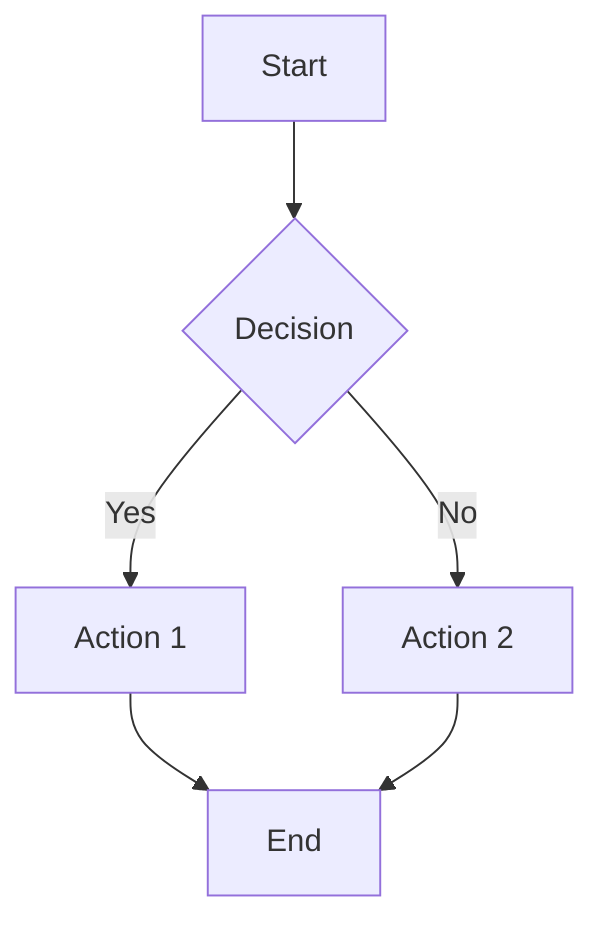
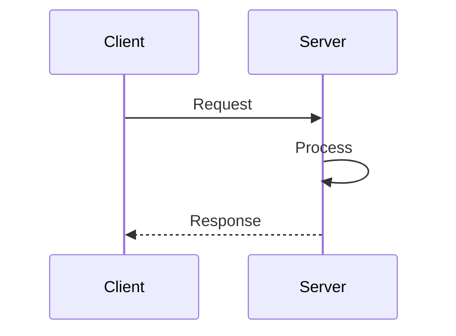
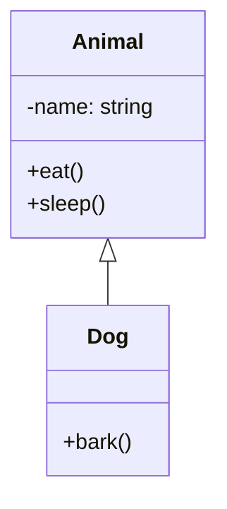
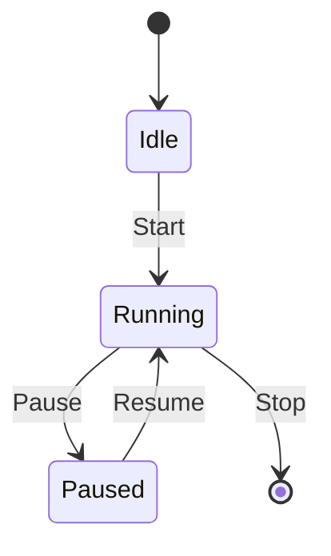
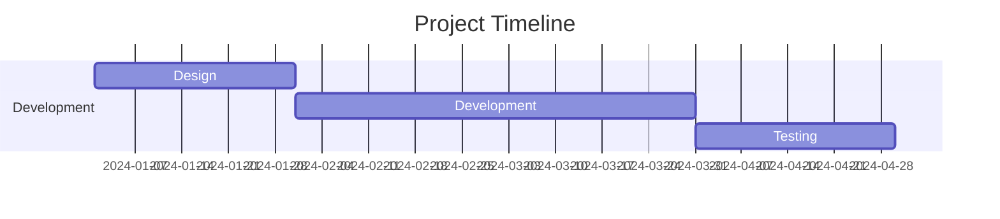

# Mermaid Diagram Support in Code Tutorial Generator

## Overview

The Code Tutorial Generator now supports **Mermaid diagrams** - a JavaScript library for rendering flowcharts, diagrams, and other visualizations from simple text syntax.

## What is Mermaid?

Mermaid is a free, open-source JavaScript library that lets you create diagrams using simple markdown-like syntax. It's perfect for:
- 📊 Flowcharts
- 📈 Sequence diagrams
- 🔄 State diagrams
- 📋 Gantt charts
- 🔗 Class diagrams
- 📍 Git graphs
- And much more!

**Website:** https://mermaid.js.org
**License:** MIT (Free & Open Source)
**Hosting:** CDN hosted via jsDelivr (free, secure, reliable)

## How It Works

### In Markdown Files

Simply write Mermaid code in a markdown code block:

```markdown
\`\`\`mermaid
graph LR
    A[Start] --> B[Process]
    B --> C[End]
\`\`\`
```

### Processing Pipeline

```
1. Markdown file with mermaid code block
   ↓
2. Flask app reads the .md file
   ↓
3. Python markdown library converts to HTML
   ↓
4. Custom processor converts code blocks to <div class="mermaid">
   ↓
5. Mermaid.js library renders diagrams in browser
   ↓
6. Beautiful diagram displays in tutorial viewer
```

## Supported Diagram Types

### 1. Flowchart (Graph)



**Markdown Code:**
```markdown
\`\`\`mermaid
graph TD
    A[Start] --> B{Decision}
    B -->|Yes| C[Action 1]
    B -->|No| D[Action 2]
    C --> E[End]
    D --> E
\`\`\`
```

### 2. Sequence Diagram



**Markdown Code:**
```markdown
\`\`\`mermaid
sequenceDiagram
    participant Client
    participant Server
    Client->>Server: Request
    Server->>Server: Process
    Server-->>Client: Response
\`\`\`
```

### 3. Class Diagram



**Markdown Code:**
```markdown
\`\`\`mermaid
classDiagram
    class Animal {
        -name: string
        +eat()
        +sleep()
    }
    class Dog {
        +bark()
    }
    Animal <|-- Dog
\`\`\`
```

### 4. State Diagram



**Markdown Code:**
```markdown
\`\`\`mermaid
stateDiagram-v2
    [*] --> Idle
    Idle --> Running: Start
    Running --> Paused: Pause
    Paused --> Running: Resume
    Running --> [*]: Stop
\`\`\`
```

### 5. Gantt Chart



**Markdown Code:**
```markdown
\`\`\`mermaid
gantt
    title Project Timeline
    section Development
    Design :des, 2024-01-01, 30d
    Development :dev, after des, 60d
    Testing :test, after dev, 30d
\`\`\`
```

## Implementation Details

### Backend (Flask - app.py)

Added a `process_mermaid_diagrams()` function that:
1. Finds all `<pre><code class="language-mermaid">` blocks in HTML
2. Converts them to `<div class="mermaid">` elements
3. Unescapes HTML entities (< > &)
4. Returns processed HTML

### Frontend (Mermaid.js - viewer.html)

Added:
1. **Mermaid.js library** from jsDelivr CDN
2. **Initialization code** to render diagrams on page load
3. **Styling** for beautiful diagram containers
4. **Error handling** for diagram rendering failures

### Technology Stack

| Component | Technology | Source | Cost |
|-----------|-----------|--------|------|
| Diagrams | Mermaid.js | CDN (jsDelivr) | Free |
| License | MIT | Open Source | N/A |
| Hosting | CDN (jsDelivr) | Third-party | Free |
| Security | Sandbox | Mermaid.js | Secure |

## Styling

Mermaid diagrams in tutorials have:
- Clean white background with border
- Centered alignment
- Responsive sizing (scales on mobile)
- Consistent spacing
- Smooth rendering

### CSS Classes

The diagrams are wrapped in styled containers:

```css
.content .mermaid {
    display: flex;
    justify-content: center;
    margin: 2rem 0;
    background-color: white;
    padding: 1.5rem;
    border-radius: 8px;
    border: 2px solid #e2e8f0;
    overflow-x: auto;  /* Scrollable on small screens */
}
```

## Real-World Example

From the tutorial in `output/Analysis-Of-Algorithm/02_minimum_spanning_tree__mst__algorithms_.md`:

```markdown
\`\`\`mermaid
graph LR
    A[Town A] -- 10 --> B[Town B]
    A -- 6 --> C[Town C]
    A -- 5 --> D[Town D]
    B -- 15 --> D
    C -- 4 --> D
\`\`\`
```

This renders as a visual network diagram showing towns and their connection costs!

## Browser Compatibility

Mermaid works on:
- ✅ Chrome 90+
- ✅ Firefox 88+
- ✅ Safari 14+
- ✅ Edge 90+
- ✅ All modern mobile browsers

## Performance Impact

- **Library size:** ~150KB (minified)
- **CDN delivery:** Fast (jsDelivr is a global CDN)
- **Rendering time:** <100ms for typical diagrams
- **No impact on page load:** Loaded after page renders

## Security

Mermaid diagrams are:
- **Sandbox-safe:** Runs in browser, not server-side
- **Input-validated:** Mermaid.js validates all input
- **No script injection:** Plain text syntax, no code execution
- **GDPR compliant:** No data collection

## Troubleshooting

### Diagram Not Rendering

**Issue:** Diagram code visible but not rendered

**Solutions:**
1. Check markdown syntax - must use triple backticks with `mermaid` language
2. Verify mermaid code syntax is correct
3. Check browser console for errors (F12 → Console)
4. Refresh page (Ctrl+R or Cmd+R)

### "Diagram can't render" Error

**Issue:** Console shows Mermaid rendering error

**Solutions:**
1. Validate Mermaid syntax at https://mermaid.js.org/syntax/flowchart.html
2. Ensure proper indentation
3. Use valid node IDs (alphanumeric, underscore, hyphen)
4. Check for special characters that need escaping

### Diagram Too Large

**Issue:** Diagram overflows the page

**Solutions:**
1. Decrease number of nodes
2. Simplify diagram complexity
3. Switch to different diagram type
4. Use shorter labels

## Advanced Configuration

To customize Mermaid behavior, edit `viewer.html`:

```javascript
mermaid.initialize({
    startOnLoad: true,
    theme: 'neutral',           // Can also be 'dark', 'forest', 'base'
    securityLevel: 'loose',      // 'strict', 'antiscript', 'sandbox', 'loose'
    logLevel: 'warn'             // 'debug', 'info', 'warn', 'error'
});
```

**Available themes:**
- `neutral` (default)
- `dark`
- `forest`
- `base`

## Future Enhancements

Potential improvements:
- 📥 Custom theme for diagrams
- 🎨 Export diagrams as SVG/PNG
- 🔍 Zoom and pan diagrams
- 🖱️ Interactive diagram interaction
- 💾 Diagram source code viewer

## Documentation & Resources

- **Official Mermaid Docs:** https://mermaid.js.org
- **Live Editor:** https://mermaid.live
- **Syntax Guide:** https://mermaid.js.org/syntax/flowchart.html
- **Examples:** https://mermaid.js.org/syntax/examples.html

## Summary

The Mermaid integration provides:
✅ Free, open-source diagram rendering
✅ Simple markdown-like syntax
✅ Beautiful, responsive diagrams
✅ Secure client-side rendering
✅ Multiple diagram types
✅ Zero server-side overhead
✅ Perfect for tutorials and documentation

Your markdown files can now include **beautiful, interactive diagrams** automatically!
