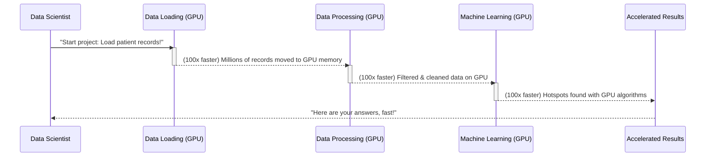

# Chapter 1: End-to-End Workflow Acceleration

Welcome to your journey into supercharging data science! In this first chapter, we're going to explore the exciting concept of "End-to-End Workflow Acceleration." Don't let the long name intimidate you; it's a powerful idea that will change how you approach data projects.

### The Problem: Slow Data Science!

Imagine you're trying to bake a really big, complex cake. You need to gather ingredients, mix them, bake it, decorate it, and then finally serve it. If any of these steps are slow—maybe your mixer is old, or your oven takes forever to heat up—the whole process takes a long, long time.

Data science projects are very similar. They involve many steps:
1.  **Loading Data:** Getting your ingredients (data) ready.
2.  **Cleaning Data:** Making sure your ingredients are perfect (no bad eggs!).
3.  **Analyzing Data:** Mixing and baking to understand what's happening.
4.  **Building Models:** Creating the "recipe" (machine learning model) to make predictions.
5.  **Presenting Results:** Decorating and serving your insights.

In the world of big data, each of these steps can be incredibly slow, especially when dealing with millions or even billions of data records. Waiting for your computer to finish hours or even days of processing is frustrating and wastes valuable time!

### Our Goal: Speeding Up *Every* Step

This project is all about solving that problem! Our central goal, **End-to-End Workflow Acceleration**, means we want to make *every single step* of your data science journey as fast and efficient as possible. It's like upgrading your entire kitchen with the fastest mixer, the quickest oven, and a super-efficient decorating team!

Think of it like planning a long road trip. "End-to-End Workflow Acceleration" isn't just about driving fast on one highway; it's about making sure:
*   Packing your bags is quick.
*   Getting to the car is speedy.
*   Driving is fast.
*   Finding parking is easy.
*   And finally, arriving at your destination is smooth and quick!

We want to achieve this by using special hardware called **GPUs (Graphics Processing Units)**. You might know GPUs from gaming, where they make graphics incredibly fast and realistic. But GPUs are also fantastic at crunching numbers, which is exactly what data science needs! By using GPUs, we can drastically reduce the total time it takes for an entire data science workflow.

### A Real-World Example: Analyzing an Epidemic Outbreak

Let's look at a concrete example from this project: analyzing a simulated epidemic outbreak. Imagine you have **millions of patient records** and you need to quickly figure out:
1.  Which patients are infected?
2.  Where are the "hotspots" or clusters of infection appearing?

If you tried this with traditional tools on a regular computer (CPU), filtering those millions of records and finding clusters could take a very long time. With End-to-End Workflow Acceleration, we aim to get answers in minutes, not hours!

Here's how we might *think* about the steps, conceptually, that we want to accelerate:

```python
# Step 1: Load a huge dataset (e.g., 58+ million patient records)
print("Loading patient data...")
# data = load_traditional_way("patient_records.csv") # This would be slow!
data = load_data_fast("patient_records.csv") # Imagine this is GPU-accelerated!
print(f"Loaded {len(data)} records.")
# Output:
# Loading patient data...
# Loaded 58479894 records.
```
*In a real GPU-accelerated setup, this `load_data_fast` step would utilize tools covered in later chapters, like [GPU-Accelerated DataFrames (cuDF)](03_gpu_accelerated_dataframes__cudf__.md), to read data at incredible speeds.*

```python
# Step 2: Filter for infected patients
print("Filtering for infected patients...")
# infected_patients = data[data['status'] == 'infected'] # Still slow traditionally
infected_patients = filter_data_fast(data, status='infected') # GPU-accelerated filtering!
print(f"Found {len(infected_patients)} infected patients.")
# Output:
# Filtering for infected patients...
# Found 8638 infected patients. (Example result from README)
```
*Again, `filter_data_fast` would be powered by GPU tools like [cuDF](03_gpu_accelerated_dataframes__cudf__.md), performing operations on millions of rows almost instantly.*

```python
# Step 3: Find infection hotspots (clustering)
print("Finding infection hotspots...")
# clusters = find_clusters_traditional(infected_patients) # Very slow for many points
clusters = find_clusters_fast(infected_patients) # GPU-accelerated machine learning!
print(f"Identified {len(clusters)} distinct clusters.")
# Output:
# Finding infection hotspots...
# Identified 14 distinct clusters. (Example result from README)
```
*This `find_clusters_fast` step would leverage [GPU-Accelerated Machine Learning (cuML)](05_gpu_accelerated_machine_learning__cuml__.md) to run complex algorithms like DBSCAN much, much faster.*

Notice how the goal isn't just to speed up *one* line of code, but the entire sequence of operations from loading to filtering to complex analysis. That's "End-to-End"!

### How Does it Work? (Under the Hood)

"End-to-End Workflow Acceleration" isn't a single magical button or a piece of code you run. Instead, it's a **strategy** where we replace traditional, CPU-based tools with special **GPU-accelerated tools** for *each step* of our data science process.

Imagine a specialized factory assembly line:



In this diagram:
*   The **Data Scientist** (you!) initiates the tasks.
*   **Data Loading (GPU)** uses a tool like [cuDF](03_gpu_accelerated_dataframes__cudf__.md) to load massive datasets directly onto the GPU very quickly.
*   **Data Processing (GPU)** continues with [cuDF](03_gpu_accelerated_dataframes__cudf__.md) to clean, filter, and prepare the data, all while it stays on the GPU. This avoids slow transfers back and forth to the main computer memory.
*   **Machine Learning (GPU)** then takes over using tools like [cuML](05_gpu_accelerated_machine_learning__cuml__.md) to run powerful algorithms (like finding clusters in our epidemic example) directly on the GPU, leveraging its massive parallel processing power.
*   Finally, you get the **Accelerated Results** much faster than you would with traditional methods!

The key here is that the data largely *stays on the GPU* as it moves from one step to the next, like ingredients smoothly moving along an automated kitchen line without ever leaving the conveyer belt. Each tool is designed to work efficiently with the GPU, making the entire workflow dramatically faster. This collection of GPU-accelerated tools is often referred to as an "ecosystem" – a topic we'll dive into in our next chapter!

### Conclusion

In this chapter, we learned that **End-to-End Workflow Acceleration** is the powerful goal of making *every single step* of your data science projects incredibly fast by using GPUs. Instead of just speeding up one part, we aim to optimize the entire process, from loading data to getting final results. This saves a huge amount of time, allowing data scientists to explore more, iterate faster, and deliver insights more quickly.

Ready to see the tools that make this acceleration possible? Let's move on to explore the foundation of these GPU-powered libraries!

[Next Chapter: RAPIDS Ecosystem](02_rapids_ecosystem_.md)

---

Generated by [AI Codebase Knowledge Builder]