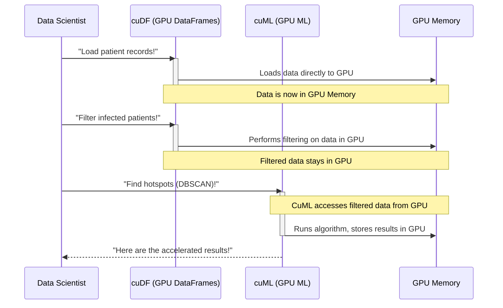

# Chapter 2: RAPIDS Ecosystem

Welcome back, future data science accelerator! In our last chapter, [End-to-End Workflow Acceleration](01_end_to_end_workflow_acceleration_.md), we learned about the exciting goal of speeding up *every single step* of a data science project using powerful hardware called GPUs. We imagined an entire kitchen upgraded with super-fast tools to make that giant cake quickly.

Now, let's open that amazing kitchen's "tool shed" and see the specialized toolkit that makes this acceleration possible: the **RAPIDS Ecosystem**.

### The Challenge: A Jigsaw Puzzle of Slow Tools

Remember our data science workflow from Chapter 1?
1.  Loading data
2.  Cleaning and processing data
3.  Running machine learning models
4.  Analyzing graphs

Traditionally, you might use different software libraries for each of these steps. For example, `pandas` for data tables, `scikit-learn` for machine learning, and `networkx` for graphs. The challenge is that these tools were mostly designed to work best on your computer's main processor (the CPU).

When you switch from one CPU-based tool to another, or worse, try to use them with a GPU, data often has to be moved around a lot. Imagine baking that cake, but every time you switch from mixing to kneading, you have to pack all your ingredients into a box, take them to a different room, unpack them, and then repack again! This constant moving back and forth is incredibly slow and wastes the GPU's potential.

### Introducing the RAPIDS Ecosystem: Your Super-Charged Data Science Toolbox!

The **RAPIDS Ecosystem** is like a specialized toolbox where every tool is super-charged to work directly with a rocket engine (your **GPU**) instead of a regular motor (your CPU). It's a collection of powerful software libraries, all designed from the ground up to speak "GPU" natively.

Think of it this way: Instead of having a regular whisk, a regular oven, and a regular decorating kit, you now have:
*   A **super-fast, GPU-powered mixer** (like `cuDF` for data tables).
*   A **super-fast, GPU-powered oven** (like `cuML` for machine learning).
*   A **super-fast, GPU-powered decorating kit** (like `cuGraph` for graph analysis).

The best part? All these tools are designed to work together seamlessly. Your ingredients (data) stay right there on the super-fast GPU, moving smoothly from one accelerated tool to the next without any slow packing and unpacking. This dramatically accelerates your entire data science project, from start to finish!

### Key Components of the RAPIDS Ecosystem

While there are many libraries in RAPIDS, here are some of the stars you'll meet in this tutorial:

*   **`cuDF` (GPU-Accelerated DataFrames)**: This is like the super-fast mixer for your data. If you've ever used `pandas` to work with tables of data (like spreadsheets), `cuDF` is its GPU-powered cousin. It lets you load, filter, sort, and combine huge datasets at incredible speeds. We'll dive deep into this in [Chapter 3: GPU-Accelerated DataFrames (cuDF)](03_gpu_accelerated_dataframes__cudf__.md).

*   **`cuML` (GPU-Accelerated Machine Learning)**: This is your super-fast oven for building AI models. If you've used `scikit-learn` for machine learning tasks like classification or clustering, `cuML` provides GPU-accelerated versions of many popular algorithms, making them run much, much faster. We'll explore this in [Chapter 5: GPU-Accelerated Machine Learning (cuML)](05_gpu_accelerated_machine_learning__cuml__.md).

*   **`cuGraph` (GPU-Accelerated Graph Analytics)**: This is your super-fast decorating kit for understanding connections. If your data involves relationships (like social networks or connections between patients), `cuGraph` helps you analyze those connections at speeds previously unimaginable. You'll learn more about this in [Chapter 6: GPU-Accelerated Graph Analytics (cuGraph/NetworkX)](06_gpu_accelerated_graph_analytics__cugraph_networkx__.md).

*   **`CuPy` (Custom GPU Computing)**: Sometimes, you need a custom tool for a very specific task. `CuPy` allows you to write your own GPU-accelerated code, especially for numerical operations, blending seamlessly with other RAPIDS libraries. We'll cover this in [Chapter 7: Custom GPU Computing (CuPy)](07_custom_gpu_computing__cupy__.md).

### How RAPIDS Accelerates Our Epidemic Outbreak Analysis

Let's revisit our simulated epidemic outbreak example. In Chapter 1, we conceptually talked about `load_data_fast`, `filter_data_fast`, and `find_clusters_fast`. With the RAPIDS Ecosystem, these "fast" functions now have real names and power!

Imagine we have millions of patient records and want to quickly:
1.  Load the data.
2.  Filter for infected patients.
3.  Find clusters of infection.

Here's how a data scientist would *conceptually* use RAPIDS for this, bringing our "fast" ideas to life:

```python
# Step 1: Import the GPU-accelerated DataFrame library
import cudf # This is like pandas, but for GPUs!

# Step 2: Load a huge dataset directly onto the GPU
print("Loading patient data with cuDF...")
patient_data_gpu = cudf.read_csv("patient_records.csv")
print(f"Loaded {len(patient_data_gpu)} records onto the GPU.")
# Output:
# Loading patient data with cuDF...
# Loaded 58479894 records onto the GPU.
```
*Here, `cudf.read_csv` loads the data directly into GPU memory, ready for super-fast processing. This is much faster than traditional methods for large files.*

```python
# Step 3: Filter for infected patients, keeping data on the GPU
print("Filtering for infected patients with cuDF...")
infected_patients_gpu = patient_data_gpu[patient_data_gpu['status'] == 'infected']
print(f"Found {len(infected_patients_gpu)} infected patients on the GPU.")
# Output:
# Filtering for infected patients with cuDF...
# Found 8638 infected patients on the GPU.
```
*Notice how similar this looks to `pandas` code? That's by design! `cuDF` makes it easy to switch to GPU processing. The filtered data stays on the GPU.*

```python
# Step 4: Import the GPU-accelerated Machine Learning library
from cuml.cluster import DBSCAN # This is like scikit-learn, but for GPUs!

# Step 5: Find infection hotspots (clustering) using GPU-accelerated DBSCAN
print("Finding infection hotspots with cuML DBSCAN...")
# We'd select the relevant columns (e.g., 'easting', 'northing') for clustering
# For simplicity, imagine these are already in infected_patients_gpu
clustering_model = DBSCAN(eps=2000, min_samples=25)
clusters = clustering_model.fit_predict(infected_patients_gpu[['easting', 'northing']])
print(f"Identified {len(clusters.unique())} distinct clusters with cuML.")
# Output:
# Finding infection hotspots with cuML DBSCAN...
# Identified 14 distinct clusters with cuML.
```
*Now, `cuML` takes the data *already on the GPU* (from `cuDF`) and runs the complex DBSCAN algorithm at incredible speed. The results are also generated on the GPU.*

This sequence demonstrates the "End-to-End" acceleration with RAPIDS: data starts on the GPU, stays on the GPU through processing, and is used for machine learning, all without slow transfers back to the CPU.

### Under the Hood: The GPU Data Pipeline

The magic of the RAPIDS Ecosystem is that all its libraries are designed to use the GPU's memory directly. When you load data with `cuDF`, it goes straight to the GPU's memory. When you filter with `cuDF`, that happens in GPU memory. When you pass that data to `cuML` for machine learning, it's *already there* on the GPU!

This is very different from traditional CPU-based workflows where data might constantly move between your computer's main RAM and the GPU, which is like moving ingredients between two different houses for each step of baking.

Here's a simplified look at how the data flows within the RAPIDS Ecosystem on the GPU:



In this diagram, the **GPU Memory** acts as a central workspace for all RAPIDS libraries. `cuDF` and `cuML` don't copy data back to the main CPU memory; they operate directly on the data residing in the GPU, ensuring maximum speed and efficiency. This seamless flow is the core of RAPIDS' power.

### Conclusion

The **RAPIDS Ecosystem** is your powerful, super-charged toolbox for data science on GPUs. It's a collection of integrated libraries like `cuDF`, `cuML`, and `cuGraph` that allow you to perform entire data science workflows at incredible speeds by keeping your data on the GPU from start to finish. This "end-to-end" approach is what makes complex tasks, like analyzing millions of patient records, possible in minutes instead of hours.

Now that we understand the big picture of the RAPIDS Ecosystem, let's dive into the first essential tool in our kit: `cuDF`, the GPU-accelerated DataFrame library!

[Next Chapter: GPU-Accelerated DataFrames (cuDF)](03_gpu_accelerated_dataframes__cudf__.md)

---

Generated by [AI Codebase Knowledge Builder]