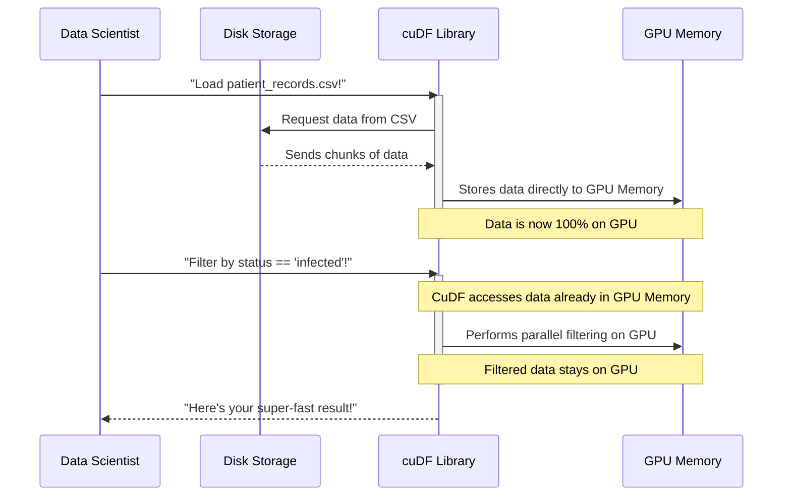

# Chapter 3: GPU-Accelerated DataFrames (cuDF)

Welcome back, data explorer! In our last chapter, [RAPIDS Ecosystem](02_rapids_ecosystem_.md), we got a glimpse of the powerful toolkit that helps us accelerate data science on GPUs. We saw how libraries like `cuDF`, `cuML`, and `cuGraph` are designed to work together seamlessly, keeping your data on the super-fast GPU.

Now, it's time to open that toolkit and pick up one of the most fundamental and incredibly useful tools: **`cuDF`**, short for **GPU-Accelerated DataFrames**.

### The Problem: Slow Spreadsheets for Massive Data

Imagine you have a gigantic spreadsheet—not just a few hundred rows, but **58 million rows** of data, like the patient records in our epidemic outbreak analysis! If you tried to sort, filter, or calculate things on this huge spreadsheet using traditional tools like `pandas` (a very popular Python library for data tables) on your computer's main processor (CPU), it would take a very, very long time. Hours, or even days, for complex operations! This is because CPUs are excellent at handling tasks one after another, but they're not designed for doing *many* simple tasks all at once across millions of data points.

Waiting for your data to process can be frustrating and slow down your entire data science workflow. This is where `cuDF` comes in!

### Introducing cuDF: Your Super-Fast GPU Spreadsheet!

Think of `cuDF` as a special, super-powered spreadsheet that doesn't run on your computer's regular brain (CPU), but on its rocket engine (GPU). Because GPUs have thousands of small "workers" (cores) that can all do calculations *at the same time*, `cuDF` can perform common data tasks at astonishing speeds.

**`cuDF` helps us tackle the challenge of processing massive datasets efficiently.** It's like having thousands of people sorting and organizing your huge spreadsheet all at once, rather than just one person doing it row by row. This is absolutely essential for handling the **58+ million records** in our epidemic simulation project, allowing us to:
*   Load large files almost instantly.
*   Filter for specific conditions (like finding infected patients) in seconds.
*   Merge different datasets quickly.
*   Perform complex group-by operations (like calculating average age per city) much faster.

### What is a DataFrame? (A Quick Recap)

If you're new to data science, you might be wondering, "What's a DataFrame?"
A **DataFrame** is essentially a table of data, just like a spreadsheet. It has rows and columns.
*   **Columns** usually represent different types of information (e.g., 'Patient ID', 'Age', 'Status', 'Location').
*   **Rows** represent individual entries or observations (e.g., details for one specific patient).

In Python, the `pandas` library is the most popular tool for working with DataFrames. `cuDF` offers a very similar way of working with data, but on the GPU. This means if you're already familiar with `pandas`, `cuDF` will feel very natural and easy to learn!

### Why Use `cuDF` on a GPU?

The power of `cuDF` comes from the **GPU's parallel processing capabilities**.
Imagine you have a huge list of numbers and you need to add 10 to each one.
*   **CPU (like `pandas`):** Would go through the list one number at a time: `number1 + 10`, then `number2 + 10`, etc.
*   **GPU (like `cuDF`):** Would assign many workers to different parts of the list. Hundreds or thousands of numbers would have 10 added to them *simultaneously*.

This "doing many things at once" approach is what makes `cuDF` so incredibly fast for tasks involving large amounts of data.

### How to Use `cuDF` in Our Epidemic Analysis

Let's see `cuDF` in action with our epidemic outbreak analysis. Our goal is to quickly load **millions of patient records** and then **filter for infected patients**.

#### Step 1: Importing `cuDF`

Just like `pandas` is usually imported as `pd`, `cuDF` is typically imported as `cudf`.

```python
import cudf
print("cuDF imported successfully!")
```

This line tells Python we want to use the `cuDF` library.

#### Step 2: Loading Millions of Records to the GPU

In our project, we deal with a file containing **58,479,894 patient records**. Traditionally, loading such a file can take significant time. With `cuDF`, we can load it directly into the GPU's memory using `cudf.read_csv()`.

```python
# Load a huge dataset (e.g., 58+ million patient records) directly onto the GPU
print("Loading patient data with cuDF...")
patient_data_gpu = cudf.read_csv("patient_records.csv") # Imagine this file exists
print(f"Loaded {len(patient_data_gpu)} records onto the GPU.")
# Example Output (from README.md):
# Loading patient data with cuDF...
# Loaded 58479894 records onto the GPU.
```
**Explanation:** `cudf.read_csv()` is very similar to `pandas.read_csv()`. The key difference is that `cuDF` bypasses your main computer memory (RAM) and loads the data *directly into the GPU's memory*. This saves a lot of time by avoiding a slow copying step. Now, all our patient data is ready for super-fast processing on the GPU!

#### Step 3: Filtering for Infected Patients

Once the data is on the GPU, we can perform operations like filtering with incredible speed. We want to find all patients where their 'status' column is 'infected'.

```python
# Filter for infected patients, keeping data on the GPU
print("Filtering for infected patients with cuDF...")
infected_patients_gpu = patient_data_gpu[patient_data_gpu['status'] == 'infected']
print(f"Found {len(infected_patients_gpu)} infected patients on the GPU.")
# Example Output (from README.md):
# Filtering for infected patients with cuDF...
# Found 8638 infected patients on the GPU.
```
**Explanation:** Again, this code looks almost identical to what you'd write with `pandas`! `cuDF` handles the magic behind the scenes. It performs the filtering operation on the GPU, leveraging its parallel processing power. The resulting `infected_patients_gpu` DataFrame is *also* stored entirely on the GPU. This is crucial for [End-to-End Workflow Acceleration](01_end_to_end_workflow_acceleration_.md), as we avoid sending data back to the CPU, which would slow things down.

#### Step 4: Selecting Specific Columns for Further Analysis

In our epidemic analysis, after filtering, we might need specific columns like `'easting'` and `'northing'` (geographic coordinates) to find infection hotspots using machine learning (which we'll cover in [GPU-Accelerated Machine Learning (cuML)](05_gpu_accelerated_machine_learning__cuml__.md)).

```python
# Select only the location columns, data remains on GPU
print("Selecting location data...")
location_data_for_clustering_gpu = infected_patients_gpu[['easting', 'northing']]
print("Location data prepared for clustering.")
# Output:
# Selecting location data...
# Location data prepared for clustering.
```
**Explanation:** We're selecting specific columns, and just like before, this operation happens on the GPU, and the new `location_data_for_clustering_gpu` DataFrame remains on the GPU, ready to be passed directly to a GPU-accelerated machine learning library like `cuML`.

### Under the Hood: How `cuDF` Achieves Speed

How does `cuDF` do all this so fast? It's all about how it talks to the GPU.

#### A Non-Code Walkthrough

When you use `cuDF`, here's a simplified version of what happens:

1.  **You give `cuDF` a command** (like `read_csv` or `filter`).
2.  **`cuDF` translates this command** into specific instructions that the GPU can understand. These instructions are called "CUDA kernels."
3.  **`cuDF` tells the GPU to execute these kernels.** The GPU, with its thousands of cores, then performs the operation on many pieces of data simultaneously.
4.  **The results are stored directly back in the GPU's memory.** They don't leave the GPU unless you specifically ask to transfer them to your CPU.

This smooth, GPU-resident workflow is the foundation of the RAPIDS Ecosystem.


In this diagram, the key takeaway is that once `cuDF` loads data onto the **GPU Memory**, all subsequent operations like filtering happen *within* that GPU Memory. There are no slow "trips" back and forth to your computer's main memory (RAM), which is what usually slows down traditional tools.

#### Diving Deeper (Conceptually)

`cuDF` is built using low-level technologies like C++ and NVIDIA's **CUDA** programming model. When you write a simple `cudf` command in Python, `cuDF` essentially generates and runs highly optimized CUDA code on your GPU. This CUDA code tells thousands of GPU cores exactly how to process your data in parallel.

For example, when `cuDF` loads our **58+ million patient records** (as mentioned in `README.md`), it doesn't read them one by one. It breaks the task into many smaller parts, and the GPU processes many parts simultaneously, reading and organizing the data directly into its own memory in a columnar format (similar to how `pandas` and other DataFrame libraries store data for efficiency). This parallel approach is why `cuDF` can be 10-100 times faster than `pandas` for large datasets.

### Conclusion

In this chapter, we explored `cuDF`, the powerful GPU-accelerated DataFrame library. We learned that `cuDF` is like a super-fast spreadsheet that leverages your GPU to handle massive datasets with incredible speed. It allows us to perform common data manipulation tasks—like loading, filtering, and selecting data—dramatically faster than traditional CPU-based tools, all while keeping the data on the GPU for an efficient [End-to-End Workflow Acceleration](01_end_to_end_workflow_acceleration_.md). We saw how `cuDF` effortlessly handled loading and filtering **58+ million patient records** in our epidemic analysis.

By understanding `cuDF`, you've unlocked the first crucial step in supercharging your data science projects with GPUs!

Next, we'll see how `cuDF` and other RAPIDS tools help us manage even larger-than-memory datasets, enabling us to scale our analysis beyond what a single GPU can hold.

[Next Chapter: Large-Scale Data Handling](04_large_scale_data_handling_.md)

---

Generated by [AI Codebase Knowledge Builder]