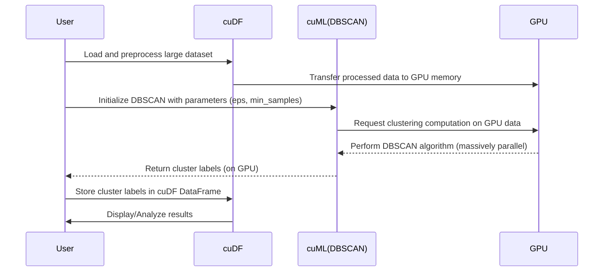

# Chapter 3: GPU-Accelerated Machine Learning (cuML)

Welcome back! In Chapter 2, we learned how `cuDF` supercharges our data manipulation by moving it to the GPU. Now that our data is blazing fast on the GPU, it's time to bring that same acceleration to our machine learning models with **cuML**.

## What is cuML?

**cuML** is a suite of GPU-accelerated machine learning libraries that provides high-performance implementations of standard ML algorithms. Think of it as the `scikit-learn` of the GPU world. If you're familiar with `scikit-learn`, you'll find `cuML`'s API very intuitive and easy to use, making the transition seamless.

**Why cuML?**
Just like `cuDF` for data processing, `cuML` leverages the massive parallel processing power of GPUs to execute machine learning algorithms significantly faster than their CPU-based counterparts. For large datasets, this can translate into dramatically reduced training times, allowing for quicker iteration and analysis – which is critical in scenarios like rapid outbreak detection.

cuML offers a wide range of algorithms for common machine learning tasks, including:
*   **Clustering**: K-Means, DBSCAN, OPTICS
*   **Classification**: Logistic Regression, Random Forest, SVM
*   **Regression**: Linear Regression, Ridge, Lasso
*   **Dimensionality Reduction**: PCA, UMAP, t-SNE

## Geospatial Cluster Detection with cuML's DBSCAN

Our project explicitly uses cuML's DBSCAN algorithm for **geospatial cluster detection**. DBSCAN (Density-Based Spatial Clustering of Applications with Noise) is perfect for identifying "clusters" of data points based on their density, naturally identifying areas with high concentrations of points (like infection hotspots) and marking sparse areas as noise.

By running DBSCAN on the GPU, we can quickly process vast patient datasets to identify potential infection hotspots, enabling a rapid response to outbreaks.

### How DBSCAN Works (Simplified)

DBSCAN groups together points that are closely packed together, marking as outliers points that lie alone in low-density regions. It requires two main parameters:
*   `eps` (epsilon): The maximum distance between two samples for one to be considered as in the neighborhood of the other.
*   `min_samples`: The number of samples (or total weight) in a neighborhood for a point to be considered as a core point.

Let's look at a quick example of using `cuML`'s DBSCAN. We'll assume we have some geospatial data (e.g., latitude and longitude) loaded into a `cudf` DataFrame.

```python
import cudf
from cuml.cluster import DBSCAN

# Assume 'geo_data_gdf' is a cuDF DataFrame
# containing 'latitude' and 'longitude' columns
# from the previous cuDF steps.
# For this example, let's create dummy data:
data = {'latitude': [34.05, 34.06, 34.04, 34.10, 33.99, 34.01, 35.00, 35.01],
        'longitude': [-118.25, -118.26, -118.24, -118.20, -118.30, -118.28, -118.10, -118.11]}
geo_data_gdf = cudf.DataFrame(data)

# Initialize DBSCAN model
# Adjust eps and min_samples based on your data and desired cluster size
dbscan = DBSCAN(eps=0.02, min_samples=2)

# Fit the model and predict clusters
# We'll use the 'latitude' and 'longitude' columns
clusters = dbscan.fit_predict(geo_data_gdf[['latitude', 'longitude']])

# Add the cluster labels back to our DataFrame
geo_data_gdf['cluster_label'] = clusters

print(geo_data_gdf)
```
In the output, `-1` typically indicates noise points that don't belong to any cluster. Other numbers represent distinct clusters.

### The cuML Workflow

Here's a simplified sequence of how `cuML` fits into our data science workflow:



This rapid execution of `cuML`'s DBSCAN on the GPU is vital for our project. It enables us to quickly identify emerging infection hotspots, providing critical insights for public health officials to take timely action.

Next, we'll dive into `CuPy`, which allows us to create custom GPU-accelerated functions for even more flexibility!

---

Generated by [AI Codebase Knowledge Builder]