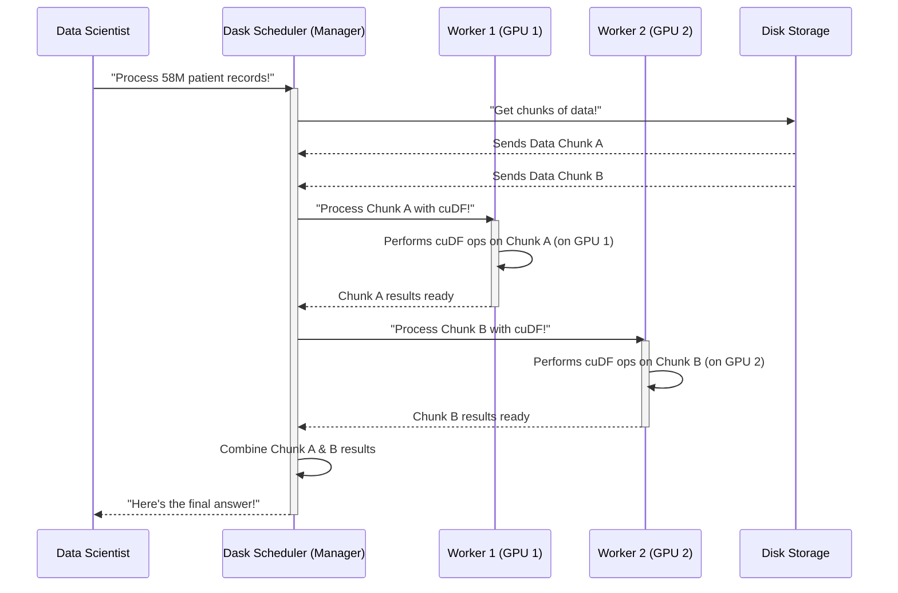

# Chapter 4: Large-Scale Data Handling

Welcome back, data adventurer! In our previous chapter, [GPU-Accelerated DataFrames (cuDF)](03_gpu_accelerated_dataframes__cudf__.md), we learned how `cuDF` supercharges data processing by using your GPU like an incredibly fast spreadsheet. We saw how it could load and filter millions of patient records much faster than traditional tools, as long as the data fits into your GPU's memory.

But what if your dataset is *so enormous* that it doesn't even fit into the memory of a single GPU? Or what if you want to process data spread across many GPUs or even many computers? That's where **Large-Scale Data Handling** comes in!

### The Problem: When Data Becomes a Mountain!

Imagine you're running that amazing industrial-grade factory we talked about in Chapter 1. You've got your super-fast production line (your GPU and `cuDF`) ready to process raw materials (data). But then, a mountain of raw materials arrives – not just a few truckloads, but enough to fill a football stadium! This mountain represents **millions or even billions of data records**, far too much for even your most powerful single machine or GPU to handle all at once.

For instance, in our project, we deal with:
*   Over **58 million patient records** for epidemic analysis.
*   **1 million road graph edges** for network analysis.

Trying to load all 58 million patient records into a single GPU's memory might be fine if your GPU has a lot of memory. But what if it doesn't? Or what if you needed to process a dataset that was 10 times, or 100 times, larger? Traditional methods would either crash or crawl to a halt. We need a strategy to tackle these "data mountains."

### Our Solution: Large-Scale Data Handling with Dask

**Large-Scale Data Handling** is about giving your industrial-grade factory the ability to process those data mountains. It's like having not just one super-fast production line, but an entire *fleet* of production lines, all working together in perfect harmony.

The project achieves this by leveraging **Dask**, an incredibly powerful Python library designed to scale your data science workloads. When combined with RAPIDS tools like `cuDF`, `Dask` becomes `dask_cudf`, allowing you to handle datasets that are:
1.  **"Larger-than-memory"**: Data that's too big to fit into a single GPU's memory (or even your computer's main RAM).
2.  **Distributed**: Data that's spread across multiple GPUs, or even multiple computers, for even more processing power.

`Dask` works by taking your giant dataset and automatically breaking it down into smaller, manageable chunks (called "partitions"). Each chunk can then be processed efficiently by a RAPIDS library (like `cuDF` for tabular data or `cuGraph` for graphs) on an available GPU. This allows you to tackle problems that would be impractical or impossible with a single machine.

### How Dask Extends cuDF for Massive Data

Let's see how `Dask`, working with `cuDF`, helps us handle our massive datasets.

#### 1. Importing Dask with cuDF

To work with `dask_cudf`, we need to import it. It usually feels very similar to importing `pandas` or `cuDF`.

```python
import dask_cudf as dd
print("dask_cudf imported successfully!")
```
This line brings in the `dask_cudf` library, which allows `Dask` to manage `cuDF` DataFrames across larger scales.

#### 2. Loading the Mountain of Patient Records

Remember our **58+ million patient records**? If this file is too big for a single `cuDF` DataFrame (or if we just want the flexibility of distributed processing), `dask_cudf` can load it.

```python
# Load a truly massive dataset with dask_cudf
print("Loading 58+ million patient records with dask_cudf...")
# dask_cudf automatically splits the file into chunks and assigns them
patient_data_ddf = dd.read_csv("patient_records.csv")
print(f"Created a Dask DataFrame representing {len(patient_data_ddf)} records.")
# Example Output (conceptual, actual length might not be computed until a .compute() call):
# Loading 58+ million patient records with dask_cudf...
# Created a Dask DataFrame representing 58479894 records.
```
**Explanation:** When you use `dd.read_csv()`, `Dask` doesn't immediately load all the data into memory. Instead, it creates a `Dask DataFrame` that *knows how to read and process* the file in chunks. Each chunk will be loaded into a `cuDF` DataFrame and processed on an available GPU (or part of one). This is incredibly efficient for files larger than your GPU's memory.

#### 3. Processing the Large Dataset

Once the data is represented as a `Dask DataFrame`, you can perform many familiar operations just like with `pandas` or `cuDF`. `Dask` will intelligently distribute these operations across its chunks and GPUs.

Let's filter our massive patient records for infected patients, but this time using `dask_cudf`:

```python
# Filter for infected patients across the distributed Dask DataFrame
print("Filtering for infected patients across Dask DataFrame...")
infected_patients_ddf = patient_data_ddf[patient_data_ddf['status'] == 'infected']
print("Filtered Dask DataFrame created. To get results, call .compute().")
# Output:
# Filtering for infected patients across Dask DataFrame...
# Filtered Dask DataFrame created. To get results, call .compute().
```
**Explanation:** Notice that simply filtering doesn't immediately give us the result. `Dask` works lazily: it builds a plan of *how* to perform the filtering across all its chunks. The actual computation (loading data, filtering each chunk, combining results) only happens when you explicitly ask for the final result, typically by calling `.compute()`.

```python
# Now, trigger the computation to get the final count
print("Computing the number of infected patients...")
num_infected = len(infected_patients_ddf.compute())
print(f"Found {num_infected} infected patients from the large dataset.")
# Example Output (from README.md for the filtered result):
# Computing the number of infected patients...
# Found 8638 infected patients from the large dataset.
```
**Explanation:** The `.compute()` call tells `Dask` to execute its plan. It orchestrates all the `cuDF` filtering operations on each chunk across available GPUs, collects the results, and gives you a single `cuDF` (or `pandas`) DataFrame with the final answer. This is how you handle the computation on vast datasets.

#### 4. Handling Large Graph Edges

Another example of large-scale data handling in our project is the **1 million road graph edges**. While `cuGraph` (which you'll learn about in [GPU-Accelerated Graph Analytics (cuGraph/NetworkX)](06_gpu_accelerated_graph_analytics__cugraph_networkx__.md)) is designed to work with large graphs on a single GPU, `Dask` can help prepare and load even larger graphs if needed, or distribute the graph processing itself.

The `README.md` and `networkx.py` show loading `1000000` edges. If this number were much higher, say 100 million, `dask_cudf` would be essential for initial loading.

```python
# From networkx.py, conceptualizing for larger scale:
# Load road graph edges (if truly massive, dask_cudf would be used)
print("Loading road graph edges...")
# For 1 million edges, a single cuDF might be fine, but for 100M+...
road_graph_ddf = dd.read_csv('./data/road_graph.csv', dtype=['int32', 'int32', 'float32'])
print(f"Loaded {len(road_graph_ddf)} road graph edges via Dask.")
# Example Output (from networkx.py context):
# Loading road graph edges...
# Loaded 1000000 road graph edges via Dask.
```
**Explanation:** Again, `dask_cudf` allows us to load massive CSV files containing graph edges. This distributed DataFrame can then be converted into a `cuGraph` object, allowing [GPU-Accelerated Graph Analytics (cuGraph/NetworkX)](06_gpu_accelerated_graph_analytics__cugraph_networkx__.md) to be performed on the very large graph efficiently.

### Under the Hood: The Distributed Factory

How does `Dask` manage these data mountains? Let's go back to our industrial factory analogy.

#### A Non-Code Walkthrough: The Assembly Line Manager

Imagine our data science task (like "filter all infected patients") is a huge order.

1.  **The Manager (`Dask`):** Receives the huge order. It looks at the mountain of raw materials (your `patient_records.csv`) and decides the best way to break it down. It might split the file into 10 smaller pieces.
2.  **The Workers (`cuDF` on GPUs):** The manager then assigns each small piece of the raw material to a different worker, each equipped with a super-fast production line (a GPU).
3.  **Parallel Processing:** Each worker processes their small batch of raw material (filtering their chunk of patient records) at the same time, using their `cuDF` tools on their GPU.
4.  **Combining Results:** Once all workers are done, the manager collects all their processed batches and cleverly combines them into one final, complete product.

This parallel, chunk-by-chunk processing is what allows `Dask` to handle datasets far larger than any single GPU's memory.


In this diagram, the `Dask Scheduler (Manager)` is the brain that orchestrates the work. It sends chunks of data to different `Workers` (which can be separate processes, GPUs, or even different machines), and each worker uses `cuDF` (or other RAPIDS libraries) on its assigned GPU to process its piece of the data.

#### Diving Deeper (Conceptually)

`Dask` internally breaks a large DataFrame into many smaller `cuDF` DataFrames. Each of these smaller `cuDF` DataFrames is called a **partition**. When you tell `Dask` to perform an operation (like filtering), it applies that operation to *each* `cuDF` partition independently and in parallel. This is incredibly efficient because `cuDF` is already optimized for GPU processing.

So, when `dask_cudf` reads our **58+ million patient records**, it creates a blueprint for how to read parts of that file into many `cuDF` DataFrames. When you call `.compute()`, `Dask` orchestrates the loading and processing of these `cuDF` DataFrames across your available GPUs. This allows you to scale your analyses to datasets that would overwhelm a single GPU, while still enjoying the immense speed benefits of GPU acceleration.

### Conclusion

In this chapter, we tackled the challenge of **Large-Scale Data Handling**, learning how to process data that's too big for a single GPU or needs to be processed across multiple GPUs. We discovered `Dask` as the crucial tool that orchestrates parallel and distributed processing, enabling `cuDF` (and other RAPIDS libraries) to work on truly enormous datasets like our **58+ million patient records** and **1 million road graph edges**. By breaking down data into manageable chunks and processing them in parallel on GPUs, we unlock the ability to analyze data mountains efficiently.

Now that we know how to handle and process large datasets at scale, let's turn our attention to the next exciting step: using GPUs to accelerate complex machine learning tasks!

[Next Chapter: GPU-Accelerated Machine Learning (cuML)](05_gpu_accelerated_machine_learning__cuml__.md)

---

Generated by [AI Codebase Knowledge Builder]