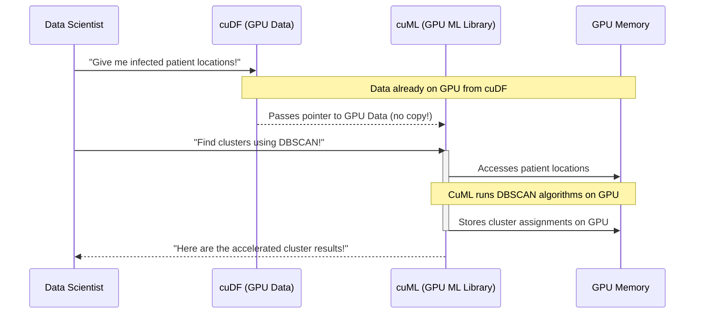

# Chapter 5: GPU-Accelerated Machine Learning (cuML)

Welcome back, data adventurer! In our last chapter, [Large-Scale Data Handling](04_large_scale_data_handling_.md), we learned how Dask helps us process truly massive datasets, even those too big for a single GPU, by cleverly breaking them into chunks. Before that, in [GPU-Accelerated DataFrames (cuDF)](03_gpu_accelerated_dataframes__cudf__.md), we mastered using your GPU as a super-fast spreadsheet.

Now that we know how to load and prepare huge amounts of data at incredible speeds, it's time for the exciting part: using that data to build intelligent models! This is where **`cuML`**, short for **GPU-Accelerated Machine Learning**, takes center stage.

### The Problem: Waiting Forever for Models to Train!

Imagine you've successfully loaded **58 million patient records** and filtered them down to **8,638 infected patients** using `cuDF`. Your next big task in our epidemic simulation is to find "hotspots" or clusters of infection. This involves running a complex **machine learning algorithm** like DBSCAN on these thousands of patient locations.

If you tried to do this with traditional machine learning libraries (like `scikit-learn`) on your computer's main processor (CPU), it could take a very, very long time. For larger datasets, this "model training" step can stretch for hours or even days! This slow process means:
*   You can't experiment with different models or settings easily.
*   You might have to use smaller datasets, losing valuable insights.
*   Your discoveries are delayed, impacting critical decisions (like responding to an epidemic!).

It's like having all your ingredients perfectly prepped, but your oven (for baking the "model") takes an eternity to cook.

### Introducing `cuML`: Your Super-Fast AI Oven!

**`cuML`** is like having a super-fast, specialized oven designed specifically for baking machine learning models. It's a library that provides **GPU-accelerated versions** of many popular machine learning algorithms. This means it can train models on your GPU much, much quicker than traditional CPU-based tools.

`cuML` directly addresses the challenge of slow model training by:
*   Utilizing the GPU's thousands of cores to perform calculations in parallel.
*   Working seamlessly with `cuDF` DataFrames, keeping your data on the GPU and avoiding slow transfers.

For our epidemic analysis, `cuML` will allow us to find those **14 distinct infection clusters** from the **8,638 infected patients** in minutes (or even seconds!), not hours. This drastically speeds up the "discovery phase" of any data science project.

### What is Machine Learning (and Clustering)? (A Quick Refresher)

**Machine Learning (ML)** is essentially about teaching computers to learn from data without being explicitly programmed. It allows computers to find patterns, make predictions, or group similar things together.

One common ML task is **clustering**.
*   **Clustering** is like sorting a pile of LEGOs into groups based on their color or shape without you telling the computer exactly how many groups there should be. The computer looks at the similarities and differences and figures out the groups itself.
*   In our epidemic project, we use a clustering algorithm called **DBSCAN** to find groups of infected patients that are geographically close to each other, thus identifying "hotspots."

### Why Use `cuML` on a GPU?

Just like `cuDF` for data processing, `cuML` harnesses the incredible parallel processing power of your GPU.
*   **Many computations at once:** Machine learning algorithms often involve repeating the same mathematical operations (like calculating distances between points, or adjusting model parameters) thousands or millions of times. GPUs excel at doing these repetitive tasks *simultaneously*.
*   **Data stays on the GPU:** Crucially, `cuML` is designed to work directly with `cuDF` DataFrames that are already residing in your GPU's memory. This means there's no time-consuming step of copying data back and forth between the CPU and GPU, which is a major bottleneck in traditional workflows. This seamless hand-off is a cornerstone of [End-to-End Workflow Acceleration](01_end_to_end_workflow_acceleration_.md).

### How to Use `cuML` in Our Epidemic Analysis

Let's see how we can use `cuML` to quickly find infection hotspots among our `infected_patients_gpu` data. Our goal is to apply DBSCAN clustering to their geographic coordinates (`easting` and `northing`).

#### Step 1: Prepare the Data (Already on GPU from cuDF)

From [GPU-Accelerated DataFrames (cuDF)](03_gpu_accelerated_dataframes__cudf__.md), we already have our filtered infected patient data (`infected_patients_gpu`) and we've selected the relevant location columns. This data is sitting comfortably in your GPU's memory.

```python
# (Conceptual) Assume 'location_data_for_clustering_gpu' is a cuDF DataFrame
# containing 'easting' and 'northing' for infected patients,
# prepared in the previous cuDF chapter.
# For example, it would look like this:
# location_data_for_clustering_gpu = infected_patients_gpu[['easting', 'northing']]

print("Location data for infected patients is ready on the GPU.")
# Output:
# Location data for infected patients is ready on the GPU.
```
This step reminds us that `cuML` works directly with the output of `cuDF`, maintaining the speed benefit.

#### Step 2: Import the `cuML` Clustering Algorithm

Just like you would import `DBSCAN` from `sklearn.cluster` in a traditional Python environment, you import it from `cuml.cluster` when using `cuML`.

```python
from cuml.cluster import DBSCAN
print("cuML DBSCAN algorithm imported!")
```
This line tells Python that we want to use the GPU-accelerated DBSCAN clustering algorithm from `cuML`.

#### Step 3: Configure and Train the DBSCAN Model

Now, we create an instance of the `DBSCAN` model and then "train" it (which, for clustering, means it finds the clusters).

```python
# Configure DBSCAN:
# 'eps' is the maximum distance between two samples for one to be considered as in the neighborhood of the other.
# 'min_samples' is the number of samples (or total weight) in a neighborhood for a point to be considered as a core point.
print("Configuring cuML DBSCAN model...")
clustering_model = DBSCAN(eps=2000, min_samples=25)

# Train the model to find clusters using the GPU data
print("Finding infection hotspots with cuML DBSCAN...")
clusters = clustering_model.fit_predict(location_data_for_clustering_gpu)
print("Clustering complete!")
# Output:
# Configuring cuML DBSCAN model...
# Finding infection hotspots with cuML DBSCAN...
# Clustering complete!
```
**Explanation:**
*   `DBSCAN(eps=2000, min_samples=25)`: We create a DBSCAN model. `eps=2000` means that points within 2000 meters of each other are considered neighbors. `min_samples=25` means a group of at least 25 neighboring infected patients forms a cluster. These parameters are crucial for defining what an "infection hotspot" means.
*   `clustering_model.fit_predict(location_data_for_clustering_gpu)`: This is the core step! `cuML` takes the GPU-resident `location_data_for_clustering_gpu` DataFrame and performs the DBSCAN algorithm directly on the GPU. It quickly calculates distances between all 8,638 infected patients and groups them into clusters. The result (`clusters`) is a `cuDF` Series (or similar GPU-array) indicating which cluster each patient belongs to.

#### Step 4: Analyze the Results

Finally, we can look at the clusters found by `cuML`.

```python
# Count the number of distinct clusters identified
num_distinct_clusters = clusters.unique().shape[0]
print(f"Identified {num_distinct_clusters} distinct infection clusters with cuML.")
# Example Output (from README.md):
# Identified 14 distinct infection clusters with cuML.
```
**Explanation:** `clusters.unique()` gives us all the unique cluster IDs, and `.shape[0]` counts them. This immediately shows us that `cuML` has successfully identified the **14 distinct clusters** mentioned in the project's README, all processed with GPU acceleration!

### Under the Hood: The GPU-Accelerated ML Engine

How does `cuML` work its magic so fast?

#### A Non-Code Walkthrough: The Specialized Bakery Team

Let's revisit our bakery analogy. Your `cuDF` tools have prepared all the ingredients (patient locations) and placed them on the super-fast counter (GPU Memory). Now it's time to "bake" the model.

1.  **You give `cuML` the recipe:** You tell `cuML` you want to use the `DBSCAN` recipe with specific settings (`eps`, `min_samples`).
2.  **`cuML` translates the recipe for the GPU team:** `cuML` doesn't just pass the recipe; it translates it into highly optimized instructions that thousands of specialized GPU "chefs" can understand.
3.  **The GPU chefs work in parallel:** Instead of one chef calculating distances between patients one by one, thousands of GPU cores (chefs) jump in and calculate distances for many patient pairs *simultaneously*. This massively speeds up the core computations of the DBSCAN algorithm.
4.  **Results stay on the counter:** All the intermediate and final results of the clustering (e.g., which patient belongs to which cluster) are stored directly back on the super-fast counter (GPU Memory). They never leave the GPU.

This direct, parallel processing on the GPU is why `cuML` delivers results so much faster than traditional CPU-based machine learning.


In this diagram, the key is the seamless hand-off from `cuDF` to `cuML`. Data doesn't need to be copied because both libraries operate directly on the **GPU Memory**. `cuML` then performs its complex calculations using the GPU's power, storing the results right there.

#### Diving Deeper (Conceptually)

`cuML` is built using NVIDIA's **CUDA** programming model, just like `cuDF`. When you call `clustering_model.fit_predict()`, `cuML` executes highly optimized **CUDA kernels** on your GPU.

For an algorithm like DBSCAN, which relies heavily on calculating distances between many points, `cuML` re-engineers these computations to be massively parallel. For instance:
*   Instead of calculating distance from one point to all others sequentially, the GPU can calculate distances from *many* points to their neighbors *at the same time*.
*   When determining if a point is a "core point" (has enough neighbors to start a cluster), thousands of points can have their neighborhoods checked in parallel.

This fundamental re-architecture for parallel processing is why `cuML` can provide such dramatic speedups for tasks like clustering, classification, regression, and more, making it an indispensable tool for accelerating the machine learning phase of your data science workflows.

### Conclusion

In this chapter, we explored **`cuML`**, the powerful GPU-accelerated machine learning library. We learned how `cuML` acts as your super-fast AI oven, allowing you to train complex machine learning models like DBSCAN clustering at incredible speeds by leveraging your GPU's parallel processing power. By working directly with data already on the GPU from `cuDF`, `cuML` eliminates bottlenecks and dramatically accelerates the discovery phase of data science, enabling us to quickly identify those **14 infection hotspots** from millions of patient records.

Now that we can process data and build models rapidly, let's explore how GPUs can also accelerate the analysis of complex relationships and networks!

[Next Chapter: GPU-Accelerated Graph Analytics (cuGraph/NetworkX)](06_gpu_accelerated_graph_analytics__cugraph_networkx__.md)

---

Generated by [AI Codebase Knowledge Builder]