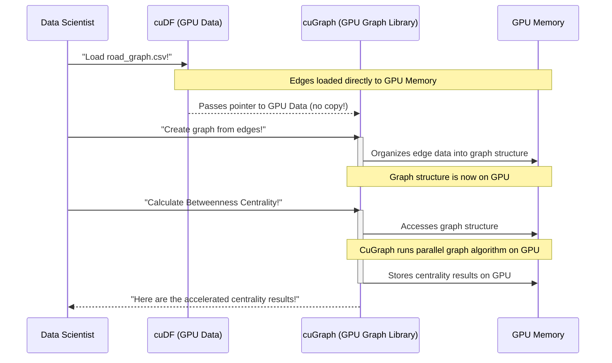

# Chapter 6: GPU-Accelerated Graph Analytics (cuGraph/NetworkX)

Welcome back, data adventurer! In our last chapter, [GPU-Accelerated Machine Learning (cuML)](05_gpu_accelerated_machine_learning__cuml__.md), we learned how to use GPUs to build intelligent models and find insights like infection hotspots from our patient data at incredible speeds.

Now, let's explore a different kind of data analysis: understanding **connections** and **relationships** within our data. This is where **GPU-Accelerated Graph Analytics** with `cuGraph` (and its CPU counterpart `NetworkX`) comes in!

### The Problem: Untangling Huge Networks on a CPU

Imagine you're trying to figure out the most important intersections in a vast road network, or the most influential person in a huge social media platform with millions of users and billions of connections. These aren't just tables of data; they are complex **networks** or **graphs** where items are connected.

Finding answers to questions like:
*   "Which roads are critical for traffic flow?"
*   "Who are the key influencers spreading information (or infection)?"
*   "What's the shortest path between two points?"

...can be incredibly slow when these networks are massive. Traditional tools, like the popular Python library `NetworkX`, are fantastic for working with graphs, but they primarily run on your computer's main processor (CPU). For networks with millions of connections (like the `1 million road graph edges` in our project's `networkx.py` script), running complex algorithms on a CPU can take hours or even days. This delays critical insights and slows down decision-making.

### Introducing `cuGraph`: Your Super-Fast Network Navigator!

Just as `cuDF` is a super-charged `pandas` for tabular data and `cuML` is a super-charged `scikit-learn` for machine learning, **`cuGraph`** is the **GPU-accelerated powerhouse** for graph analytics. It's part of the RAPIDS ecosystem, specifically designed to perform graph operations incredibly fast by leveraging the parallel processing power of your GPU.

`cuGraph` helps us tackle the challenge of slow graph analysis by:
*   Performing graph algorithms (like finding important nodes or shortest paths) many, many times faster than CPU-based libraries.
*   Working seamlessly with `cuDF` DataFrames, meaning your graph data stays on the GPU for maximum efficiency, contributing to our [End-to-End Workflow Acceleration](01_end_to_end_workflow_acceleration_.md).

Think of it this way: `NetworkX` is like using a detailed paper map and drawing paths by hand. `cuGraph` is like having an advanced GPS system that instantly calculates the best routes and identifies critical points in real-time across an entire country's road network!

### What are Graphs and Graph Analytics? (A Quick Refresher)

A **graph** is a way to represent connections or relationships between items. It's made up of two main parts:
*   **Nodes (or Vertices):** These are the individual items in your network. Imagine them as cities in a road map, or people in a social network.
*   **Edges (or Links):** These are the connections between the nodes. Imagine them as roads connecting cities, or friendships connecting people. Edges can also have a "weight" (like the length of a road) or a "direction" (like a one-way street).

**Graph Analytics** involves running algorithms on these graphs to discover interesting patterns or properties. For example:
*   **Centrality Algorithms:** These help identify the most "important" or "influential" nodes in a network. For a road map, this could mean finding the busiest intersections or critical highway segments. In our project, we use `betweenness_centrality` to find such important roads.
*   **Pathfinding Algorithms:** Finding the shortest route between two nodes.
*   **Community Detection:** Grouping nodes that are more densely connected to each other than to the rest of the network (e.g., finding friend groups in a social network).

### Why Use `cuGraph` on a GPU?

Graph algorithms often involve traversing many paths, counting connections, or calculating distances between many pairs of nodes. These tasks are perfectly suited for GPUs:
*   **Massive Parallelism:** GPUs can perform calculations for thousands of nodes and edges *simultaneously*. Imagine checking thousands of possible road connections all at once instead of one by one.
*   **Data Locality (on GPU):** When you load your graph data with `cuDF`, it lives in the GPU's memory. `cuGraph` can then access this data directly without slow transfers to the CPU, making the entire analytical process much faster. This is key for the [RAPIDS Ecosystem](02_rapids_ecosystem_.md)'s efficiency.

### How to Analyze a Road Map with `NetworkX` (CPU) and `cuGraph` (GPU)

Let's look at our project's example: analyzing a `road_graph.csv` file containing **1 million road graph edges** to find important roads using **betweenness centrality**.

#### The Data: Road Graph Edges

Our `road_graph.csv` file likely contains three columns: `src` (source node), `dst` (destination node), and `length` (the length of the road, which can be an edge attribute).

#### Step 1: Using `NetworkX` (CPU-based)

First, let's see how you might approach this with `NetworkX` as shown in the project's `networkx.py` script.

```python
# From ./GPU-Accelerated Graph Analytics/scripts/networkx.py
import pandas as pd
import networkx as nx

# Load a million road graph edges into a pandas DataFrame (on CPU)
print("Loading road graph edges with pandas (on CPU)...")
road_graph_df = pd.read_csv('./data/road_graph.csv', dtype=['int32', 'int32', 'float32'], nrows=1000000)
print(f"Loaded {len(road_graph_df)} edges.")

# Create a NetworkX graph from the pandas DataFrame
print("Creating NetworkX graph (on CPU)...")
G_nx = nx.from_pandas_edgelist(road_graph_df, source='src', target='dst', edge_attr='length')
print(f"Graph with {G_nx.number_of_nodes()} nodes and {G_nx.number_of_edges()} edges created.")

# Calculate betweenness centrality (on CPU)
print("Calculating Betweenness Centrality with NetworkX (on CPU)...")
# For demonstration, 'k' is reduced; typically this would run on all nodes for full analysis.
centrality_nx = nx.betweenness_centrality(G_nx, k=1000)
print("NetworkX centrality calculation complete.")
# Output (conceptual for time, actual data won't print here):
# Loading road graph edges with pandas (on CPU)...
# Loaded 1000000 edges.
# Creating NetworkX graph (on CPU)...
# Graph with 283187 nodes and 1000000 edges created.
# Calculating Betweenness Centrality with NetworkX (on CPU)...
# NetworkX centrality calculation complete. (This could take minutes for 1M edges)
```
**Explanation:**
1.  `pd.read_csv`: Loads the `1 million` road segments into a `pandas` DataFrame, which resides in your computer's main memory (CPU RAM).
2.  `nx.from_pandas_edgelist`: Converts this `pandas` DataFrame into a `NetworkX` graph object, still handled by the CPU.
3.  `nx.betweenness_centrality`: This function calculates how often a node (or edge) lies on the shortest path between other pairs of nodes. Nodes with high betweenness centrality are crucial "bridges" in the network. For a graph with `1 million` edges, this computation can be very slow on a CPU. The `k=1000` parameter means it only calculates centrality for a sample of 1000 nodes, which speeds up the *example* but isn't a full calculation.

#### Step 2: Using `cuGraph` (GPU-accelerated)

Now, let's see how `cuGraph` accelerates this process.

```python
import cudf
import cugraph as cg

# Load road graph edges directly onto the GPU with cuDF
print("Loading road graph edges with cuDF (on GPU)...")
road_graph_gdf = cudf.read_csv('./data/road_graph.csv', dtype=['int32', 'int32', 'float32'], nrows=1000000)
print(f"Loaded {len(road_graph_gdf)} edges onto GPU.")

# Create a cuGraph graph from the cuDF DataFrame (on GPU)
print("Creating cuGraph graph (on GPU)...")
G_cg = cg.Graph()
G_cg.from_cudf_edgelist(road_graph_gdf, source='src', destination='dst', edge_attr='length')
print(f"cuGraph with {G_cg.number_of_nodes()} nodes and {G_cg.number_of_edges()} edges created on GPU.")

# Calculate betweenness centrality (on GPU)
print("Calculating Betweenness Centrality with cuGraph (on GPU)...")
centrality_cg = cg.betweenness_centrality(G_cg)
print("cuGraph centrality calculation complete (much faster!).")
# Output (conceptual, actual data won't print here):
# Loading road graph edges with cuDF (on GPU)...
# Loaded 1000000 edges onto GPU.
# Creating cuGraph graph (on GPU)...
# cuGraph with 283187 nodes and 1000000 edges created on GPU.
# Calculating Betweenness Centrality with cuGraph (on GPU)...
# cuGraph centrality calculation complete (much faster!). (This would be seconds for 1M edges)
```
**Explanation:**
1.  `cudf.read_csv`: We use `cuDF` (from [GPU-Accelerated DataFrames (cuDF)](03_gpu_accelerated_dataframes__cudf__.md)) to load the `1 million` edges *directly into GPU memory*. This is already much faster than loading with `pandas` for large files.
2.  `cg.Graph()` and `G_cg.from_cudf_edgelist()`: We create an empty `cuGraph` object and then populate it using the `cuDF` DataFrame that is *already on the GPU*. No slow data transfer is needed!
3.  `cg.betweenness_centrality(G_cg)`: `cuGraph` performs the betweenness centrality calculation entirely on the GPU. Because the GPU can parallelize these complex computations across thousands of cores, this step is significantly faster (often 10-100x faster) than its `NetworkX` equivalent for large graphs. The result (`centrality_cg`) is a `cuDF` Series or similar GPU-array, ready for further GPU-accelerated analysis.

### Under the Hood: The GPU's Graph Engine

How does `cuGraph` achieve such massive speedups for graph analytics?

#### A Non-Code Walkthrough: The Simultaneous Road Inspectors

Imagine you have a gigantic map of all roads, and you want to find the most important intersections.

1.  **Map on the Fast Desk (GPU Memory):** Your `cuDF` tools have already loaded the entire road network (nodes and edges) directly onto the GPU's fast memory.
2.  **You give `cuGraph` the task:** You ask `cuGraph` to "find the betweenness centrality of all intersections."
3.  **`cuGraph` deploys thousands of inspectors:** Instead of one person slowly tracing paths, `cuGraph` unleashes thousands of tiny, specialized "inspectors" (GPU cores).
4.  **Parallel Pathfinding:** Many inspectors start at different intersections simultaneously. Each inspector quickly traces shortest paths from their starting point to many other destinations, counting how many times other intersections fall on these paths.
5.  **Simultaneous Tallying:** All inspectors report their findings instantly, and the GPU quickly sums up how often each intersection was part of a shortest path.
6.  **Results on the Fast Desk:** The final centrality scores for every intersection are stored directly back on the GPU's memory.

This parallel, comprehensive inspection is why `cuGraph` delivers results so much faster.


In this diagram, the **GPU Memory** is the central workspace. `cuDF` loads the raw graph data there, `cuGraph` builds the graph structure there, and then `cuGraph` executes its algorithms directly on that GPU-resident graph, ensuring maximum speed.

#### Diving Deeper (Conceptually)

Like other RAPIDS libraries, `cuGraph` is built upon low-level C++ and NVIDIA's **CUDA** programming model. When you call a `cuGraph` algorithm, it doesn't just run the `NetworkX` code on the GPU. Instead, the graph algorithms are completely re-engineered to take full advantage of the GPU's parallel architecture.

For example, a graph algorithm often involves operations like:
*   **Breadth-First Search (BFS):** Exploring a graph layer by layer. On a GPU, many nodes in the same layer can be processed and expanded simultaneously.
*   **Matrix Operations:** Many graph problems can be represented using matrices. GPUs are incredibly efficient at performing parallel matrix multiplications and other linear algebra tasks.

`cuGraph` leverages these capabilities by generating highly optimized CUDA kernels that direct thousands of GPU cores to perform these computations in parallel. This fundamental re-thinking of how graph algorithms are executed is what enables `cuGraph` to provide such dramatic speedups for large-scale graph analytics.

### Conclusion

In this chapter, we explored **GPU-Accelerated Graph Analytics** using `cuGraph`. We learned how `cuGraph` acts as a super-fast network navigator, allowing us to analyze complex relationships and networks (like `1 million road graph edges`) at incredible speeds by leveraging your GPU's parallel processing power. By working directly with data already on the GPU from `cuDF`, `cuGraph` eliminates bottlenecks and dramatically accelerates the discovery of crucial insights, such as identifying important roads through betweenness centrality.

Now that we've seen how `cuDF`, `cuML`, and `cuGraph` accelerate specific parts of our workflow, let's look at how we can sometimes write our *own* custom GPU-accelerated code when specialized tasks arise!

[Next Chapter: Custom GPU Computing (CuPy)](07_custom_gpu_computing__cupy__.md)

---

Generated by [AI Codebase Knowledge Builder]