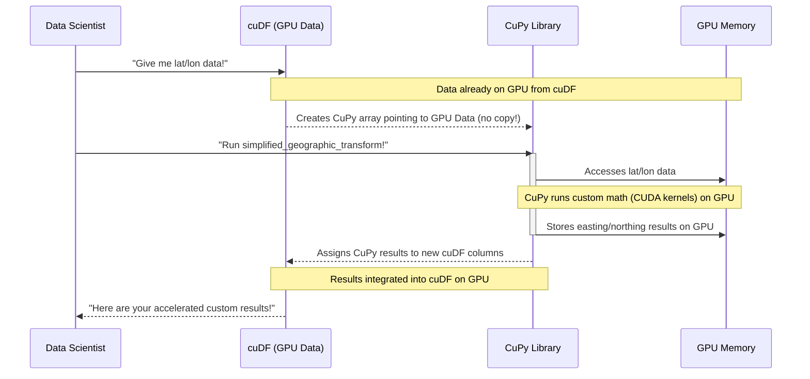

# Chapter 7: Custom GPU Computing (CuPy)

Welcome back, data craftsman! In our previous chapter, [GPU-Accelerated Graph Analytics (cuGraph/NetworkX)](06_gpu_accelerated_graph_analytics__cugraph_networkx__.md), we learned how to untangle complex relationships and networks at lightning speed using `cuGraph`. We've seen how powerful the RAPIDS ecosystem is for accelerating common data science tasks like data processing with `cuDF` and machine learning with `cuML`.

But what if you encounter a very specific, unique mathematical operation or data transformation that isn't readily available in these standard GPU-accelerated libraries? This is where **Custom GPU Computing** with **CuPy** becomes your secret weapon!

### The Problem: When Off-the-Shelf Tools Don't Quite Fit

Imagine you're a chef with a kitchen full of amazing, specialized appliances: a super-fast mixer (`cuDF`), a high-tech oven (`cuML`), and an automated decorating machine (`cuGraph`). These tools handle 99% of your cooking tasks efficiently.

However, sometimes you need to perform a *very specific*, custom step that no pre-built appliance can do. Perhaps you need to blend a unique spice mix using an ancient family recipe that requires a special grinding technique. If you tried to do this complex, custom task manually or with a slow, general-purpose tool, it would slow down your entire high-speed kitchen.

In data science, this situation arises when you need to apply **unique mathematical operations** or **custom data transformations** to your massive datasets. A perfect example from our `Accelerating-End-to-End-Data-Science-Workflows` project is converting geographic coordinates from standard latitude/longitude to the specialized **OSGB36 grid reference system**. This conversion involves complex formulas that are not typically found as a single function in `cuDF` or `cuML`. If we did this on the CPU, it would be a significant bottleneck for millions of patient records.

### Introducing CuPy: Your Specialized GPU Workshop!

**CuPy** is like your specialized workshop where you can build your own custom, super-fast tools to run directly on the GPU. It allows data scientists to write Python code for numerical computations that leverages the GPU, very similar to how the popular `NumPy` library works for CPUs.

`CuPy` helps us tackle the challenge of unique operations by:
*   Providing a **NumPy-like interface** for creating and manipulating arrays on the GPU.
*   Enabling you to write **custom mathematical functions** that execute directly on the GPU, leveraging its parallel processing power.
*   Integrating seamlessly with `cuDF` and other RAPIDS libraries, keeping your data on the GPU and maintaining our [End-to-End Workflow Acceleration](01_end_to_end_workflow_acceleration_.md).

For our epidemic analysis, `CuPy` is crucial for quickly and efficiently performing **geographic coordinate conversions** for millions of patient records, which is a vital step before clustering to ensure accurate distance calculations.

### What are NumPy and CuPy? (A Quick Refresher)

If you're familiar with Python for data science, you've almost certainly used **NumPy**:
*   **NumPy:** This is the foundational library for numerical computing in Python. It provides powerful **array objects** (like lists, but optimized for numbers) and a vast collection of functions to operate on these arrays (e.g., adding numbers, finding averages, performing complex math). NumPy arrays and operations typically run on your computer's main processor (CPU).

**CuPy** is designed to be a **drop-in replacement for NumPy**, but with a crucial difference:
*   **CuPy:** It provides array objects that live in **GPU memory**, and all its functions execute on the **GPU**. This means you can often take existing NumPy code, change `numpy` to `cupy`, and instantly get GPU acceleration for those numerical operations!

The similarity in syntax makes it incredibly easy for Python developers to start using `CuPy` and harness the GPU's power for their custom calculations.

### Why Use CuPy on a GPU?

The benefits of `CuPy` on a GPU are similar to those of other RAPIDS libraries:
*   **Blazing Speed for Custom Math:** Just like `cuDF` and `cuML`, `CuPy` leverages the GPU's thousands of cores to perform mathematical operations simultaneously. If your custom function involves many repeated calculations on a large array, `CuPy` will be dramatically faster than NumPy on a CPU.
*   **Data Stays on GPU:** When you convert a `cuDF` column to a `CuPy` array, the data *remains in GPU memory*. `CuPy` then performs its operations directly on that GPU-resident data. This avoids slow transfers between CPU and GPU memory, which is a major bottleneck. This seamless integration is fundamental to the [RAPIDS Ecosystem](02_rapids_ecosystem_.md).
*   **Unrivaled Flexibility:** When a specific algorithm or transformation isn't available in `cuDF` or `cuML`, `CuPy` gives you the power to implement it yourself in Python, knowing it will run efficiently on the GPU.

### How to Perform Custom Coordinate Conversions with CuPy

Let's look at a conceptual example of how `CuPy` is used in our epidemic analysis project to perform custom geographic coordinate conversions. The project's `README.md` mentions "Developed custom lat/long → OSGB36 grid converter in CuPy."

While the full OSGB36 conversion is quite complex, we'll demonstrate the *principle* of using `CuPy` for such a custom mathematical transformation with a simplified example.

#### Step 1: Prepare Data on the GPU (from cuDF)

Before using `CuPy`, your data needs to be on the GPU. We've seen in [GPU-Accelerated DataFrames (cuDF)](03_gpu_accelerated_dataframes__cudf__.md) that `cuDF` excels at this. Let's imagine we have our `infected_patients_gdf` from previous steps, and we need its latitude and longitude columns.

```python
import cudf
import cupy as cp

# (Conceptual) Assume 'infected_patients_gdf' is a cuDF DataFrame
# containing 'latitude' and 'longitude' for infected patients.
# For demonstration, let's create some dummy cuDF data on GPU.
data_on_gpu = {
    'latitude': [54.0, 54.1, 54.2, 54.3, 54.4],
    'longitude': [-1.0, -1.1, -1.2, -1.3, -1.4]
}
infected_patients_gdf = cudf.DataFrame(data_on_gpu)

print("Infected patient latitude/longitude data on GPU (as cuDF DataFrame).")
print(infected_patients_gdf.head())
# Output:
# Infected patient latitude/longitude data on GPU (as cuDF DataFrame).
#    latitude  longitude
# 0      54.0       -1.0
# 1      54.1       -1.1
# 2      54.2       -1.2
# 3      54.3       -1.3
# 4      54.4       -1.4
```
**Explanation:** First, we import `cudf` and `cupy`. We then create a sample `cuDF` DataFrame (`infected_patients_gdf`) that holds our latitude and longitude values directly in GPU memory. This is the starting point for `CuPy` operations.

#### Step 2: Extract CuPy Arrays from cuDF

To work with `CuPy`, we need our data in `CuPy` array format. `cuDF` makes it easy to convert its columns to `CuPy` arrays (or `DeviceNDArray` objects, which is CuPy's core array type).

```python
# Extract latitude and longitude as CuPy arrays from the cuDF DataFrame
lat_gpu = infected_patients_gdf['latitude'].values # .values extracts the underlying CuPy array
lon_gpu = infected_patients_gdf['longitude'].values
print(f"Latitude data type: {type(lat_gpu)}")
print(f"Longitude data type: {type(lon_gpu)}")
# Output:
# Latitude data type: <class 'cupy.ndarray'>
# Longitude data type: <class 'cupy.ndarray'>
```
**Explanation:** By accessing the `.values` attribute of a `cuDF` Series, we directly get a `CuPy` `ndarray` (a `cupy.ndarray`) that references the data already in GPU memory. No copying between CPU and GPU is involved here, ensuring maximum efficiency.

#### Step 3: Define and Apply a Custom CuPy Function

Now, let's create a *highly simplified* custom function that represents the *type* of complex mathematical operations involved in coordinate conversions. In a real scenario, this function would implement the full OSGB36 formulas. For this tutorial, we'll use a placeholder to illustrate the concept.

```python
# Define a custom function using CuPy operations (simplified for demonstration)
def simplified_geographic_transform(lat_arr, lon_arr):
    # In a real OSGB36 conversion, this would be a complex series of
    # trigonometric, matrix, and iterative calculations.
    # For this example, let's do some custom math with CuPy arrays.
    
    # Example: A simple non-linear transformation
    easting_approx = lat_arr * cp.sin(lon_arr * 0.01) + 370000
    northing_approx = lon_arr * cp.cos(lat_arr * 0.02) + 400000
    
    return easting_approx, northing_approx

print("Applying custom GPU transformation with CuPy...")
easting_result_gpu, northing_result_gpu = simplified_geographic_transform(lat_gpu, lon_gpu)

print(f"Transformed easting (first 5 values): {easting_result_gpu[:5]}")
print(f"Transformed northing (first 5 values): {northing_result_gpu[:5]}")
# Output (values will vary slightly):
# Applying custom GPU transformation with CuPy...
# Transformed easting (first 5 values): [369999.  369999.99 370000.99 370002.  370003.  ]
# Transformed northing (first 5 values): [400001.00000000e+00  400001.10000000e+00  400001.20000000e+00 ... ]
```
**Explanation:**
*   `simplified_geographic_transform` is our custom function. Inside, notice we use `cp.sin`, `cp.cos`, and standard arithmetic operations directly on the `CuPy` arrays (`lat_arr`, `lon_arr`). These operations are automatically executed on the GPU!
*   When we call `simplified_geographic_transform`, `CuPy` handles the parallel computation across all the elements in `lat_gpu` and `lon_gpu` using the GPU.
*   The results, `easting_result_gpu` and `northing_result_gpu`, are also `CuPy` arrays (or `cupy.ndarray`) and reside on the GPU.

#### Step 4: Convert Results Back to cuDF (Optional)

Often, after performing custom operations, you'll want to integrate the results back into a `cuDF` DataFrame for further analysis with other RAPIDS tools.

```python
# Convert the CuPy results back into new cuDF columns
infected_patients_gdf['easting'] = easting_result_gpu
infected_patients_gdf['northing'] = northing_result_gpu

print("\nUpdated cuDF DataFrame with new easting/northing columns:")
print(infected_patients_gdf.head())
# Output (values will vary slightly):
# Updated cuDF DataFrame with new easting/northing columns:
#    latitude  longitude      easting    northing
# 0      54.0       -1.0  369999.0000  400001.0000
# 1      54.1       -1.1  369999.9912  400001.1026
# 2      54.2       -1.2  370000.9926  400001.2052
# 3      54.3       -1.3  370002.0041  400001.3077
# 4      54.4       -1.4  370003.0256  400001.4102
```
**Explanation:** We can directly assign a `CuPy` array to a new column in a `cuDF` DataFrame. `cuDF` recognizes the `CuPy` array and integrates it efficiently, keeping the data on the GPU. This means our new `easting` and `northing` columns are now part of our `cuDF` DataFrame, ready for GPU-accelerated clustering with `cuML` (as seen in [GPU-Accelerated Machine Learning (cuML)](05_gpu_accelerated_machine_learning__cuml__.md)).

### Under the Hood: The GPU's Custom Computing Engine

How does `CuPy` manage to run your custom Python code so fast on the GPU?

#### A Non-Code Walkthrough: The Specialized Robot Team

Think back to our specialized workshop. You want to perform a unique, custom grinding process (our geographic conversion).

1.  **You write the blueprint (Python with CuPy):** You describe the steps of your custom grinding process using `CuPy` functions (like `cp.sin`, `cp.cos`). This is like writing a detailed instruction manual for a robot.
2.  **CuPy translates the blueprint for the robot team (CUDA Kernels):** `CuPy` doesn't just pass the manual to one robot. It cleverly translates your high-level Python/CuPy instructions into very specific, low-level commands called "CUDA kernels" that thousands of specialized GPU "robots" (cores) can understand.
3.  **The robot team works in parallel:** Instead of one robot grinding each spice one by one, thousands of GPU cores (robots) jump in and perform their part of the grinding process *simultaneously* on different pieces of the data (e.g., different patient coordinates).
4.  **Results stay on the workbench (GPU Memory):** All the intermediate and final results of your custom process are stored directly back on the fast workbench (GPU Memory). They never leave the GPU, ensuring maximum speed.

This parallel, direct processing of your custom computations on the GPU is why `CuPy` is so powerful for unique, numerically intensive tasks.


In this diagram, the **GPU Memory** is the central hub. `cuDF` and `CuPy` work hand-in-hand, with `CuPy` directly accessing and modifying data that resides *entirely within* the GPU's memory.

#### Diving Deeper (Conceptually)

At its core, `CuPy` leverages NVIDIA's **CUDA** programming model. When you write `cp.sin(my_array)`, `CuPy` doesn't just interpret this as a Python `sin` function. Instead, it generates and executes a specialized **CUDA kernel** on the GPU. This kernel is a small program written in C++ (or similar low-level language) that tells each of the thousands of GPU cores exactly how to calculate the sine of *its assigned element* in `my_array`, all at the same time.

For more complex custom functions, `CuPy` intelligently compiles your series of `CuPy` operations into efficient CUDA code behind the scenes. This compilation and parallel execution are what provide the immense speedups, allowing you to implement arbitrary numerical logic that runs directly on your GPU, making it a powerful tool for extending the capabilities of the RAPIDS ecosystem for highly specialized tasks.

### Conclusion

In this chapter, we explored **Custom GPU Computing (CuPy)**. We learned that while RAPIDS libraries excel at common tasks, `CuPy` acts as your specialized GPU workshop, allowing you to build and run your own custom, numerically intensive operations directly on the GPU. We saw how `CuPy` seamlessly integrates with `cuDF` and enables us to efficiently perform unique transformations, such as conceptual geographic coordinate conversions for millions of patient records. By using `CuPy`, you gain unparalleled flexibility to accelerate *any* numerical task, ensuring your entire data science workflow remains super-fast from end-to-end.

---

Generated by [AI Codebase Knowledge Builder]