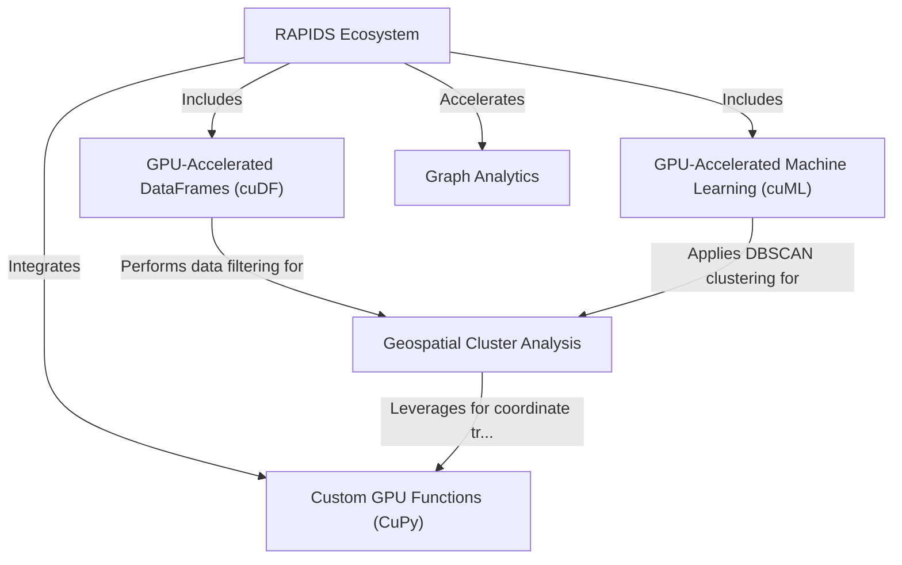

# Tutorial: Accelerating-End-to-End-Data-Science-Workflows

This project, an NVIDIA certification program, focuses on accelerating end-to-end data science workflows using the RAPIDS ecosystem. It demonstrates how GPU-accelerated libraries like cuDF, cuML, cuGraph, and CuPy can dramatically speed up data processing, machine learning, and graph analytics. A core application is the "Biodefense Outbreak Analysis" project, which processes over 58 million patient records to identify infection hotspots through GPU-accelerated geospatial cluster analysis (using cuDF, cuML, and custom CuPy functions for coordinate transformations), aiming for rapid outbreak response and resource optimization.

**Source Repository:** [https://github.com/Dr-Westworld/Accelerating-End-to-End-Data-Science-Workflows](https://github.com/Dr-Westworld/Accelerating-End-to-End-Data-Science-Workflows)

## Chapters

1. [RAPIDS Ecosystem
](01_rapids_ecosystem_.md)
2. [GPU-Accelerated DataFrames (cuDF)
](02_gpu_accelerated_dataframes__cudf__.md)
3. [GPU-Accelerated Machine Learning (cuML)
](03_gpu_accelerated_machine_learning__cuml__.md)
4. [Custom GPU Functions (CuPy)
](04_custom_gpu_functions__cupy__.md)
5. [Graph Analytics
](05_graph_analytics_.md)
6. [Geospatial Cluster Analysis
](06_geospatial_cluster_analysis_.md)

---

Generated by [AI Codebase Knowledge Builder]