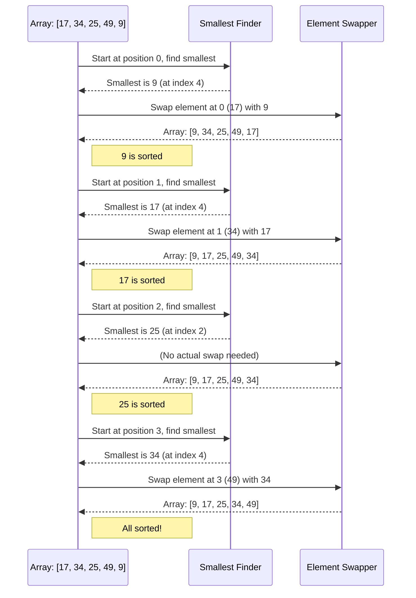

# Chapter 1: Sorting Algorithms

Welcome to the exciting world of algorithms! In this first chapter, we're going to explore a fundamental concept that helps us organize data: **Sorting Algorithms**.

### The Messy Playlist Problem

Imagine you have a huge music playlist with hundreds of songs. They're all mixed up, playing in a random order. You want to listen to them alphabetically by song title, or maybe by artist, or even by release date. How would you do that? Manually dragging each song into place would take ages!

This is where sorting algorithms come in! They are like super-efficient digital assistants that take a messy list of items and arrange them into a specific order, whether it's from smallest to largest, oldest to newest, or A to Z.

### What are Sorting Algorithms?

Simply put, **sorting algorithms** are step-by-step instructions that arrange a collection of items (like numbers, words, or objects) into a specific sequence. This sequence could be:

*   **Ascending Order:** Smallest to largest (e.g., `1, 2, 3, 4, 5`)
*   **Descending Order:** Largest to smallest (e.g., `5, 4, 3, 2, 1`)
*   **Alphabetical Order:** (e.g., `Apple, Banana, Cherry`)

Think of organizing a deck of cards by suit and rank, or arranging books on a shelf by author's last name. Sorting makes data much easier to find, understand, and use!

### Solving the Messy Playlist Problem

Let's use a very simple example. Imagine your playlist has these song ratings (just numbers for simplicity): `[17, 34, 25, 49, 9]`. You want to sort them from the lowest rating to the highest.

A sorting algorithm will take this list:
`[17, 34, 25, 49, 9]`

And transform it into this ordered list:
`[9, 17, 25, 34, 49]`

Now, how does it do that? Different sorting algorithms use different strategies. We'll look at one of the simplest ones: **Selection Sort**.

### How Selection Sort Works (Step-by-Step)

Imagine you're trying to find the shortest person in a line and move them to the front. Then, from the remaining people, you find the next shortest and move them to the second position, and so on. That's essentially what Selection Sort does!

Let's trace it with our example array: `[17, 34, 25, 49, 9]`

1.  **Pass 1:**
    *   Look at the entire list `[17, 34, 25, 49, 9]`.
    *   The smallest number is `9`.
    *   Swap `9` with `17` (the first element).
    *   Array becomes: `[9, 34, 25, 49, 17]` (The `9` is now in its correct sorted position!)

2.  **Pass 2:**
    *   Now, ignore the `9` (it's sorted) and look at the rest: `[34, 25, 49, 17]`.
    *   The smallest number in this remaining part is `17`.
    *   Swap `17` with `34` (the first element of the unsorted part).
    *   Array becomes: `[9, 17, 25, 49, 34]` (The `17` is now in its correct sorted position!)

3.  **Pass 3:**
    *   Ignore `9` and `17`. Look at `[25, 49, 34]`.
    *   The smallest number is `25`.
    *   Swap `25` with `25` (no change, it's already there!).
    *   Array becomes: `[9, 17, 25, 49, 34]` (The `25` is now in its correct sorted position!)

4.  **Pass 4:**
    *   Ignore `9`, `17`, `25`. Look at `[49, 34]`.
    *   The smallest number is `34`.
    *   Swap `34` with `49`.
    *   Array becomes: `[9, 17, 25, 34, 49]` (The `34` is now in its correct sorted position!)

5.  **Done!** The last element (`49`) is automatically in place. The array is sorted!

This entire process can be visualized like this:



### Looking at the Code (Selection Sort)

Let's see how this "find the smallest and swap" idea translates into actual C code. We'll look at pieces from the `selection_sort.c` file.

First, the `main` function sets up an unsorted array and then calls `selectionSort` to sort it:

```c
// selection_sort.c (main function)
int main() {
    int arr[] = {17, 34, 25, 49, 9};   // Our messy array
    int n = sizeof(arr) / sizeof(arr[0]);  // How many items are in it

    printf("Original Array: ");
    for (int i = 0; i < n; i++) {
        printf("%d ", arr[i]); // Print the original array
    }
    printf("\n");

    selectionSort(arr, n); // This is where the magic happens!
    
    printf("Sorted Array: ");
    for (int i = 0; i < n; i++) {
        printf("%d ", arr[i]); // Print the sorted array
    }
    printf("\n");
    
    return 0;
}
```
**Explanation:** This `main` function simply defines an array, prints it, calls the `selectionSort` function to do the sorting, and then prints the array again to show the sorted result.

Now, let's peek inside the `selectionSort` function itself. It has an outer loop that goes through each position where a smallest element needs to be placed:

```c
// selection_sort.c (part of selectionSort function)
void selectionSort(int arr[], int n) {
    int i, j;          // Loop counters
    int minIndex;      // To store the index of the smallest element found
    int temp;          // Used for swapping numbers

    // One by one, move boundary of unsorted subarray
    for (i = 0; i < n - 1; i++) {
        // Assume the current element is the smallest
        minIndex = i; 
        // ... (more code to find the actual smallest)
    }
}
```
**Explanation:** The `for (i = 0; i < n - 1; i++)` loop runs `n-1` times. Each time `i` increases, it means one more element has been placed in its correct sorted position at the beginning of the array. `minIndex = i` starts by assuming the current element is the smallest in the unsorted part.

Inside that loop, another loop helps find the *actual* smallest element in the remaining unsorted part:

```c
// selection_sort.c (another part of selectionSort function)
void selectionSort(int arr[], int n) {
    // ... (previous lines)
    for (i = 0; i < n - 1; i++) {
        minIndex = i; 
        // Find the minimum element in the remaining unsorted array
        for (j = i + 1; j < n; j++) {
            if (arr[j] < arr[minIndex]) {
                minIndex = j; // Update minIndex if a smaller element is found
            }
        }
        // ... (more code to swap)
    }
}
```
**Explanation:** The `for (j = i + 1; j < n; j++)` loop scans through the rest of the array (starting *after* `i`). If it finds an element smaller than what's currently stored at `arr[minIndex]`, it updates `minIndex` to point to this *new* smallest element's location.

Finally, after finding the smallest element's position, we swap it with the element at the current `i` position:

```c
// selection_sort.c (final part of selectionSort function)
void selectionSort(int arr[], int n) {
    // ... (previous lines to find minIndex)
    for (i = 0; i < n - 1; i++) {
        minIndex = i;
        for (j = i + 1; j < n; j++) {
            if (arr[j] < arr[minIndex]) {
                minIndex = j; 
            }
        }
        // Swap the found minimum element with the first element of the unsorted part
        temp = arr[i];
        arr[i] = arr[minIndex];
        arr[minIndex] = temp;
    }
}
```
**Explanation:** This block performs the actual swap. It uses a temporary variable `temp` to hold one value while the two values at `arr[i]` and `arr[minIndex]` exchange places. After this, `arr[i]` now holds the smallest value from the unsorted part, and it's considered sorted.

When you run the `selection_sort.c` program, here's what you'd see:

```
Original Array: 17 34 25 49 9 
Sorted Array: 9 17 25 34 49 
```

### Other Sorting Strategies

While Selection Sort is easy to understand, it's not always the fastest. Computer scientists have developed many other clever sorting algorithms, each with its own strengths:

*   **Insertion Sort:** (from `insertion_sort.c`) Works like sorting a hand of cards. You pick up cards one by one and insert them into their correct position in your already sorted hand.
*   **Merge Sort:** (from `merge_sort.c`) A "divide and conquer" approach. It splits the list in half again and again until you have very small (already sorted) lists, then it "merges" them back together in the correct order.
*   **Quick Sort:** (from `Quick_sort.c`) Also a "divide and conquer" algorithm, but it picks an element called a "pivot" and rearranges the array so that all elements smaller than the pivot come before it, and all larger elements come after it. Then it recursively sorts the two sub-arrays.

Each of these algorithms has different trade-offs in terms of how fast they are for different types of data, or how much extra memory they need.

### Conclusion

Sorting algorithms are powerful tools that help us organize data efficiently. We learned about the basic idea behind sorting and explored **Selection Sort** in detail, seeing how it systematically finds and places elements into their correct order. Understanding how these algorithms work is crucial for building fast and organized computer programs.

In the next chapter, we'll shift our focus from organizing lists to finding the most efficient way to connect points in a network with [Minimum Spanning Tree (MST) Algorithms](02_minimum_spanning_tree__mst__algorithms_.md).

---

Generated by [AI Codebase Knowledge Builder]