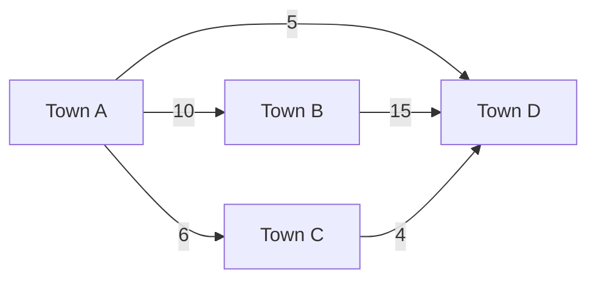
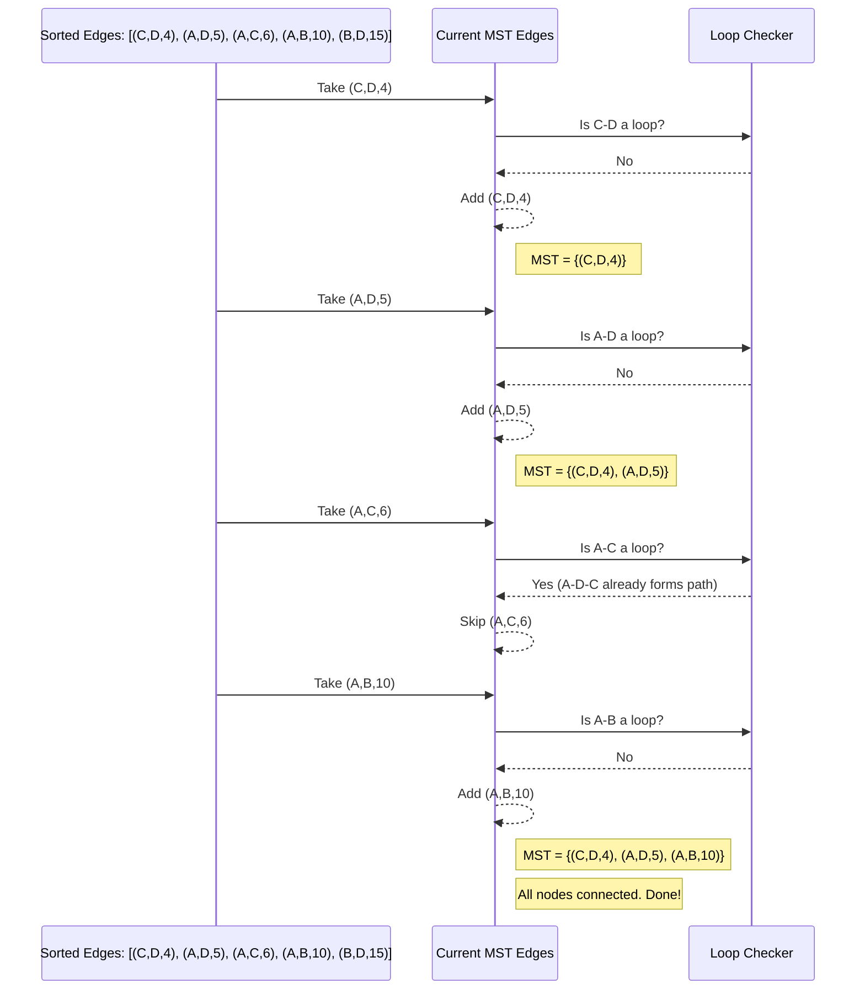

# Chapter 2: Minimum Spanning Tree (MST) Algorithms

Welcome back, algorithm adventurers! In our previous chapter, [Sorting Algorithms](01_sorting_algorithms_.md), we learned how to organize messy lists of items into a neat order. We saw how algorithms like Selection Sort can systematically arrange data, making it easier to work with.

Now, imagine we're facing a different kind of challenge: instead of just organizing items in a list, we need to organize *connections* in a network.

### The Town Connection Challenge

Picture a map with several towns scattered across it. Your task is to connect all these towns with a new road network. Each possible road between two towns has a different construction cost. Your goal is to:

1.  **Connect all towns:** No town should be left isolated.
2.  **Use the minimum total cost:** You want to spend as little money as possible.
3.  **No unnecessary detours or loops:** A direct connection is usually better than a roundabout way that creates a loop. For example, if you already have roads connecting Town A to B, and B to C, adding a direct road from A to C might be a loop if it doesn't provide a unique connection.

This is a very common problem in the real world! It could be about laying electrical cables, setting up a computer network, designing plumbing systems, or even planning bus routes. Manually figuring out the best (cheapest) way to connect everything can be incredibly difficult for many towns. This is where **Minimum Spanning Tree (MST) Algorithms** come to the rescue!

### What's a Network? (Graphs!)

Before we dive into MST, let's understand how computer scientists describe networks. They use something called a **graph**.

*   **Nodes (or Vertices):** These are the individual "things" in your network. In our example, the **towns** are nodes.
*   **Edges:** These are the "connections" or "relationships" between nodes. The **roads** between towns are edges.
*   **Weights (or Costs):** Often, edges have a value associated with them, like the cost to build a road, the distance of a cable, or the time it takes to travel. These are the weights.

So, our town connection problem is really about finding the cheapest way to connect all nodes in a graph.


*Here, A, B, C, D are nodes (towns), and the lines between them are edges (roads). The numbers are weights (costs).*

### Spanning Trees: Connecting Everything Without Loops

Now, let's talk about the "spanning tree" part.

*   **Spanning:** Means it connects *all* the nodes in the graph. No town is left out.
*   **Tree:** In computer science, a "tree" is a special kind of graph that has two main properties:
    1.  It is **connected**: You can get from any node to any other node.
    2.  It has **no loops (cycles)**: There's only one unique path between any two nodes. If you tried to add another edge that creates a loop, it means you've found an "unnecessary detour" or a redundant connection.

So, a **Spanning Tree** for our towns means we've picked a set of roads that connects every town, but without creating any circular routes.

### Minimum Spanning Tree (MST): The Cheapest Connections

A **Minimum Spanning Tree (MST)** is simply a spanning tree where the **total sum of the weights (costs) of all the chosen edges is as small as possible.** It's the cheapest way to connect all towns without creating loops.

Our goal is to find this MST.

### How Do We Find the MST? (Greedy Algorithms!)

MST algorithms use a strategy called "greedy." A greedy algorithm makes the best choice available *right now* at each step, hoping that these local best choices will lead to the best overall solution. For MSTs, this works perfectly!

There are two very famous greedy algorithms for finding an MST:

1.  **Kruskal's Algorithm**
2.  **Prim's Algorithm**

Both give you the same correct answer (the MST), but they approach the problem slightly differently. Let's look at Kruskal's first.

---

## Kruskal's Algorithm: Picking the Cheapest Roads First

Imagine you're the project manager for the road network. You have a big list of all possible roads and their costs. Kruskal's strategy is like this:

1.  **List all roads and their costs.**
2.  **Sort the roads by cost** from cheapest to most expensive. (Hey, this sounds like [Sorting Algorithms](01_sorting_algorithms_.md)!)
3.  Go through your sorted list of roads, one by one.
    *   For each road, check: **"Does adding this road connect two towns that are *already* connected by the roads I've chosen so far?"**
    *   If the answer is **NO** (it connects two previously separate groups of towns, or connects an isolated town to a group), then **add this road** to your network.
    *   If the answer is **YES** (it would create a loop), then **skip this road**.
4.  Keep doing this until all towns are connected.

Let's use our example towns from before:


The possible roads and their costs are:
*   C-D: Cost 4
*   A-D: Cost 5
*   A-C: Cost 6
*   A-B: Cost 10
*   B-D: Cost 15

### Kruskal's Algorithm: Step-by-Step Walkthrough

Let's see Kruskal's in action:

1.  **Sort all edges by weight:**
    *   (C, D, cost 4)
    *   (A, D, cost 5)
    *   (A, C, cost 6)
    *   (A, B, cost 10)
    *   (B, D, cost 15)

2.  **Start picking edges:**

    *   **Pick (C, D, cost 4):**
        *   Does it create a loop? No, C and D are separate.
        *   **Add it!** Current MST edges: {(C, D)}
        *   Connected groups: {A}, {B}, {C, D}

    *   **Pick (A, D, cost 5):**
        *   Does it create a loop? No, A is separate from {C, D}.
        *   **Add it!** Current MST edges: {(C, D), (A, D)}
        *   Connected groups: {A, C, D}, {B}

    *   **Pick (A, C, cost 6):**
        *   Does it create a loop? Yes! A and C are *already* connected through D (A-D-C). Adding A-C would create a loop A-D-C-A.
        *   **Skip it!** Current MST edges remain: {(C, D), (A, D)}

    *   **Pick (A, B, cost 10):**
        *   Does it create a loop? No, B is separate from {A, C, D}.
        *   **Add it!** Current MST edges: {(C, D), (A, D), (A, B)}
        *   Connected groups: {A, B, C, D} (All towns are now connected!)

    *   **Stop!** All towns are connected, and we have 3 edges (which is `number of towns - 1`, a property of trees).

The Minimum Spanning Tree has edges (C, D), (A, D), and (A, B).
The total minimum cost is 4 + 5 + 10 = 19.

This process can be visualized simply:



### Looking at the Code (Kruskal's Algorithm)

The code for Kruskal's algorithm often uses a clever data structure called "Disjoint Set Union" (DSU) to efficiently check for loops. For now, just know that `findParent` and `unionSet` functions help keep track of which towns are already connected into groups.

Let's look at `kruskal_algorithm.c`.

First, the `main` function sets up our graph (the towns and roads) and calls the `kruskalAlgo` function:

```c
// kruskal_algorithm.c (main function)
int main()
{
    // Our example graph: {town1, town2, cost}
    int edge[5][3] = { { 0, 1, 10 }, // Road between town 0 and 1, cost 10
                       { 0, 2, 6 },  // Road between town 0 and 2, cost 6
                       { 0, 3, 5 },  // Road between town 0 and 3, cost 5
                       { 1, 3, 15 }, // Road between town 1 and 3, cost 15
                       { 2, 3, 4 } };// Road between town 2 and 3, cost 4
    
    // There are 5 possible roads/edges in this graph
    kruskalAlgo(5, edge); 

    return 0;
}
```
**Explanation:** This `main` function defines our graph. Each row in `edge` represents a possible road: `{start_town, end_town, cost}`. Towns are numbered 0, 1, 2, etc. It then calls `kruskalAlgo` to find the MST.

Inside `kruskalAlgo`, the first important step is to sort all the edges by their cost:

```c
// kruskal_algorithm.c (part of kruskalAlgo function)
void kruskalAlgo(int n, int edge[n][3]) 
{ 
    // Sort all edges based on their cost (the 3rd element in each row)
    qsort(edge, n, sizeof(edge[0]), comparator); 

    int parent[n]; // Used by Disjoint Set Union to track connected components
    int rank[n];   // Also for Disjoint Set Union

    // Initialize each town as its own separate group
    makeSet(parent, rank, n); 

    int minCost = 0; // To accumulate the total cost of the MST
    
    // ... (rest of the algorithm)
}
```
**Explanation:** `qsort` is a standard C library function for sorting. It uses our custom `comparator` function to sort the `edge` array so that edges with lower costs come first. `makeSet` initializes our DSU structure, ensuring each town is initially in its own separate "group."

Then, `kruskalAlgo` loops through the sorted edges and decides whether to include them:

```c
// kruskal_algorithm.c (another part of kruskalAlgo function)
void kruskalAlgo(int n, int edge[n][3]) 
{ 
    // ... (previous lines to sort and initialize)

    printf("Following are the edges in the constructed MST\n"); 
    for (int i = 0; i < n; i++) { 
        int v1 = findParent(parent, edge[i][0]); // Find group of town 1
        int v2 = findParent(parent, edge[i][1]); // Find group of town 2
        int wt = edge[i][2];                     // Cost of this road

        // If towns v1 and v2 are in different groups (adding this road won't create a loop)
        if (v1 != v2) { 
            unionSet(v1, v2, parent, rank, n); // Merge their groups
            minCost += wt;                     // Add cost to total
            printf("%d -- %d == %d\n", edge[i][0], edge[i][1], wt); 
        } 
    } 

    printf("Minimum Cost Spanning Tree: %d\n", minCost); 
}
```
**Explanation:** This loop goes through each road (edge) in the *sorted* order. `findParent` is crucial here: it tells us which "group" or "connected component" a town belongs to. If `v1` and `v2` (the towns connected by the current road) belong to *different* groups, it means this road connects two previously separate parts of our network without forming a loop. We then use `unionSet` to merge their groups, add the road's cost to `minCost`, and print the chosen road.

When you run the `kruskal_algorithm.c` program, here's what you'd see:

```
Following are the edges in the constructed MST
2 -- 3 == 4
0 -- 3 == 5
0 -- 1 == 10
Minimum Cost Spanning Tree: 19
```
This output matches our manual walkthrough! The towns 0, 1, 2, 3 correspond to A, B, C, D in our example.

---

## Prim's Algorithm: Expanding from a Starting Point

Prim's algorithm takes a slightly different approach, but it's also greedy and gives the same MST. Instead of sorting all roads and picking from the cheapest, Prim's algorithm "grows" the MST from a starting point.

Imagine you pick one town to start your road network from.

1.  **Pick any starting town.** Let's say Town A.
2.  **Look at all roads connected to Town A.** Pick the *cheapest* one that leads to a town *not yet in your connected network*. Add this road and the new town to your network.
3.  Now, you have a small connected network (e.g., Town A and Town C connected by A-C).
4.  **Look at all roads connected to *any* town in your growing network.** Again, pick the *cheapest* one that leads to a town *not yet in your connected network*. Add this road and the new town.
5.  Repeat this process until all towns are included in your network.

Let's use our example towns again, starting from Town A:


### Prim's Algorithm: Step-by-Step Walkthrough (Starting from A)

1.  **Start with Town A.** Our MST is currently just {A}.

2.  **Consider roads from A:**
    *   A-B (cost 10)
    *   A-C (cost 6)
    *   A-D (cost 5)
    *   The cheapest is A-D (cost 5).
    *   **Add (A, D, cost 5).** Our MST is now {(A, D)}. Connected towns: {A, D}.

3.  **Consider roads from {A, D} to unconnected towns (B, C):**
    *   From A: A-B (cost 10), A-C (cost 6)
    *   From D: D-C (cost 4), D-B (cost 15)
    *   The cheapest road among these that connects to a *new* town is D-C (cost 4).
    *   **Add (D, C, cost 4).** Our MST is now {(A, D), (D, C)}. Connected towns: {A, D, C}.

4.  **Consider roads from {A, D, C} to unconnected town (B):**
    *   From A: A-B (cost 10)
    *   From D: D-B (cost 15)
    *   From C: C-B (none in original graph, implicitly infinite cost)
    *   The cheapest road to B is A-B (cost 10).
    *   **Add (A, B, cost 10).** Our MST is now {(A, D), (D, C), (A, B)}. Connected towns: {A, D, C, B}.

5.  **Stop!** All towns are connected.

The Minimum Spanning Tree has edges (A, D), (D, C), and (A, B).
The total minimum cost is 5 + 4 + 10 = 19.
Notice that Prim's algorithm found the *exact same* MST as Kruskal's, just by building it in a different order!

### Looking at the Code (Prim's Algorithm)

Prim's algorithm usually works with an "adjacency matrix" representation of the graph, where `graph[i][j]` stores the cost of the road between town `i` and town `j`. `0` means no direct road or no cost to self.

Let's look at `prims_algorithm.c`.

First, the `main` function defines our graph and calls `primMST`:

```c
// prims_algorithm.c (main function)
#define V 5 // Define the number of towns (vertices)

int main()
{
    // Our example graph as an adjacency matrix
    int graph[V][V] = { { 0, 2, 0, 6, 0 }, // Costs from Town 0 to 0, 1, 2, 3, 4
                        { 2, 0, 3, 8, 5 }, // Costs from Town 1
                        { 0, 3, 0, 0, 7 }, // Costs from Town 2
                        { 6, 8, 0, 0, 9 }, // Costs from Town 3
                        { 0, 5, 7, 9, 0 } };// Costs from Town 4

    // Print the solution
    primMST(graph);

    return 0;
}
```
**Explanation:** This `main` function defines our graph using a 2D array, where `graph[i][j]` is the cost of the road between town `i` and town `j`. `V` is defined as 5, meaning there are 5 towns (0 to 4). It then calls `primMST`.

The `primMST` function initializes tracking arrays and then loops `V-1` times to add edges:

```c
// prims_algorithm.c (part of primMST function)
void primMST(int graph[V][V])
{
    int parent[V]; // Stores the MST to reconstruct it
    int key[V];    // Stores the minimum cost to connect a town to the MST
    bool mstSet[V]; // Keeps track of towns already included in MST

    // Initialize all costs to "infinity" and no towns in MST
    for (int i = 0; i < V; i++)
        key[i] = INT_MAX, mstSet[i] = false;

    key[0] = 0;      // Start with town 0, cost to connect it to MST is 0
    parent[0] = -1;  // Town 0 is the root, has no parent in MST

    // The MST will have V-1 edges, so we loop V-1 times
    for (int count = 0; count < V - 1; count++) {

        // Find the town not yet in MST with the minimum key value (cheapest connection)
        int u = minKey(key, mstSet); 

        mstSet[u] = true; // Add this town 'u' to the MST

        // Now, update key values and parent index for adjacent towns
        for (int v = 0; v < V; v++)
            // If there's a road (graph[u][v]), v is not in MST, and road is cheaper than current key[v]
            if (graph[u][v] && mstSet[v] == false && graph[u][v] < key[v])
                parent[v] = u, key[v] = graph[u][v]; // Update parent and key
    }

    printMST(parent, graph); // Print the constructed MST
}
```
**Explanation:** `primMST` initializes `key` to track the lowest cost to connect each town to the growing MST, `mstSet` to mark towns already included, and `parent` to record which edge led to a town. It starts `key[0]=0` for town 0 (our starting point). The main loop runs `V-1` times because an MST has `V-1` edges. In each iteration, `minKey` finds the cheapest *unconnected* town to add. Once `u` is added, it then updates the costs (`key`) for all towns `v` connected to `u`, if `u-v` is a cheaper way to connect `v` to the MST.

When you run the `prims_algorithm.c` program, here's what you'd see:

```
Edge 	Weight
0 - 1 	2 
1 - 2 	3 
0 - 3 	6 
1 - 4 	5 
```
In this example, the graph is slightly different from our 4-town example, using 5 towns (0-4). This output shows the edges chosen and their weights, resulting in the MST.

### Conclusion

Minimum Spanning Tree algorithms are incredibly useful tools for finding the most efficient (cheapest) way to connect all parts of a network without creating any unnecessary loops. We explored the core idea behind MSTs, understanding what a graph, spanning tree, and minimum spanning tree are. We then looked at two classic greedy approaches: **Kruskal's Algorithm**, which sorts all edges and picks the cheapest non-looping ones, and **Prim's Algorithm**, which grows the MST outwards from a starting point. Both methods efficiently solve the problem of connecting towns with minimum cost, laying cables, or designing pipelines.

In the next chapter, we'll shift our focus from connecting everything to finding the quickest way to get from one point to another in a network with [Shortest Path Algorithms](03_shortest_path_algorithms_.md).

---

Generated by [AI Codebase Knowledge Builder]