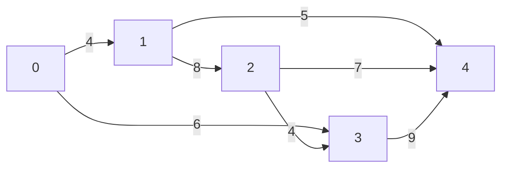
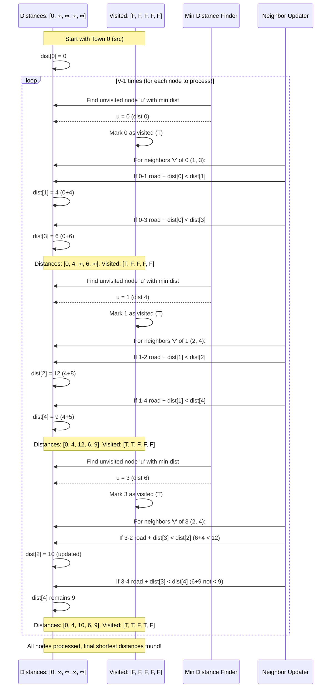
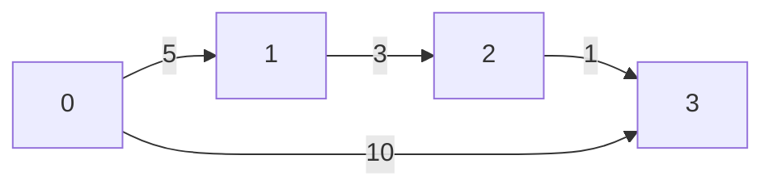

# Chapter 3: Shortest Path Algorithms

Welcome back, algorithm adventurers! In our previous chapter, [Minimum Spanning Tree (MST) Algorithms](02_minimum_spanning_tree__mst__algorithms_.md), we learned how to connect *all* points in a network with the minimum total cost, ensuring no unnecessary loops. We were interested in the overall cheapest network.

Now, we're going to solve a slightly different but equally important problem: finding the *best way to get from one specific point to another*.

### The GPS Navigation Challenge

Imagine you're in your car, and you want to get from your current location to a new restaurant. You pull out your GPS. What does it do? It doesn't just show you any random route; it tries to find the **quickest** way to get there. It considers different roads, current traffic conditions, speed limits, and even tolls to calculate the "best" route.

This is exactly what **Shortest Path Algorithms** are designed to do! They are the brains behind your GPS, network routers, and logistics planning, helping you find the most efficient way to travel between two points.

### What is a "Shortest Path"?

Let's break down the idea:

*   **Network (Graph):** Just like with MSTs, we're working with a network of "places" and "connections."
    *   **Nodes (or Vertices):** These are your locations (e.g., intersections, cities, delivery hubs).
    *   **Edges:** These are the connections between locations (e.g., roads, flight routes, data cables).
    *   **Weights (or Costs):** Each edge has a value, representing how "hard" or "expensive" it is to use that connection. This could be:
        *   **Distance:** The physical length of a road.
        *   **Time:** How long it takes to travel that road (including traffic).
        *   **Cost:** A toll, or fuel consumption.
        *   The goal is to minimize this weight.

*   **Path:** A sequence of connected edges that takes you from a starting node to an ending node.

*   **Shortest Path:** Out of all possible paths from your starting point to your destination, the "shortest path" is the one where the **sum of the weights of all its edges is the smallest.**

Think of it as adding up the travel time for each road segment until you reach your destination, and then picking the path that has the lowest total travel time.

### Two Ways to Find Shortest Paths

There are many algorithms for finding shortest paths, depending on what you need. We'll look at two famous ones:

1.  **Dijkstra's Algorithm:** Finds the shortest paths from **one starting point** to *all other points* in the network.
2.  **Floyd-Warshall Algorithm:** Finds the shortest paths between **every single pair of points** in the network.

---

## Dijkstra's Algorithm: One Starting Point to Everywhere

Imagine you're a delivery driver starting your day from a central warehouse (your "source"). You want to know the quickest way to get to *every single customer* on your route. You don't just want one destination; you want to know the best way to reach *all* of them from your current spot. That's what Dijkstra's Algorithm helps with!

It works a bit like how a ripple expands when you drop a stone in water. It starts at your source, "explores" its nearest neighbors, then expands to the next nearest, and so on, always finding the shortest way to reach new places.

### Dijkstra's Algorithm: Step-by-Step Walkthrough

Let's use a simplified network (graph) with 5 towns (numbered 0 to 4) and some roads with travel times (weights):


(Note: These numbers don't match the code's example perfectly, but illustrate the principle for simplicity.)

Let's say we start at **Town 0**. We want to find the shortest time to reach all other towns from Town 0.

1.  **Start:**
    *   Town 0: Distance = 0 (we are here)
    *   All other towns (1, 2, 3, 4): Distance = "Infinity" (we don't know how to get there yet, so it's very far).
    *   No towns are "visited" yet.

2.  **Choose the unvisited town with the smallest distance:**
    *   That's **Town 0** (distance 0). Mark Town 0 as visited.

3.  **Update distances for Town 0's neighbors:**
    *   From Town 0 to Town 1: `0 (current dist of 0) + 4 (road cost) = 4`. This is less than Town 1's current "Infinity", so update Town 1's distance to 4.
    *   From Town 0 to Town 3: `0 (current dist of 0) + 6 (road cost) = 6`. Update Town 3's distance to 6.
    *   Current distances: Town 0:0, Town 1:4, Town 2:Inf, Town 3:6, Town 4:Inf.

4.  **Choose the unvisited town with the smallest distance:**
    *   Now, the smallest unvisited distance is **Town 1** (distance 4). Mark Town 1 as visited.

5.  **Update distances for Town 1's neighbors (that are not visited):**
    *   From Town 1 to Town 2: `4 (current dist of 1) + 8 (road cost) = 12`. Update Town 2's distance to 12.
    *   From Town 1 to Town 4: `4 (current dist of 1) + 5 (road cost) = 9`. Update Town 4's distance to 9.
    *   Current distances: Town 0:0, Town 1:4, Town 2:12, Town 3:6, Town 4:9.

6.  **Choose the unvisited town with the smallest distance:**
    *   The smallest unvisited distance is **Town 3** (distance 6). Mark Town 3 as visited.

7.  **Update distances for Town 3's neighbors (that are not visited):**
    *   From Town 3 to Town 2: `6 (current dist of 3) + 4 (road cost) = 10`. This is *less* than Town 2's current distance of 12. So, update Town 2's distance to 10.
    *   From Town 3 to Town 4: `6 (current dist of 3) + 9 (road cost) = 15`. This is *not less* than Town 4's current distance of 9. So, Town 4's distance remains 9.
    *   Current distances: Town 0:0, Town 1:4, Town 2:10, Town 3:6, Town 4:9.

8.  **Continue this process:**
    *   Next smallest unvisited is Town 4 (distance 9). Mark Town 4 as visited.
    *   From Town 4, all neighbors (1, 2, 3) are already visited. No updates.
    *   Next smallest unvisited is Town 2 (distance 10). Mark Town 2 as visited.
    *   From Town 2, all neighbors (1, 3, 4) are already visited. No updates.

All towns are now visited! We have found the shortest path distances from Town 0 to all other towns.

This process can be visualized:



### Looking at the Code (Dijkstra's Algorithm)

The provided `dijkstra_algorithm.c` file implements this logic. It uses a graph with `V=9` vertices (towns).

First, the `main` function sets up the graph and calls the `dijkstra` function, specifying the starting town (source):

```c
// dijkstra_algorithm.c (main function)
#include <limits.h> // For INT_MAX
#include <stdbool.h> // For boolean type
#include <stdio.h>
#define V 9 // Our graph has 9 towns (0 to 8)

int main()
{
	// The graph represented as an adjacency matrix.
    // graph[i][j] is the cost from town 'i' to town 'j'.
    // 0 means no direct road.
	int graph[V][V] = { { 0, 4, 0, 0, 0, 0, 0, 8, 0 },
						{ 4, 0, 8, 0, 0, 0, 0, 11, 0 },
						{ 0, 8, 0, 7, 0, 4, 0, 0, 2 },
						{ 0, 0, 7, 0, 9, 14, 0, 0, 0 },
						{ 0, 0, 0, 9, 0, 10, 0, 0, 0 },
						{ 0, 0, 4, 14, 10, 0, 2, 0, 0 },
						{ 0, 0, 0, 0, 0, 2, 0, 1, 6 },
						{ 8, 11, 0, 0, 0, 0, 1, 0, 7 },
						{ 0, 0, 2, 0, 0, 0, 6, 7, 0 } };

	dijkstra(graph, 0); // Find shortest paths starting from Town 0

	return 0;
}
```
**Explanation:** Here, `V` is set to 9, meaning we have towns numbered 0 through 8. The `graph` variable is a 2D array (an "adjacency matrix") where `graph[i][j]` tells us the direct cost to go from town `i` to town `j`. If `graph[i][j]` is 0, it means there's no direct road or the cost is 0 (for self-loop, which we ignore). `dijkstra(graph, 0)` calls the main algorithm, starting from town 0.

The `dijkstra` function itself first sets up some tracking arrays:

```c
// dijkstra_algorithm.c (part of dijkstra function)
void dijkstra(int graph[V][V], int src)
{
	int dist[V];      // dist[i] stores shortest distance from src to i
	bool sptSet[V];   // sptSet[i] is true if town i is included in shortest path tree

	// Initialize all distances as "infinity" and all towns as not visited
	for (int i = 0; i < V; i++)
		dist[i] = INT_MAX, sptSet[i] = false;

	dist[src] = 0; // Distance from source to itself is 0
    // ... (rest of the algorithm logic)
}
```
**Explanation:** `dist` array will store the shortest distance found so far from `src` to each town. `sptSet` (Shortest Path Tree Set) is a boolean array that keeps track of which towns have already been "visited" (i.e., their shortest path from the source has been finalized). We initialize all distances to `INT_MAX` (a very large number representing "infinity") and `sptSet` to `false` for all towns. The distance from the `src` town to itself is, of course, 0.

The core of Dijkstra's is a loop that runs `V-1` times (because we need to find paths for `V-1` other towns after starting at `src`):

```c
// dijkstra_algorithm.c (another part of dijkstra function)
void dijkstra(int graph[V][V], int src)
{
    // ... (initialization as above)

	for (int count = 0; count < V - 1; count++) {
		// Pick the unvisited town 'u' with the minimum distance value
		int u = minDistance(dist, sptSet);

		sptSet[u] = true; // Mark 'u' as visited (its shortest path is finalized)

		// ... (more code to update neighbors)
	}
    printSolution(dist); // Print the final distances
}
```
**Explanation:** In each iteration of this `for` loop, `minDistance` (a helper function we'll see next) finds the unvisited town `u` that currently has the smallest distance from the source. Once `u` is found, `sptSet[u] = true` marks it as processed.

After finding `u`, we look at all its direct neighbors to see if we can find a shorter path to them *through* `u`:

```c
// dijkstra_algorithm.c (final part of dijkstra function)
void dijkstra(int graph[V][V], int src)
{
    // ... (initialization and outer loop part)

	for (int count = 0; count < V - 1; count++) {
		int u = minDistance(dist, sptSet);
		sptSet[u] = true;

		// Update dist value of the adjacent vertices of the picked vertex 'u'
		for (int v = 0; v < V; v++)

			// Only consider 'v' if:
            // 1. 'v' is not yet visited (!sptSet[v])
            // 2. There's a direct road from 'u' to 'v' (graph[u][v] is not 0)
            // 3. 'u' itself is reachable (dist[u] != INT_MAX)
            // 4. The path through 'u' (dist[u] + graph[u][v]) is shorter than current dist[v]
			if (!sptSet[v] && graph[u][v]
				&& dist[u] != INT_MAX
				&& dist[u] + graph[u][v] < dist[v])
				dist[v] = dist[u] + graph[u][v]; // Update distance for 'v'
	}
    // ... (call printSolution)
}
```
**Explanation:** This inner `for` loop iterates through all possible towns `v`. The `if` condition checks if `v` is a neighbor of `u` (meaning `graph[u][v]` is not 0), if `v` hasn't been visited yet, and if the path from `src` to `u` and then to `v` (`dist[u] + graph[u][v]`) is shorter than any path found to `v` so far (`dist[v]`). If it is, we update `dist[v]`.

The `minDistance` helper function:

```c
// dijkstra_algorithm.c (minDistance function)
int minDistance(int dist[], bool sptSet[])
{
	int min = INT_MAX, min_index;

	for (int v = 0; v < V; v++)
		if (sptSet[v] == false && dist[v] <= min)
			min = dist[v], min_index = v;

	return min_index; // Returns the index of the town with the smallest distance
}
```
**Explanation:** This function simply scans through all towns. If a town `v` has not been visited (`sptSet[v] == false`) and its current distance (`dist[v]`) is smaller than the `min` found so far, it updates `min` and `min_index`. This ensures we always pick the closest unvisited town.

When you run `dijkstra_algorithm.c`, you'll see output like this (starting from source 0):

```
Vertex          Distance from Source
0                        0
1                        4
2                        12
3                        7
4                        14
5                        11
6                        9
7                        8
8                        14
```
This output tells you the shortest travel time/distance from Town 0 to every other town in the graph. For example, the shortest path from Town 0 to Town 2 takes 12 units.

---

## Floyd-Warshall Algorithm: All-Pairs Shortest Paths

What if you're not just a single delivery driver, but you're managing a whole fleet? You need to know the quickest route between *any two* towns in your network, for any driver, at any time. This is where the **Floyd-Warshall Algorithm** shines! It calculates the shortest path between *every possible pair of towns*.

Instead of expanding from one source, Floyd-Warshall systematically checks if going through each town as an "intermediate stop" can shorten the path between any two other towns.

### Floyd-Warshall Algorithm: Step-by-Step Walkthrough

Let's use a simple graph with 4 towns (0, 1, 2, 3) and direct road costs:


Initially, we have a distance table (matrix) showing only direct roads (or `INF` if no direct road):

**Initial Distances (D0):**
| From/To | 0    | 1    | 2    | 3    |
| :------ | :--- | :--- | :--- | :--- |
| **0**   | 0    | 5    | INF  | 10   |
| **1**   | INF  | 0    | 3    | INF  |
| **2**   | INF  | INF  | 0    | 1    |
| **3**   | INF  | INF  | INF  | 0    |

The algorithm works by trying each town, one by one, as a possible intermediate point (`k`) between all other pairs of towns (`i` to `j`).

**1. Allow Town 0 as an intermediate point (k=0):**
*   Can going from `i` to `0` and then `0` to `j` shorten any `i` to `j` path?
*   No new shorter paths are found here because no other town can reach 0, and 0 can only reach 1 and 3 directly (which are already reflected).
*   Distances (D1) remain mostly the same as D0.

**2. Allow Town 1 as an intermediate point (k=1):**
*   Look at all `i` to `j` paths. Can we shorten `dist[i][j]` by going `dist[i][1] + dist[1][j]`?
*   Example: Path from **0 to 2**:
    *   Currently `dist[0][2]` = INF.
    *   Path `0 -> 1 -> 2`: `dist[0][1] + dist[1][2] = 5 + 3 = 8`.
    *   Since `8 < INF`, update `dist[0][2]` to 8.
*   Distances (D2) after considering Town 1:
| From/To | 0    | 1    | 2    | 3    |
| :------ | :--- | :--- | :--- | :--- |
| **0**   | 0    | 5    | **8**| 10   | (0->1->2, total 8)
| **1**   | INF  | 0    | 3    | INF  |
| **2**   | INF  | INF  | 0    | 1    |
| **3**   | INF  | INF  | INF  | 0    |

**3. Allow Town 2 as an intermediate point (k=2):**
*   Now we consider `i -> 2 -> j`.
*   Example: Path from **0 to 3**:
    *   Currently `dist[0][3]` = 10.
    *   Path `0 -> 2 -> 3`: `dist[0][2] + dist[2][3]`.
        *   We just found `dist[0][2]` = 8 (path 0->1->2).
        *   `dist[2][3]` = 1.
        *   So, `8 + 1 = 9`.
    *   Since `9 < 10`, update `dist[0][3]` to 9.
*   Example: Path from **1 to 3**:
    *   Currently `dist[1][3]` = INF.
    *   Path `1 -> 2 -> 3`: `dist[1][2] + dist[2][3] = 3 + 1 = 4`.
    *   Since `4 < INF`, update `dist[1][3]` to 4.
*   Distances (D3) after considering Town 2:
| From/To | 0    | 1    | 2    | 3    |
| :------ | :--- | :--- | :--- | :--- |
| **0**   | 0    | 5    | 8    | **9**| (0->1->2->3, total 9)
| **1**   | INF  | 0    | 3    | **4**| (1->2->3, total 4)
| **2**   | INF  | INF  | 0    | 1    |
| **3**   | INF  | INF  | INF  | 0    |

**4. Allow Town 3 as an intermediate point (k=3):**
*   We consider `i -> 3 -> j`.
*   No shorter paths are found in this specific example with these final values.
*   The final shortest distance matrix:
| From/To | 0    | 1    | 2    | 3    |
| :------ | :--- | :--- | :--- | :--- |
| **0**   | 0    | 5    | 8    | 9    |
| **1**   | INF  | 0    | 3    | 4    |
| **2**   | INF  | INF  | 0    | 1    |
| **3**   | INF  | INF  | INF  | 0    |

Now you have the shortest path distance from *every town to every other town*!

### Looking at the Code (Floyd-Warshall Algorithm)

The `Floyd_Warshall_Algorithm.c` file implements this. It uses a graph with `V=4` vertices (towns).

First, the `main` function defines the graph as an adjacency matrix:

```c
// Floyd_Warshall_Algorithm.c (main function)
#include <stdio.h>
#define V 4 // Our graph has 4 towns (0 to 3)
#define INF 99999 // A large number to represent "infinity" (no direct path)

int main()
{
    // The graph as an adjacency matrix.
    // graph[i][j] is the cost from town 'i' to town 'j'.
    // INF means no direct road.
    int graph[V][V] = { { 0, 5, INF, 10 },
                        { INF, 0, 3, INF },
                        { INF, INF, 0, 1 },
                        { INF, INF, INF, 0 } };

    floydWarshall(graph); // Calculate all-pairs shortest paths

    return 0;
}
```
**Explanation:** `V` is 4, representing towns 0 to 3. `INF` is a large number (99999) used instead of `INT_MAX` for simplicity, representing that there's no direct path between two towns. The `graph` matrix shows the initial direct costs.

The `floydWarshall` function has three nested loops, which is the heart of the algorithm:

```c
// Floyd_Warshall_Algorithm.c (floydWarshall function)
void floydWarshall(int dist[][V])
{
    int i, j, k;

    // Outer loop: Consider each vertex 'k' as an intermediate point
    for (k = 0; k < V; k++) {
        // Middle loop: Pick all vertices 'i' as source
        for (i = 0; i < V; i++) {
            // Inner loop: Pick all vertices 'j' as destination
            for (j = 0; j < V; j++) {
                // If going from 'i' to 'k' and then 'k' to 'j'
                // is shorter than the current path from 'i' to 'j'
                if (dist[i][k] + dist[k][j] < dist[i][j])
                    dist[i][j] = dist[i][k] + dist[k][j]; // Update shortest path
            }
        }
    }
    printSolution(dist); // Print the final matrix
}
```
**Explanation:** This function takes the `dist` matrix (which is initially our `graph` matrix) and updates it. The outer loop `for (k = 0; k < V; k++)` iterates through each possible intermediate town `k`. The inner two loops `for (i = 0; i < V; i++)` and `for (j = 0; j < V; j++)` iterate through all possible source towns `i` and destination towns `j`. The `if` condition checks if the path `i -> k -> j` is shorter than the currently known shortest path `i -> j`. If it is, `dist[i][j]` is updated.

The `printSolution` function simply displays the resulting matrix:

```c
// Floyd_Warshall_Algorithm.c (printSolution function)
void printSolution(int dist[][V])
{
    printf(
        "The following matrix shows the shortest distances"
        " between every pair of vertices \n");
    for (int i = 0; i < V; i++) {
        for (int j = 0; j < V; j++) {
            if (dist[i][j] == INF)
                printf("%7s", "INF"); // Print "INF" instead of the large number
            else
                printf("%7d", dist[i][j]);
        }
        printf("\n");
    }
}
```
**Explanation:** This function makes the output readable by printing "INF" wherever the distance is still our large "infinity" value, indicating no reachable path.

When you run `Floyd_Warshall_Algorithm.c`, you'd see output like this:

```
The following matrix shows the shortest distances between every pair of vertices
      0      5      8      9
    INF      0      3      4
    INF    INF      0      1
    INF    INF    INF      0
```
This matrix shows the shortest distance from any row-town to any column-town. For example, from town 0 to town 2, the shortest distance is 8. From town 1 to town 3, it's 4. This matches our manual walkthrough!

### Conclusion

Shortest Path Algorithms are fundamental for solving problems where you need to find the most efficient route. We explored two powerful algorithms:

*   **Dijkstra's Algorithm:** Perfect when you need to find the shortest paths from **one starting point** to *all other destinations*.
*   **Floyd-Warshall Algorithm:** Ideal when you need to know the shortest path **between *every* possible pair of points** in your network.

Both algorithms use clever strategies to explore paths and ensure the optimal (shortest) one is found, whether it's for your GPS, network routing, or logistics.

In the next chapter, we'll dive into a different class of algorithms that tackle complex problems by systematically trying out possibilities and "backtracking" when they hit a dead end: [Backtracking Algorithms](04_backtracking_algorithms_.md).

---

Generated by [AI Codebase Knowledge Builder]