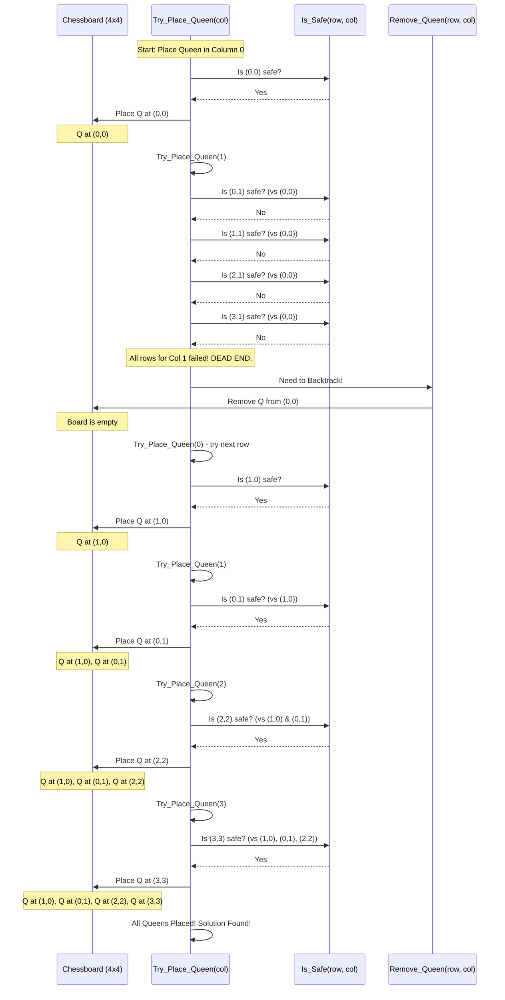

# Chapter 4: Backtracking Algorithms

Welcome back, algorithm adventurers! In our previous chapter, [Shortest Path Algorithms](03_shortest_path_algorithms_.md), we became master navigators, finding the quickest way to get from one point to another, or even between all pairs of points, in a network. We focused on finding the *single best* path.

Now, imagine a different kind of challenge: instead of finding *one optimal* path, you need to explore *many possible paths* to solve a problem, especially when the solution isn't straightforward and involves making a series of decisions. Sometimes, a decision leads to a dead end, and you need to "undo" that decision and try something else. This is where **Backtracking Algorithms** come in!

### The N-Queens Puzzle: A Royal Headache!

Let's start with a fun, classic puzzle: the **N-Queens Problem**.

Imagine you have a standard chessboard. Your task is to place `N` chess queens on an `N x N` board such that **no two queens can attack each other**.

Do you remember how queens move in chess? They can move any number of squares horizontally, vertically, or diagonally. This means two queens attack each other if they share the same row, same column, or same diagonal.

For a 4x4 board (N=4), this puzzle can be quite tricky!

*   How do you know where to place the first queen?
*   What if placing a queen in one spot makes it impossible to place the others?
*   How do you systematically try all possibilities without missing a solution or getting stuck?

Manually trying every single combination would be a nightmare, especially as `N` gets larger! This is a perfect problem for a Backtracking Algorithm.

### What is Backtracking? (Navigating a Maze)

Think of backtracking like trying to find your way through a **maze**:

1.  **You start at the entrance.**
2.  **You pick a path.** (This is like making a decision, or placing a queen.)
3.  **You follow it.**
4.  **If you hit a dead end** (a wall, or in our N-Queens case, placing a queen in an attacking position):
    *   You don't just stop. You **"backtrack"**! You return to the *last point where you made a choice* (a junction in the maze).
    *   Then, you **try a different path** from that junction. (You "undo" your last decision and make a new one.)
5.  You keep doing this, systematically exploring all possible paths, until you either find the exit (a solution!) or realize there's no way out.

That's the core idea of **Backtracking Algorithms**:

*   They try to build a solution **incrementally**, one step at a time (e.g., placing one queen at a time).
*   At each step, they make a **decision** (e.g., "place a queen in this row of the current column").
*   They check if the partial solution (the queens placed so far) is still **valid** (e.g., no two queens attack each other).
*   If the decision leads to a **"dead end"** (it violates a constraint, or no further valid decisions can be made from here), the algorithm **"backs up"** to the previous decision point.
*   It then **"undoes"** that previous decision and tries a different option.

This systematic "try-and-undo" process ensures that all possible combinations are explored until a solution is found or all possibilities are exhausted. Backtracking is often used for combinatorial problems where you need to find *all* or *some* solutions among many possibilities.

### Solving the N-Queens Problem with Backtracking

Let's see how this "maze navigation" idea applies to our N-Queens puzzle on a 4x4 board:

1.  **Start with the first column (Column 0).** We need to place a queen here.
2.  **Try Row 0 in Column 0.** Is it safe? Yes, the board is empty. Place Queen 0 at (0,0).
3.  **Move to the next column (Column 1).**
    *   Try Row 0. Is it safe with Queen 0 at (0,0)? No, it's in the same row.
    *   Try Row 1. Is it safe? No, it's on a diagonal.
    *   Try Row 2. Is it safe? No, it's on a diagonal.
    *   Try Row 3. Is it safe? Yes! Place Queen 1 at (1,3).
4.  **Move to the next column (Column 2).**
    *   Try Row 0. Is it safe? No, diagonal with (0,0).
    *   Try Row 1. Is it safe? No, same row with (1,3).
    *   Try Row 2. Is it safe? No, diagonal with (0,0).
    *   Try Row 3. Is it safe? No, diagonal with (1,3).
    *   **Dead End!** We can't place a queen in Column 2.

5.  **Backtrack!** Since Column 2 failed, we must "undo" the last decision.
    *   Remove Queen 1 from (1,3).
    *   Go back to **Column 1**. Try the *next* available row for Queen 1. But we tried all rows (0,1,2,3) for Column 1 already!
    *   **Another Dead End!** We have to backtrack again.
    *   Remove Queen 0 from (0,0).
    *   Go back to **Column 0**. Try the *next* available row for Queen 0.
        *   Try Row 1. Is it safe? Yes! Place Queen 0 at (1,0).

And so on. The algorithm will systematically try `(1,0)`, then find a spot for the next queen, and the next, backing up whenever it hits a dead end, until it finds a full solution or exhausts all possibilities.

This systematic process for finding a solution (for N=4) can be visualized as:


This diagram simplifies a bit, but it shows the core logic: try a spot, if it's safe, move on. If not, or if subsequent steps fail, go back and try another spot for the last decision.

### Looking at the Code (`N_queen.c`)

Let's look at the `N_queen.c` file to see how this backtracking logic is written in C. We'll examine the code in small, easy-to-digest parts.

First, the `main` function simply calls `solveNQ` to start the puzzle:

```c
// N_queen.c (main function)
#include <stdio.h> // For printf
#define N 4 // We're solving for a 4x4 board

// ... other functions (isSafe, solveNQUtil, printSolution) ...

int main()
{
	solveNQ(); // Start solving the N-Queens puzzle
	return 0;
}
```
**Explanation:** `N` is set to 4 for a 4x4 board. The `main` function's job is just to kick off the `solveNQ` function.

The `solveNQ` function initializes the empty chessboard and then calls the main recursive helper function `solveNQUtil`:

```c
// N_queen.c (solveNQ function)
#include <stdbool.h> // For bool type

// ... other functions ...

bool solveNQ()
{
	int board[N][N] = { { 0, 0, 0, 0 }, // Initialize board with all 0s (empty squares)
						{ 0, 0, 0, 0 },
						{ 0, 0, 0, 0 },
						{ 0, 0, 0, 0 } };

	// Start placing queens from column 0
	if (solveNQUtil(board, 0) == false) {
		printf("Solution does not exist");
		return false;
	}

	printSolution(board); // If a solution is found, print it
	return true;
}
```
**Explanation:** `solveNQ` creates our `N x N` chessboard (represented as a 2D array, where `0` means empty and `1` means a queen is placed). It then calls `solveNQUtil`, starting the process from `col = 0`. If `solveNQUtil` finds a solution, `solveNQ` prints it.

Now, let's look at the heart of the backtracking algorithm, the `solveNQUtil` function. This is a recursive function that tries to place a queen in the current `col`:

```c
// N_queen.c (part of solveNQUtil function)
bool solveNQUtil(int board[N][N], int col)
{
	// Base case: If all queens are placed (all columns filled)
	if (col >= N)
		return true; // A solution is found!

	// Try placing a queen in each row of the current column
	for (int i = 0; i < N; i++) {
        // ... (more code for checking safety and recursion) ...
	}

	return false; // If no row works in this column, no solution from this path
}
```
**Explanation:**
*   The `if (col >= N)` is the **base case** for the recursion. If `col` has reached `N`, it means we have successfully placed queens in all columns from `0` to `N-1`. So, we found a solution!
*   The `for (int i = 0; i < N; i++)` loop iterates through each `row` (`i`) in the current `col`. This is where the algorithm tries different options for placing a queen.

Inside that loop, we check if placing a queen in the current `(i, col)` position is `isSafe`. If it is, we place it and then recursively call `solveNQUtil` for the *next* column (`col + 1`):

```c
// N_queen.c (another part of solveNQUtil function)
bool solveNQUtil(int board[N][N], int col)
{
	if (col >= N) return true;

	for (int i = 0; i < N; i++) {
		if (isSafe(board, i, col)) { // Check if placing a queen at (i, col) is safe

			board[i][col] = 1; // MAKE A DECISION: Place Queen at (i, col)

			// RECURSIVE CALL: Try to place queens in the rest of the columns
			if (solveNQUtil(board, col + 1))
				return true; // If successful, propagate 'true' all the way up

			// BACKTRACKING STEP: If placing queen at (i, col) didn't lead to a solution
			// then remove it and try the next row for the current column
			board[i][col] = 0;
		}
	}
	return false;
}
```
**Explanation:**
*   `if (isSafe(board, i, col))` checks if the current spot `(i, col)` is a valid place for a queen.
*   `board[i][col] = 1;` is where the **decision is made** – we tentatively place a queen.
*   `if (solveNQUtil(board, col + 1))` is the **recursive call**. We ask, "Can we solve the rest of the puzzle (from the next column onwards) with this queen placed?"
*   If `solveNQUtil(board, col + 1)` returns `true`, it means we found a full solution, so we immediately return `true` to stop further exploration.
*   **`board[i][col] = 0;` THIS IS THE BACKTRACKING!** If the recursive call returned `false` (meaning placing a queen at `(i, col)` *didn't* lead to a solution), we "undo" our decision by removing the queen. Then, the `for` loop continues to the next `i` (next row) to try a different spot for the queen in the current `col`.

The `isSafe` function checks if a queen can be placed at `(row, col)` without attacking other queens already on the board:

```c
// N_queen.c (isSafe function)
bool isSafe(int board[N][N], int row, int col)
{
	int i, j;

	// Check this row on the left side
	for (i = 0; i < col; i++)
		if (board[row][i])
			return false; // Queen found in the same row

	// Check upper diagonal on left side
	for (i = row, j = col; i >= 0 && j >= 0; i--, j--)
		if (board[i][j])
			return false; // Queen found in upper diagonal

	// Check lower diagonal on left side
	for (i = row, j = col; j >= 0 && i < N; i++, j--)
		if (board[i][j])
			return false; // Queen found in lower diagonal

	return true; // If no conflicts, it's safe
}
```
**Explanation:** This function carefully checks three directions from the proposed `(row, col)`: the current `row` to its left, the `upper-left diagonal`, and the `lower-left diagonal`. It only checks left because we are placing queens column by column from left to right, so there are no queens to the right. If it finds any existing queen (`board[i][j] == 1`), it's not safe.

When you run the `N_queen.c` program, here's what you'd see for N=4 (one possible solution):

```
. Q . . 
. . . Q 
Q . . . 
. . Q . 
```
This output shows one valid placement of 4 queens on a 4x4 board where none attack each other!

### Another Example: Graph Coloring

Backtracking is a very versatile technique! Another classic example is the **Graph Coloring Problem**.

Imagine you have a map of countries, and you want to color them such that no two adjacent countries (sharing a border) have the same color. You want to use the minimum number of colors possible.

In terms of graphs ([Minimum Spanning Tree (MST) Algorithms](02_minimum_spanning_tree__mst__algorithms_.md) introduced graphs), each country is a **node**, and an edge exists between two nodes if their countries are **adjacent**. The goal is to assign a color to each node such that no two connected nodes have the same color, using a limited number of `m` colors.

The `graph_coloring.c` file also uses a backtracking approach:

*   It tries to color one node at a time.
*   For each node, it tries to assign color 1, then color 2, and so on, up to `m` colors.
*   It uses an `isSafe` function to check if assigning a particular `color` to the current `node` `v` is valid (i.e., no adjacent node already has that `color`).
*   If safe, it assigns the color and recursively calls itself for the *next* node.
*   If the recursive call fails, it **backtracks**: it "un-colors" the current node (`color[v] = 0;`) and tries the next color for it.

The structure is very similar to N-Queens!

```c
// graph_coloring.c (part of graphColoringUtil function)
bool graphColoringUtil(bool graph[V][V], int m, int color[],
					int v) // v is the current node to color
{
	if (v == V) // Base case: All nodes colored successfully
		return true;

	// Try different colors (from 1 to m) for the current node v
	for (int c = 1; c <= m; c++) { 
		if (isSafe(v, graph, color, c)) { // Check if 'c' is a safe color for 'v'
			color[v] = c; // MAKE A DECISION: Assign color 'c' to node 'v'

			// RECURSIVE CALL: Try to color the next node
			if (graphColoringUtil(graph, m, color, v + 1) == true)
				return true;

			// BACKTRACKING STEP: If this color didn't work out, remove it
			color[v] = 0; 
		}
	}
	return false; // No color worked for this node
}
```
**Explanation:** Notice the familiar pattern: a loop trying options (`c = 1` to `m`), an `isSafe` check, a temporary assignment (`color[v] = c`), a recursive call, and then the crucial backtracking step (`color[v] = 0;`) if the recursive path fails. This core structure is the essence of many backtracking algorithms.

When you run `graph_coloring.c` with its example graph and `m=3` colors:

```
Solution Exists: Following are the assigned colors 
 1  2  3  2 
```
This output means node 0 got color 1, node 1 got color 2, node 2 got color 3, and node 3 got color 2. No adjacent nodes share the same color.

### Conclusion

Backtracking algorithms are powerful problem-solving strategies, especially for complex combinatorial problems. They work like exploring a maze: building a solution step by step, making decisions along the way, and if a decision leads to a dead end, "backing up" to try an alternative path. We saw this in action with the N-Queens puzzle and briefly touched upon graph coloring, highlighting the "try, recurse, and undo (backtrack)" pattern. This systematic exploration ensures that all possibilities are considered to find a solution.

In the next chapter, we'll look at a different powerful technique called [Dynamic Programming](05_dynamic_programming_.md), which often optimizes solutions to problems that can be broken down into overlapping subproblems.

---

Generated by [AI Codebase Knowledge Builder]