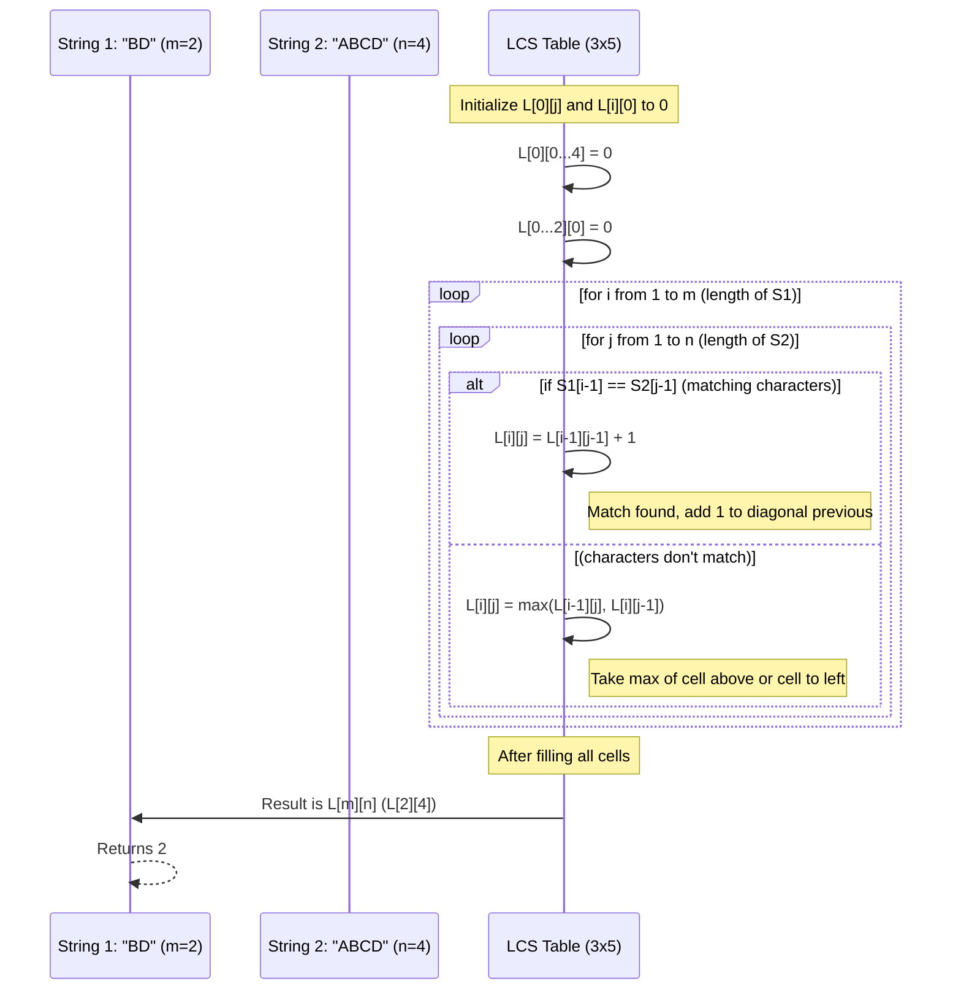

# Chapter 5: Dynamic Programming

Welcome back, algorithm adventurers! In our previous chapter, [Backtracking Algorithms](04_backtracking_algorithms_.md), we learned how to solve complex puzzles like N-Queens by systematically exploring possibilities and "backing up" when we hit a dead end. Backtracking is great for problems where you need to try many different paths.

Now, imagine you're faced with a slightly different kind of challenge: a problem that seems to break down into many smaller pieces, but you realize you're solving the *same small pieces* over and over again. It's like re-reading the same paragraph of a book multiple times because you keep forgetting the main point before moving to the next one. This is inefficient!

This is where **Dynamic Programming** comes to the rescue! It's a powerful technique that helps us solve complex problems much more efficiently by avoiding redundant calculations.

### The "Overlapping Work" Problem

Imagine you're trying to figure out the longest possible sequence of characters that appear in the same order in *two different words*. For example:

*   Word 1: `ABCBDAB`
*   Word 2: `BDCABA`

What's the longest common sequence?
*   `BDAB` (length 4) is common.
*   `BCBA` (length 4) is common.

This is called the **Longest Common Subsequence (LCS)** problem. A "subsequence" means the characters don't have to be consecutive in the original word, but their order must be maintained. For `ABCBDAB`, `AD` is a subsequence, but `DA` is not.

When trying to solve this problem, you might notice that to find the LCS of two long words, you often need to find the LCS of their slightly shorter parts. And many of these "shorter parts" LCS calculations might be identical! If you calculate them repeatedly, it takes a lot of time. Dynamic Programming helps us solve each unique "shorter part" problem *once*, store the answer, and then just look up that answer whenever we need it again.

### What is Dynamic Programming?

Dynamic Programming (often shortened to DP) is an optimization technique used for problems that have two main properties:

1.  **Overlapping Subproblems:** The problem can be broken down into smaller subproblems, and these subproblems are *repeatedly solved*. Instead of re-solving them every time, DP solves each unique subproblem only once.
2.  **Optimal Substructure:** The optimal solution to the main problem can be constructed from the optimal solutions of its subproblems. If you have the best way to solve the smaller parts, you can use those to build the best way to solve the whole problem.

Think of it like building a very complex Lego structure. If you need to build the same specific small module (a "subproblem") multiple times, you build it once, put it aside, and then just grab a copy whenever you need it for the larger structure, instead of rebuilding it from scratch every single time.

There are generally two ways to implement Dynamic Programming:

*   **Memoization (Top-Down):** This is a recursive approach where you solve the main problem, and if you need the answer to a subproblem, you check if you've already computed it (in a "memo" or storage). If yes, return the stored answer; otherwise, compute it, store it, then return it.
*   **Tabulation (Bottom-Up):** This is an iterative approach where you fill up a "table" (usually a 2D array) with solutions to all possible subproblems, starting from the smallest ones, and working your way up to the solution of the main problem. The `largest_common_subsequence.c` code uses this method.

### Solving Longest Common Subsequence (LCS) with Dynamic Programming

Let's use our example again:
*   `S1 = "BD"`
*   `S2 = "ABCD"`

We want to find the length of their LCS.
If we compare `S1` and `S2`, the LCS is `BD`, and its length is 2.

How would DP solve this? It builds a table. Each cell `L[i][j]` in this table will store the length of the LCS for the first `i` characters of `S1` and the first `j` characters of `S2`.

Here's the logic for filling the table `L`:

*   If `i` is 0 or `j` is 0 (meaning one of the strings is empty), the LCS length is 0.
*   If the characters `S1[i-1]` and `S2[j-1]` are the **same**: The LCS includes this matching character. So, `L[i][j]` will be `1 + L[i-1][j-1]` (1 for the current match, plus the LCS of the shorter strings before these characters).
*   If the characters `S1[i-1]` and `S2[j-1]` are **different**: We can't include both. So, we take the maximum of two possibilities:
    *   LCS of `S1` (first `i-1` chars) and `S2` (first `j` chars) - represented by `L[i-1][j]`.
    *   LCS of `S1` (first `i` chars) and `S2` (first `j-1` chars) - represented by `L[i][j-1]`.

The final answer will be in the bottom-right cell of the table, `L[m][n]`.

### Internal Implementation Walkthrough (LCS Table)

Let's walk through building the LCS table for `S1 = "BD"` (m=2) and `S2 = "ABCD"` (n=4).
We'll create a table `L` of size `(m+1) x (n+1)`, which is `3x5`.

Initial table with first row and column filled with 0s:
(Each `L[i][j]` represents LCS of `S1[0...i-1]` and `S2[0...j-1]`)

```
      ""  A  B  C  D
   ""  0  0  0  0  0
   B   0  ?  ?  ?  ?
   D   0  ?  ?  ?  ?
```

Now, let's fill the rest:

1.  **For `i = 1` (comparing `S1[0]` = 'B'):**
    *   **`j = 1` (comparing `S2[0]` = 'A'):** 'B' != 'A'. Take `max(L[0][1], L[1][0]) = max(0, 0) = 0`. So `L[1][1] = 0`.
    *   **`j = 2` (comparing `S2[1]` = 'B'):** 'B' == 'B'. Take `1 + L[0][1] = 1 + 0 = 1`. So `L[1][2] = 1`.
    *   **`j = 3` (comparing `S2[2]` = 'C'):** 'B' != 'C'. Take `max(L[0][3], L[1][2]) = max(0, 1) = 1`. So `L[1][3] = 1`.
    *   **`j = 4` (comparing `S2[3]` = 'D'):** 'B' != 'D'. Take `max(L[0][4], L[1][3]) = max(0, 1) = 1`. So `L[1][4] = 1`.

Updated table:
```
      ""  A  B  C  D
   ""  0  0  0  0  0
   B   0  0  1  1  1
   D   0  ?  ?  ?  ?
```

2.  **For `i = 2` (comparing `S1[1]` = 'D'):**
    *   **`j = 1` (comparing `S2[0]` = 'A'):** 'D' != 'A'. Take `max(L[1][1], L[2][0]) = max(0, 0) = 0`. So `L[2][1] = 0`.
    *   **`j = 2` (comparing `S2[1]` = 'B'):** 'D' != 'B'. Take `max(L[1][2], L[2][1]) = max(1, 0) = 1`. So `L[2][2] = 1`.
    *   **`j = 3` (comparing `S2[2]` = 'C'):** 'D' != 'C'. Take `max(L[1][3], L[2][2]) = max(1, 1) = 1`. So `L[2][3] = 1`.
    *   **`j = 4` (comparing `S2[3]` = 'D'):** 'D' == 'D'. Take `1 + L[1][3] = 1 + 1 = 2`. So `L[2][4] = 2`.

Final table:
```
      ""  A  B  C  D
   ""  0  0  0  0  0
   B   0  0  1  1  1
   D   0  0  1  1  2
```

The final answer is `L[m][n]`, which is `L[2][4] = 2`. This is the correct length of the LCS for "BD" and "ABCD"!

This process can be visualized like systematically filling the table:



### Looking at the Code (`largest_common_subsequence.c`)

Let's see how this "filling the table" idea translates into actual C code, using snippets from the `largest_common_subsequence.c` file.

First, the `main` function defines our two strings and calls the `lcs` function to get the length:

```c
// largest_common_subsequence.c (main function)
#include <stdio.h>
#include <string.h> // For strlen()

int main() {
    char S1[] = "BD";       // Our first string
    char S2[] = "ABCD";     // Our second string
    printf("Length of LCS is %d\n", lcs(S1, S2)); // Call lcs function
    return 0;
}
```
**Explanation:** This `main` function sets up our two example strings, `S1` and `S2`, and then calls the `lcs` function, printing the result.

Now, let's look inside the `lcs` function itself. It first gets the lengths of the strings and declares our DP table `L`:

```c
// largest_common_subsequence.c (part of lcs function)
int lcs(char *X, char *Y) {
    int m = strlen(X); // Length of first string
    int n = strlen(Y); // Length of second string
    int L[m+1][n+1];   // Our DP table to store LCS lengths of subproblems
    int i, j;          // Loop counters

    // ... (more code to fill the table) ...

    return L[m][n]; // The final answer is in the bottom-right cell
}
```
**Explanation:** `m` and `n` store the lengths of `X` and `Y`. `L[m+1][n+1]` declares a 2D array, which is our DP table. We use `m+1` and `n+1` dimensions because we need extra rows/columns for the "empty string" base cases (index 0).

Next, the `lcs` function initializes the first row and column of the `L` table with zeros. This represents the base case where one of the strings is empty, so their LCS length is 0:

```c
// largest_common_subsequence.c (another part of lcs function)
int lcs(char *X, char *Y) {
    // ... (previous lines to get lengths and declare L) ...

    // Fill the L table in a bottom-up manner
    for (i = 0; i <= m; i++) {
        for (j = 0; j <= n; j++) {
            if (i == 0 || j == 0) // If either string is empty, LCS is 0
                L[i][j] = 0;
            // ... (more code for matching/non-matching characters) ...
        }
    }
    return L[m][n];
}
```
**Explanation:** The outer `for (i = 0; i <= m; i++)` loop iterates through rows, and the inner `for (j = 0; j <= n; j++)` loop iterates through columns. The `if (i == 0 || j == 0)` condition handles our base cases: if `i` is 0 (first string is effectively empty) or `j` is 0 (second string is effectively empty), the length of the LCS is 0.

Finally, the core logic for filling the table cells for non-empty strings, based on whether the current characters match or not:

```c
// largest_common_subsequence.c (final part of lcs function)
int lcs(char *X, char *Y) {
    // ... (previous lines to get lengths, declare L, and initialize 0s) ...

    for (i = 0; i <= m; i++) {
        for (j = 0; j <= n; j++) {
            if (i == 0 || j == 0)
                L[i][j] = 0;
            else if (X[i-1] == Y[j-1]) // If current characters match
                L[i][j] = L[i-1][j-1] + 1; // Take diagonal value + 1
            else // If current characters do not match
                L[i][j] = (L[i-1][j] > L[i][j-1]) ? L[i-1][j] : L[i][j-1]; // Take max of above or left
        }
    }
    return L[m][n];
}
```
**Explanation:**
*   `else if (X[i-1] == Y[j-1])`: If the characters at the current positions (remember `i-1` and `j-1` because our strings are 0-indexed while our `L` table is 1-indexed for string characters) are the same, it means we found a match. So, the LCS length for `L[i][j]` is 1 (for this match) plus the LCS length from the subproblem where both strings were one character shorter (`L[i-1][j-1]`).
*   `else`: If the characters don't match, we can't include both. We must choose to either ignore `X[i-1]` (and look at `L[i-1][j]`) or ignore `Y[j-1]` (and look at `L[i][j-1]`). We pick the option that gives us the longer LCS, so `L[i][j]` becomes the maximum of `L[i-1][j]` and `L[i][j-1]`.

When you run the `largest_common_subsequence.c` program with the given inputs, here's what you'd see:

```
Length of LCS is 2
```
This confirms our manual walkthrough and shows that the algorithm correctly found the length of the Longest Common Subsequence.

### Conclusion

Dynamic Programming is a powerful technique for solving problems that have "overlapping subproblems" and "optimal substructure." Instead of repeatedly calculating the same thing, it cleverly stores the results of subproblems and reuses them, saving a lot of computational effort. We saw this in action with the Longest Common Subsequence problem, where building a table of solutions to smaller subproblems led us to the efficient solution for the overall problem. Understanding DP is crucial for tackling many complex optimization challenges in computer science.

In the next chapter, we'll dive into another fascinating area: [String Matching Algorithms](06_string_matching_algorithms_.md), which are used to efficiently find occurrences of a pattern within a larger text.

---

Generated by [AI Codebase Knowledge Builder]