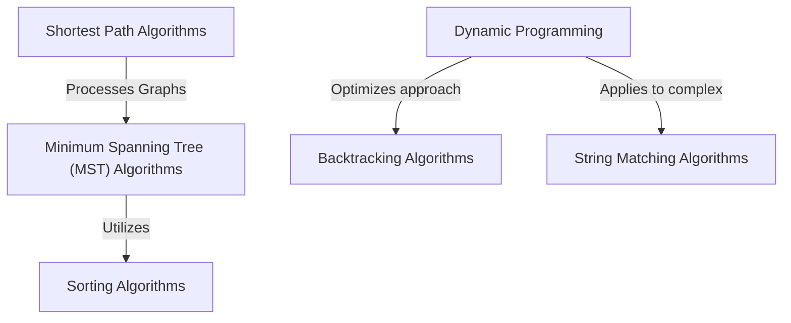

# Tutorial: Analysis-Of-Algorithm

This project serves as a practical collection and *demonstration* of various fundamental algorithms.
It showcases how different algorithmic strategies like **sorting**, **shortest path finding**, and **dynamic programming** can solve common computational problems, helping users understand their underlying logic and implementation.

**Source Repository:** [https://github.com/010624/Analysis-Of-Algorithm](https://github.com/010624/Analysis-Of-Algorithm)

## Chapters

1. [Sorting Algorithms
](01_sorting_algorithms_.md)
2. [Minimum Spanning Tree (MST) Algorithms
](02_minimum_spanning_tree__mst__algorithms_.md)
3. [Shortest Path Algorithms
](03_shortest_path_algorithms_.md)
4. [Backtracking Algorithms
](04_backtracking_algorithms_.md)
5. [Dynamic Programming
](05_dynamic_programming_.md)
6. [String Matching Algorithms
](06_string_matching_algorithms_.md)

---

Generated by [AI Codebase Knowledge Builder]