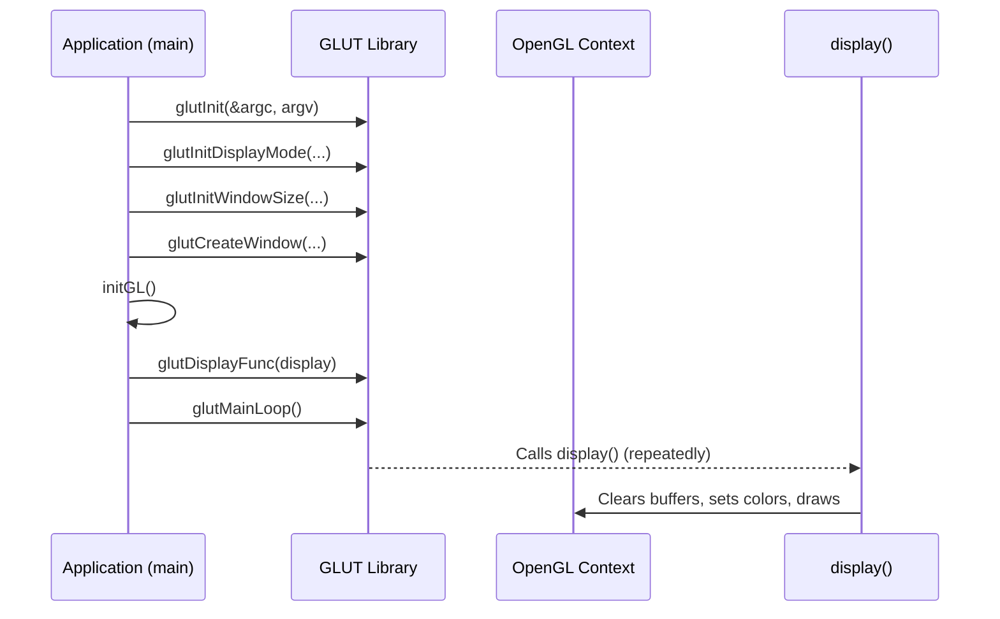

# Chapter 1: OpenGL Initialization and Rendering

Welcome to the world of Computer Graphics! In this chapter, we'll kickstart our journey by understanding the fundamental setup required for any OpenGL application. We'll use the GLUT library (OpenGL Utility Toolkit), which simplifies window management and event handling, allowing us to focus on graphics.

## 1.1 What is OpenGL and Why Initialize It?

OpenGL (Open Graphics Library) is a powerful cross-platform API (Application Programming Interface) for rendering 2D and 3D graphics. Think of it as a specialized language your program uses to "talk" to your computer's graphics hardware (GPU).

Before we can draw anything, we need to:
*   Tell the operating system we want to create a graphics window.
*   Prepare the OpenGL context, which is like setting up a canvas and choosing our drawing tools.
*   Define a basic perspective from which we'll view our drawings.

This setup process is what we refer to as "OpenGL Initialization."

## 1.2 The Role of GLUT

GLUT (OpenGL Utility Toolkit) is a library that handles the "boilerplate" code for creating windows, handling keyboard/mouse input, and managing the event loop. While modern applications often use more sophisticated libraries like GLFW or SDL, GLUT is excellent for learning due to its simplicity.

## 1.3 The Core Program Structure

Every GLUT-based OpenGL program follows a similar structure, primarily within the `main` function and a custom "display" function.

### 1.3.1 Setting Up the Main Function

The `main` function is the entry point of our program. Here's a minimal example:

```c
#include <GL/freeglut.h> // Or <GL/glut.h>
#include <GL/gl.h>

// Function prototypes
void initGL();
void display();

int main(int argc, char** argv) {
    glutInit(&argc, argv); // Initialize GLUT
    glutInitDisplayMode(GLUT_SINGLE | GLUT_RGB); // Single buffer, RGB color
    glutInitWindowSize(800, 600); // Window dimensions
    glutInitWindowPosition(100, 100); // Window position on screen
    glutCreateWindow("My First OpenGL Window"); // Create the window

    initGL(); // Our custom OpenGL initialization
    glutDisplayFunc(display); // Register the display callback

    glutMainLoop(); // Enter GLUT's event processing loop
    return 0;
}
```

Let's break down these essential `main` function calls:

*   `glutInit(&argc, argv)`: This **initializes the GLUT library**. It processes any command-line arguments that might be relevant to GLUT.
*   `glutInitDisplayMode(GLUT_SINGLE | GLUT_RGB)`: This specifies the **display mode** for the window.
    *   `GLUT_SINGLE`: Uses a single buffer for drawing. This means drawing directly to the screen. (For smoother animations, `GLUT_DOUBLE` is often used with `glutSwapBuffers`).
    *   `GLUT_RGB`: Requests an RGB color buffer, allowing us to specify colors using red, green, and blue components.
*   `glutInitWindowSize(800, 600)`: Sets the **initial width and height** of the window in pixels.
*   `glutInitWindowPosition(100, 100)`: Sets the **initial top-left corner position** of the window on the screen.
*   `glutCreateWindow("My First OpenGL Window")`: Creates the actual **window** with the specified title.
*   `initGL()`: A custom function (which we'll define) to set up the OpenGL rendering context.
*   `glutDisplayFunc(display)`: This is crucial! It **registers our `display` function** as the one GLUT should call whenever the window needs to be redrawn (e.g., when it's first created or uncovered).
*   `glutMainLoop()`: **Enters the GLUT event processing loop**. This function never returns. It continuously checks for events (like drawing requests, keyboard presses, mouse clicks) and dispatches them to the appropriate callback functions we've registered.

Here's a sequence diagram illustrating the flow:



### 1.3.2 Custom OpenGL Initialization (`initGL`)

This function is where we configure the basic OpenGL rendering state.

```c
void initGL() {
    glClearColor(0.0, 0.0, 0.0, 1.0); // Set background color to black (RGBA)
    glMatrixMode(GL_PROJECTION);      // Set current matrix to Projection
    glLoadIdentity();                 // Reset the projection matrix
    // Define an orthographic 2D projection
    gluOrtho2D(-400, 400, -300, 300); // Left, Right, Bottom, Top
}
```

*   `glClearColor(0.0, 0.0, 0.0, 1.0)`: This sets the **background color** that will be used when we clear the window. The values are RGBA (Red, Green, Blue, Alpha), ranging from 0.0 to 1.0. Here, `0.0, 0.0, 0.0` is black, and `1.0` means fully opaque.
*   `glMatrixMode(GL_PROJECTION)`: OpenGL uses matrices to transform objects. We tell OpenGL that we're now going to manipulate the **projection matrix**, which defines how our 3D (or 2D) world is mapped onto our 2D screen.
*   `glLoadIdentity()`: Resets the currently active matrix (projection matrix, in this case) to the **identity matrix**. This is good practice to ensure we start with a clean slate.
*   `gluOrtho2D(-400, 400, -300, 300)`: This function from GLU (OpenGL Utility library) sets up a **2D orthographic projection**. It defines the "world coordinates" that will be visible in our window.
    *   The first two arguments (`-400`, `400`) specify the minimum and maximum X-coordinates visible.
    *   The last two arguments (`-300`, `300`) specify the minimum and maximum Y-coordinates visible.
    *   This means our window will display a coordinate system where X ranges from -400 to 400, and Y ranges from -300 to 300. The origin (0,0) will be at the center of the window.

## 1.4 The Display Function: Our Drawing Canvas

The `display` function is where all our drawing commands go. GLUT calls this function whenever the window needs to be redrawn.

```c
void display() {
    glClear(GL_COLOR_BUFFER_BIT); // Clear the color buffer with background color

    // Set drawing color to red
    glColor3f(1.0, 0.0, 0.0);

    // Draw a point at (0, 0)
    glPointSize(5.0); // Set point size
    glBegin(GL_POINTS);
        glVertex2f(0.0, 0.0);
    glEnd();

    // Draw a line from (-200, -100) to (200, 100)
    glColor3f(0.0, 1.0, 0.0); // Set drawing color to green
    glBegin(GL_LINES);
        glVertex2f(-200.0, -100.0);
        glVertex2f(200.0, 100.0);
    glEnd();

    glFlush(); // Force all buffered OpenGL commands to execute
}
```

Key commands in the `display` function:

*   `glClear(GL_COLOR_BUFFER_BIT)`: This command clears the entire window using the background color set by `glClearColor`. `GL_COLOR_BUFFER_BIT` tells OpenGL to clear the color buffer (where pixels are stored).
*   `glColor3f(R, G, B)`: Sets the **current drawing color**. Subsequent drawing commands will use this color until `glColor3f` is called again. Values are floats from 0.0 to 1.0. `glColor3f(1.0, 0.0, 0.0)` is red.
*   `glPointSize(size)`: Sets the **size of points** to be drawn, in pixels.
*   `glBegin(primitive_type)` / `glEnd()`: These functions define a **block of drawing commands**. All `glVertex` calls between `glBegin` and `glEnd` will form the specified `primitive_type`.
    *   `GL_POINTS`: Draws individual points.
    *   `GL_LINES`: Draws independent lines, with each pair of vertices forming a line.
    *   There are many other primitive types like `GL_TRIANGLES`, `GL_QUADS`, `GL_POLYGON`, etc., which we'll explore later.
*   `glVertex2f(x, y)`: Specifies a **vertex** (a point in space) with 2D float coordinates.
*   `glFlush()`: Ensures that all OpenGL commands are executed and rendered to the screen immediately. Without `glFlush()`, commands might be buffered and not appear until later.

## 1.5 Putting it All Together: A Complete Example

Here's the full code for our first OpenGL application:

```c
#include <GL/freeglut.h>
#include <GL/gl.h>

// Custom OpenGL initialization
void initGL() {
    glClearColor(0.0, 0.0, 0.0, 1.0); // Background color (black)
    glMatrixMode(GL_PROJECTION);
    glLoadIdentity();
    gluOrtho2D(-400, 400, -300, 300); // Define world coordinates
}

// Our drawing function
void display() {
    glClear(GL_COLOR_BUFFER_BIT); // Clear window to background color

    // Draw a red point at the center
    glColor3f(1.0, 0.0, 0.0); // Red
    glPointSize(8.0);
    glBegin(GL_POINTS);
        glVertex2f(0.0, 0.0);
    glEnd();

    // Draw a green line
    glColor3f(0.0, 1.0, 0.0); // Green
    glBegin(GL_LINES);
        glVertex2f(-300.0, -200.0);
        glVertex2f(300.0, 200.0);
    glEnd();

    glFlush(); // Render now
}

int main(int argc, char** argv) {
    glutInit(&argc, argv);
    glutInitDisplayMode(GLUT_SINGLE | GLUT_RGB);
    glutInitWindowSize(800, 600);
    glutInitWindowPosition(100, 100);
    glutCreateWindow("My First OpenGL Program");

    initGL();
    glutDisplayFunc(display);
    glutMainLoop();
    return 0;
}
```

To compile this on a Linux system, you might use:
`gcc my_program.c -o my_program -lGL -lGLU -lglut`

## 1.6 Summary

In this chapter, we've laid the groundwork for all our future OpenGL endeavors. You've learned:
*   How to initialize the GLUT library and create a window.
*   The essential components of the `main` function for setting up an OpenGL application.
*   How to configure the OpenGL rendering context using `initGL`, including setting the background color and defining a 2D projection.
*   The basics of drawing within the `display` function, using `glClear`, `glColor3f`, `glBegin`/`glEnd` blocks, and `glVertex2f` for simple shapes like points and lines.

This fundamental setup will be the starting point for nearly every OpenGL program you write. In the next chapter, we'll dive deeper into drawing more complex geometric primitives!

---

Generated by [AI Codebase Knowledge Builder]