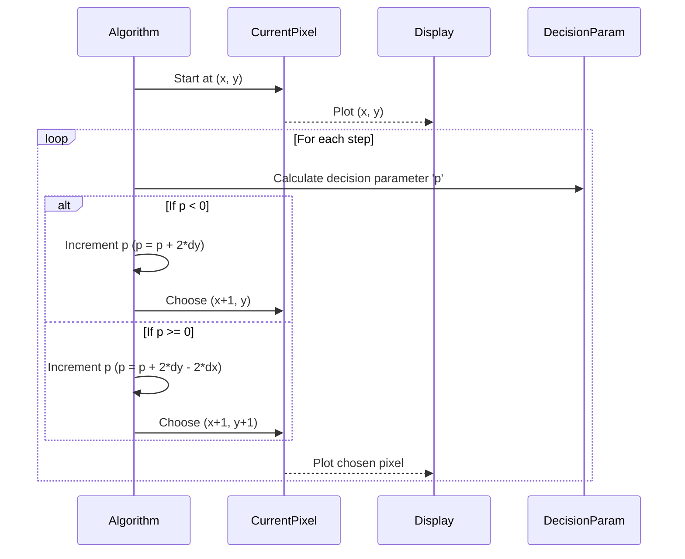

# Chapter 2: Basic Geometric Primitive Algorithms

Welcome to Chapter 2! In the previous chapter, we learned how to get OpenGL up and running and draw simple points. Now, let's dive into something more exciting: drawing fundamental geometric shapes like lines and circles *precisely* on your screen.

Imagine your computer screen as a grid, like graph paper. Each square on this grid is a tiny light called a **pixel**. When we want to draw a line or a circle, we're essentially telling the computer which of these pixels to light up to create the illusion of that shape. This isn't as simple as just connecting the dots; we need smart algorithms to pick the *right* pixels to make the shape look smooth and accurate.

This chapter introduces you to the mathematical techniques and algorithms that determine and plot all the necessary pixels for basic shapes. These are the building blocks for creating any complex graphic you can imagine!

## 2.1 Drawing Lines: The Challenge

How do you draw a straight line between two points (X1, Y1) and (X2, Y2) on a pixel grid? If the line is perfectly horizontal or vertical, it's easy. But what about diagonal lines? If we just "connect the dots," the line might look jagged or broken. We need algorithms that decide which pixel is "closest" to the ideal mathematical line.

### 2.1.1 Digital Differential Analyzer (DDA) Algorithm

The DDA algorithm is one of the simplest line-drawing algorithms. It works by calculating the slope of the line and then incrementally stepping along one axis (either X or Y) and calculating the corresponding step along the other axis.

**How it works (Concept):**
1.  Calculate `dx = X2 - X1` and `dy = Y2 - Y1`.
2.  Determine which axis has the larger difference (e.g., if `abs(dx) > abs(dy)`, step along X).
3.  For each step along the dominant axis, calculate the corresponding increment for the other axis using the slope.
4.  Plot the pixel.

**Pros:** Simple to understand and implement.
**Cons:** Involves floating-point arithmetic, which can be slower and lead to rounding errors, potentially causing gaps or inaccuracies in the line, especially for long lines.

### 2.1.2 Bresenham's Line Algorithm

Bresenham's algorithm is a highly efficient and accurate method for drawing lines. The magic here is that it uses *only integer arithmetic* to decide which pixel to light up next. This makes it much faster and prevents the rounding errors that DDA can suffer from.

**How it works (Simplified):**
Instead of using floating-point numbers, Bresenham's uses a "decision parameter" (often called `p` or `d`). This parameter helps the algorithm decide whether the next pixel should be directly "across" or "up/down and across" from the current pixel. It essentially checks which of the two possible next pixels is closer to the true mathematical line.

Let's visualize the decision process:



Here's the core loop from the provided C code, implementing Bresenham's algorithm:

```c
// Inside the Line() function
// ... initialization of dx, dy, p, x, y ...

for(k=0; k<dx; k++) // Loop for dx steps
{
    if(p<0) // Is the next pixel below the line?
    {
        p=p+2*dy; // Update p for moving horizontally
    }
    else // Is the next pixel above or on the line?
    {
        p=p+2*dy-2*dx; // Update p for moving diagonally
        y++; // Increment y
    }
    x++; // Always increment x
    glVertex2f(x,y); // Plot the new pixel
}
```
This loop efficiently determines and plots each pixel, ensuring a smooth and accurate line using only integer operations.

## 2.2 Drawing Circles and Ellipses: The Midpoint Algorithm

Drawing curves like circles and ellipses on a pixel grid presents similar challenges to drawing lines. We need to select the pixels that best approximate the curve.

### 2.2.1 Midpoint Circle Algorithm

Just like Bresenham's for lines, the Midpoint Circle Algorithm (also known as Bresenham's Circle Algorithm) is an efficient method for drawing circles using only integer arithmetic.

**How it works (Concept):**
1.  **Symmetry:** A key trick for circles is exploiting symmetry. A circle has 8-fold symmetry (imagine dividing it into 8 equal slices). If you calculate the pixels for one 45-degree segment (an "octant"), you can simply reflect those pixels to get the rest of the circle. This means you only need to calculate 1/8th of the circle!
2.  **Decision Parameter:** Similar to Bresenham's line, a decision parameter is used. At each step, the algorithm decides between two possible pixels: one that keeps the Y-coordinate the same (or decrements it by 1) and one that decrements the Y-coordinate by 1 and moves X by 1. The decision parameter helps choose which pixel is closer to the true circle boundary.

This algorithm provides a way to draw smooth, accurate circles efficiently without complex floating-point calculations, making it ideal for computer graphics.

## 2.3 Summary

In this chapter, we've explored the fundamental algorithms used to draw basic geometric shapes precisely on a raster display. We learned:
*   **DDA** for lines, a simpler but less efficient approach.
*   **Bresenham's Line Algorithm**, a highly efficient and accurate integer-only method for drawing straight lines.
*   **Midpoint Circle Algorithm**, which uses symmetry and a decision parameter to efficiently draw smooth circles.

These algorithms are the bedrock of computer graphics, allowing us to render smooth and accurate basic shapes that form the building blocks for more complex and visually rich graphics. In the next chapter, we'll move on to filling these shapes with colors!

---

Generated by [AI Codebase Knowledge Builder]