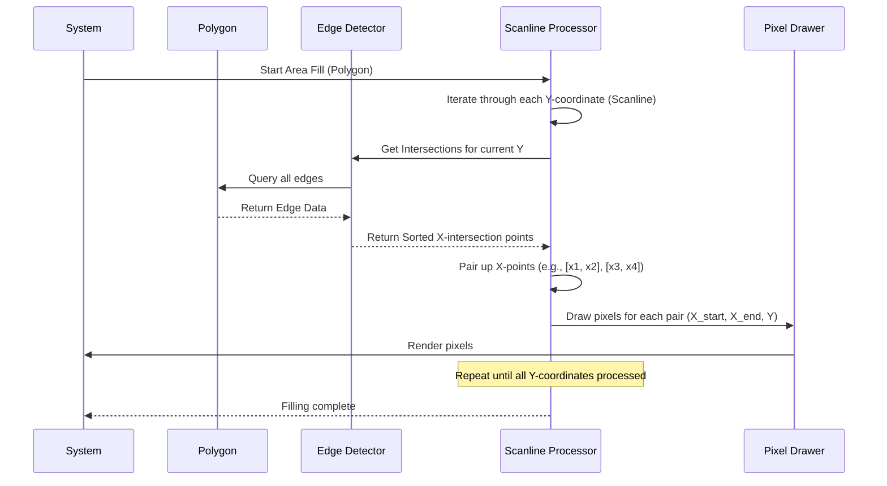

# Chapter 3: Area Filling Algorithms

In the world of computer graphics, simply drawing outlines of shapes isn't enough to make them look solid and realistic. This is where **Area Filling Algorithms** come into play. Their primary goal is to color the entire interior region of closed shapes, transforming a wireframe outline into a solid object. Think of filling a polygon with a specific color or giving a circle a solid appearance.

## The Scanline Algorithm: A Core Technique

One of the most common and intuitive techniques for area filling is the **Scanline Algorithm**. Imagine taking a paint roller and moving it horizontally across your shape, coloring everything it touches between the shape's edges. That's essentially what the scanline algorithm does!

Here's how it generally works:

1.  **Horizontal Scanlines:** The algorithm processes the shape one horizontal line (called a "scanline") at a time, from the lowest `y`-coordinate to the highest `y`-coordinate of the shape.
2.  **Intersection Detection:** For each scanline, it identifies all the points where the scanline intersects the edges of the shape.
3.  **Pairing and Filling:** These intersection points are then sorted by their `x`-coordinate. Pixels are drawn between alternating pairs of these sorted intersection points. For example, if a scanline intersects at `x1`, `x2`, `x3`, `x4`, you would fill from `x1` to `x2`, and then from `x3` to `x4`. This effectively fills the interior segments of the shape on that particular scanline.
4.  **Repeat:** This process is repeated for every scanline, incrementally filling the entire enclosed area.

This method ensures that every pixel inside the shape is colored, making the shape appear solid with a specified color.

### Visualizing the Scanline Process

Let's visualize the flow of the scanline algorithm:



### Code Walkthrough

Let's look at a simplified C code example that demonstrates key parts of a scanline algorithm, specifically how to detect edges and prepare for filling.

#### `draw_pixel` Function

This is a fundamental helper function to draw a single pixel at a given `(x, y)` coordinate.

```c
void draw_pixel(int x, int y)
{
    glColor3f(0.0, 1.0, 4); // Set color (Green)
    glPointSize(1.0);       // Set pixel size
    glBegin(GL_POINTS);     // Start drawing points
    glVertex2i(x, y);       // Specify pixel coordinates
    glEnd();                // End drawing points
}
```

#### `edgedetect` Function

This is a crucial part of the scanline algorithm. For a given edge (`(x1, y1)` to `(x2, y2)`), this function identifies the leftmost (`le`) and rightmost (`re`) `x` coordinates for each `y` value (scanline) that the edge crosses.

```c
void edgedetect(float x1, float y1, float x2, float y2, int *le, int *re)
{
    float temp, x, mx;
    int i;
    // Ensure y1 <= y2 for consistent processing
    if(y1 > y2) { temp=x1; x1=x2; x2=temp; temp=y1; y1=y2; y2=temp; }

    // Calculate slope (mx)
    if(y1 == y2) mx = x2 - x1; // Horizontal line
    else mx = (x2 - x1) / (y2 - y1); // General line

    x = x1; // Start x-coordinate

    // Iterate through each scanline (y-value) the edge covers
    for(i = y1; i <= y2; i++) {
        // Update leftmost x for this scanline if current x is smaller
        if(x < (float)le[i]) le[i] = (int)x;
        // Update rightmost x for this scanline if current x is larger
        if(x > (float)re[i]) re[i] = (int)x;
        x += mx; // Move x along the edge for the next scanline
    }
}
```
*   `le[]` and `re[]`: These are arrays where `le[i]` stores the minimum x-coordinate found for scanline `i`, and `re[i]` stores the maximum x-coordinate found.
*   **Slope Calculation:** `mx` (pronounced "m-x") calculates how much `x` changes for every unit change in `y`. This is the inverse slope (`dx/dy`).
*   **Looping `y`:** The loop iterates from `y1` to `y2`, effectively tracing the edge one scanline at a time. In each iteration, `x` is updated based on the slope.
*   **Updating `le` and `re`:** For each `y` value, `le[y]` and `re[y]` are updated to store the minimum and maximum `x` values encountered so far from *any* edge at that `y`.

#### `scanfill` Function

This function orchestrates the filling process for a quadrilateral (defined by `(x1,y1)` to `(x4,y4)`). It initializes the `le` and `re` arrays and then calls `edgedetect` for each edge of the polygon.

```c
void scanfill(float x1, float y1, float x2, float y2, float x3, float y3, float x4, float y4)
{
    int le[500], re[500], i, j;

    // Initialize le to a large value and re to a small value
    // This ensures that any edge intersection will correctly update them
    for(i = 0; i < 500; i++)
        le[i] = 500, re[i] = 0;

    // Call edgedetect for each edge of the polygon
    edgedetect(x1, y1, x2, y2, le, re); // Edge 1-2
    edgedetect(x2, y2, x3, y3, le, re); // Edge 2-3
    edgedetect(x3, y3, x4, y4, le, re); // Edge 3-4
    // Missing: edgedetect(x4, y4, x1, y1, le, re); for the closing edge (4-1)

    // After all edges have been processed by edgedetect,
    // the le and re arrays contain the min and max x-coordinates
    // for each scanline. The actual filling loop would then look like this:
    /*
    for(i = 0; i < 500; i++) { // Iterate through all possible scanlines
        if(le[i] < re[i]) { // If valid segment exists for this scanline
            for(j = le[i] + 1; j < re[i]; j++) { // Fill pixels between min and max x
                draw_pixel(j, i);
            }
        }
    }
    */
}
```
*   **Initialization:** `le` is initialized to a large value (500) and `re` to a small value (0) for each `y`. This ensures that the first `x` value encountered for any `y` will correctly set the initial `le[y]` and `re[y]`.
*   **Edge Processing:** `edgedetect` is called for each edge of the polygon. For a quadrilateral, there should be four calls (the example is missing the last edge connecting `x4,y4` to `x1,y1`).
*   **Actual Filling (Conceptual):** Once all edges have been processed, the `le` and `re` arrays hold the minimum and maximum `x` values for each `y` scanline. The final step (commented out above, as it's not fully present in the snippet) would iterate through `y` from 0 to 499 (or max `y` of polygon), and for each `y` where `le[y] < re[y]`, it would draw pixels from `le[y]` to `re[y]` using the `draw_pixel` function.

Area filling algorithms like scanline are fundamental for rendering solid shapes in computer graphics, transforming simple outlines into visually complete objects.

---

Generated by [AI Codebase Knowledge Builder]