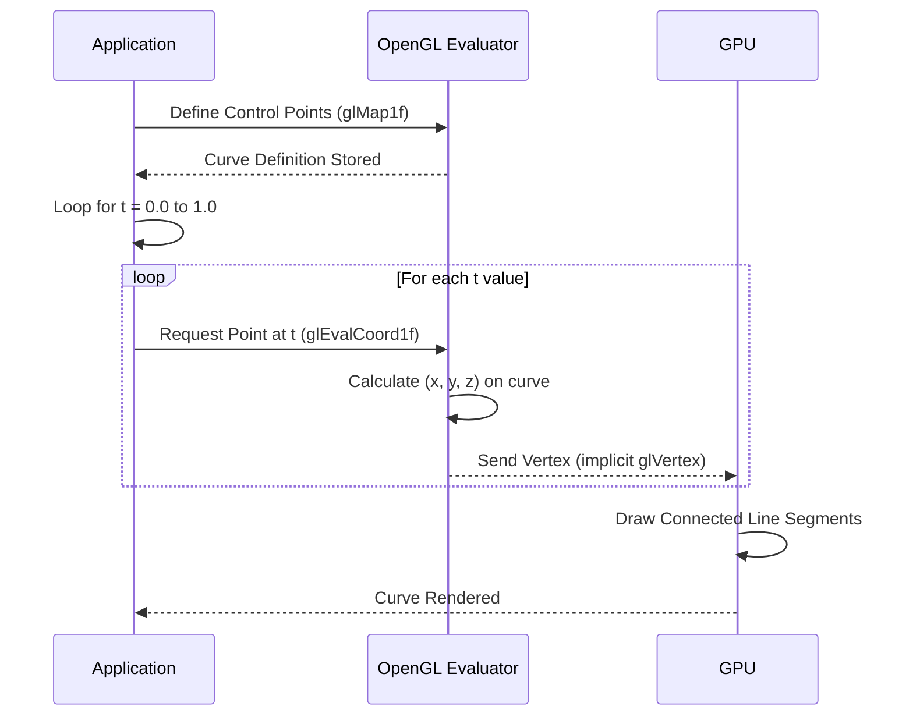

# Chapter 4: Bézier Curve Generation

Welcome to Chapter 4! In this chapter, we're diving into Bézier curves, a fundamental concept in computer graphics for creating smooth, flexible shapes. Think of them as the go-to tool for drawing everything from elegant fonts to the flowing outlines of animated characters.

## What are Bézier Curves?

At its heart, a Bézier curve is a mathematically defined curve that is controlled by a set of special points called **control points**. The magic of Bézier curves is that they don't necessarily pass *through* all these control points. Instead, the control points act like magnets, pulling and shaping the curve, allowing you to design intricate paths with great precision and intuition.

Imagine you're trying to draw a smooth arc. Instead of specifying hundreds of tiny line segments, you just tell the computer a few key points, and it calculates a beautiful, continuous curve that's influenced by those points.

## How Control Points Work

For a simple Bézier curve, you usually have:
*   A **start point** and an **end point** (the curve *always* passes through these).
*   **Intermediate control points** that dictate the curve's curvature and direction. These points don't lie on the curve but pull it towards them, giving it its characteristic shape.

The more control points you have, the more complex and flexible the curve can be. For instance, a cubic Bézier curve (a very common type) uses four control points.

## Generating Bézier Curves with OpenGL

OpenGL provides a powerful mechanism called "evaluators" to generate Bézier curves. This involves two main functions:

1.  `glMap1f()`: This function defines the curve using your control points. It tells OpenGL what kind of curve you want to draw and where its control points are located.
2.  `glEvalCoord1f()`: Once the curve is defined, this function calculates a specific point on the curve for a given parameter value (usually `t`, ranging from 0.0 to 1.0). By calling it repeatedly with slightly different parameter values, you can get a series of points that form the curve.

Let's look at the relevant code to see how this works:

```c
// Define the control points for our Bézier curve
GLfloat ctrlpoints[4][3] = {
    { -0.00, 2.00, 0.0 }, // P0: Start point (top-center)
    { -2.00, 2.00, 0.0 }, // P1: Control point 1 (pulls left and up)
    { -2.00, -1.00, 0.0 },// P2: Control point 2 (pulls left and down)
    { -0.00, -2.00, 0.0 } // P3: End point (bottom-center)
};
```

Here, we define `ctrlpoints`, an array of 4 points, each with X, Y, and Z coordinates. This `ctrlpoints` array will define a cubic Bézier curve.

### Defining the Curve with `glMap1f`

```c
void draw(GLfloat ctrlpoints[4][3])
{
    glShadeModel(GL_FLAT); // Simple shading model

    // Define a 1D evaluator for 3D vertices (GL_MAP1_VERTEX_3)
    // Range of parameter 't': 0.0 to 1.0
    // Stride between control points: 3 (for X, Y, Z)
    // Number of control points: 4
    // Pointer to the first control point's data: &ctrlpoints[0][0]
    glMap1f(GL_MAP1_VERTEX_3, 0.0, 1.0, 3, 4, &ctrlpoints[0][0]);

    glEnable(GL_MAP1_VERTEX_3); // Enable the vertex evaluator
    glColor3f(1.0, 1.0, 1.0);   // Set draw color to white (assuming black background)
    // ... drawing the curve ...
}
```

*   `glMap1f(GL_MAP1_VERTEX_3, 0.0, 1.0, 3, 4, &ctrlpoints[0][0]);` is the core of defining our curve.
    *   `GL_MAP1_VERTEX_3`: Specifies that we are mapping a 1D parameter (`t`) to 3D vertex coordinates (X, Y, Z).
    *   `0.0, 1.0`: This is the range for our parameter `t`. The curve will be calculated for `t` values between 0.0 and 1.0.
    *   `3`: This is the `stride`. Since each control point has 3 `GLfloat` values (X, Y, Z), OpenGL skips 3 floats to get to the next control point's data.
    *   `4`: This is the `order`, which in this context means the number of control points (P0, P1, P2, P3).
    *   `&ctrlpoints[0][0]`: This is a pointer to the very first `GLfloat` of our `ctrlpoints` array.

### Drawing the Curve with `glEvalCoord1f`

After defining the curve, we need to enable the evaluator and then sample points along the curve to draw it.

```c
void draw(GLfloat ctrlpoints[4][3])
{
    // ... glMap1f and glEnable calls ...

    glBegin(GL_LINE_STRIP); // Start drawing a series of connected lines
    for (i = 0; i <= 30; i++)
    {
        // Evaluate a point on the curve for the current 't' value
        // t goes from 0/30 (0.0) to 30/30 (1.0)
        glEvalCoord1f((GLfloat)i / 30.0);
    }
    glEnd(); // End drawing
    glFlush(); // Ensure all commands are executed
}
```

*   `glBegin(GL_LINE_STRIP);`: We're telling OpenGL to draw a series of connected line segments.
*   The `for` loop iterates 31 times (from `i=0` to `i=30`).
*   `glEvalCoord1f((GLfloat)i / 30.0);`: In each iteration, we calculate a `t` value from 0.0 to 1.0. For `i=0`, `t=0.0`; for `i=30`, `t=1.0`. `glEvalCoord1f` takes this `t` value, uses the curve definition from `glMap1f`, computes the corresponding 3D vertex, and implicitly calls `glVertex3f` to add it to our `GL_LINE_STRIP`.
*   The result is 30 tiny line segments that approximate the smooth Bézier curve. The more steps (e.g., `i <= 100`), the smoother the curve will appear.

## The Process in Action

Here's a sequence diagram illustrating the generation of a Bézier curve:



By defining a few control points and letting OpenGL do the heavy lifting, you can generate incredibly smooth and complex curves, which are essential for many computer graphics tasks.

In the next chapter, we'll explore how to transform these geometric shapes in 2D space.

---

Generated by [AI Codebase Knowledge Builder]