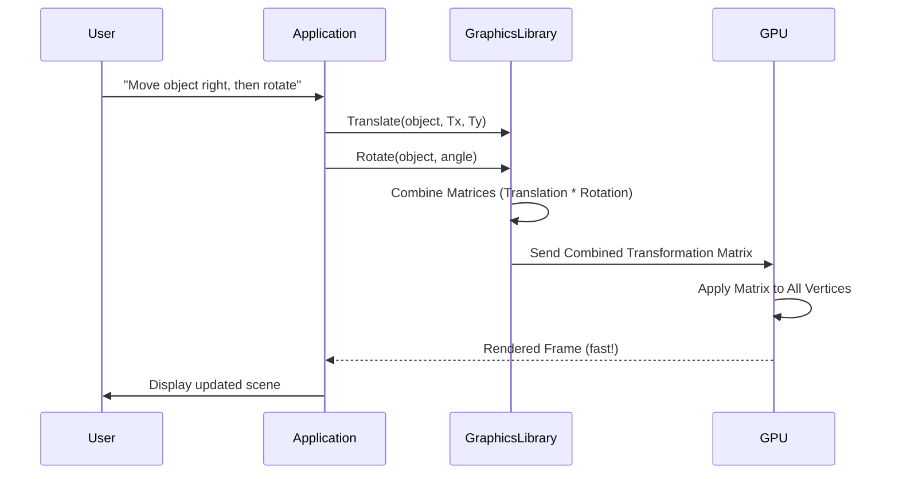

# Chapter 5: 2D Geometric Transformations

Welcome to Chapter 5! In this section, we'll dive into how we can move, resize, rotate, and reshape objects within our 2D computer graphics world. These "2D Geometric Transformations" are fundamental to creating dynamic scenes, animations, and interactive experiences.

Imagine drawing a square on a piece of paper. Now, imagine sliding it across the table, making it bigger, turning it, or even squishing it. These are exactly the kinds of operations we're talking about, but done mathematically on a computer.

At their core, these transformations take the coordinates of an object's vertices (points) and use mathematical formulas to calculate new coordinates, effectively changing the object's position, size, or orientation. While often simplified for beginners, the real magic happens behind the scenes with powerful mathematical tools like matrices.

Let's explore the key 2D transformations:

---

### 1. Translation (Moving an Object)

Translation is the simplest transformation. It involves moving an object from one location to another without changing its size or orientation.

To translate a point `(x, y)` by `Tx` units in the X-direction and `Ty` units in the Y-direction, the new coordinates `(x', y')` are:

`x' = x + Tx`
`y' = y + Ty`

For an entire object, you apply this formula to every single vertex that defines the object.

---

### 2. Scaling (Resizing an Object)

Scaling changes the size of an object. You can scale an object uniformly (maintaining its proportions) or non-uniformly (stretching or shrinking it more in one direction than another).

To scale a point `(x, y)` by `Sx` in the X-direction and `Sy` in the Y-direction (relative to the origin), the new coordinates `(x', y')` are:

`x' = x * Sx`
`y' = y * Sy`

-   If `Sx` and `Sy` are both greater than 1, the object gets larger.
-   If `Sx` and `Sy` are both between 0 and 1, the object gets smaller.
-   If `Sx` equals `Sy`, it's uniform scaling. Otherwise, it's non-uniform.

---

### 3. Rotation (Turning an Object)

Rotation involves turning an object around a fixed point, typically the origin `(0, 0)`. The angle of rotation determines how much the object turns.

To rotate a point `(x, y)` by an angle `θ` (theta) counter-clockwise around the origin, the new coordinates `(x', y')` are:

`x' = x * cos(θ) - y * sin(θ)`
`y' = x * sin(θ) + y * cos(θ)`

Remember that `θ` is usually in radians for mathematical functions.

---

### 4. Shearing (Skewing or Slanting an Object)

Shearing is a transformation that skews an object, as if one side is pushed while the opposite side stays put. It creates a slanting effect.

There are two common types of 2D shearing:

*   **X-Shear**: Shifts points horizontally based on their Y-coordinate.
    `x' = x + shx * y`
    `y' = y`
    Here, `shx` is the shearing factor along the X-axis.

*   **Y-Shear**: Shifts points vertically based on their X-coordinate.
    `x' = x`
    `y' = y + shy * x`
    Here, `shy` is the shearing factor along the Y-axis.

Let's look at how this might appear in a basic C graphics program:

```c
// Excerpt from 2d_shear_reflec_10.c
float xd[10], yd[10], X1[10], Y1[10];
int vertex; // Number of vertices in the object
float shx, shy; // Shearing factors

void shearX() {
    int i;
    for (i = 0; i < vertex; i++) {
        X1[i] = xd[i] + shx * yd[i]; // Apply X-shear formula
        Y1[i] = yd[i];               // Y-coordinate remains unchanged
    }
}

void shearY() {
    int i;
    for (i = 0; i < vertex; i++) {
        Y1[i] = yd[i] + shy * xd[i]; // Apply Y-shear formula
        X1[i] = xd[i];               // X-coordinate remains unchanged
    }
}
```
In this code, `xd` and `yd` store the original coordinates, and `X1`, `Y1` store the transformed coordinates after shearing.

---

### 5. Reflection (Mirroring an Object)

Reflection (or mirroring) creates a mirror image of an object across a specific axis or line.

Common reflections include:

*   **Reflection across the X-axis**: `x' = x`, `y' = -y`
    The X-coordinate stays the same, while the Y-coordinate is negated.
*   **Reflection across the Y-axis**: `x' = -x`, `y' = y`
    The Y-coordinate stays the same, while the X-coordinate is negated.

Here's a simplified look at how reflection functions could be structured:

```c
// Based on 2d_shear_reflec_10.c structure (conceptual)
float xd[10], yd[10], X1[10], Y1[10];
int vertex;

void reflectionX_axis() { // Reflect across X-axis
    int i;
    for (i = 0; i < vertex; i++) {
        X1[i] = xd[i];  // X-coordinate unchanged
        Y1[i] = -yd[i]; // Y-coordinate negated
    }
}

void reflectionY_axis() { // Reflect across Y-axis
    int i;
    for (i = 0; i < vertex; i++) {
        X1[i] = -xd[i]; // X-coordinate negated
        Y1[i] = yd[i];  // Y-coordinate unchanged
    }
}
```
*Note: The provided `2d_shear_reflec_10.c` snippet only showed `shearX` and `shearY`. The `reflectionX_axis` and `reflectionY_axis` functions are inferred based on standard definitions and the pattern established by the shearing functions.*

---

### The Power of Matrices (Briefly)

While we've looked at each transformation individually with separate formulas, in real computer graphics, these operations are usually performed using **matrix multiplication**. Each transformation (Translation, Scaling, Rotation, Shearing, Reflection) can be represented as a mathematical matrix.

The power of matrices lies in:
1.  **Efficiency**: Graphics hardware (GPUs) are highly optimized for matrix operations.
2.  **Combination**: You can combine multiple transformations into a single matrix. For example, rotate an object and then translate it by simply multiplying their respective transformation matrices together. This results in one final matrix that, when applied to an object's vertices, performs all the operations in one step.



---

### Conclusion

2D Geometric Transformations are essential tools for manipulating objects in computer graphics. By understanding Translation, Scaling, Rotation, Shearing, and Reflection, you gain the ability to create dynamic and interactive visual content. These operations, when combined and accelerated by graphics hardware using matrix mathematics, form the backbone of smooth animations and compelling graphical effects.

In the next chapter, we'll look at how we define the viewing area for our graphical scenes.

---

Generated by [AI Codebase Knowledge Builder]