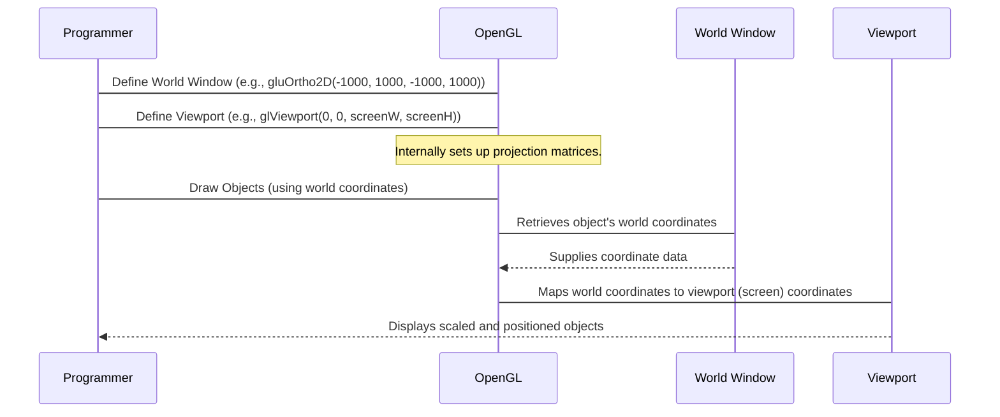

# Chapter 6: Viewport and Windowing

Welcome to Chapter 6! So far, we've learned how to draw shapes, fill areas, and even transform them in a virtual 2D world. But how does this virtual world translate to what you actually see on your screen? That's where **Viewport and Windowing** come in.

Imagine you're looking at a vast landscape through a physical window.
*   The **landscape** is your entire virtual drawing space, where all your objects exist in "world coordinates."
*   The **window frame** is like your "world window," defining which part of that vast landscape you're interested in viewing.
*   The **glass pane** of your window is your "viewport," a specific rectangular area on your screen where the selected part of the landscape will be displayed.

Viewport and windowing are fundamental concepts in computer graphics that allow you to control *what* is seen and *where* it is seen on the display.

## 6.1 Understanding World Coordinates and the World Window

When you define objects in your graphics program (like a square at `(100, 100)` or a circle centered at `(0, 0)`), you're using **world coordinates**. This is your application's own coordinate system, which can be anything you choose (e.g., pixels, meters, game units). It's a virtual space where your objects "live."

The **World Window** (sometimes called the "viewing volume" or "clipping window") is a rectangular region *within* your world coordinate system that you select to be visible. Anything outside this window will not be shown.

In OpenGL, you often define this world window using the projection matrix. For 2D graphics, `gluOrtho2D` is commonly used to set up an orthographic projection:

```c
void initt() {
    glClearColor(0, 0, 0, 0.0);
    glMatrixMode(GL_PROJECTION);
    // Defines a 2D world window from X=-1000 to X=1000, and Y=-1000 to Y=1000
    gluOrtho2D(-1000, 1000, -1000, 1000);
}
```
This line tells OpenGL: "My virtual world extends from `XMin = -1000` to `XMax = 1000` and `YMin = -1000` to `YMax = 1000`. This is the area I want to consider for display."

In the provided code, variables like `WXMax`, `WXMin`, `WYMax`, `WYMin` might be used to define or store the bounds of such a world window:
```c
float WXMax = 600, WXMin = 100, WYMax = 600, WYMin = 100;
```
These variables represent the boundaries of a desired world window (e.g., from `X=100` to `X=600` and `Y=100` to `Y=600`).

## 6.2 Understanding Viewport Coordinates and the Viewport

Once you've selected a portion of your virtual world with the world window, you need to tell the graphics system *where* on your physical screen this chosen view should appear. This display area on the screen is called the **Viewport**.

The viewport is a rectangular region defined in **screen coordinates** (usually pixels). It specifies the actual pixel area on your monitor where your graphics will be rendered.

In OpenGL, the `glViewport` function is used to define the viewport:
```c
// Example: Sets viewport to cover the entire window (0,0 to width,height)
glViewport(0, 0, windowWidth, windowHeight);

// Example: Sets viewport to a smaller square in the middle of the screen
// glViewport(100, 100, 200, 200); // (x, y, width, height)
```
The `glViewport` function takes four arguments: the x and y coordinates of the viewport's bottom-left corner, and its width and height, all in pixels relative to the display window.

The provided code defines variables for a potential viewport:
```c
float VXMax = 800, VXMin = 600, VYMax = 800, VYMin = 200;
```
These variables define a viewport that spans from `X=600` to `X=800` and `Y=200` to `Y=800` on the screen. If these were used with `glViewport`, the call would look something like `glViewport(VXMin, VYMin, VXMax - VXMin, VYMax - VYMin)`.

## 6.3 The Mapping Process: World to Viewport

The magic happens when the graphics library takes the objects defined in your **World Window** and scales/translates them to fit within your **Viewport**. This process ensures that no matter the size or aspect ratio of your screen, your objects are displayed correctly and consistently.

Here's a conceptual sequence of how this mapping works:



**How the mapping is done (conceptually):**

1.  **Normalization:** A point `(xw, yw)` from the world window `[WXMin, WXMax]` and `[WYMin, WYMax]` is first converted into a normalized device coordinate (NDC) system, typically ranging from -1 to +1 for both X and Y.
    *   `xn = (xw - WXMin) / (WXMax - WXMin)` (0 to 1 range)
    *   `yn = (yw - WYMin) / (WYMax - WYMin)` (0 to 1 range)
    *   Then, this `[0,1]` range is mapped to `[-1,1]` in NDC.
2.  **Viewport Transformation:** These normalized coordinates `(xn, yn)` are then scaled and translated to fit within the viewport `[VXMin, VXMax]` and `[VYMin, VYMax]` on the screen:
    *   `xv = VXMin + xn * (VXMax - VXMin)`
    *   `yv = VYMin + yn * (VYMax - VYMin)`

The graphics library handles all these calculations behind the scenes. Your role is to define the world window (what you want to see) and the viewport (where on the screen you want to see it).

## 6.4 Benefits of Viewport and Windowing

*   **Flexibility:** You can easily change the display area without altering your original object definitions.
*   **Resizing:** If your application window is resized, you can adjust the viewport to always fill the new window, or maintain a specific aspect ratio.
*   **Multiple Views:** You can define multiple viewports on the same screen, each showing a different part of your world or even the same part from a different "camera" angle (though multiple camera angles usually involve matrix manipulation in 3D).
*   **Zooming/Panning:** By changing the `WXMin`, `WXMax`, `WYMin`, `WYMax` of your world window, you can effectively zoom in/out or pan across your virtual world.
*   **Resolution Independence:** Your objects are defined in logical world coordinates, not pixels. This means they will scale appropriately when displayed on different screen resolutions.

## Summary

**Viewport and Windowing** are essential for bridging the gap between your abstract geometric definitions and the concrete pixels on your screen.

*   The **World Window** selects *what* part of your virtual world you want to display.
*   The **Viewport** defines *where* on the physical screen that selected content will be rendered.

By understanding and controlling these two concepts, you gain powerful control over how your graphics are presented to the user, ensuring your creations look good on any display.

---

Generated by [AI Codebase Knowledge Builder]