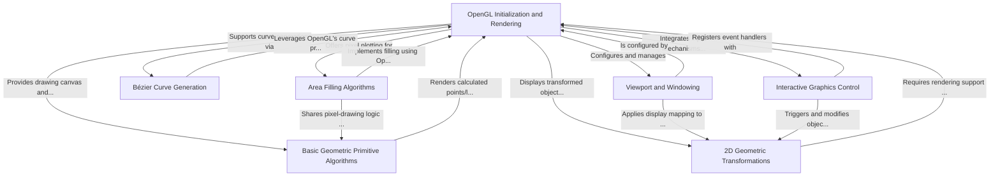

# Tutorial: Computer-Grahpics

The `Computer-Grahpics` project is a collection of fundamental computer graphics algorithms implemented using the OpenGL and GLUT libraries. It encompasses the entire pipeline from setting up the OpenGL rendering context and window management (Abstraction 0), to implementing basic geometric primitive algorithms like DDA and Bresenham for lines, and Midpoint algorithms for circles and ellipses (Abstraction 1). The project also features 2D geometric transformations (Abstraction 2) such as shearing, reflection, translation, scaling, and rotation, along with area filling algorithms like scanline for polygons (Abstraction 3). Furthermore, it includes Bézier curve generation (Abstraction 4), mechanisms for viewport and windowing transformations (Abstraction 5), and interactive control through keyboard and mouse inputs to manipulate the displayed graphics (Abstraction 6).

**Source Repository:** [https://github.com/010624/Computer-Grahpics](https://github.com/010624/Computer-Grahpics)

## Chapters

1. [OpenGL Initialization and Rendering
](01_opengl_initialization_and_rendering_.md)
2. [Basic Geometric Primitive Algorithms
](02_basic_geometric_primitive_algorithms_.md)
3. [Area Filling Algorithms
](03_area_filling_algorithms_.md)
4. [Bézier Curve Generation
](04_bézier_curve_generation_.md)
5. [2D Geometric Transformations
](05_2d_geometric_transformations_.md)
6. [Viewport and Windowing
](06_viewport_and_windowing_.md)
7. [Interactive Graphics Control
](07_interactive_graphics_control_.md)

---

Generated by [AI Codebase Knowledge Builder]