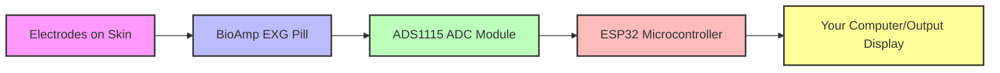

# Chapter 1: Hardware Platform (ESP32-based)

Welcome to the exciting world of the `Eog-Data` project! Before we can start analyzing eye movements or even thinking about fancy algorithms, we need something physical to actually *do* the work. Imagine building a robot: you need its body, its brain, and its sensors first, right? That's exactly what our "Hardware Platform" is all about!

### Why Do We Need a Hardware Platform?

Think about our main goal: we want to understand eye movements to help detect conditions like lazy eye. To do this, we need to *measure* what the eyes are doing. How do you measure something that's happening inside a human body? You need special electronic tools!

The Hardware Platform is the essential collection of electronic components that make our project physically possible. It's like the nervous system of our project, where different parts work together to capture data from your body and prepare it for analysis.

For example, if you want to detect a simple blink, you can't just tell a computer "detect a blink." You need a way to sense the tiny electrical signals generated by eye muscle movements. This platform provides that capability.

### The Brain and Body of Our Project

Our hardware platform is built around a powerful little device called the **ESP32 microcontroller**. Let's break down the key parts of this platform:

#### 1. The Brain: ESP32 Microcontroller

Imagine the ESP32 as the mini-computer or the "brain" of our project. It's a small chip that can run programs (the code we write!), control other electronic parts, and even connect to Wi-Fi or Bluetooth. For our `Eog-Data` project, the ESP32's job is to:

*   Receive data from our sensors.
*   Run the special analysis model (which we'll learn about in [Chapter 4: EOG Signal Analysis Model (TFLite)](04_eog_signal_analysis_model__tflite__.md)).
*   Send out the results.

It's truly the central hub where all the important decisions and data processing happen.

#### 2. The Sensor: BioAmp EXG Pill

To capture those tiny electrical signals from eye movements, we use a special sensor called the **BioAmp EXG Pill**. Think of it as a very sensitive microphone for your body's electrical activity.

*   **What it does:** It measures extremely small electrical signals that your muscles (including those around your eyes) produce when they move. These signals are called "bio-potential" signals.
*   **Why a "Pill"?** It's small and compact, designed to be easily integrated into projects.
*   **Important Note:** The signals it picks up are super tiny, like whispers. The BioAmp EXG Pill also acts as a mini-amplifier, making these whispers loud enough to be heard by other electronics.

#### 3. The Translator: ADS1115 16-bit ADC Module

Even though the BioAmp EXG Pill amplifies the signals, they are still "analog" signals. This means they are continuous, wave-like electrical changes, like the sound waves your voice makes. The ESP32 (our "brain") primarily understands "digital" signals – numbers, like 0s and 1s, or specific voltage levels.

This is where the **ADS1115 ADC (Analog-to-Digital Converter) Module** comes in. Think of it as a super-fast translator or a magnifying glass:

*   **Translator:** It takes the analog (wave-like) signals from the BioAmp EXG Pill and converts them into digital numbers that the ESP32 can easily understand and process.
*   **Magnifying Glass:** It's a "16-bit" ADC, which means it can make incredibly precise measurements, picking up even the slightest changes in the signal. This precision is crucial for detecting subtle eye movements.

### Putting It All Together: How They Connect

These three main components don't just float around; they need to be connected properly to work as a unified platform. This is often done using a **breadboard** (like an electronic LEGO baseplate for temporary connections) and jumper wires, as mentioned in the project's `README.md`.

Here’s a simplified look at how they connect:



This diagram shows the flow of information:
1.  **Electrodes on Skin:** These are like tiny antennae that pick up the body's electrical signals.
2.  **BioAmp EXG Pill:** Amplifies these tiny signals.
3.  **ADS1115 ADC Module:** Converts the amplified analog signals into digital numbers.
4.  **ESP32 Microcontroller:** Receives these digital numbers, processes them, and makes decisions.
5.  **Your Computer/Output Display:** The ESP32 sends the processed results here for you to see.

### Under the Hood: The Data Flow

Let's trace a single eye movement signal through our hardware platform to see what happens step-by-step:

1.  **Signal Generation:** When your eye moves, tiny muscles contract, creating a very faint electrical signal on your skin.
2.  **Capture and Amplification:** Electrodes placed near your eyes (connected to the BioAmp EXG Pill) pick up this faint signal. The BioAmp EXG Pill immediately amplifies it, making it stronger but still in analog form.
3.  **Analog-to-Digital Conversion:** The amplified analog signal travels from the BioAmp EXG Pill to the ADS1115 ADC Module. The ADS1115 then rapidly samples this continuous signal, turning each sample into a precise digital number.
4.  **Digital Data Transfer:** The ADS1115 sends these digital numbers to the ESP32. This communication usually happens over a standard connection called I2C, which is like a tiny digital highway between chips.
5.  **Processing and Action:** The ESP32 receives these numbers and uses them to understand the eye movement. It might then run an analysis model or prepare the data for further steps, as described in [Chapter 5: Output Handling](05_output_handling_.md).

Here's a conceptual code snippet that shows how the ESP32 would start talking to the ADS1115:

```cpp
// File: main_sketch.ino (simplified example)
#include <Wire.h> // This library allows ESP32 to "talk" to ADS1115

void setup() {
  Serial.begin(115200); // Start communicating with your computer (for messages)
  Wire.begin();         // Initialize the I2C communication.
                        // This prepares the ESP32 to send and receive data
                        // to devices like the ADS1115, which are connected
                        // via the SDA and SCL pins.

  Serial.println("Hardware Platform is ready to listen for eye movements!");
  // More ADS1115 setup would go here, like setting its address and gain.
  // We'll dive into those details in the next chapter!
}

void loop() {
  // In this loop, we would continuously read data from the ADS1115.
  // But that's for the next chapter!
}
```

In this code, `Wire.begin();` is super important. It initializes the "digital highway" (I2C) so that our ESP32 can send commands to the ADS1115 and receive the translated digital data back. The `Serial.println` line is just for us, the developers, to see messages on our computer to know things are working!

### Conclusion

You've just taken your first step into understanding the backbone of the `Eog-Data` project! You learned that the "Hardware Platform" is the physical collection of parts that makes everything else possible. We met the **ESP32** (the brain), the **BioAmp EXG Pill** (the sensitive eye movement sensor), and the **ADS1115 ADC** (the crucial translator). You also saw how these components connect and work together to get raw eye movement signals into a digital format that our ESP32 can understand.

Now that we have our physical setup understood, the next logical step is to actually *collect* the data from it! In the next chapter, we'll dive into how we acquire eye movement data using this hardware platform.

[Next Chapter: Eye Movement Data Acquisition](02_eye_movement_data_acquisition_.md)

---

Generated by [AI Codebase Knowledge Builder]