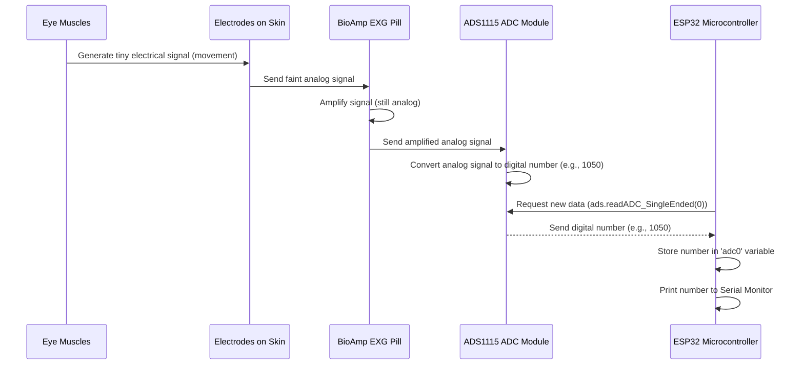

# Chapter 2: Eye Movement Data Acquisition

Welcome back, future eye movement expert! In [Chapter 1: Hardware Platform (ESP32-based)](01_hardware_platform__esp32_based__.md), we explored the physical brain (ESP32), sensitive microphone (BioAmp EXG Pill), and translator (ADS1115 ADC) that form the backbone of our `Eog-Data` project. You now understand *what* components we have. But how do we actually *use* them to get information about eye movements?

### The Heartbeat of Our Project: Capturing Eye Signals

Imagine you want to take a picture or record a sound. First, you need to open your camera or microphone app and hit "record," right? Similarly, for our project, if we want to detect something like "lazy eye," we first need to continuously "record" the raw electrical activity generated by the eyes. This process of capturing these raw eye movement signals is called **Eye Movement Data Acquisition**.

Think of it like setting up a specialized camera and microphone system, but for your eyes. Instead of pictures or sounds, we're detecting tiny electrical changes caused by eye movements. This is the crucial first step. If we don't acquire this raw data accurately, everything else – detecting blinks, saccades (quick eye jumps), or running analysis models – becomes impossible.

Our goal in this chapter is to understand how we set up our hardware platform to *continuously capture* these tiny electrical signals and turn them into numbers our ESP32 can understand.

### How Our Hardware Captures Eye Movements

Let's quickly revisit our key components and see how they work together specifically for data acquisition:

1.  **Electrodes (The "Antennae"):** These are placed on the skin around your eyes. They are like tiny antennae that pick up the extremely faint electrical signals your eye muscles produce when they move or blink.
2.  **BioAmp EXG Pill (The "Amplifier"):** Remember, these signals are like whispers. The BioAmp EXG Pill takes these whispers and amplifies them into a signal that's strong enough for other electronics to notice. It's still an "analog" signal at this point, meaning it's a continuous electrical wave.
3.  **ADS1115 ADC Module (The "Translator"):** Our ESP32 "brain" speaks a digital language (numbers like 0s and 1s). The ADS1115 acts as a super-precise translator. It takes the amplified analog signal from the BioAmp EXG Pill and rapidly converts it into a stream of digital numbers.
4.  **ESP32 Microcontroller (The "Receiver"):** The ESP32 constantly "listens" to the ADS1115, receiving these digital numbers. Once it has these numbers, it can then begin to process them.

The core idea here is to get a *stream of numbers* that represent the electrical activity around the eyes over time.

### Getting the Raw Data: Our First Code Snippet

Now, let's see how our ESP32 tells the ADS1115 to continuously read these signals. In [Chapter 1](01_hardware_platform__esp32_based__.md), we saw how `Wire.begin();` sets up the communication line. Now, we need to actually *read* data.

We'll use a library for the ADS1115 to make things easier. This library provides simple commands to talk to the chip.

First, let's add the necessary library and set up our ADS1115:

```cpp
#include <Wire.h> // For I2C communication
#include <Adafruit_ADS1X15.h> // Library for ADS1115

Adafruit_ADS1115 ads; // Create an object for the ADS1115

void setup() {
  Serial.begin(115200);
  Wire.begin();

  Serial.println("Initializing ADS1115...");
  // This sets up the ADS1115 to work with our BioAmp EXG Pill.
  // It's like tuning a radio to the correct frequency.
  if (!ads.begin()) {
    Serial.println("Failed to initialize ADS!");
    while (1); // Stop here if it fails
  }
  // Set the gain to maximize sensitivity for small bio-signals.
  // This is like increasing the microphone's sensitivity.
  ads.setGain(GAIN_ONE); // 1x gain +/- 4.096V
                         // (This setting allows us to read very small voltage changes)
  Serial.println("ADS1115 initialized and ready!");
}

void loop() {
  // We'll put our continuous reading code here!
}
```

In the `setup()` function:
*   `#include <Adafruit_ADS1X15.h>`: This line tells our code that we'll be using a special set of tools (functions) to talk to the ADS1115.
*   `Adafruit_ADS1115 ads;`: This creates a special "object" named `ads` that we'll use to interact with our ADS1115 module.
*   `if (!ads.begin())`: This command *starts* the ADS1115. If it doesn't start properly, the program will halt and tell us.
*   `ads.setGain(GAIN_ONE);`: This is important! The BioAmp EXG Pill amplifies signals, but the ADS1115 can *also* amplify them further. Setting the `GAIN_ONE` (which means a 1x gain internally, but allows measuring a wide range of voltages from -4.096V to +4.096V with high resolution) ensures we can capture the very tiny eye signals with precision. It's like setting the sensitivity of our translator.

### Continuously Reading Data

Now that our ADS1115 is initialized, the real work of data acquisition happens in the `loop()` function. This function runs over and over again, allowing us to continuously read the eye signals.

```cpp
// (Previous setup() code goes here)

void loop() {
  // Read the analog value from channel 0 of the ADS1115.
  // This is where the actual "data acquisition" happens!
  int16_t adc0 = ads.readADC_SingleEnded(0);

  // Print the raw digital value to our computer's serial monitor.
  Serial.print("Raw Eye Signal: ");
  Serial.println(adc0);

  // A small delay to avoid reading too fast, which can overload the serial port.
  // In a real-time system, this delay might be removed or adjusted.
  delay(10);
}
```

In this `loop()`:
*   `int16_t adc0 = ads.readADC_SingleEnded(0);`: This is the core line!
    *   `ads.readADC_SingleEnded(0)`: This command tells our `ads` object (which represents the ADS1115) to read the voltage from its input channel `0`. The BioAmp EXG Pill is connected to this channel. The ADS1115 performs its super-precise translation and returns a digital number.
    *   `int16_t adc0`: This declares a variable named `adc0` to store the digital number we just read. `int16_t` means it's a 16-bit integer, capable of storing a wide range of positive and negative numbers, reflecting the precision of the ADS1115.
*   `Serial.print("Raw Eye Signal: "); Serial.println(adc0);`: We print this raw number to the Serial Monitor (the window on your computer where the ESP32 can send messages). This allows us to see the data stream in real-time.
*   `delay(10);`: This pauses the program for 10 milliseconds. This is a simple way to control how fast we read data and prevent our `Serial.print` from overflowing.

**Example Output:**

When you run this code, your Serial Monitor would show a continuous stream of numbers, something like this:

```
Raw Eye Signal: 1024
Raw Eye Signal: 1025
Raw Eye Signal: 1020
Raw Eye Signal: 1050  <-- Maybe a slight eye twitch here
Raw Eye Signal: 1100  <-- Maybe a tiny blink starting
Raw Eye Signal: 1500  <-- Peak of a blink
Raw Eye Signal: 1100  <-- Blink ending
Raw Eye Signal: 1030
Raw Eye Signal: 1028
Raw Eye Signal: 1027
...
```

These numbers are the *raw eye movement data*. They don't tell us "blink!" or "saccade!" yet, but they show the tiny electrical changes. A change from `1024` to `1500` indicates a significant electrical event, likely a blink. A rapid jump and fall might be a saccade.

### Under the Hood: The Data Acquisition Flow

Let's visualize the journey of an eye movement signal from your body to a digital number inside the ESP32:



Here's what's happening step-by-step with the code we just wrote:

1.  **Eye Movement:** Your eye muscles move, generating a very subtle electrical signal on your skin.
2.  **Capture & Amplify (BioAmp):** The electrodes pick up this faint analog signal. The [BioAmp EXG Pill](01_hardware_platform__esp32_based__.md) immediately amplifies it, making it stronger but still an analog (wave-like) electrical signal.
3.  **Translate (ADS1115):** The amplified analog signal goes into channel 0 of the [ADS1115 ADC Module](01_hardware_platform__esp32_based__.md).
    *   Inside the `loop()` function, the ESP32's `ads.readADC_SingleEnded(0)` command tells the ADS1115: "Hey, read what's on your channel 0 and give me the digital number."
    *   The ADS1115 quickly measures the voltage at that instant and converts it into a precise 16-bit digital number (e.g., `1050`).
4.  **Receive & Store (ESP32):** The ADS1115 sends this digital number back to the [ESP32 Microcontroller](01_hardware_platform__esp32_based__.md) through the I2C digital highway. The ESP32 stores this number in the `adc0` variable.
5.  **Observe:** The `Serial.println(adc0);` command then sends this number from the ESP32 to your computer's Serial Monitor, allowing you to see the raw data being acquired in real-time.

This entire sequence repeats many times per second thanks to the `loop()` function, giving us a continuous stream of data.

### Conclusion

You've just learned the fundamental process of **Eye Movement Data Acquisition**! You now understand how the combined power of the BioAmp EXG Pill, ADS1115 ADC, and ESP32 microcontroller works to transform tiny electrical signals from your eye muscles into a stream of digital numbers. This raw numerical data is the foundation for everything else we do in the `Eog-Data` project. Without this accurate acquisition, we couldn't detect blinks, saccades, or analyze any eye movement patterns.

Now that we know how to *get* the raw data, the next exciting step is to understand what these numbers actually *mean* in terms of eye movements. In the next chapter, we'll dive into how these raw numbers reveal distinct [Eye Movement Patterns (EOG Data)](03_eye_movement_patterns__eog_data__.md).

[Next Chapter: Eye Movement Patterns (EOG Data)](03_eye_movement_patterns__eog_data__.md)

---

Generated by [AI Codebase Knowledge Builder]