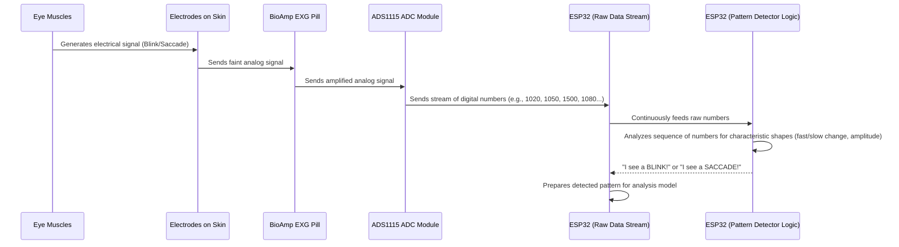

# Chapter 3: Eye Movement Patterns (EOG Data)

Welcome back, intrepid explorer of eye movements! In [Chapter 1: Hardware Platform (ESP32-based)](01_hardware_platform__esp32_based__.md), we built our electronic "eye" and "brain." Then, in [Chapter 2: Eye Movement Data Acquisition](02_eye_movement_data_acquisition_.md), we learned how to actually *collect* the raw electrical signals from eye movements, turning them into a stream of digital numbers.

You saw lines of numbers like `1024`, `1050`, `1500`, and then back to `1028`. These numbers are like a secret code. But what do they *mean*? How do we go from a stream of numbers to actually understanding what the eye is doing? That's exactly what we'll uncover in this chapter!

### The "Language" Your Eyes Speak: Eye Movement Patterns

Imagine you're listening to a radio, and all you hear is static. Then, suddenly, a clear voice or a melody emerges from the noise. Those voices and melodies are the "patterns" in the static.

Similarly, the raw electrical signals we acquire are like that static. Our goal with the `Eog-Data` project is to decipher the "language" of the eyes from this electrical activity. This "language" is made up of distinct **Eye Movement Patterns**.

Understanding these patterns is not just cool; it's essential! For our project, these patterns are the key to inferring conditions like lazy eye (amblyopia). If we can "read" the patterns accurately, we can detect irregularities and potentially help with early intervention.

### What is EOG Data?

The raw electrical signals we captured in Chapter 2 are formally known as **EOG Data**, which stands for **Electrooculography**. It's a fancy name for measuring the electrical potential changes generated by eye movements.

When your eye moves, the muscles around it create tiny electrical signals. Because the eye itself acts like a tiny battery (the front of the eye is generally more positive than the back), its movement changes the electrical field around it. Our electrodes pick up these changes, and our hardware converts them into the digital numbers you saw.

These digital numbers, when plotted over time, create characteristic "shapes" or patterns. Let's look at the two most important ones for our project:

#### 1. Saccades: The Quick Jumps

Have you ever noticed your eyes don't smoothly scan a page when you read? Instead, they make tiny, rapid jumps from one word to the next. These quick, jerky movements are called **saccades**. They happen when your gaze shifts from one point of interest to another.

*   **What it looks like in EOG Data:** When your eye makes a saccade, the electrical signal changes very rapidly. You'll see a sharp, quick spike upwards or downwards in our raw data numbers, followed by a rapid return. The direction (up or down) depends on whether your eye moved left/right or up/down, and the orientation of your electrodes.

    ```
    Raw Eye Signal: 1025
    Raw Eye Signal: 1030
    Raw Eye Signal: 1028
    Raw Eye Signal: 1150  <-- Eye starts to jump!
    Raw Eye Signal: 1300  <-- Mid-saccade
    Raw Eye Signal: 1100  <-- Saccade ending
    Raw Eye Signal: 1035
    Raw Eye Signal: 1027
    ```
    In this example, the numbers rapidly jumped from around `1025` to `1300` and back, indicating a saccade.

#### 2. Blinks: The Momentary Closures

This one is probably the easiest to understand! A **blink** is when you briefly close and open your eyelids.

*   **What it looks like in EOG Data:** Blinks tend to produce a much larger and often slower change in the electrical signal compared to saccades. They usually appear as a significant, often broader, peak or trough in the raw data numbers.

    ```
    Raw Eye Signal: 1024
    Raw Eye Signal: 1020
    Raw Eye Signal: 1050
    Raw Eye Signal: 1200  <-- Blink starting
    Raw Eye Signal: 1500  <-- Peak of the blink
    Raw Eye Signal: 1700  <-- Still blinking!
    Raw Eye Signal: 1550  <-- Blink ending
    Raw Eye Signal: 1250
    Raw Eye Signal: 1080
    Raw Eye Signal: 1030
    ```
    Here, the numbers climbed significantly higher to `1700` and then gradually returned, showing a typical blink pattern.

### How Our EOG Data Reveals These Patterns

Let's look at the `signal.png` image mentioned in the `README.md` file. This image visually represents these very patterns.


This graph shows how the raw numbers from our [ADS1115 ADC Module](01_hardware_platform__esp32_based__.md) would look when plotted over time.

*   Notice the large, rounded "hills" in the signal? Those are likely **blinks**.
*   See the smaller, sharper, quicker "spikes" or "bumps" that go up and down quickly? Those are **saccades**.

The smooth parts in between these events represent periods where the eye is relatively still, or making very small, slow movements (like drifts).

### Under the Hood: From Raw Numbers to Recognized Patterns

So, how does our `Eog-Data` system, especially the [ESP32 Microcontroller](01_hardware_platform__esp32_based__.md), actually *recognize* these patterns from the stream of numbers we get from [Chapter 2: Eye Movement Data Acquisition](02_eye_movement_data_acquisition_.md)?

It's like our ESP32 is a detective, constantly watching the incoming numbers for clues (the characteristic shapes).

Here's a simplified step-by-step walkthrough:

1.  **Continuous Data Stream:** The [ESP32 Microcontroller](01_hardware_platform__esp32_based__.md) continuously receives new digital numbers from the [ADS1115 ADC Module](01_hardware_platform__esp32_based__.md), as described in [Chapter 2](02_eye_movement_data_acquisition_.md).
2.  **Looking for Change:** The ESP32 doesn't just look at one number; it looks at a sequence of numbers over a very short time. It's interested in how fast and how much the numbers are changing.
3.  **Pattern Matching (Conceptual):**
    *   If the numbers suddenly jump *very high* or *very low* and then return, it's a strong candidate for a **blink**.
    *   If the numbers show a *rapid but less extreme* jump up or down, followed by a quick return, it's a strong candidate for a **saccade**.
    *   This is often done using techniques that analyze the signal's speed of change (like derivatives) and its amplitude (how big the change is).

Let's visualize this conceptual flow:



While we don't have a simple 10-line code snippet for complex pattern detection here (that's where machine learning in [Chapter 4](04_eog_signal_analysis_model__tflite__.md) comes in!), you can imagine a simplified conceptual check that might look at the *difference* between consecutive readings:

```cpp
// (Inside your loop() function after reading adc0)
// This is a very simplified, conceptual example to illustrate the idea!
const int THRESHOLD_BLINK = 400; // A large change for a blink
const int THRESHOLD_SACCADE = 100; // A smaller, rapid change for a saccade

static int lastAdcValue = 0; // Stores the previous reading
int currentAdcValue = ads.readADC_SingleEnded(0); // Current reading

int difference = abs(currentAdcValue - lastAdcValue); // How much did it change?

if (difference > THRESHOLD_BLINK) {
  Serial.println(">>> POTENTIAL BLINK DETECTED! <<<");
} else if (difference > THRESHOLD_SACCADE) {
  Serial.println("--- SACCADE LIKELY! ---");
}

lastAdcValue = currentAdcValue; // Update for the next comparison
delay(10); // Don't read too fast!
```

This conceptual code snippet shows that by comparing the current reading with the last one (`difference`), we can start to get an idea of how much and how fast the eye signal is changing. A big `difference` might mean a blink, while a smaller but still significant `difference` could indicate a saccade. Real-world detection is more sophisticated, involving multiple data points and filtering, but the core idea is to look for these changes and shapes.

### Conclusion

You've just taken a massive step in understanding the "heart" of the `Eog-Data` project! You learned that the raw electrical numbers we collect are called **EOG Data**, and within this data, there are distinct **Eye Movement Patterns** like **saccades** (quick jumps) and **blinks** (momentary closures). You also saw how these patterns appear as characteristic shapes in the data and how our ESP32 conceptually processes these numbers to identify them.

These recognized patterns are more than just interesting observations; they are the fundamental input for detecting conditions like lazy eye. Now that we know how to identify these patterns, the next exciting challenge is to actually *analyze* them to make informed decisions. In the next chapter, we'll dive into the advanced topic of the [EOG Signal Analysis Model (TFLite)](04_eog_signal_analysis_model__tflite__.md), where we'll explore how machine learning helps our ESP32 interpret these patterns for diagnostic purposes.

[Next Chapter: EOG Signal Analysis Model (TFLite)](04_eog_signal_analysis_model__tflite__.md)

---

Generated by [AI Codebase Knowledge Builder]