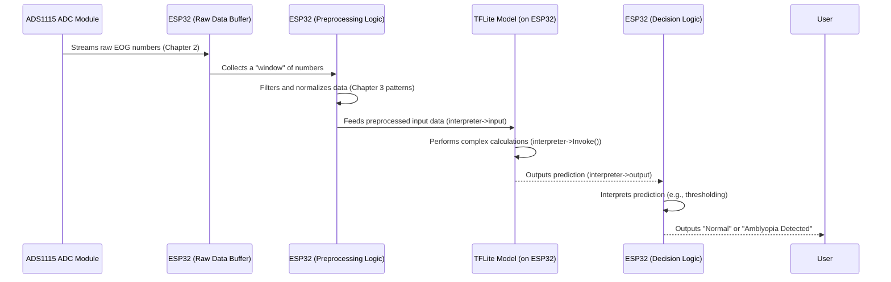

# Chapter 4: EOG Signal Analysis Model (TFLite)

Welcome back, future EOG data expert! In [Chapter 3: Eye Movement Patterns (EOG Data)](03_eye_movement_patterns__eog_data__.md), we learned how to identify fascinating patterns like **saccades** (quick eye jumps) and **blinks** from the raw electrical signals picked up by our [Hardware Platform (ESP32-based)](01_hardware_platform__esp32_based__.md). You can now look at a graph of EOG data and say, "Aha! That's a blink!"

But here's the tricky part: just seeing a blink or a saccade isn't enough to tell us if someone has a condition like lazy eye (amblyopia). We need an "expert" to look at these patterns and decide if they are "normal" or if they show signs of a problem. That's exactly where the **EOG Signal Analysis Model** comes in!

### The Brain on Our ESP32: Making Sense of Patterns

Imagine you're trying to learn the difference between a normal dog bark and a warning bark from a guard dog. You'd listen to many examples, and eventually, you'd recognize the subtle differences. Our project needs to do something similar, but for eye movement patterns.

The problem: Our [ESP32 Microcontroller](01_hardware_platform__esp32_based__.md) can collect data and see patterns, but it doesn't inherently "know" what a "healthy" eye movement pattern looks like versus a pattern that might suggest lazy eye. We can't just write simple `if/else` rules for something so complex.

The solution: We give our ESP32 a tiny, super-smart "brain" – a **pre-trained machine learning model**. Think of it as a miniature expert that has already studied thousands of eye movement patterns from both healthy eyes and eyes with conditions like amblyopia. Its job is to take the patterns we detect (like a specific saccade or a series of blinks) and give us a prediction: "This looks like a normal eye" or "This pattern suggests lazy eye."

This is the "brain" of our analysis system, performing real-time pattern recognition right on our small device.

### Key Concepts: Understanding Our Tiny Expert

Let's break down the important ideas behind this "brain":

#### 1. Machine Learning (ML)

Machine Learning is a way to teach computers to learn from data, instead of being explicitly programmed for every possible scenario.

*   **Analogy:** Imagine teaching a child to recognize a cat. You don't give them a list of rules like "if it has pointy ears, four legs, and a tail, it's a cat." Instead, you show them many pictures of cats and dogs, and eventually, they learn to tell the difference themselves.
*   **For EOG Data:** We show the computer thousands of EOG patterns that are "normal" and thousands that are from "lazy eyes." The ML model then learns the subtle characteristics that distinguish one from the other.

#### 2. Pre-trained Model

Our ML model isn't learning *on* the ESP32. That would take too much power and time. Instead, it's a **pre-trained model**.

*   **Analogy:** It's like buying a highly educated doctor who already has years of experience and knowledge. You don't have to send them to medical school; they're ready to start diagnosing.
*   **For EOG Data:** The training (the "learning" phase) happens on a powerful computer, where the model analyzes vast amounts of data. Once it's "smart enough," its learned knowledge is compressed into a small file. This small, expert "brain" file is then loaded onto our ESP32.

#### 3. TFLite (TensorFlow Lite)

TensorFlow is a popular and powerful library for building machine learning models. But full TensorFlow models can be very large and require a lot of computing power. That's not good for our tiny, power-efficient [ESP32 Microcontroller](01_hardware_platform__esp32_based__.md)!

This is where **TensorFlow Lite (TFLite)** comes in:

*   **Analogy:** Think of TFLite as a special "diet" version of a big, fancy software. It takes the core knowledge of the ML model and shrinks it down, making it super efficient to run on small devices like smartphones, microcontrollers, or our ESP32.
*   **For EOG Data:** TFLite allows us to take our sophisticated eye movement analysis model and embed it directly onto our ESP32. This means our system can analyze eye movements in real-time, on the device itself, without needing to send data to a cloud server or a powerful computer. It's fast, private, and works anywhere!

#### 4. Embedded on Device

The fact that this TFLite model runs directly on the ESP32 is a game-changer.

*   **Benefit 1: Real-time Analysis:** Decisions about eye movement patterns can be made instantly, as the data is collected.
*   **Benefit 2: Privacy:** No need to send sensitive eye movement data over the internet. All analysis happens locally.
*   **Benefit 3: Portability:** The system works anywhere, even without an internet connection.

### How Our ESP32 Uses the TFLite Model

Now, let's see conceptually how our ESP32 uses this expert TFLite model to analyze eye movement patterns.

**Use Case:** We want to take a short sequence of [EOG Data](03_eye_movement_patterns__eog_data__.md) (representing a saccade or a blink) and get a prediction: is it "Normal" or "Amblyopia"?

1.  **Data Collection:** The [ESP32 Microcontroller](01_hardware_platform__esp32_based__.md) continuously collects raw EOG data using the [BioAmp EXG Pill](01_hardware_platform__esp32_based__.md) and [ADS1115 ADC Module](01_hardware_platform__esp32_based__.md), as explained in [Chapter 2: Eye Movement Data Acquisition](02_eye_movement_data_acquisition_.md).
2.  **Pattern Preparation:** Instead of just printing raw numbers, the ESP32 now processes a small "window" or segment of these numbers that represent a specific eye movement pattern (like a few hundred milliseconds of data around a blink or saccade). This "window" of numbers becomes the input for our TFLite model.
3.  **Model Inference (The "Thinking"):** The ESP32 feeds this window of numbers into the loaded TFLite model. The model then "thinks" about these numbers based on everything it learned during its training.
4.  **Prediction Output:** The model outputs a prediction, typically as a probability score for each possible outcome (e.g., 95% chance of "Normal," 5% chance of "Amblyopia"). The ESP32 then interprets this.

Here's a simplified conceptual code snippet to illustrate loading and using the model:

```cpp
#include "tensorflow/lite/micro/all_ops_resolver.h"
#include "tensorflow/lite/micro/micro_interpreter.h"
#include "tensorflow/lite/micro/system_setup.h"
#include "tensorflow/lite/schema/schema_generated.h"

// The eye movement model is stored in an array in 'eogsignal/model.h'
#include "eogsignal/model.h"

// GLOBAL VARIABLES FOR THE MODEL (initialized once)
namespace {
  tflite::ErrorReporter* error_reporter = nullptr;
  const tflite::Model* model = nullptr;
  tflite::MicroInterpreter* interpreter = nullptr;
  TfLiteTensor* input = nullptr;
  TfLiteTensor* output = nullptr;

  // A small buffer for the model's internal calculations.
  // The size depends on the model.
  constexpr int kTensorArenaSize = 8 * 1024; // 8KB is a common starting point
  uint8_t tensor_arena[kTensorArenaSize];
}

void setup() {
  Serial.begin(115200);
  tflite::MicroSystemSetup(); // Initialize TFLite Micro

  // Set up logging.
  static tflite::MicroErrorReporter micro_error_reporter;
  error_reporter = &micro_error_reporter;

  // Load the pre-trained model from our `model.h` file.
  model = tflite::GetModel(eye_movement_model_tflite);
  if (model->version() != TFLITE_SCHEMA_VERSION) {
    error_reporter->Report("Model schema version mismatch!");
    while(1);
  }

  // Set up the operations the model needs.
  static tflite::AllOpsResolver resolver; // Includes all common ML operations

  // Create an interpreter to run the model.
  static tflite::MicroInterpreter static_interpreter(
      model, resolver, tensor_arena, kTensorArenaSize, error_reporter);
  interpreter = &static_interpreter;

  // Allocate memory for the model's tensors.
  TfLiteStatus allocate_status = interpreter->AllocateTensors();
  if (allocate_status != kTfLiteOk) {
    error_reporter->Report("AllocateTensors() failed!");
    while(1);
  }

  // Get pointers to the input and output tensors.
  input = interpreter->input(0);
  output = interpreter->output(0);

  Serial.println("EOG Analysis Model (TFLite) is ready!");
}

void loop() {
  // In this loop, we would:
  // 1. Acquire and preprocess EOG data (from Chapter 2 & 3).
  // 2. Populate the 'input' tensor with this data.
  // 3. Run inference: interpreter->Invoke();
  // 4. Read prediction from 'output' tensor.
  // We'll show these steps in detail below!
  delay(1000); // Simulate some work
}
```

This `setup()` code is the "startup ritual" for our TFLite model. It initializes the TensorFlow Lite Micro library, loads our pre-trained model (from the `eye_movement_model_tflite` array), and gets it ready to receive data and make predictions. The `tensor_arena` is a special memory space where the model does its calculations, like a workbench for our expert.

Now, let's look at the crucial part in `loop()`: actually using the model to analyze data.

```cpp
// (Previous setup() and global declarations go here)

// Placeholder for raw EOG data (e.g., a window of 256 readings)
// In a real scenario, this would come from the ADS1115 and preprocessing.
float sample_input_data[256]; // Assuming our model expects 256 float inputs

void loop() {
  // --- Step 1: Acquire and Preprocess EOG data ---
  // (Conceptual: Fill 'sample_input_data' with actual EOG patterns)
  // For demonstration, let's simulate a 'normal' pattern.
  for (int i = 0; i < 256; i++) {
    sample_input_data[i] = sin(i * 0.1) + 0.5; // A simple wave for "normal"
  }
  Serial.println("Simulating EOG data for analysis...");

  // --- Step 2: Populate the 'input' tensor ---
  // Copy our processed EOG data into the model's input buffer.
  for (int i = 0; i < input->bytes / sizeof(float); i++) {
    input->data.f[i] = sample_input_data[i];
  }

  // --- Step 3: Run Inference (Make a Prediction!) ---
  TfLiteStatus invoke_status = interpreter->Invoke();
  if (invoke_status != kTfLiteOk) {
    error_reporter->Report("Invoke failed!");
    return;
  }

  // --- Step 4: Read Prediction from 'output' tensor ---
  // Our model outputs a single float: 0 for Normal, 1 for Amblyopia (example)
  float prediction = output->data.f[0];

  Serial.print("Model Prediction: ");
  if (prediction < 0.5) { // Assuming a threshold of 0.5
    Serial.println("NORMAL EYE movement detected.");
  } else {
    Serial.println("POSSIBLE AMBLYOPIA pattern detected!");
  }

  delay(5000); // Wait 5 seconds before the next simulated analysis
}
```

In this `loop()`:
*   `sample_input_data`: This array is where we'd temporarily store a segment of our processed [EOG Data](03_eye_movement_patterns__eog_data__.md) before feeding it to the model.
*   `input->data.f[i] = sample_input_data[i];`: This line is crucial! It takes our prepared eye movement pattern (the numbers) and gives it to the TFLite model as its input.
*   `interpreter->Invoke();`: This is the moment the "brain" thinks! The TFLite model processes the input data.
*   `float prediction = output->data.f[0];`: After thinking, the model gives us its answer, stored in the `output` tensor. In this simplified example, we imagine a single number that tells us the likelihood of a condition.
*   The `if/else` checks this prediction to give a human-readable result.

**Example Output:**

```
EOG Analysis Model (TFLite) is ready!
Simulating EOG data for analysis...
Model Prediction: NORMAL EYE movement detected.
Simulating EOG data for analysis...
Model Prediction: POSSIBLE AMBLYOPIA pattern detected!
...
```

### Under the Hood: How the Tiny Brain Works

Let's visualize the entire process of how an eye movement pattern gets analyzed by our TFLite model.



Here's what's happening step-by-step:

1.  **Raw Data Stream:** Our [ADS1115 ADC Module](01_hardware_platform__esp32_based__.md) constantly sends digital numbers representing eye activity to the [ESP32 Microcontroller](01_hardware_platform__esp32_based__.md).
2.  **Windowing & Preprocessing:** The ESP32 gathers these numbers into small "windows" (e.g., 256 consecutive readings) that might contain an interesting eye movement pattern. It then cleans and prepares this data (e.g., filtering out noise, scaling the numbers) so the model can understand it – just like preparing ingredients for a chef.
3.  **Input to Model:** This prepared window of numbers is copied into the TFLite model's designated input area (the `input` tensor we saw in the code).
4.  **Inference:** The `interpreter->Invoke()` command tells the TFLite model to "think." Inside, the model uses its learned "rules" (weights and biases from its training) to process the input numbers through several mathematical layers. It's quickly comparing the input pattern to all the patterns it learned before.
5.  **Output Prediction:** The result of the model's thinking is placed in the `output` tensor. This is typically a numerical value (or values) representing its prediction.
6.  **Decision Making:** The ESP32's code then looks at this output. If the prediction value is below a certain threshold (e.g., 0.5), it might classify it as "Normal." If above, it could be "Amblyopia Detected."

#### The TFLite Model File (`eogsignal/model.h`)

You might have noticed the line `#include "eogsignal/model.h"` in the code. This is where our pre-trained TFLite model actually lives!

If you open the `eogsignal/model.h` file, you'll see a long, intimidating array of hexadecimal numbers:

```c++
// File: eogsignal/model.h (simplified snippet)
unsigned char eye_movement_model_tflite[] = {
  0x1c, 0x00, 0x00, 0x00, 0x54, 0x46, 0x4c, 0x33, 0x14, 0x00, 0x20, 0x00,
  // ... many, many more lines of numbers ...
  0x0c, 0x00, 0x00, 0x00, 0x09, 0x00, 0x00, 0x00
};
unsigned int eye_movement_model_tflite_len = 2904;
```

*   **`unsigned char eye_movement_model_tflite[]`**: This is our TFLite model, stored as a sequence of bytes (numbers from 0 to 255). It's essentially the highly compressed "brain" of our system.
*   **`0x1c, 0x00, ...`**: These hexadecimal numbers are the raw, encoded form of the model's structure, its learned patterns (weights), and other critical information. It's like a highly compressed instruction manual that the TFLite interpreter knows how to read and execute.
*   **`eye_movement_model_tflite_len = 2904;`**: This tells us how big the model is in bytes. For a microcontroller like the ESP32, a model of a few kilobytes is very efficient!

This raw array is then used by the TFLite Micro library to reconstruct the model's "brain" in the ESP32's memory, ready for inference.

### Conclusion

You've just unlocked the most intelligent part of the `Eog-Data` project: the **EOG Signal Analysis Model (TFLite)**! You learned that this is a pre-trained machine learning model, shrunk down using TensorFlow Lite, and embedded directly onto our [ESP32 Microcontroller](01_hardware_platform__esp32_based__.md). This "tiny expert" takes the [Eye Movement Patterns (EOG Data)](03_eye_movement_patterns__eog_data__.md) we've learned to identify and produces a real-time prediction, helping us differentiate between normal eye movements and those that might indicate conditions like lazy eye.

Now that our system can analyze eye movements and make predictions, the final step is to actually *do something* with those predictions! In the next chapter, we'll explore [Output Handling](05_output_handling_.md) – how we display results, trigger alerts, or even initiate tailored exercises based on the model's findings.

[Next Chapter: Output Handling](05_output_handling_.md)

---

Generated by [AI Codebase Knowledge Builder]