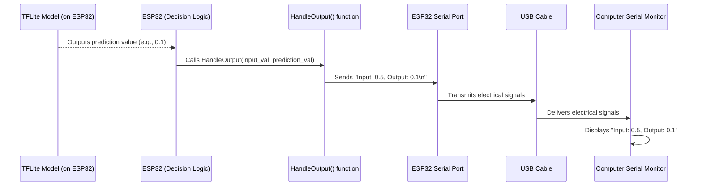

# Chapter 5: Output Handling

Welcome to the final exciting chapter of our `Eog-Data` project tutorial! So far, we've built our [Hardware Platform (ESP32-based)](01_hardware_platform__esp32_based__.md), learned how to [acquire eye movement data](02_eye_movement_data_acquisition_.md), understood the crucial [eye movement patterns](03_eye_movement_patterns__eog_data__.md), and finally, in [Chapter 4: EOG Signal Analysis Model (TFLite)](04_eog_signal_analysis_model__tflite__.md), we empowered our ESP32 with a tiny, smart brain to analyze these patterns and make predictions (like "Normal" or "Amblyopia detected").

But what good is a brilliant analysis if nobody hears the results? Imagine a detective solving a mystery but never telling anyone the answer! That's where **Output Handling** comes in.

### The Project's Voice: Communicating Findings

Our `Eog-Data` system is constantly "listening" to your eyes, "thinking" about what it sees, and making important "decisions" about eye movement patterns. Now, it needs a way to "speak" and share those findings with us.

**Output Handling** is simply how our project communicates its conclusions and provides feedback. Think of it as the project's **voice** or its **reporting system**. Right now, our system's voice is set up in a very direct and understandable way: it prints the analysis results to a **Serial Monitor**.

The central use case for Output Handling in our current setup is to **display the analysis results from our TFLite model to a computer screen**, so we can immediately see what the ESP32 has determined. For example, after analyzing an eye movement pattern, it might tell us: "Input: [some processed data], Output: NORMAL EYE movement detected."

This allows users or clinicians to understand and act upon the detected eye movement patterns. While currently simple, this component is super important because it's the bridge between the smart electronics and human understanding!

### Key Concepts: Understanding How Our Project "Speaks"

Let's break down the main ideas behind how our project communicates:

#### 1. The Message: Analysis Results

The primary "message" our system wants to send is the outcome of the [EOG Signal Analysis Model (TFLite)](04_eog_signal_analysis_model__tflite__.md). This could be a classification (e.g., "Normal" or "Amblyopia") or perhaps a processed value derived from the input data. The `output_handler.h` file mentioned in the project implies we're displaying both an "Input" value (`x`) and an "Output" value (`y`), where `y` is likely the model's prediction, and `x` could be a simplified representation of the EOG data segment it just analyzed.

#### 2. The Messenger: `Serial.print` and `Serial.println`

For microcontrollers like our [ESP32 Microcontroller](01_hardware_platform__esp32_based__.md), the most common and easiest way to send messages to a computer is using **Serial Communication**. This involves sending text data over a USB cable to a program called a **Serial Monitor** on your computer.

*   `Serial.print()`: This command sends text or numbers to the Serial Monitor. It keeps the cursor on the same line.
*   `Serial.println()`: This command is similar to `Serial.print()`, but after sending the text, it moves the cursor to the next line, just like pressing "Enter" on a keyboard.

These commands are like talking into a microphone that's connected directly to your computer.

#### 3. The Listener: The Serial Monitor

The **Serial Monitor** is a tool built into the Arduino IDE (the software we use to program the ESP32). It's a simple window that displays any messages sent by the `Serial.print()` or `Serial.println()` commands from our ESP32. It's our primary way to "listen" to what the ESP32 is saying.

### How to Use Output Handling: Displaying Our Findings

Let's see how we integrate Output Handling into our main program, especially after our TFLite model has made a prediction.

In [Chapter 4](04_eog_signal_analysis_model__tflite__.md), we had a conceptual `loop()` that made a `prediction` based on some `sample_input_data`. Now, we'll use a special function, `HandleOutput`, to display this information.

First, we need to include the `output_handler.h` file, which contains our `HandleOutput` function.

```cpp
// File: main_sketch.ino (conceptual)
// ... (includes from Chapter 4) ...
#include "eogsignal/output_handler.h" // Include our output handling function

// ... (global variables from Chapter 4) ...

void setup() {
  // ... (setup code from Chapter 4 for Serial, TFLite Micro, etc.) ...
  Serial.println("EOG Analysis Model (TFLite) is ready!");
  Serial.println("Ready to report findings!"); // New line for setup
}

// Placeholder for raw EOG data (e.g., a window of 256 readings)
float sample_input_data[256]; // Assuming our model expects 256 float inputs

void loop() {
  // --- Step 1: Acquire and Preprocess EOG data ---
  // (Conceptual: Fill 'sample_input_data' with actual EOG patterns)
  // For demonstration, let's simulate a 'normal' pattern.
  for (int i = 0; i < 256; i++) {
    sample_input_data[i] = sin(i * 0.1) + 0.5; // A simple wave for "normal"
  }

  // --- Step 2: Populate the 'input' tensor ---
  // ... (code to copy sample_input_data to TFLite input, from Chapter 4) ...

  // --- Step 3: Run Inference (Make a Prediction!) ---
  // ... (code to call interpreter->Invoke(), from Chapter 4) ...

  // --- Step 4: Read Prediction from 'output' tensor ---
  float prediction_value = output->data.f[0]; // The raw model output
  float simplified_input_value = sample_input_data[0]; // Let's just use the first sample as a simplified 'x'

  // --- Step 5: Handle Output! ---
  // Now we use our HandleOutput function to display the results!
  HandleOutput(simplified_input_value, prediction_value);

  // Instead of just printing the raw prediction, let's also give a human-readable interpretation.
  Serial.print("Interpretation: ");
  if (prediction_value < 0.5) { // Assuming a threshold of 0.5
    Serial.println("NORMAL EYE movement detected.");
  } else {
    Serial.println("POSSIBLE AMBLYOPIA pattern detected!");
  }

  delay(5000); // Wait 5 seconds before the next simulated analysis
}
```

In this updated `loop()`:
*   `#include "eogsignal/output_handler.h"`: This line ensures that our `HandleOutput` function is available to be called.
*   `HandleOutput(simplified_input_value, prediction_value);`: This is where we call our output handling function. We pass it two numbers: a `simplified_input_value` (just the first data point from our sample, for illustration) and the `prediction_value` from our TFLite model.
*   The `Serial.print` and `Serial.println` lines after `HandleOutput` are for providing a more user-friendly interpretation of the prediction.

**Example Output (in your computer's Serial Monitor):**

```
EOG Analysis Model (TFLite) is ready!
Ready to report findings!
Input: 0.5, Output: 0.1
Interpretation: NORMAL EYE movement detected.
Input: 0.5, Output: 0.8
Interpretation: POSSIBLE AMBLYOPIA pattern detected!
Input: 0.5, Output: 0.2
Interpretation: NORMAL EYE movement detected.
...
```

You can see how `HandleOutput` prints its specific format ("Input: x, Output: y"), and then our main loop adds further context. This makes the system's "voice" clear and informative!

### Under the Hood: How Output Handling Works

Let's trace the journey of a prediction from our TFLite model to your computer screen:



Here's a step-by-step breakdown:

1.  **Prediction Made:** After the [EOG Signal Analysis Model (TFLite)](04_eog_signal_analysis_model__tflite__.md) processes the eye movement data, it gives a numerical `prediction_value` to the [ESP32 Microcontroller](01_hardware_platform__esp32_based__.md).
2.  **Function Call:** Our main `loop()` function (the `ESP32 (Decision Logic)` in the diagram) takes this `prediction_value` and a `simplified_input_value` and calls the `HandleOutput()` function.
3.  **Sending Characters (Inside `HandleOutput`):** Inside the `HandleOutput()` function, the `Serial.print()` and `Serial.println()` commands prepare the text string ("Input: x, Output: y") character by character.
4.  **Serial Transmission:** The [ESP32 Microcontroller](01_hardware_platform__esp32_based__.md)'s internal "Serial Port" mechanism then converts these characters into a stream of electrical signals.
5.  **Physical Connection:** These electrical signals travel along the **USB Cable** that connects your ESP32 to your computer.
6.  **Display on Monitor:** Your computer receives these signals, and the **Serial Monitor** application translates them back into human-readable text, displaying them on your screen.

#### The `eogsignal/output_handler.h` File

The core of our current Output Handling is defined in the `eogsignal/output_handler.h` file. Let's look at its content:

```cpp
// File: eogsignal/output_handler.h
void HandleOutput(float x, float y) {
  Serial.print("Input: ");
  Serial.print(x);
  Serial.print(", Output: ");
  Serial.println(y);
}
```

*   **`void HandleOutput(float x, float y)`**: This declares a function named `HandleOutput`. It takes two floating-point numbers (`x` and `y`) as input. `void` means it doesn't return any value.
*   **`Serial.print("Input: ");`**: This prints the text "Input: " to the Serial Monitor.
*   **`Serial.print(x);`**: This prints the value of the `x` variable (our `simplified_input_value`) right after "Input: ".
*   **`Serial.print(", Output: ");`**: This prints the text ", Output: " after the `x` value.
*   **`Serial.println(y);`**: Finally, this prints the value of the `y` variable (our `prediction_value`) and then moves to a new line, so the next output starts clean.

This simple function neatly encapsulates our current way of reporting results. In a more advanced version of `Eog-Data`, this `HandleOutput` function might evolve to do much more, like generating custom exercises, displaying results on an OLED screen, sending data over Wi-Fi, or saving it to an SD card. But for now, its job is to give us clear, immediate feedback.

### Conclusion

You've successfully completed your journey through the `Eog-Data` project! In this chapter, you learned about **Output Handling**, understanding it as the project's voice that communicates analysis findings. We saw how the simple but effective `Serial.print()` and `Serial.println()` commands are used within the `HandleOutput()` function to display model predictions and related data on your computer's Serial Monitor. This allows us to "hear" what our smart ESP32 system has discovered about eye movement patterns.

From setting up the hardware to acquiring data, identifying patterns, analyzing them with a TFLite model, and finally reporting the results – you now have a foundational understanding of how the `Eog-Data` project works from end to end. This project provides a robust platform for detecting amblyopia and exploring further applications in eye health.

---

Generated by [AI Codebase Knowledge Builder]