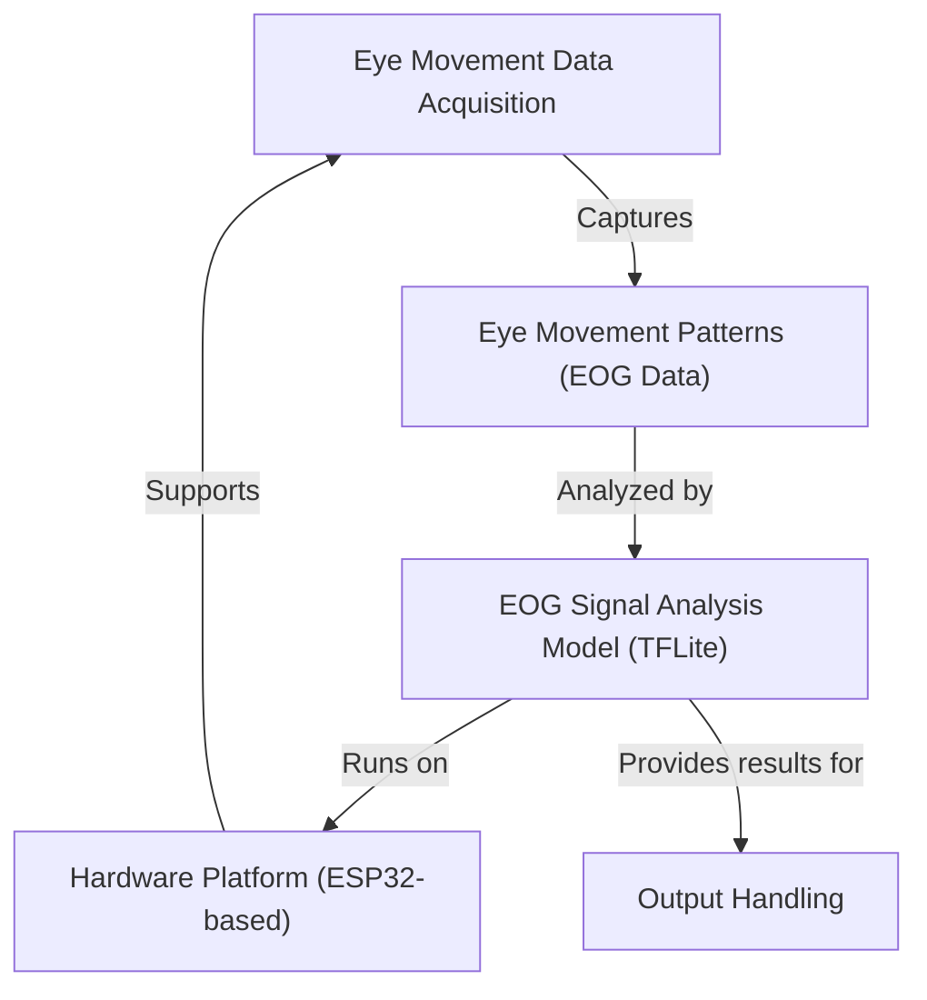

# Tutorial: Eog-Data

This project focuses on detecting *lazy eye (amblyopia)* by analyzing **eye movement patterns**. It uses an **ESP32-based hardware platform** to acquire raw EOG signals, which are then processed in real-time by an embedded **TFLite machine learning model** to identify irregularities. Finally, the system provides analysis results and can generate personalized exercises to address detected issues.

**Source Repository:** [https://github.com/Prathamesh282/Eog-Data](https://github.com/Prathamesh282/Eog-Data)

## Chapters

1. [Hardware Platform (ESP32-based)
](01_hardware_platform__esp32_based__.md)
2. [Eye Movement Data Acquisition
](02_eye_movement_data_acquisition_.md)
3. [Eye Movement Patterns (EOG Data)
](03_eye_movement_patterns__eog_data__.md)
4. [EOG Signal Analysis Model (TFLite)
](04_eog_signal_analysis_model__tflite__.md)
5. [Output Handling
](05_output_handling_.md)

---

Generated by [AI Codebase Knowledge Builder]