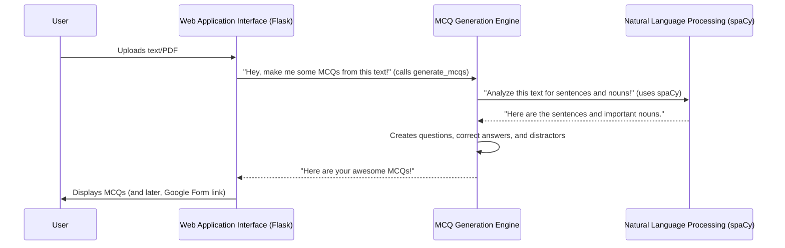

# Chapter 1: MCQ Generation Engine

Have you ever spent hours creating multiple-choice questions (MCQs) for a test or a study guide? Reading through pages of text, picking out important facts, and then coming up with believable wrong answers (distractors) can be a real headache! It's a time-consuming task that many students and teachers face regularly.

Imagine if you had an automated quiz master that could read any textbook or article and instantly create a custom quiz for you. That's exactly what the **MCQ Generation Engine** does for our project! It's the "brain" behind the operation, transforming ordinary text into engaging multiple-choice questions.

## What is the MCQ Generation Engine?

At its core, the MCQ Generation Engine is a smart system that understands text and figures out how to turn key information into questions. Think of it like this:

1.  **It reads your text:** Just like you would read a book.
2.  **It identifies important words:** It looks for key nouns (people, places, things, ideas) that could be good answers to questions.
3.  **It creates a question:** It takes a sentence, removes one of those important words, and puts a blank (`______`) in its place.
4.  **It finds the correct answer:** The word it removed becomes the correct answer.
5.  **It generates fake answers (distractors):** It finds other related words from the text to serve as plausible but incorrect options.
6.  **It shuffles everything:** It mixes up the correct answer and distractors so the position of the correct answer isn't always the same.

Let's look at a simple example from our project's `README.md` to see this in action:

**Input Text**:

```
The mitochondria is the powerhouse of the cell. It generates most of the cell's supply of ATP.
```

**What the Engine Does**:

*   It reads the first sentence.
*   It identifies "mitochondria" as a key noun.
*   It creates a question stem: "The ________ is the powerhouse of the cell."
*   "Mitochondria" is the correct answer.
*   It finds other nouns (or related words) from the text, or even uses placeholders, to create distractors like "nucleus," "ribosome," and "cytoplasm."
*   Finally, it shuffles them into a set of choices.

**Generated MCQ (Output)**:

```
Q: The ________ is the powerhouse of the cell.
A. nucleus
B. ribosome
C. mitochondria ✅
D. cytoplasm
```

This is the magic that our MCQ Generation Engine performs!

## How It Works (Behind the Scenes)

The MCQ Generation Engine is implemented as a Python function called `generate_mcqs`. This function takes the plain text you provide and the number of questions you want, then returns a list of ready-to-use MCQs.

Here's a simplified sequence of how our MCQ Generation Engine interacts with other parts of the system:



As you can see, the `MCQEngine` relies heavily on the `NLP` component to understand the text. We'll dive much deeper into [Natural Language Processing (NLP) with spaCy](05_natural_language_processing__nlp__with_spacy__.md) in a later chapter.

Let's look at the core of the `generate_mcqs` function, found in `project/app.py`:

```python
# project/app.py

import spacy
import random
# ... (other imports)

# We load a special language model from spaCy to understand text
nlp = spacy.load("en_core_web_sm")

def generate_mcqs(text: str, num_questions: int=5) -> list:
    # 1. First, the engine reads your text
    doc = nlp(text)

    # 2. It breaks the text into individual sentences
    sentences = [sent.text for sent in doc.sents]

    mcqs = [] # This list will hold all our generated questions

    # 3. It picks some sentences to turn into questions
    selected_sentences = random.sample(sentences, min(num_questions, len(sentences)))

    for sentence in selected_sentences:
        # 4. For each selected sentence, it finds the important words (nouns)
        sent_doc = nlp(sentence)
        nouns = [token.text for token in sent_doc if token.pos_ == "NOUN"]

        # If there are not enough nouns, it skips this sentence
        if len(nouns) < 2:
            continue

        # 5. It picks the main noun to be the correct answer
        subject = nouns[0] # Simplification: taking the first noun

        # 6. It creates the question by blanking out the main noun
        question_stem = sentence.replace(subject, "______")

        # 7. It prepares the answer choices
        answer_choices = [subject] # The correct answer is always first

        # 8. It finds other nouns to use as wrong answers (distractors)
        distractors = list(set(nouns) - {subject})
        random.shuffle(distractors)

        # Adds up to 3 distractors to the choices
        for distractor in distractors[:3]:
            answer_choices.append(distractor)

        # 9. Finally, it shuffles all choices and stores the MCQ
        random.shuffle(answer_choices)
        mcqs.append((question_stem, answer_choices, subject)) # Simplified: subject is correct answer

    return mcqs
```

Let's break down some key parts of this code:

### 1. Loading the Language Brain

```python
# project/app.py
import spacy

# This line loads a special tool called 'en_core_web_sm' from spaCy.
# Think of it as giving our program a brain that understands English grammar!
nlp = spacy.load("en_core_web_sm")
```
Before the engine can do anything, it needs to understand human language. That's where [Natural Language Processing (NLP) with spaCy](05_natural_language_processing__nlp__with_spacy__.md) comes in. We load a "language model" (`en_core_web_sm`) which is like giving our program a grammar book and dictionary for English. This `nlp` object is crucial for processing text.

### 2. Processing the Text into Sentences and Nouns

```python
# project/app.py

def generate_mcqs(text: str, num_questions: int=5) -> list:
    doc = nlp(text) # The 'brain' processes the whole text

    # It finds all the individual sentences in the text
    sentences = [sent.text for sent in doc.sents]

    # ... later, inside the loop for each sentence:
    sent_doc = nlp(sentence) # The 'brain' processes one sentence
    # It finds all the 'NOUN' (nouns) in that sentence
    nouns = [token.text for token in sent_doc if token.pos_ == "NOUN"]
    # ...
```
When we feed the `text` into `nlp(text)`, the [Natural Language Processing (NLP) with spaCy](05_natural_language_processing__nlp__with_spacy__.md) magic happens. It creates a `doc` object that knows all about the text, including where sentences begin and end (`doc.sents`) and what type of word each word is (like if it's a noun, verb, or adjective – `token.pos_`). This helps us easily extract sentences and find potential answers!

### 3. Creating the Question Stem

```python
# project/app.py

    # ... (inside the loop for each selected sentence)
        subject = nouns[0] # We pick the first noun as the correct answer (simplified for clarity)

        # This replaces the correct answer word with "______" to form the question
        question_stem = sentence.replace(subject, "______")
    # ...
```
Once the engine decides which noun will be the correct answer (`subject`), it simply removes that word from the original sentence and puts a blank in its place. This creates the "question part" of the MCQ.

### 4. Generating Distractors (Wrong Answers)

```python
# project/app.py

    # ... (inside the loop for each selected sentence)
        answer_choices = [subject] # Start with the correct answer

        # Create a list of other nouns from the sentence, excluding the correct one.
        # These are potential wrong answers.
        distractors = list(set(nouns) - {subject})
        random.shuffle(distractors) # Mix them up!

        # Add up to 3 distractors to the choices
        for distractor in distractors[:3]:
            answer_choices.append(distractor)

        random.shuffle(answer_choices) # Shuffle ALL choices (correct + distractors)
        mcqs.append((question_stem, answer_choices, subject))
    # ...
```
To make the quiz challenging, we need believable wrong answers! The engine smartly looks for *other nouns* in the same sentence (or the whole text, in the actual code) that are different from the `subject`. These become our `distractors`. It then mixes the correct answer and distractors randomly so the answer isn't always 'A'.

## Conclusion

The MCQ Generation Engine is the smart core of our project. It takes plain text, understands it using natural language processing, and then intelligently creates multiple-choice questions with correct answers and plausible distractors. It's the powerhouse that saves you from manually crafting quizzes!

Now that you understand how questions are made, you might be wondering how we actually get text into this engine and how the final questions are shown to the user. That's where the user-friendly part comes in!

Let's move on to the next chapter, where we'll explore the [Web Application Interface (Flask)](02_web_application_interface__flask__.md), which is the friendly face of our project that allows you to interact with this powerful engine.

---

Generated by [AI Codebase Knowledge Builder]