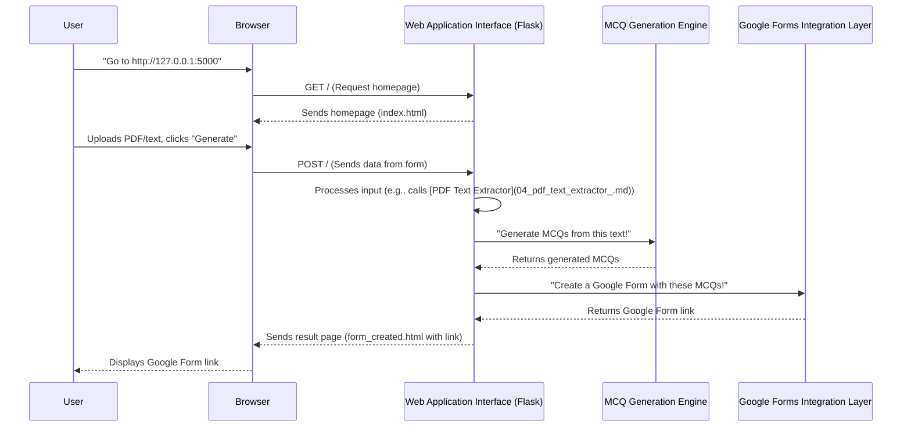

# Chapter 2: Web Application Interface (Flask)

In [Chapter 1: MCQ Generation Engine](01_mcq_generation_engine_.md), we learned about the "brain" of our project – the engine that magically turns text into multiple-choice questions. That's super cool, but how do *you*, the user, tell this brain what text to use? How do you even see the amazing MCQs it creates, or get that handy Google Form link?

This is where the **Web Application Interface (Flask)** comes in!

## What is a Web Application Interface?

Imagine our MCQ Generation Engine is a powerful, smart robot. You can't just talk to the robot directly in its "robot language." You need a user-friendly control panel with buttons, screens, and text fields.

A **Web Application Interface** is exactly that control panel for our project. It's the part you see and interact with in your web browser.

*   **It takes your input:** You can upload a PDF, type some text, or choose how many questions you want.
*   **It talks to the "brain":** It sends your input to the `[MCQ Generation Engine](01_mcq_generation_engine_.md)`.
*   **It shows you the results:** It receives the generated Google Form link and displays it nicely for you.

Our project uses a popular Python tool called **Flask** to build this friendly control panel.

### What is Flask? (A Mini Introduction)

Flask is like a lightweight toolkit for building web applications (websites that do more than just show static information). Think of it as a set of LEGO bricks specifically designed for creating web pages that can interact with users and run Python code behind the scenes.

With Flask, we can:
1.  **Define Web Pages (Routes):** Decide what happens when someone visits `http://127.0.0.1:5000/` or any other address.
2.  **Handle User Input:** Grab text from forms, uploaded files, and button clicks.
3.  **Show Dynamic Content:** Create web pages that change based on what the user does or what our `[MCQ Generation Engine](01_mcq_generation_engine_.md)` generates.

## The User's Journey: Using the Web App

Let's trace a typical journey of a user interacting with our MCQ generator:

1.  **You open your browser** and type `http://127.0.0.1:5000`.
2.  **Flask shows you the homepage:** A friendly page with options to upload files or type text. You also see a dropdown to select the number of questions.

    *   *(This is Flask handling a `GET` request and rendering `index.html`)*
3.  **You upload a PDF file** (like a chapter from a textbook) and choose "5" questions. Then you click the "Generate MCQs" button.

    *   *(This is you sending data to Flask via a `POST` request)*
4.  **Flask gets busy:** It takes your PDF, extracts the text, sends it to the `[MCQ Generation Engine](01_mcq_generation_engine_.md)`, waits for the MCQs, then sends those MCQs to Google Forms to create an actual quiz.
5.  **Flask shows you the result page:** A brand new page appears with a clickable link to your newly generated Google Form!

    *   *(This is Flask receiving the Google Form link and rendering `form_created.html`)*

## How It Works (Behind the Scenes)

Let's look at the simplified flow of how Flask acts as the go-between for you and the `[MCQ Generation Engine](01_mcq_generation_engine_.md)`:



### Starting the Web Application

The very first step is to tell Python that we want to create a Flask application.

```python
# project/app.py
from flask import Flask, render_template, request, abort
# ... other imports ...

# This line creates our Flask web application!
# Think of 'app' as the main manager for our website.
app = Flask(__name__)
# ... other setup like Bootstrap(app) ...

if __name__ == '__main__':
    # This tells Flask to start running the website.
    # It will listen for visitors at http://127.0.0.1:5000
    # 'debug=True' is helpful for development, as it shows errors.
    app.run(debug=True)
```
The `app = Flask(__name__)` line initializes our web application. When you run `python app.py` and see the message `Running on http://127.0.0.1:5000/`, it means your Flask app is active and ready to receive visitors!

### Defining the Homepage (The `/` Route)

In Flask, "routes" are like addresses for different pages on your website. When you visit `/` (the root address, like `www.example.com/`), Flask needs to know what to show you.

```python
# project/app.py

@app.route('/', methods=['GET', 'POST'])
def index():
    # ... code for handling requests ...
    if request.method == 'POST':
        # This part runs when you click the "Generate MCQs" button
        # and send data to the server.
        pass # We'll fill this in next!
    
    # This part runs when you first visit the page.
    # It shows the user the 'index.html' file.
    return render_template('index.html')
```

The `@app.route('/', methods=['GET', 'POST'])` line is a special Flask "decorator" (a way to add extra functionality to a function). It tells Flask:
*   "When someone goes to the `/` address..."
*   "...and uses either a `GET` (just asking for the page) or a `POST` (sending data from a form) method..."
*   "...run the `index()` function."

The `index()` function is the heart of our main page. It checks if the user is just visiting (`GET`) or submitting data (`POST`). If it's a `GET` request, it simply shows the `index.html` file, which contains our form for uploading files or typing text.

### Handling User Input (The `POST` Request)

When you fill out the form and click "Generate MCQs," your browser sends the data to our Flask app using a `POST` request. Flask needs to grab that data.

```python
# project/app.py

@app.route('/', methods=['GET', 'POST'])
def index():
    if request.method == 'POST':
        text = "" # This will hold all the text from user input

        # Check if files were uploaded in the form
        if 'files[]' in request.files:
            files = request.files.getlist('files[]')
            for file in files:
                if file.filename.endswith('.pdf'):
                    # Call a function to get text from PDF (covered in Chapter 4)
                    text += process_pdf(file) 
                elif file.filename.endswith('.txt'):
                    text += file.read().decode('utf-8')
        else:
            # If no files, get text from the manual text area
            text = request.form['text']

        # Get the number of questions the user selected
        num_questions = int(request.form['num_questions'])

        # Now we have the text and number of questions!
        # ... what happens next? ...
```

Inside the `if request.method == 'POST':` block:
*   `request.files` helps us access any uploaded files (like PDFs or TXT files).
*   `request.form` helps us access data from regular form fields, like the text typed into an input box or the selection from a dropdown menu.
*   We use helper functions like `process_pdf(file)` (which we'll explore in [Chapter 4: PDF Text Extractor](04_pdf_text_extractor_.md)) to get the actual content.

### Orchestrating the MCQ Generation

Once Flask has all the text and the desired number of questions, it's time to call our powerful `[MCQ Generation Engine](01_mcq_generation_engine_.md)`!

```python
# project/app.py

        # ... (after getting text and num_questions) ...

        # Call the MCQ Generation Engine from Chapter 1!
        mcqs = generate_mcqs(text, num_questions=num_questions) 

        # Prepare the generated MCQs to be sent to Google Forms
        mcq_data = [(mcq[0], mcq[1]) for mcq in mcqs] # Takes question and choices

        # Replace with your Google Apps Script URL (explained in Chapter 6)
        script_url = "https://script.google.com/macros/s/..."

        try:
            # Send the MCQs to the Google Apps Script to create the form
            # This is talking to our [Google Forms Integration Layer](06_google_forms_integration_layer_.md)
            response = requests.post(script_url, data=json.dumps(mcq_data), 
                                     headers={'Content-Type': 'application/json'})

            if response.status_code == 200:
                # Get the URL of the generated Google Form
                form_url = response.text
                # Show the user the page with the Google Form link
                return render_template('form_created.html', form_url=form_url)
            else:
                return f"Error creating form: {response.text}"
        except Exception as e:
            return f"An error occurred: {str(e)}"
    
    return render_template('index.html') # Default for GET requests
```

This part brings everything together:
1.  We call `generate_mcqs(text, num_questions)`, which is the "brain" from [Chapter 1: MCQ Generation Engine](01_mcq_generation_engine_.md). It gives us back a list of questions.
2.  We then send these `mcqs` to our `script_url` using the `requests.post` function. This `script_url` is part of our `[Google Forms Integration Layer](06_google_forms_integration_layer_.md)`, which takes our MCQs and creates a real Google Form!
3.  Finally, when the Google Form is successfully created, the `script_url` sends back the link to that form. Flask then uses `render_template('form_created.html', form_url=form_url)` to show you a new web page, displaying that link.

## Conclusion

The Web Application Interface (Flask) is the friendly face of our powerful MCQ generator. It handles all the interactions with you, the user, from taking your input (files, text, number of questions) to displaying the final Google Form link. It acts as the central coordinator, connecting your requests to the `[MCQ Generation Engine](01_mcq_generation_engine_.md)` and the `[Google Forms Integration Layer](06_google_forms_integration_layer_.md)`.

Now that we know how users interact with the app, you might be curious about how the app specifically handles text when you type it directly into a box, rather than uploading a file. That's what we'll cover in the next chapter: [Text Input Handler](03_text_input_handler_.md)!

---

Generated by [AI Codebase Knowledge Builder]