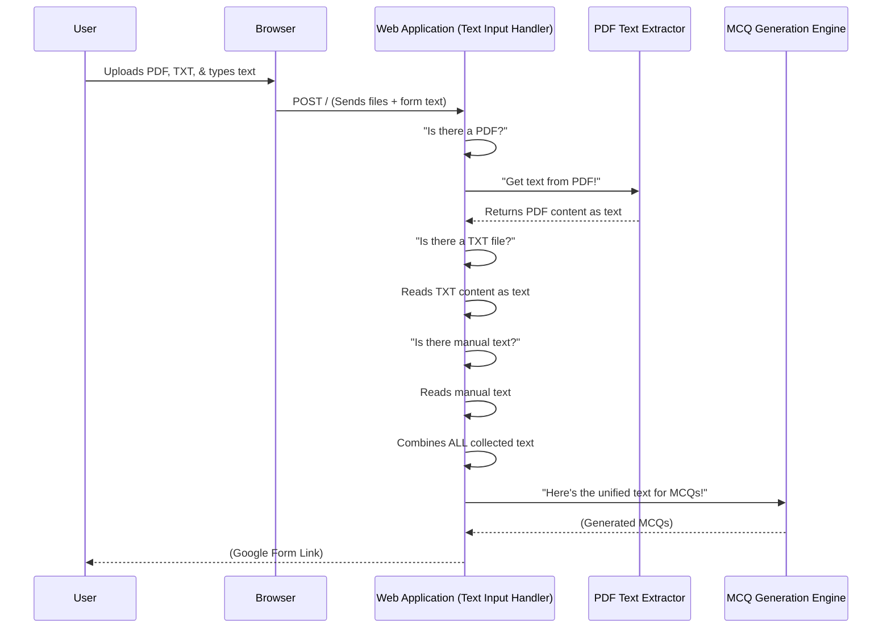

# Chapter 3: Text Input Handler

In [Chapter 2: Web Application Interface (Flask)](02_web_application_interface__flask__.md), we learned how Flask provides the friendly face for our project, allowing you to upload files or type text. But once you've uploaded a PDF, a `.txt` file, or typed directly into the box, how does our system actually *get* that text, especially when it comes from different places? And how does it make sure that text is ready for the [MCQ Generation Engine](01_mcq_generation_engine_.md)?

That's the job of the **Text Input Handler**!

## What is the Text Input Handler?

Imagine you have three different types of notes from a class:
1.  A scanned chapter from a textbook (a PDF).
2.  Your digital notes you typed up (a `.txt` file).
3.  Some quick ideas you just wrote down directly (manual text entry).

The [MCQ Generation Engine](01_mcq_generation_engine_.md) is super smart, but it only understands one thing: a single, long string of plain text. It doesn't know how to open a PDF or read a `.txt` file directly.

The **Text Input Handler** is like a super-efficient assistant that takes *all* these different kinds of text inputs, converts them into a standardized, pure text format, and then hands them over to the [MCQ Generation Engine](01_mcq_generation_engine_.md). It's a universal document converter that ensures all text, no matter its origin, becomes a unified stream of readable content.

Its main goals are:
*   **Collect:** Gather text from various sources (PDFs, TXT files, typed input).
*   **Standardize:** Turn everything into a simple, plain text format.
*   **Unify:** Combine all the collected text into one single, continuous block.

## Your Mission: Get All Text Ready!

Let's say you want to generate MCQs from two different sources at once:
1.  An uploaded `.txt` file with your study notes.
2.  Some extra concepts you quickly type into the text area.

The **Text Input Handler** will make sure both pieces of text are combined into one big chunk before the [MCQ Generation Engine](01_mcq_generation_engine_.md) sees it.

## How It Works (Behind the Scenes)

The Text Input Handler lives inside our Flask application's `index()` function, specifically when you submit the form using a `POST` request. It intelligently checks where the text is coming from and grabs it.

Let's look at a simplified flow:



The `FlaskApp` participant above represents the logic of our Text Input Handler. It's the central point that orchestrates getting text from all possible sources.

### Diving into the Code (`app.py`)

Let's revisit the `index()` function in `project/app.py` from [Chapter 2: Web Application Interface (Flask)](02_web_application_interface__flask__.md). This is where the Text Input Handler does its work.

```python
# project/app.py

@app.route('/', methods=['GET', 'POST'])
def index():
    if request.method == 'POST':
        text = "" # This variable will hold ALL our collected text

        # 1. Check for uploaded files
        if 'files[]' in request.files:
            files = request.files.getlist('files[]')
            for file in files:
                if file.filename.endswith('.pdf'):
                    # If it's a PDF, we use a special helper
                    text += process_pdf(file) # We'll learn about this in Chapter 4!
                elif file.filename.endswith('.txt'):
                    # If it's a TXT, we can read it directly
                    text += file.read().decode('utf-8')
        else:
            # 2. If no files, check for manual text entry
            text = request.form['text']
        
        # At this point, 'text' contains all combined content!
        num_questions = int(request.form['num_questions']) # Get desired question count
        mcqs = generate_mcqs(text, num_questions=num_questions) # Send to MCQ Engine
        # ... rest of the code for sending to Google Forms ...
    return render_template('index.html')
```

Let's break down the key parts of this "Text Input Handler" section:

### 1. Starting with an Empty Canvas

```python
# project/app.py
# ... inside the POST request block ...
        text = "" # This variable will hold ALL our collected text
```
We start by creating an empty Python string called `text`. This is our "canvas" where we will collect and combine all the text from different sources.

### 2. Handling Uploaded Files (PDFs and TXT)

```python
# project/app.py
# ...
        if 'files[]' in request.files: # Checks if any files were uploaded
            files = request.files.getlist('files[]') # Gets a list of all uploaded files
            for file in files:
                if file.filename.endswith('.pdf'):
                    # For PDFs, we call a dedicated function
                    text += process_pdf(file) # This function extracts text from PDF
                elif file.filename.endswith('.txt'):
                    # For TXT files, we read them directly
                    text += file.read().decode('utf-8')
# ...
```
*   `request.files` is how Flask lets us access files that were uploaded through a web form.
*   `'files[]'` is the name given to the file input field in our HTML form (you'll see this in the `index.html` file).
*   `request.files.getlist('files[]')` is important because users can upload *multiple* files at once. This gives us a list of all those files.
*   We loop through each `file` in the `files` list.
*   `file.filename.endswith('.pdf')` checks if the file is a PDF. If it is, we use `process_pdf(file)`. We'll explore exactly how `process_pdf` works in [Chapter 4: PDF Text Extractor](04_pdf_text_extractor_.md). For now, just know it magically turns a PDF into plain text!
*   `file.filename.endswith('.txt')` checks if it's a plain text file. If so, `file.read().decode('utf-8')` directly reads its content and converts it into a regular Python string.
*   `text += ...` is crucial: it appends (adds) the text from each file to our main `text` variable, building up one large string.

### 3. Handling Manual Text Input

```python
# project/app.py
# ...
        else: # This 'else' means no files were uploaded
            # If no files, we assume the user typed text into the manual input box
            text = request.form['text']
# ...
```
If the user didn't upload any files (the `if 'files[]' in request.files:` condition was false), the Text Input Handler assumes they must have typed something into the text input area of the form.

*   `request.form` is how Flask lets us access data from regular text fields in a web form.
*   `request.form['text']` grabs whatever the user typed into the input field named `text` (again, matching the HTML form).
*   In this `else` case, we assign the manual text directly to our `text` variable. If there were uploaded files, this `else` block wouldn't run, and the manual text would need to be specifically *added* to the `text` variable if both manual input and files were allowed simultaneously. *Note: In our project's current simplified `app.py`, it prioritizes files, then falls back to manual input if no files are present. A more advanced version might combine both if a user simultaneously uploaded files and typed text.*

### 4. The Unified Stream

After these checks, our `text` variable contains all the raw content, regardless of whether it came from a PDF, a `.txt` file, or direct typing. It's now a single, long string of plain text, perfectly ready to be fed into the `generate_mcqs` function (our [MCQ Generation Engine](01_mcq_generation_engine_.md)).

```python
# project/app.py
# ...
        # At this point, 'text' contains all combined content!
        num_questions = int(request.form['num_questions']) # Get desired question count

        # Now, send this unified text to the MCQ Generation Engine!
        mcqs = generate_mcqs(text, num_questions=num_questions) 
# ...
```
This is where the Text Input Handler successfully completes its mission: it prepares the text, and passes it along to the next component in our pipeline.

## Conclusion

The **Text Input Handler** might seem like a simple concept, but it's vital for making our MCQ generator flexible and user-friendly. It handles the crucial task of collecting text from different sources – uploaded PDFs, `.txt` files, or manual entries – and standardizing it into a single, clean stream of plain text. This unified text is then perfectly prepared for the powerful [MCQ Generation Engine](01_mcq_generation_engine_.md) to work its magic.

Now that we understand how all text gets collected and unified, let's dive deeper into one specific, trickier part of this process: how we actually *extract* text from those PDF files! That's what we'll cover in [Chapter 4: PDF Text Extractor](04_pdf_text_extractor_.md).

---

Generated by [AI Codebase Knowledge Builder]