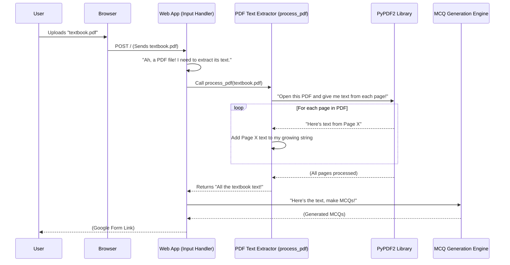

# Chapter 4: PDF Text Extractor

In [Chapter 3: Text Input Handler](03_text_input_handler_.md), we learned how our project gathers text from various sources – whether you type it directly or upload a `.txt` file. We saw how all these different inputs get unified into one long string of plain text, ready for the [MCQ Generation Engine](01_mcq_generation_engine_.md).

But there's one tricky type of file we mentioned: **PDFs**. Have you ever tried to copy text from a PDF and paste it somewhere else, only for it to come out all messy, or sometimes not even work? PDFs are special documents; they're designed to look exactly the same no matter where you open them, which is great for printing, but can be a challenge for computers trying to "read" their content.

That's where the **PDF Text Extractor** comes in! It's like a special key that unlocks PDF documents and takes out all the written words, turning them into a simple, readable format for our program.

## What is the PDF Text Extractor?

Imagine a PDF document as a sealed book. You can see the pages and the words, but a computer program can't just "read" it like a regular text file. It needs a way to open the book, turn each page, and carefully copy all the text.

The **PDF Text Extractor** is a dedicated utility in our project for doing exactly that. Its job is to:

1.  **Open the PDF:** It uses a powerful Python library called `PyPDF2` to access the PDF file you uploaded.
2.  **Go Page by Page:** It looks at each page inside the PDF, one after another.
3.  **Extract Text:** From each page, it carefully pulls out all the visible words and sentences.
4.  **Piece it Together:** It takes all the extracted text from every page and combines it into one continuous, plain text string.

Think of it as a specialized translator that can convert any PDF document into a standard text file, making its information accessible for our [MCQ Generation Engine](01_mcq_generation_engine_.md) to understand and process.

## Our Goal: Get Text from a PDF!

Let's say you upload a PDF file containing a chapter from your science textbook. The PDF Text Extractor's mission is to take that file and give us back a simple string like:

```
"The mitochondria is the powerhouse of the cell. It generates most of the cell's supply of ATP. The nucleus contains the genetic material..."
```

This plain text is exactly what our [MCQ Generation Engine](01_mcq_generation_engine_.md) needs to create questions.

## How It Works (Behind the Scenes)

The PDF Text Extractor lives in a helper function called `process_pdf` within our `app.py` file. Let's trace how it interacts with the rest of our application when you upload a PDF:



As you can see, `process_pdf` is the bridge between a complex PDF file and the simple text our application needs. It uses the `PyPDF2` library to do the heavy lifting of reading the PDF's internal structure.

## Diving into the Code (`app.py`)

Let's look at the actual code for the `process_pdf` function, found in `project/app.py`:

```python
# project/app.py

from PyPDF2 import PdfReader # We need this tool!
# ... (other imports) ...

def process_pdf(file) -> str:
    # 1. Start with an empty string to collect all text
    text = "" 
    try:
        # 2. Tell PyPDF2 to read the uploaded file
        pdf_reader = PdfReader(file)
    
        # 3. Go through each page, one by one
        for page_num in range(len(pdf_reader.pages)):
            # 4. Extract text from the current page
            page_text = pdf_reader.pages[page_num].extract_text()
            # 5. Add the page's text to our main 'text' variable
            text += page_text
    except Exception as e:
        # If anything goes wrong, we'll stop and show an error
        abort(400, description=f"Failed to process PDF: {e}")

    # 6. Return the combined text from all pages
    return text
```

Let's break down each step of this function:

### 1. Importing the PDF Tool

```python
# project/app.py
from PyPDF2 import PdfReader
```
First, we need to import `PdfReader` from the `PyPDF2` library. Think of `PdfReader` as the special device that knows how to open and read PDF files. Without this, our Python program wouldn't know how to handle a PDF.

### 2. Preparing for Text Extraction

```python
# project/app.py

def process_pdf(file) -> str:
    text = "" # Our empty bucket to catch all the text
    try:
        pdf_reader = PdfReader(file) # Open the PDF file
        # ...
```
When `process_pdf` is called by our Flask app (as seen in [Chapter 3: Text Input Handler](03_text_input_handler_.md)), it receives the uploaded PDF `file`.
*   We create an empty string `text = ""` to store all the content we're about to extract. This `text` variable will grow as we read each page.
*   `PdfReader(file)` is like handing our PDF "book" to the `PdfReader` device, which then prepares it for us to read.

### 3. Reading Page by Page

```python
# project/app.py
# ...
        for page_num in range(len(pdf_reader.pages)):
            # ...
```
PDFs are made of pages, just like a physical book. `pdf_reader.pages` gives us access to all the pages in the document. We use a `for` loop to go through each `page_num` (page number), ensuring we don't miss any content.

### 4. Extracting and Combining Text

```python
# project/app.py
# ...
            # Get the text from the current page
            page_text = pdf_reader.pages[page_num].extract_text()
            # Add this page's text to our growing 'text' string
            text += page_text
# ...
```
Inside the loop, for each page:
*   `pdf_reader.pages[page_num]` selects the current page.
*   `.extract_text()` is the magic method that tells `PyPDF2` to read all the visible text on that specific page and return it as a string.
*   `text += page_text` then takes this extracted `page_text` and adds it to our `text` variable. This way, `text` continuously builds up with content from every page.

### 5. Returning the Unified Text

```python
# project/app.py
# ...
    return text # Send back all the collected text!
```
Finally, after the loop has finished processing every page, the `process_pdf` function returns the complete `text` string. This string now contains all the content from the uploaded PDF, merged into one continuous block of plain text. It's perfectly formatted for the [MCQ Generation Engine](01_mcq_generation_engine_.md) to begin its analysis!

## Conclusion

The **PDF Text Extractor** is a crucial component of our MCQ generator. It solves the challenge of getting usable text from complex PDF documents by employing the `PyPDF2` library. It systematically reads each page, extracts its textual content, and stitches it all together into a single, clean stream of plain text. This ensures that even your PDF textbooks can be turned into quizzes!

Now that we know how to get our text, whether it's typed, from a `.txt` file, or extracted from a PDF, the next big step is to make our computer actually *understand* that text. How does it identify important words and sentences? That's the fascinating world we'll explore in the next chapter: [Natural Language Processing (NLP) with spaCy](05_natural_language_processing__nlp__with_spacy__.md)!

---

Generated by [AI Codebase Knowledge Builder]