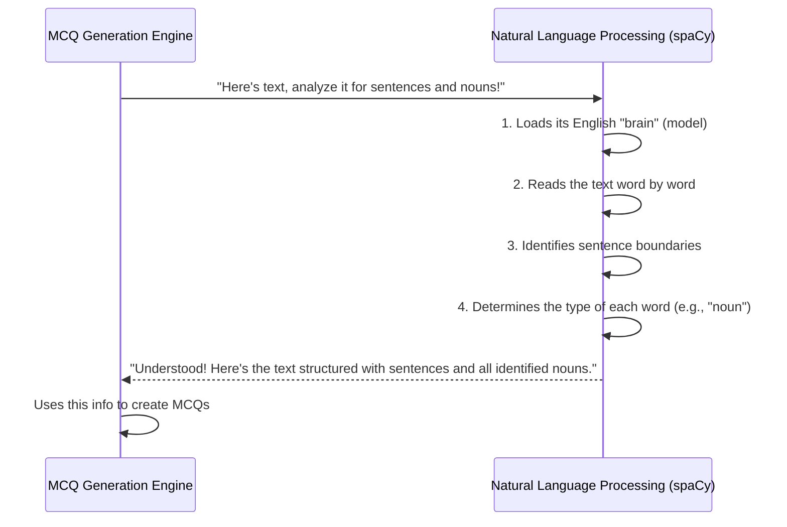

# Chapter 5: Natural Language Processing (NLP) with spaCy

In [Chapter 4: PDF Text Extractor](04_pdf_text_extractor_.md), we accomplished a significant task: extracting clean, plain text from various sources, including tricky PDF files. Now, we have a big, continuous string of words. But here's the catch: our computer, clever as it is, still just sees this as a long sequence of characters. It doesn't *understand* what the words mean, where sentences begin or end, or which words are important.

Imagine you're given a foreign language book. You can see all the letters, but you can't tell which ones form a word, what each word means, or how to break it into sentences. To turn that book into a quiz, you'd first need a linguist to help you understand it!

This is exactly the problem **Natural Language Processing (NLP) with spaCy** solves for our project. It's the "linguist" or "language brain" that helps our computer read, understand, and make sense of human language. This deep understanding is absolutely essential for our [MCQ Generation Engine](01_mcq_generation_engine_.md) to accurately identify potential question subjects and create relevant wrong answers (distractors).

## What is Natural Language Processing (NLP) with spaCy?

**NLP** is a field of Artificial Intelligence that teaches computers to understand, interpret, and generate human language in a valuable way. When we talk about "NLP with spaCy" in our project, we're referring to a specialized and very powerful Python library called `spaCy`.

Think of `spaCy` as a highly trained language expert inside our program. When it receives a block of text, it doesn't just see letters; it performs sophisticated analysis:

*   **Breaks into Sentences**: It knows where each sentence starts and ends, just like a human reader.
*   **Breaks into Words (Tokens)**: It separates words, punctuation, and numbers into individual pieces.
*   **Identifies Parts of Speech**: It figures out if each word is a noun (a person, place, thing, or idea), a verb (an action), an adjective (a descriptive word), and so on. This is super important for finding key terms!
*   **Recognizes Important "Things" (Entities)**: More advanced features can even identify names of people, organizations, locations, or dates. For our MCQ generator, identifying **nouns** is key!

This ability to "dissect" sentences and find their core meaning and important elements is precisely how our [MCQ Generation Engine](01_mcq_generation_engine_.md) can turn raw text into smart questions.

## Our Mission: Make the Computer Understand Text!

Let's take our example text:
`"The mitochondria is the powerhouse of the cell. It generates most of the cell's supply of ATP."`

A human can easily identify "mitochondria," "powerhouse," "cell," and "ATP" as important nouns. Our mission with spaCy is to enable the computer to do the same.

The [MCQ Generation Engine](01_mcq_generation_engine_.md) relies on spaCy to:
1.  **Find all sentences** in the text.
2.  **For each sentence, find all the nouns**. These nouns are prime candidates for being the correct answer or good distractors in an MCQ.

## How It Works (Behind the Scenes)

The interaction between our [MCQ Generation Engine](01_mcq_generation_engine_.md) and spaCy is quite straightforward. The engine feeds the text to spaCy, and spaCy returns a "smart" version of the text that the engine can then use.



### Diving into the Code (`app.py`)

Let's look at the key lines in our `project/app.py` file where spaCy does its magic, particularly within the `generate_mcqs` function.

#### 1. Loading the Language Brain

Before spaCy can understand anything, it needs a "language model." Think of this as loading a giant dictionary and grammar book for a specific language (in our case, English).

```python
# project/app.py
import spacy

# This line loads spaCy's small English language model.
# It gives our program the knowledge to understand English text.
try:
    nlp = spacy.load("en_core_web_sm")
except OSError:
    raise RuntimeError("spaCy model 'en_core_web_sm' not found")
```
`spacy.load("en_core_web_sm")` tells spaCy to load a pre-trained model for English (`en`) that includes things like tokenization, part-of-speech tagging, and more. We store this loaded model in a variable called `nlp`. Now, `nlp` is our language expert!

#### 2. Processing the Text

Once we have our `nlp` expert, we can feed it any text, and it will process it.

```python
# project/app.py

def generate_mcqs(text: str, num_questions: int=5) -> list:
    # ...
    # The 'nlp' expert processes our raw text.
    # It turns the plain text into a 'doc' object, which contains all the analysis.
    doc = nlp(text)
    # ...
```
When we call `nlp(text)`, spaCy takes our plain `text` and runs all its language analysis on it. The result is a special `doc` object. This `doc` object isn't just a string; it's a rich representation of our text, packed with information about its words, sentences, and their properties.

#### 3. Extracting Sentences

The `doc` object makes it incredibly easy to get individual sentences.

```python
# project/app.py

def generate_mcqs(text: str, num_questions: int=5) -> list:
    # ...
    doc = nlp(text)

    # We extract all individual sentences from the processed 'doc'.
    # `doc.sents` gives us a list of sentence objects.
    # `.text` converts each sentence object back into a simple string.
    sentences = [sent.text for sent in doc.sents]
    # Example: If text was "Hello world. How are you?", sentences would be ["Hello world.", "How are you?"]
    # ...
```
`doc.sents` is a special feature of the `doc` object that provides all the sentences found in the text. We then use a list comprehension to convert these sentence objects into a list of plain Python strings, ready for further processing.

#### 4. Identifying Nouns (Potential Answers/Distractors)

After getting individual sentences, the [MCQ Generation Engine](01_mcq_generation_engine_.md) needs to find the *important words* within each sentence to create questions and answers. Nouns are usually great candidates for this.

```python
# project/app.py

# ... (inside the loop for each selected sentence) ...
        # Process an individual sentence with spaCy to analyze its words.
        sent_doc = nlp(sentence)

        # We look at each 'token' (word) in the sentence.
        # If its 'pos_' (Part-of-Speech) is "NOUN", we add it to our 'nouns' list.
        nouns = [token.text for token in sent_doc if token.pos_ == "NOUN"]
        # Example: If sentence was "The mitochondria is the powerhouse of the cell.",
        # nouns might be ["mitochondria", "powerhouse", "cell"]
# ...
```
Here, we process each `sentence` with `nlp` again (this creates `sent_doc`), allowing us to examine its individual words, which spaCy calls "tokens."
*   `token.pos_` gives us the **Part-of-Speech** tag for each word.
*   `token.pos_ == "NOUN"` is a condition that checks if the word is a noun.
*   If it is a noun, `token.text` extracts the word itself, and we add it to our `nouns` list. This list is then used by the [MCQ Generation Engine](01_mcq_generation_engine_.md) to select the correct answer (`subject`) and generate `distractors`.

## Conclusion

**Natural Language Processing (NLP) with spaCy** is the unsung hero that brings true intelligence to our MCQ generator. It acts as our highly skilled linguist, taking raw, unstructured text and breaking it down into meaningful components like sentences and crucial parts of speech (like nouns). This foundational understanding of language empowers the [MCQ Generation Engine](01_mcq_generation_engine_.md) to accurately identify what questions to ask and what believable wrong answers to provide. Without spaCy, our computer would be "reading" text blindly!

Now that our system can understand the text and generate intelligent questions, the final piece of the puzzle is to take these MCQs and turn them into something interactive and widely usable: a Google Form! Let's explore how we achieve this in the next chapter: [Google Forms Integration Layer](06_google_forms_integration_layer_.md).

---

Generated by [AI Codebase Knowledge Builder]