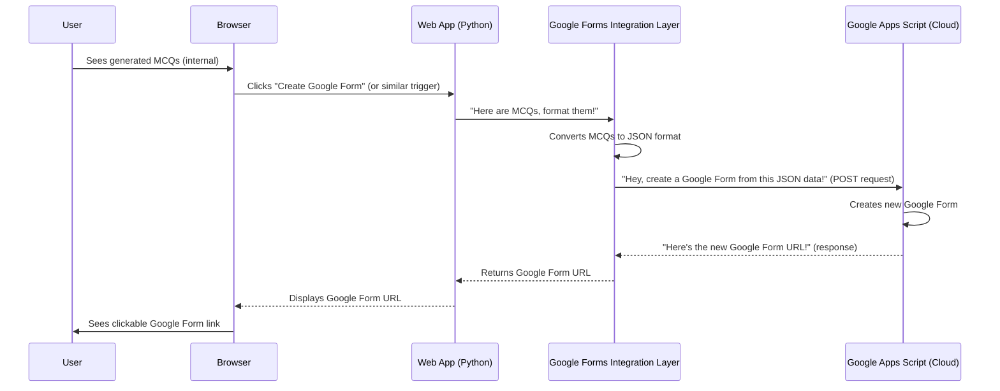

# Chapter 6: Google Forms Integration Layer

In [Chapter 5: Natural Language Processing (NLP) with spaCy](05_natural_language_processing__nlp__with_spacy__.md), we learned how our project intelligently understands text and generates fantastic multiple-choice questions (MCQs). We now have a list of well-crafted questions, complete with correct answers and clever distractors, all within our Python application. That's a huge achievement!

But what do we do with these MCQs? They're currently just data inside our program. As a user, you probably want to share a quiz, assign it to students, or take it yourself in an easy-to-use online format. This is where a **Google Form** comes in handy – it's a widely used tool for creating surveys and quizzes.

The problem is, our Python application can't just magically "create" a Google Form directly. We need a way to bridge the gap between our generated MCQs and Google's services.

## What is the Google Forms Integration Layer?

Imagine you've written down all your brilliant quiz questions on a piece of paper. You now need someone to take that paper, type everything into an online quiz platform (like Google Forms), and then give you the link to that new online quiz.

The **Google Forms Integration Layer** is exactly that "someone" in our project. It acts as a dedicated messenger service with a very specific job:

1.  **Packages the MCQs:** It takes the MCQs generated by our [MCQ Generation Engine](01_mcq_generation_engine_.md) and organizes them into a neat digital package (a special text format called JSON).
2.  **Sends the Package:** It sends this MCQ package to a special assistant living in Google's cloud – a program called a "Google Apps Script." This is done using a secure web request (a POST request).
3.  **Waits for the Result:** The Google Apps Script receives the MCQs, works its magic to create a new Google Form, and then sends back the web address (URL) of that newly created form.
4.  **Delivers the Link:** Our integration layer receives this Google Form URL and makes it available to you, the user, usually by displaying it on a webpage.

In short, this component is the bridge that turns our Python-generated questions into a fully functional, shareable Google Form, bringing the quiz to life online!

## How It Works (Behind the Scenes)

Let's trace the journey of our MCQs through the Google Forms Integration Layer:



As you can see, the Python Flask application interacts with the Google Apps Script through our `Google Forms Integration Layer`. The Google Apps Script is a separate small program that you would set up and deploy within your Google account. It's designed to receive our data and talk to Google Forms.

## Diving into the Code (`app.py`)

Let's look at the key parts of `project/app.py` that implement this integration layer. This code runs after the [MCQ Generation Engine](01_mcq_generation_engine_.md) has produced the MCQs.

#### 1. Preparing the Data for the Script

First, we need to take the list of `mcqs` generated by our engine and format them correctly for the Google Apps Script. Our script specifically expects a list of tuples, where each tuple contains the question stem and its answer choices.

```python
# project/app.py
# ... after mcqs = generate_mcqs(text, num_questions=num_questions) ...

        # Prepare the data to send to the Google Apps Script
        # mcqs is a list of (question_stem, answer_choices, correct_answer_letter)
        # We only need the question stem and answer choices for the script.
        mcq_data = [(mcq[0], mcq[1]) for mcq in mcqs]  
        # Example mcq_data: [ ("Q: The ______ of the cell.", ["nucleus", "mitochondria"]), ... ]
```
**Explanation:** The `generate_mcqs` function returns MCQs with three pieces of information. However, for creating the Google Form, the Google Apps Script only needs the question text (`mcq[0]`) and the list of answer choices (`mcq[1]`). This line creates a new `mcq_data` list with just these two pieces, making it simpler for the Google Apps Script to process.

#### 2. The Google Apps Script's Address

To send our `mcq_data` to the Google Apps Script, we need its unique web address. This is like knowing the postal code for our messenger service.

```python
# project/app.py
# ...
        # Replace with YOUR OWN Google Apps Script URL
        # You would get this URL after deploying your Google Apps Script as a web app.
        script_url = "https://script.google.com/macros/s/AKfycbyjmsrqBz9UEf-5ArymKg1XYolphP1TTDoxxcuhuYfXaxtX4SPlq6HQD2MW6SR7K4Tj/exec"
```
**Explanation:** `script_url` holds the unique URL of the deployed Google Apps Script. In a real-world scenario, you would replace this placeholder URL with the actual URL you get when you publish your own Google Apps Script as a web application. This is the endpoint where our Python application sends the MCQ data.

#### 3. Sending the MCQs to Google (POST Request)

Now it's time for our Python application to act as the messenger and send the `mcq_data` to the `script_url`. We use the `requests` library for this.

```python
# project/app.py
import requests # Needed to make web requests
import json     # Needed to convert Python data to JSON string

        try:
            # Send the MCQs to the Google Apps Script.
            # json.dumps() converts our Python list into a JSON string.
            # headers tell the script that we are sending JSON data.
            response = requests.post(script_url, data=json.dumps(mcq_data), 
                                     headers={'Content-Type': 'application/json'})
            # ...
```
**Explanation:**
*   `requests.post()` is the function that sends a POST request. A POST request is typically used when you want to send data to a server to create or update something.
*   `script_url` is the destination.
*   `json.dumps(mcq_data)` converts our `mcq_data` (which is a Python list of tuples) into a single string formatted in **JSON**. JSON (JavaScript Object Notation) is a very common and easy-to-read format for exchanging data between different systems over the internet.
*   `headers={'Content-Type': 'application/json'}` tells the Google Apps Script, "Hey, I'm sending you data, and it's in JSON format!" This helps the script understand how to read the incoming data.

#### 4. Receiving the Google Form URL

After sending the data, our Python application waits for a response from the Google Apps Script. If the script successfully creates the Google Form, it will send back the URL of that new form.

```python
# project/app.py
# ... (inside the try block) ...
            if response.status_code == 200:
                # If the script successfully created the form, it sends back its URL.
                form_url = response.text
                # Display the new Google Form URL to the user on a dedicated page.
                return render_template('form_created.html', form_url=form_url)
            else:
                # If the script had an error, it might send back an error message.
                return f"Error creating form: {response.text}"
        except Exception as e:
            # If there was a problem even connecting to the script (e.g., wrong URL)
            return f"An error occurred: {str(e)}"
```
**Explanation:**
*   `response.status_code == 200` checks if the web request was successful. A `200 OK` status means the request was handled without any issues.
*   If successful, `response.text` will contain the new Google Form URL (as a plain text string) sent back by the Google Apps Script.
*   This `form_url` is then passed to `render_template('form_created.html', form_url=form_url)`, which displays a new web page to the user with the clickable link to their newly generated Google Form!
*   The `else` block and `except Exception` handle any errors that might occur during communication or script execution, providing feedback to the user.

## Conclusion

The **Google Forms Integration Layer** is the final, crucial step that transforms our internally generated MCQs into a usable, shareable online quiz. It skillfully packages our question data, communicates with a specialized Google Apps Script, and then retrieves the precious link to the newly created Google Form. This layer truly makes our `Google-forms-MCQ-generator-from-pdf` project complete, allowing users to move from raw text to a functional, interactive quiz with ease.

This marks the end of our tutorial! You've learned about all the core components, from understanding text with NLP to creating a full Google Form.

---

Generated by [AI Codebase Knowledge Builder]