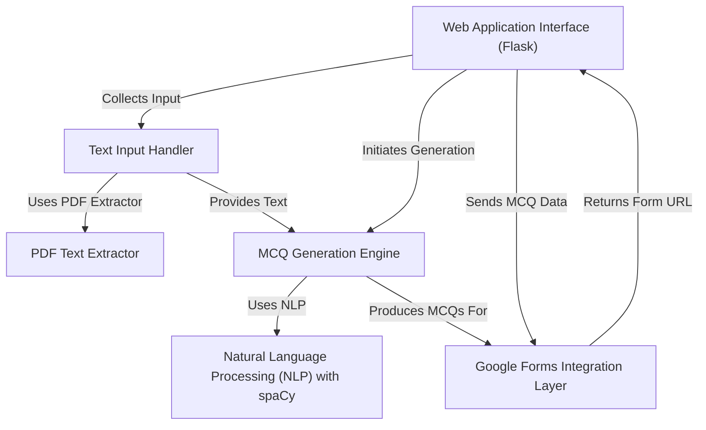

# Tutorial: Google-forms-MCQ-generator-from-pdf

This project is a **web application** that helps you *automatically create multiple-choice questions (MCQs)*. You can either **upload PDF or text files**, or just *type in some text*, and the app will generate a quiz based on your content. The best part? It then *automatically turns your generated quiz into a Google Form* that you can easily share!

**Source Repository:** [https://github.com/Dr-Westworld/Google-forms-MCQ-generator-from-pdf](https://github.com/Dr-Westworld/Google-forms-MCQ-generator-from-pdf)

## Chapters

1. [MCQ Generation Engine
](01_mcq_generation_engine_.md)
2. [Web Application Interface (Flask)
](02_web_application_interface__flask__.md)
3. [Text Input Handler
](03_text_input_handler_.md)
4. [PDF Text Extractor
](04_pdf_text_extractor_.md)
5. [Natural Language Processing (NLP) with spaCy
](05_natural_language_processing__nlp__with_spacy_.md)
6. [Google Forms Integration Layer
](06_google_forms_integration_layer_.md)

---

Generated by [AI Codebase Knowledge Builder]