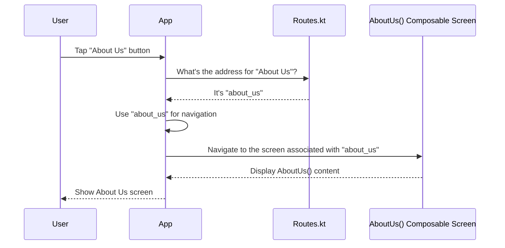

# Chapter 2: App Navigation Routes

Welcome back, future app developers! In our last chapter, [Composable Screens](01_composable_screens_.md), we learned how to build individual "rooms" or pages for our NHITM Classboard app. We created screens like `Home`, `AboutUs`, and `Faculty`, each living in its own file and defining its own visual content.

Now, imagine you've built all these fantastic rooms in your house, but you haven't labeled them yet. How would you tell someone, "Go to the `AboutUs` room," if there's no clear sign or address for it? You'd be lost!

This is exactly the problem **App Navigation Routes** solve for our application!

### What Problem Do App Navigation Routes Solve?

Our app needs a way to tell its navigation system, "Show the `Home` screen," or "Take me to the `Faculty` page." To do this reliably, each screen needs a unique, simple name or address that the navigation system can understand.

**App Navigation Routes** provide these unique names. They are like assigning a specific room number or a clear address to each of your [Composable Screens](01_composable_screens_.md), so the app always knows exactly which screen to show when you want to navigate there.

### Understanding "App Navigation Routes"

Let's break it down:

*   **App**: Refers to our NHITM Classboard application.
*   **Navigation**: The act of moving from one screen (or "page") to another within the app.
*   **Routes**: A list of all the possible destinations or "addresses" a user can go to. Each route is typically represented by a unique string (like a word or phrase).

So, **App Navigation Routes** are simply unique string identifiers that tell the app's navigation system, "This string represents *that* specific screen."

### How We Define Our App Navigation Routes

In our NHITM Classboard project, all these "addresses" for our screens are neatly organized in a single file called `Routes.kt`. You can find it at `app/src/main/java/com/example/nhitmclassboard/navigation/Routes.kt`.

Let's look at the code:

```kotlin
// File: app/src/main/java/com/example/nhitmclassboard/navigation/Routes.kt
package com.example.nhitmclassboard.navigation

sealed class Routes(val route:String){ // (1) Our "list of addresses" container
    object Home:Routes("home")       // (2) An address for the Home screen
    object Faculty:Routes("faculty") // (3) An address for the Faculty screen
    object AboutUs:Routes("about_us")
    object Gallery:Routes("gallery")
    object BottomNav:Routes("bottom_nav")
}
```

Let's break down this important piece of code:

1.  **`sealed class Routes(val route:String)`**:
    *   `sealed class`: This is a special type of class in Kotlin. Think of it as a container that can only hold a *limited and known* set of specific items (our routes). It's like having a special menu where you *know* all the possible dishes available. This helps us list all our navigation destinations in one place.
    *   `Routes`: This is the name of our special container class.
    *   `(val route:String)`: This means every item (every route) in our `Routes` container will have a `route` property, which is a simple `String` (text). This `String` is the actual unique address for that screen.

2.  **`object Home:Routes("home")`**:
    *   `object Home`: This creates a single, unique instance (like a single physical address label) for our `Home` screen. We don't need to create multiple `Home` routes; there's only one "home" in our app.
    *   `:Routes("home")`: This tells Kotlin that `Home` is one of the specific items inside our `Routes` container, and its unique string identifier (its "address") is `"home"`.

3.  **Other `object` declarations**:
    *   `object Faculty:Routes("faculty")` assigns the address `"faculty"` to our `Faculty` screen.
    *   `object AboutUs:Routes("about_us")` assigns `"about_us"` to our `AboutUs` screen.
    *   And so on for `Gallery` and `BottomNav`.

Each of these `object` definitions essentially creates a distinct "address label" for a specific [Composable Screen](01_composable_screens_.md).

### How App Navigation Routes Work (Behind the Scenes)

Let's trace what happens when the app uses these routes.

Imagine you're pressing a button that should take you to the "About Us" screen:

1.  **You Request a Destination**: When you interact with the app (e.g., tap a button), the app decides it needs to go to the "About Us" screen.
2.  **The App Looks Up the Route**: Instead of directly calling the `AboutUs()` Composable function, the app uses its designated *route string*, which is `"about_us"`.
3.  **The Navigation System Acts**: The app's internal navigation system (which we'll learn about in [App Navigation Graph](03_app_navigation_graph_.md)) takes this `"about_us"` string.
4.  **Connects to the Screen**: It then knows that the route `"about_us"` corresponds to the `AboutUs()` [Composable Screen](01_composable_screens_.md) and displays it on your device.

Here's a simplified sequence of events:



In essence, `Routes.kt` acts as a central directory, mapping friendly names (like `Home` or `AboutUs`) to simple string addresses (`"home"`, `"about_us"`). This makes our navigation clear and organized.

### Why use `sealed class` and `object`?

*   **`sealed class`**: It's like having a fixed number of doors in a house. You know exactly how many doors there are, and you can't suddenly add a new, unnamed door. This helps prevent errors and makes sure we've accounted for all possible navigation paths.
*   **`object`**: For each route like `Home` or `Faculty`, we create an `object` instead of a regular class. This means there's only *one* instance of `Home` throughout the app. It's like saying there's only *one* "Home" screen address, not many different variations. This keeps things simple and consistent.

### Summary

In this chapter, we learned that **App Navigation Routes** are the crucial "addresses" or unique string identifiers we assign to each of our [Composable Screens](01_composable_screens_.md). By organizing these routes in `Routes.kt` using a `sealed class` and `object`s, we create a clear, centralized directory for all possible destinations within our `NHITM_Classboard` app. This system ensures that when we want to move from one part of the app to another, the navigation system knows exactly where to go.

Now that we have our individual rooms (screens) and their addresses (routes), the next step is to build the hallways and pathways that connect these rooms! In the next chapter, we will explore the [App Navigation Graph](03_app_navigation_graph_.md), which will define how we move between these routes.

[Next Chapter: App Navigation Graph](03_app_navigation_graph_.md)

---

Generated by [AI Codebase Knowledge Builder]