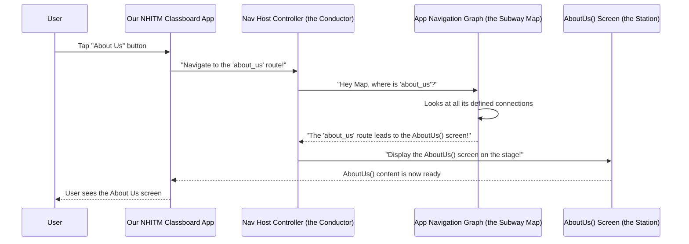

# Chapter 3: App Navigation Graph

Welcome back! In our last two chapters, we've been busy building the foundations of our app. We started by creating individual "rooms" for our app, which we called [Composable Screens](01_composable_screens_.md) (like `Home`, `AboutUs`, `Faculty`). Then, in the last chapter, [App Navigation Routes](02_app_navigation_routes_.md), we gave each of these rooms a unique "address" or name (like `"home"`, `"about_us"`, `"faculty"`).

Now, imagine you have a house with many beautifully built rooms, and each room has a clear address. But how do you actually *move* from the living room to the kitchen? You need hallways, doorways, and a clear understanding of the house's layout, right?

This is exactly what the **App Navigation Graph** does for our application!

### What Problem Does the App Navigation Graph Solve?

Our app needs a central "director" or "map" that knows *all* the possible screens, *all* their routes, and *how to connect them*. Without this map, when you tap a button to go to "About Us," the app wouldn't know which actual [Composable Screen](01_composable_screens_.md) (the `AboutUs()` function) to display for the `"about_us"` route.

The **App Navigation Graph** solves this by being the central brain for navigation. It's like a detailed subway map:

*   It shows all the "stations" (our [Composable Screens](01_composable_screens_.md)).
*   It defines the "lines" (our [App Navigation Routes](02_app_navigation_routes_.md)).
*   Most importantly, it connects each "line" to its correct "station," ensuring you can move smoothly from one part of the app to another.

It tells the app: "If someone wants to go to `home`, show them the `Home()` Composable function."

### Understanding the "App Navigation Graph"

Let's break down the key parts of building this graph:

1.  **`NavHost`**: Think of this as the main "stage" or "area" within your app where all the different screens will be displayed. When you navigate, the `NavHost` swaps out the current screen on this stage with the new one. It's the physical infrastructure of our subway system.

2.  **`NavHostController`**: This is the "driver" or "conductor" of our navigation system. It's the object you'll use to actually *tell* the app to go from one screen to another (e.g., "navigate to `home`"). It manages the back stack (so you can press "back" and go to the previous screen) and executes the navigation commands.

3.  **`composable()` blocks**: These are the individual "connections" on our subway map. Each `composable()` block tells the `NavHost`: "When you see *this specific route string*, then *display this specific Composable Screen*."

### Building Our App Navigation Graph

In our `NHITM_Classboard` project, the App Navigation Graph is defined in `NavGraph.kt`, located at `app/src/main/java/com/example/nhitmclassboard/navigation/NavGraph.kt`.

Let's look at the `NavGraph` function, which sets up our entire navigation:

```kotlin
// File: app/src/main/java/com/example/nhitmclassboard/navigation/NavGraph.kt
package com.example.nhitmclassboard.navigation

import androidx.compose.runtime.Composable
import androidx.navigation.NavHost // The "stage" for our screens
import androidx.navigation.NavHostController // The "driver" for navigation
import com.example.nhitmclassboard.screens.* // Import all our screens

@Composable
fun NavGraph(navController: NavHostController){
    // ... This is where we define our navigation ...
}
```

**Explanation:**

*   `@Composable fun NavGraph(...)`: This is a special function, just like our [Composable Screens](01_composable_screens_.md), that builds a part of our UI. Its job is to define the navigation structure.
*   `navController: NavHostController`: It takes the `NavHostController` as an input. This is the "driver" we mentioned – it's crucial for telling the graph where to go.
*   `import com.example.nhitmclassboard.screens.*`: This line is important! It brings in *all* our [Composable Screens](01_composable_screens_.md) (`Home`, `AboutUs`, `Faculty`, etc.) so we can connect them to our routes.

Now, let's put the `NavHost` and the connections inside:

```kotlin
// Inside NavGraph function in NavGraph.kt
@Composable
fun NavGraph(navController: NavHostController){
    NavHost(
        navController = navController, // (1) Give the NavHost its driver
        startDestination = Routes.BottomNav.route // (2) Our starting screen
    ){
        // (3) Define individual connections (routes to screens)
        composable(route = Routes.Home.route) {
            Home() // Show the Home screen when the route is "home"
        }
        composable(route = Routes.Faculty.route) {
            Faculty() // Show the Faculty screen for "faculty" route
        }
        composable(route = Routes.AboutUs.route) {
            AboutUs() // Show the AboutUs screen for "about_us" route
        }
        composable(route = Routes.Gallery.route) {
            Gallery() // Show the Gallery screen for "gallery" route
        }
        // There might be more composable blocks here for other screens!
    }
}
```

**Let's break down this code block:**

1.  **`NavHost(...)`**: This is where we create our "navigation stage."
    *   `navController = navController`: We give our `NavHost` its "driver" (the `NavHostController`) so it knows how to respond to navigation commands.
    *   `startDestination = Routes.BottomNav.route`: This tells the app which screen should be shown *first* when the app starts. Here, it's the route for our "Bottom Navigation" (which itself might contain other screens), using the specific route string we defined in [App Navigation Routes](02_app_navigation_routes_.md).

2.  **`{ ... }` after `NavHost`**: This is where we define all the "pathways" or "connections" of our navigation graph. Inside these curly braces, we use `composable()` blocks.

3.  **`composable(route = Routes.Home.route) { Home() }`**: This is the core of our graph!
    *   `composable()`: This is a function that defines a single navigation destination.
    *   `route = Routes.Home.route`: We tell it the "address" (route string) for this destination. `Routes.Home.route` gives us the string `"home"` from our [App Navigation Routes](02_app_navigation_routes_.md) file.
    *   `{ Home() }`: This is a *lambda* function. It simply tells the `NavHost`: "When someone navigates to the route `"home"`, then call the `Home()` [Composable Screen](01_composable_screens_.md) function to display its content."

We repeat this `composable` block for every screen in our app, effectively mapping each route string to its corresponding [Composable Screen](01_composable_screens_.md).

### How the App Navigation Graph Works (Behind the Scenes)

Let's trace what happens when you interact with the app and ask to go to a new screen, using our "subway map" analogy:



In simple terms:

1.  You (the user) interact with the app, for example, by tapping a button that says "About Us".
2.  The app then tells the `NavController` (our "conductor"): "Go to the `about_us` route!"
3.  The `NavController` consults the `NavGraph` (our "subway map"). It asks, "Which [Composable Screen](01_composable_screens_.md) should I show for the route string `"about_us"`?"
4.  The `NavGraph` looks at all its `composable()` definitions. It finds the one that matches `route = Routes.AboutUs.route` and knows it corresponds to the `AboutUs()` function.
5.  It tells the `NavController` to then display the `AboutUs()` [Composable Screen](01_composable_screens_.md) on the `NavHost` "stage".
6.  The `AboutUs()` screen's content appears on your device.

### Summary

In this chapter, we learned that the **App Navigation Graph** is the central "subway map" for our `NHITM_Classboard` app. It uses the `NavHost` as its display area, is managed by a `NavHostController`, and most importantly, it defines all the connections using `composable()` blocks. Each `composable()` block links a specific [App Navigation Route](02_app_navigation_routes_.md) string to its corresponding [Composable Screen](01_composable_screens_.md) function, allowing users to smoothly move between different parts of the application.

Now that we have our screens, their addresses, and the map to connect them all, the final step is to actually put this entire navigation system into our main application and make it run! In the next chapter, we'll explore the [Main Application Entry Point (MainActivity)](04_main_application_entry_point__mainactivity__.md), which is where our app truly comes to life.

[Next Chapter: Main Application Entry Point (MainActivity)](04_main_application_entry_point__mainactivity__.md)

---

Generated by [AI Codebase Knowledge Builder]