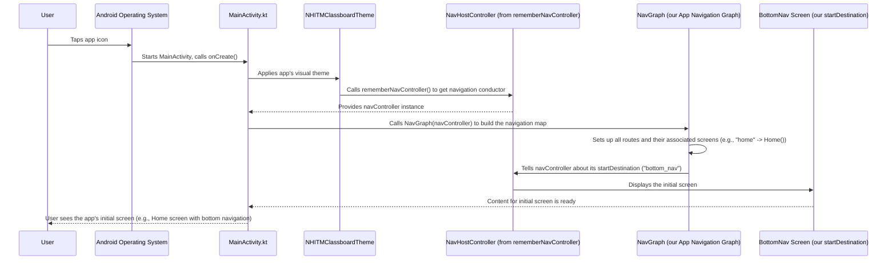

# Chapter 4: Main Application Entry Point (MainActivity)

Welcome back, future app developers! So far in our journey, we've done a lot of planning and building:
*   In [Composable Screens](01_composable_screens_.md), we built all the individual "rooms" or pages of our `NHITM_Classboard` app (like `Home`, `AboutUs`, `Faculty`).
*   In [App Navigation Routes](02_app_navigation_routes_.md), we gave each of those rooms a unique "address" or name (like `"home"`, `"about_us"`).
*   And in [App Navigation Graph](03_app_navigation_graph_.md), we created a detailed "subway map" that knows all the routes and how to connect them to their respective screens.

Now, imagine you've meticulously planned a grand opening for your new Classboard building. You have all the rooms, addresses, and even a full map, but the doors are still closed! How do you actually *open* the building and let people in? How does the app actually *start* and show all the amazing UI we've built?

This is where the **Main Application Entry Point**, typically represented by `MainActivity`, comes in!

### What Problem Does MainActivity Solve?

Every Android application needs a starting point, a designated "launchpad" where everything begins. When you tap the `NHITM_Classboard` app icon on your phone, the Android operating system needs to know *which* part of your app to run first.

`MainActivity` solves this problem by being that initial launchpad. It's the very first piece of your app's code that Android executes. Its primary job is to:

1.  Set up the initial environment.
2.  Tell Android what UI to display.
3.  In our case, it will kick off our entire [App Navigation Graph](03_app_navigation_graph_.md) and apply our app's visual style.

Think of `MainActivity` as the app's main lobby or reception area. It's where users are first greeted, and from there, they can move to any other part of the application using our navigation system.

### Understanding `MainActivity`

In our `NHITM_Classboard` project, `MainActivity` is a Kotlin file named `MainActivity.kt` found at `app/src/main/java/com/example/nhitmclassboard/MainActivity.kt`.

Let's break down its key components:

1.  **`MainActivity` Class**: This is the actual "doorway" of our application. It's a special type of Android component called an "Activity." Every Android app has at least one activity, and `MainActivity` is typically the one that launches first.

    ```kotlin
    // File: app/src/main/java/com/example/nhitmclassboard/MainActivity.kt
    package com.example.nhitmclassboard

    import android.os.Bundle
    import androidx.activity.ComponentActivity // We extend this!
    // ... other imports ...

    class MainActivity : ComponentActivity() { // (1) Our main application entry class
        // ... code inside ...
    }
    ```

    *   `class MainActivity : ComponentActivity()`: This declares our `MainActivity` class. By extending `ComponentActivity`, we get all the necessary functionality to build modern Android UIs using Jetpack Compose.

2.  **`onCreate` Method**: This is the most important part of `MainActivity` for us right now. It's a special function that Android calls *immediately* when the `MainActivity` is created and the app is starting. It's literally the "on create" moment!

    ```kotlin
    // Inside MainActivity class
    class MainActivity : ComponentActivity() {
        override fun onCreate(savedInstanceState: Bundle?) { // (1) This code runs FIRST!
            super.onCreate(savedInstanceState) // (2) Important Android setup
            // This is where we tell our app what to do when it starts!
        }
    }
    ```

    *   `override fun onCreate(...)`: The `override` keyword means we're providing our own version of a function that `ComponentActivity` already has.
    *   `super.onCreate(savedInstanceState)`: This is a call to the parent `ComponentActivity`'s `onCreate` function. It performs essential setup that Android needs. Always keep this line!

3.  **`setContent` Block**: Inside `onCreate`, the `setContent` function is crucial for Jetpack Compose apps. It's how we tell Android: "Here is the UI that should be displayed on the screen!" Whatever Composable function you put inside `setContent` will be the very first thing your users see.

    Initially, your `MainActivity.kt` might look like this, displaying a simple "Hello Android!" message:

    ```kotlin
    // Inside MainActivity's onCreate method
    override fun onCreate(savedInstanceState: Bundle?) {
        super.onCreate(savedInstanceState)
        // enableEdgeToEdge() // (Optional: system UI styling)
        setContent { // (1) This is where we tell Android what UI to show
            NHITMClassboardTheme { // (2) Applying our app's overall look
                // (3) Placeholder UI: Just shows "Hello Android!"
                // Scaffold and Greeting are simple Composables
                // that display a text message.
                Greeting(name = "Android")
            }
        }
    }

    // A simple Composable function to display text
    @Composable
    fun Greeting(name: String) {
        Text(text = "Hello $name!")
    }
    ```
    *   `setContent { ... }`: This block is where all our Jetpack Compose UI starts.
    *   `NHITMClassboardTheme { ... }`: This line is applying our app's overall visual style, like colors, fonts, and shapes. We'll dive much deeper into this in [Application Theming](05_application_theming_.md). For now, just know it makes our app look consistent!
    *   `Greeting(name = "Android")`: This is a simple placeholder [Composable Screen](01_composable_screens_.md) that just shows "Hello Android!" This is what you would see if you ran the app with this default code.

### Connecting Our Navigation Graph from MainActivity

Now that we understand the basics of `MainActivity`, how do we make it display our actual `NHITM_Classboard` app with all its screens and navigation? We replace the placeholder `Greeting` with our entire [App Navigation Graph](03_app_navigation_graph_.md)!

Here's how we modify the `setContent` block in `MainActivity.kt`:

```kotlin
// File: app/src/main/java/com/example/nhitmclassboard/MainActivity.kt
package com.example.nhitmclassboard

import android.os.Bundle
import androidx.activity.ComponentActivity
import androidx.activity.compose.setContent
import androidx.navigation.compose.rememberNavController // (1) Important import for navigation
import com.example.nhitmclassboard.navigation.NavGraph // (2) Import our navigation map
import com.example.nhitmclassboard.ui.theme.NHITMClassboardTheme

class MainActivity : ComponentActivity() {
    override fun onCreate(savedInstanceState: Bundle?) {
        super.onCreate(savedInstanceState)
        setContent {
            NHITMClassboardTheme { // (3) Still applying our app's overall look
                // (4) Create our "navigation conductor"
                val navController = rememberNavController()
                // (5) Launch our entire navigation system!
                NavGraph(navController = navController)
            }
        }
    }
}
// Note: The Greeting composable and its preview are no longer needed
// because we're now displaying our full app's navigation.
```

Let's break down the important changes:

1.  **`import androidx.navigation.compose.rememberNavController`**: We need to import this function to create our navigation controller.
2.  **`import com.example.nhitmclassboard.navigation.NavGraph`**: We need to import our [App Navigation Graph](03_app_navigation_graph_.md) so we can use it here.
3.  **`NHITMClassboardTheme { ... }`**: Our app's theme is still applied to ensure a consistent look.
4.  **`val navController = rememberNavController()`**: This is a very important line! `rememberNavController()` creates and remembers a `NavHostController`. This `navController` is the "driver" or "conductor" of our navigation system, as we discussed in [App Navigation Graph](03_app_navigation_graph_.md). It's what will manage moving between screens.
5.  **`NavGraph(navController = navController)`**: Finally, we call our `NavGraph` function, which we defined in [App Navigation Graph](03_app_navigation_graph_.md). We pass the `navController` we just created to it. This tells our navigation map who the "conductor" is, allowing it to start displaying the `startDestination` (which we set to `Routes.BottomNav.route` in Chapter 3).

By making these changes, `MainActivity` no longer shows a simple "Hello Android!" message. Instead, it launches our entire `NHITM_Classboard` navigation system, starting with the screen defined as the `startDestination` in our `NavGraph`.

### How It All Comes Together (Behind the Scenes)

When you tap the `NHITM_Classboard` app icon, here's a simplified sequence of events:



In essence:

1.  **You Launch**: You tap the app icon.
2.  **Android Starts `MainActivity`**: The Android OS finds our `MainActivity` and calls its `onCreate()` method.
3.  **Setup & Theme**: `MainActivity` performs initial setup and applies our `NHITMClassboardTheme`.
4.  **Get the Conductor**: It then creates a `navController` (our "navigation conductor").
5.  **Build the Map**: It passes this `navController` to our `NavGraph` function, telling the "subway map" who its "driver" is.
6.  **First Stop**: The `NavGraph` then instructs the `navController` to display the `startDestination` screen.
7.  **App Appears**: The content of that `startDestination` screen finally appears on your device, and the app is officially running!

### Summary

In this chapter, we learned that `MainActivity` is the fundamental **Main Application Entry Point** for our `NHITM_Classboard` app. It's the very first piece of code that Android executes, and its `onCreate` method, particularly the `setContent` block, is where we initialize our entire Jetpack Compose UI. By using `rememberNavController()` and calling our [App Navigation Graph](03_app_navigation_graph_.md) within `setContent`, `MainActivity` effectively launches our app's complete navigation system and applies our theme, allowing users to interact with all the screens we've built.

Now that our app has a main entry point and its navigation is all set up, the next logical step is to make sure our app looks great and consistent across all screens! In the next chapter, we'll dive into [Application Theming](05_application_theming_.md), where we'll explore how to define and apply our app's visual style.

[Next Chapter: Application Theming](05_application_theming_.md)

---

Generated by [AI Codebase Knowledge Builder]