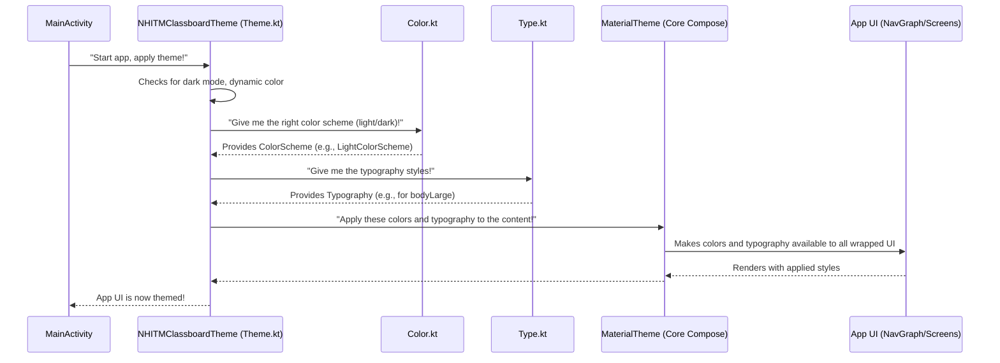

# Chapter 5: Application Theming

Welcome back, future app designers! In our last chapter, [Main Application Entry Point (MainActivity)](04_main_application_entry_point__mainactivity__.md), we finally launched our `NHITM_Classboard` app. We saw how `MainActivity` acts as the grand opening, setting up our entire [App Navigation Graph](03_app_navigation_graph_.md) and bringing our screens to life.

Now, imagine your `NHITM_Classboard` building is open, and people are walking through its rooms. But what if all the rooms have different, clashing paint colors? What if some signs use one font and others use a completely different, hard-to-read font? It would look messy and unprofessional!

This is where **Application Theming** comes in.

### What Problem Does Application Theming Solve?

Our `NHITM_Classboard` app needs to look **consistent** and **professional** across *all* its screens. If you decide the main color of the app should be a specific shade of blue, you don't want to go into every single button, text, and background on every screen and change its color manually. That would be a huge amount of work and very error-prone!

**Application Theming** solves this by providing a central control for the app's entire visual appearance. It allows you to define a consistent **color palette** (like your app's main "paint colors") and **typography** (like your app's "font styles and sizes") in one place. Then, any UI element in your app can simply "ask" the theme for the `primary` color or the `bodyLarge` text style, and it will automatically get the correct, consistent look.

Think of Application Theming as the **interior designer** of your app. It selects the overall paint colors, furniture styles, and general aesthetic to make everything visually appealing and harmonious, even supporting features like dark mode!

### Understanding "Application Theming"

Application Theming in Jetpack Compose (which our app uses) is primarily managed by a special Composable function that acts as a container. Everything inside this container will inherit the defined visual styles.

Let's break down the key parts of theming:

1.  **Color Palette**: This defines the set of colors your app will use. You'll specify colors for different purposes, like a `primary` color for buttons and main headers, a `secondary` color for accents, and colors for backgrounds and text.
    *   **Analogy**: These are like the specific paint swatches you've chosen for your building.

2.  **Typography**: This defines the font styles, sizes, and weights for different types of text in your app. For example, you might have a large, bold style for titles and a smaller, regular style for paragraph text.
    *   **Analogy**: These are like the different font styles and sizes you'd use for signage, brochures, and documents in your building.

3.  **Theme Composable**: This is the actual Composable function that brings the color palette and typography together. It wraps around your entire application UI, applying these styles to everything inside it. It also intelligently switches between light and dark modes, and can even adapt to the user's wallpaper colors (dynamic color) on newer Android versions.
    *   **Analogy**: This is like the interior designer's master plan, ensuring that all the chosen paint colors and font styles are applied correctly throughout the entire building.

### How We Apply Our App's Theme

In our `NHITM_Classboard` project, our theming components are located in the `app/src/main/java/com/example/nhitmclassboard/ui/theme/` package.

You might remember from [Main Application Entry Point (MainActivity)](04_main_application_entry_point__mainactivity__.md) that our `MainActivity` wraps our entire [App Navigation Graph](03_app_navigation_graph_.md) in a `NHITMClassboardTheme` block:

```kotlin
// From: app/src/main/java/com/example/nhitmclassboard/MainActivity.kt
// Inside MainActivity's onCreate method, simplified for focus
override fun onCreate(savedInstanceState: Bundle?) {
    super.onCreate(savedInstanceState)
    setContent {
        // (1) This is our main theme Composable!
        NHITMClassboardTheme {
            // Everything inside this block gets our app's defined styles
            val navController = rememberNavController()
            NavGraph(navController = navController) // Our entire app UI
        }
    }
}
```

**What's happening here?**

1.  `NHITMClassboardTheme { ... }`: This is our custom theme Composable function. It's like putting your entire application (our `NavGraph` in this case) inside a beautifully designed box. All the UI elements within this box (buttons, text, backgrounds on all screens) will automatically pick up the colors and fonts defined by `NHITMClassboardTheme`.

    *   **Use Case Example**: If you wanted to change the main color of a button from purple to blue, you would **not** change the button's code. Instead, you'd change the `primary` color definition *inside* `NHITMClassboardTheme`, and all buttons using the `primary` color would automatically update!

### How Application Theming Works (Behind the Scenes)

Let's trace how the `NHITMClassboardTheme` gives our app its consistent look.



In simple terms:

1.  **App Starts**: When `MainActivity` runs, it calls our `NHITMClassboardTheme` Composable.
2.  **Theme Configuration**: `NHITMClassboardTheme` first checks the device settings (e.g., is dark mode enabled? Is dynamic color preferred?).
3.  **Get Colors**: Based on these settings, it goes to `Color.kt` to get the appropriate set of colors (either `LightColorScheme`, `DarkColorScheme`, or a dynamic color scheme).
4.  **Get Typography**: It then gets the predefined text styles from `Type.kt`.
5.  **Apply to UI**: Finally, it passes these selected colors and typography to `MaterialTheme` (a core Jetpack Compose component). `MaterialTheme` then makes these styles available to *all* the UI elements (our [Composable Screens](01_composable_screens_.md)) that are placed inside the `NHITMClassboardTheme` block.
6.  **Consistent Look**: Now, any text, button, or background in our app can use `MaterialTheme.colorScheme.primary` or `MaterialTheme.typography.bodyLarge` and automatically get the correct, consistent style.

### Deep Dive into Theming Files

Let's look at the actual code that defines these styles:

#### 1. Defining Colors (`Color.kt`)

This file contains the raw color definitions. We define specific `Color` objects using hexadecimal codes.

```kotlin
// File: app/src/main/java/com/example/nhitmclassboard/ui/theme/Color.kt
package com.example.nhitmclassboard.ui.theme

import androidx.compose.ui.graphics.Color

val Purple80 = Color(0xFFD0BCFF) // A lighter purple, often for dark themes
val PurpleGrey80 = Color(0xFFCCC2DC)
val Pink80 = Color(0xFFEFB8C8)

val Purple40 = Color(0xFF6650a4) // A darker purple, often for light themes
val PurpleGrey40 = Color(0xFF625b71)
val Pink40 = Color(0xFF7D5260)
```
**Explanation:**

*   `val Purple80 = Color(0xFFD0BCFF)`: We declare variables (like `Purple80`) that hold `Color` objects. `0xFFD0BCFF` is a hexadecimal code representing a specific shade of purple.
*   We have different shades (like `Purple80` and `Purple40`) because lighter colors often look better as "primary" colors in a dark theme, and darker colors look better in a light theme.

These raw colors are then grouped into `ColorScheme` objects for light and dark modes:

```kotlin
// From: app/src/main/java/com/example/nhitmclassboard/ui/theme/Theme.kt
// Simplified section of Theme.kt
private val DarkColorScheme = darkColorScheme(
    primary = Purple80,      // Main color for dark mode
    secondary = PurpleGrey80,
    tertiary = Pink80
)

private val LightColorScheme = lightColorScheme(
    primary = Purple40,      // Main color for light mode
    secondary = PurpleGrey40,
    tertiary = Pink40
    // You can define other colors here too, like background, surface, text colors
    /* background = Color(0xFFFFFBFE), */
)
```
**Explanation:**

*   `darkColorScheme(...)` and `lightColorScheme(...)`: These are functions that help us define a complete set of colors for either a dark or light theme.
*   `primary = Purple80`: Here, we assign our `Purple80` color (defined in `Color.kt`) to the `primary` role for the `DarkColorScheme`. This means any UI component requesting the `primary` color in dark mode will get `Purple80`.
*   Similarly, `primary = Purple40` assigns a different purple for the `LightColorScheme`. This is how our app automatically adapts its main color when switching between light and dark modes!

#### 2. Defining Typography (`Type.kt`)

This file defines our app's text styles.

```kotlin
// File: app/src/main/java/com/example/nhitmclassboard/ui/theme/Type.kt
package com.example.nhitmclassboard.ui.theme

import androidx.compose.material3.Typography
import androidx.compose.ui.text.TextStyle
import androidx.compose.ui.text.font.FontFamily
import androidx.compose.ui.text.font.FontWeight
import androidx.compose.ui.unit.sp

// Set of Material typography styles to start with
val Typography = Typography(
    bodyLarge = TextStyle( // A style for larger body text
        fontFamily = FontFamily.Default, // The default system font
        fontWeight = FontWeight.Normal,  // Normal thickness
        fontSize = 16.sp,                // 16 "scaled pixels" in size
        lineHeight = 24.sp,
        letterSpacing = 0.5.sp
    )
    /* You can define many more styles here!
    titleLarge = TextStyle(...)
    labelSmall = TextStyle(...)
    */
)
```
**Explanation:**

*   `val Typography = Typography(...)`: This creates a `Typography` object, which is a collection of different `TextStyle` definitions.
*   `bodyLarge = TextStyle(...)`: We define a specific style for `bodyLarge` text. This could be used for longer paragraphs.
*   `fontFamily = FontFamily.Default`: We're using the default font family for the system. You could also load custom fonts here.
*   `fontWeight = FontWeight.Normal`: This sets the thickness of the font. Other options include `Bold`, `Light`, etc.
*   `fontSize = 16.sp`: This sets the size of the text. `sp` stands for "scaled pixels," which means the text size will adjust based on the user's system font size settings.

Any text element in our app can now simply ask for `MaterialTheme.typography.bodyLarge`, and it will get all these properties (default font, normal weight, 16sp size).

#### 3. Orchestrating the Theme (`Theme.kt`)

This is the main `NHITMClassboardTheme` Composable that ties everything together.

```kotlin
// File: app/src/main/java/com/example/nhitmclassboard/ui/theme/Theme.kt
package com.example.nhitmclassboard.ui.theme

import android.app.Activity
import android.os.Build
import androidx.compose.foundation.isSystemInDarkTheme // Checks system dark mode
import androidx.compose.material3.MaterialTheme      // The core Compose theme
// ... other imports ...
import androidx.compose.ui.platform.LocalContext      // To get current context

@Composable
fun NHITMClassboardTheme(
    darkTheme: Boolean = isSystemInDarkTheme(), // Is system in dark mode?
    dynamicColor: Boolean = true,              // Use Android 12+ wallpaper colors?
    content: @Composable () -> Unit            // The UI content to apply theme to
) {
    val colorScheme = when { // Decide which color scheme to use
        dynamicColor && Build.VERSION.SDK_INT >= Build.VERSION_CODES.S -> {
            val context = LocalContext.current
            if (darkTheme) dynamicDarkColorScheme(context) else dynamicLightColorScheme(context)
        }
        darkTheme -> DarkColorScheme // Use our custom dark scheme
        else -> LightColorScheme     // Use our custom light scheme
    }

    MaterialTheme( // (1) The core Jetpack Compose theme container
        colorScheme = colorScheme, // (2) Pass the chosen colors
        typography = Typography,   // (3) Pass our defined text styles (from Type.kt)
        content = content          // (4) Apply theme to the app's UI content
    )
}
```
**Explanation:**

*   `@Composable fun NHITMClassboardTheme(...)`: This is our theme function. It takes three parameters:
    *   `darkTheme`: Automatically detects if the system is in dark mode.
    *   `dynamicColor`: A boolean to enable/disable dynamic colors (where the app's colors adapt to the user's wallpaper).
    *   `content`: This is a special parameter that represents **all the UI code you put *inside* the `NHITMClassboardTheme { ... }` block** in `MainActivity`.
*   `val colorScheme = when { ... }`: This `when` statement is smart!
    *   It first checks if `dynamicColor` is enabled and if the Android version is new enough (Android 12+). If so, it generates colors from the user's wallpaper (`dynamicDarkColorScheme` or `dynamicLightColorScheme`).
    *   Otherwise, it falls back to our predefined `DarkColorScheme` or `LightColorScheme` (from the previous section).
*   `MaterialTheme(...)`: This is the final step. It's the standard Jetpack Compose Composable that applies a theme.
    *   `colorScheme = colorScheme`: We pass the `colorScheme` we just decided on.
    *   `typography = Typography`: We pass our `Typography` object (defined in `Type.kt`).
    *   `content = content`: And finally, we tell `MaterialTheme` to apply all these styles to the `content` (which is our entire app UI from `MainActivity`).

This setup makes it incredibly easy to change the entire look of your app. Want a different primary color? Change one line in `Color.kt`. Want a different font for headlines? Change one `TextStyle` in `Type.kt`. The rest of your app will update automatically!

### Summary

In this chapter, we learned that **Application Theming** is the powerful "interior designer" of our `NHITM_Classboard` app. It provides a central, organized way to control the app's entire visual appearance, including its **color palette** (`Color.kt`) and **typography** (`Type.kt`). Our custom `NHITMClassboardTheme` (in `Theme.kt`) orchestrates these styles, intelligently handles features like dark mode and dynamic colors, and applies them to our entire application UI (which we wrapped in `MainActivity`). This ensures a consistent, professional, and easily customizable look and feel across all our [Composable Screens](01_composable_screens_.md).

Now that our app has a beautiful and consistent look, the final step is to understand some foundational setup of any Android project. In the next chapter, we'll cover [Android Project Configuration](06_android_project_configuration_.md), which deals with essential settings and permissions for our app.

[Next Chapter: Android Project Configuration](06_android_project_configuration_.md)

---

Generated by [AI Codebase Knowledge Builder]