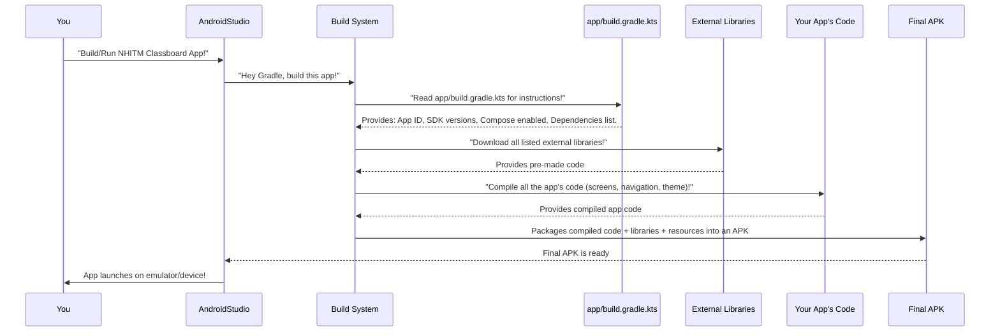

# Chapter 6: Android Project Configuration

Welcome back, future app developers! In our last chapter, [Application Theming](05_application_theming_.md), we became interior designers, giving our `NHITM_Classboard` app a beautiful and consistent look. We learned how to define colors and text styles that automatically apply across all our screens.

Now, imagine your Classboard building is fully designed and decorated. It looks great! But before you can actually *build* it and open it to the public, you need to deal with some fundamental paperwork and planning. You need architectural blueprints, building permits, and a complete list of all the materials the construction crew will need. Without these, no one knows how to build your project!

This is exactly what **Android Project Configuration** is for our app. It's like the project's "instruction manual" and "ingredient list" that tells Android *how* to build, run, and identify our `NHITM_Classboard` application.

### What Problem Does Android Project Configuration Solve?

When you create an Android app, the system needs crucial information to understand it. Without this information, Android wouldn't know:
*   Its unique identity among millions of other apps.
*   Which Android versions it can run on.
*   What special features it uses (like Jetpack Compose).
*   Which external helper tools (libraries) it needs to function.

**Android Project Configuration** solves this by providing all these fundamental settings in one place. It ensures that our `NHITM_Classboard` app is built correctly, can be installed on users' phones, and works as expected across different Android versions.

### Understanding "Android Project Configuration"

For our `NHITM_Classboard` project, most of these core settings are defined in a special file named `build.gradle.kts` within our `app` folder. You can find it at `app/build.gradle.kts`. This file uses a language called Kotlin DSL (Domain Specific Language) for Gradle, which is Android's build system.

Let's break down the key concepts defined in this file:

1.  **Unique Identifier (Application ID)**: Every app on an Android device needs a unique "passport number" to distinguish it from others. This is called the `applicationId`.
2.  **Minimum and Target Android Versions (SDK)**:
    *   **Minimum SDK**: The oldest Android version your app can run on.
    *   **Target SDK**: The newest Android version your app is tested against and designed for.
3.  **Build Configuration (e.g., Enabling Compose)**: Special instructions for the build system, like telling it that our app uses Jetpack Compose for its UI.
4.  **External Libraries (Dependencies)**: A list of all the "ingredients" or pre-built software components our app needs. For example, we need libraries for Jetpack Compose UI elements, navigation, and more!

### How We Configure Our NHITM Classboard App

Let's open `app/build.gradle.kts` and look at how our `NHITM_Classboard` app is configured.

#### 1. Unique Identifier and Android Version Support

Inside `app/build.gradle.kts`, you'll find a section called `android { ... }`. This is where general Android-specific settings are defined.

```kotlin
// File: app/build.gradle.kts (simplified snippet)
android {
    namespace = "com.example.nhitmclassboard" // Internal package name
    compileSdk = 35 // SDK version to compile with

    defaultConfig {
        applicationId = "com.example.nhitmclassboard" // (1) Your app's unique ID
        minSdk = 24 // (2) Minimum Android version supported (Android 7.0)
        targetSdk = 35 // (3) Android version your app is designed for
        versionCode = 1 // (4) Internal version number for updates
        versionName = "1.0" // (5) User-visible version name
        // ... other settings ...
    }
    // ... more sections ...
}
```

**What's happening here?**

1.  `applicationId = "com.example.nhitmclassboard"`: This is the unique "passport number" for our `NHITM_Classboard` app. No other app installed on the same device can have this exact ID. When you upload your app to the Google Play Store, this ID is how it's uniquely identified globally.
2.  `minSdk = 24`: This means our app will run on devices with Android 7.0 (Nougat) and newer. If someone tries to install our app on an older device, they won't be able to.
3.  `targetSdk = 35`: This tells Android that we've tested our app thoroughly on the latest Android version (currently Android 15, API level 35). This helps Android apply the correct behaviors and optimizations for our app on newer devices.
4.  `versionCode = 1`: An internal version number. When you release updates to your app, you'll increment this number.
5.  `versionName = "1.0"`: This is the version number users see (e.g., "1.0", "1.1", "2.0").

#### 2. Build Configuration (Enabling Compose)

Since our `NHITM_Classboard` app uses Jetpack Compose for its UI, we need to tell the build system to enable Compose-specific features.

```kotlin
// File: app/build.gradle.kts (simplified snippet)
android {
    // ... previous settings ...
    buildFeatures {
        compose = true // (1) Tell Gradle to enable Jetpack Compose support
    }
    // ... other settings ...
}
```

**What's happening here?**

1.  `compose = true`: This simple line is crucial! It informs Gradle (our build system) that this project uses Jetpack Compose. This enables important functionalities like previewing our [Composable Screens](01_composable_screens_.md) in Android Studio and properly compiling Compose UI code.

#### 3. External Libraries (Dependencies)

Building an app from scratch would be incredibly difficult. Fortunately, we can use "pre-made tools" or "ingredients" called libraries (also known as dependencies). These are blocks of code written by others that provide common functionalities, saving us a lot of work.

```kotlin
// File: app/build.gradle.kts (simplified snippet)
dependencies {
    // (1) Libraries for core Android functionality and Compose UI
    implementation(libs.androidx.core.ktx)
    implementation(libs.androidx.activity.compose)
    implementation(platform(libs.androidx.compose.bom))
    implementation(libs.androidx.material3) // (2) Material Design 3 UI components

    // (3) Library for App Navigation
    implementation(libs.androidx.navigation.runtime.ktx)

    // (4) Libraries for testing (these are only used when running tests)
    testImplementation(libs.junit)
    androidTestImplementation(libs.androidx.junit)
    // ... more dependencies ...
}
```

**What's happening here?**

1.  **`implementation(...)`**: This keyword tells Gradle that these libraries are essential for our app to run.
2.  `libs.androidx.material3`: This is an important one! It provides all the beautiful [Material Design 3](05_application_theming_.md) components (like buttons, text fields, and themes) that we use to build our app's UI.
3.  `libs.androidx.navigation.runtime.ktx`: This library provides the core components for our [App Navigation Graph](03_app_navigation_graph_.md) and [App Navigation Routes](02_app_navigation_routes_.md). Without this, we couldn't move between screens!
4.  **`testImplementation(...)` / `androidTestImplementation(...)`**: These libraries are only included when we run automated tests for our app. They don't get included in the final app that users download.

The `libs.` prefix you see (`libs.androidx.core.ktx`, etc.) is a modern way to manage dependencies in Android projects, making them easier to read and update. You'll find the actual version numbers for these libraries defined in another file named `libs.versions.toml` (don't worry about that for now, it's just a way to keep things tidy!).

### How Project Configuration Works (Behind the Scenes)

When you hit the "Run" button in Android Studio, or whenever you build your app, a powerful tool called **Gradle** springs into action. Gradle is like the project manager for your app's construction.

Here's a simplified look at what happens:



In essence:

1.  **You Request a Build**: You tell Android Studio to build your `NHITM_Classboard` app.
2.  **Gradle Takes Over**: Android Studio hands over the task to Gradle.
3.  **Reads the Blueprint**: Gradle immediately reads our `app/build.gradle.kts` file. It learns the app's identity, which Android versions it supports, that it uses Compose, and all the external libraries it needs.
4.  **Gathers Ingredients**: Gradle goes out and downloads all the required external libraries (like `material3` and `navigation`).
5.  **Compiles Code**: It then compiles all your own app code – our [Composable Screens](01_composable_screens_.md), [App Navigation Graph](03_app_navigation_graph_.md), [Application Theming](05_application_theming_.md), and everything else we've written.
6.  **Packages It Up**: Finally, Gradle combines your compiled app code, the external libraries, and other resources (like images) into a single, installable file called an **APK** (Android Package Kit).
7.  **App Launches**: This APK is then installed and launched on your emulator or physical device!

This entire process ensures that your `NHITM_Classboard` app is correctly assembled with all its parts and dependencies, ready for users to enjoy.

### Summary

In this chapter, we explored **Android Project Configuration**, the essential "instruction manual" and "ingredient list" for our `NHITM_Classboard` app. We learned that the `app/build.gradle.kts` file defines critical settings like the app's unique `applicationId`, the `minSdk` and `targetSdk` versions it supports, how to enable Jetpack Compose, and lists all the external `dependencies` (pre-made tools) our app relies on. By understanding these configuration settings, we ensure our app is properly built and runs smoothly on Android devices.

With our app's core configuration understood, its UI built, navigation set up, and theme applied, you now have a solid foundation in how modern Android applications are structured and brought to life!

---

Generated by [AI Codebase Knowledge Builder]