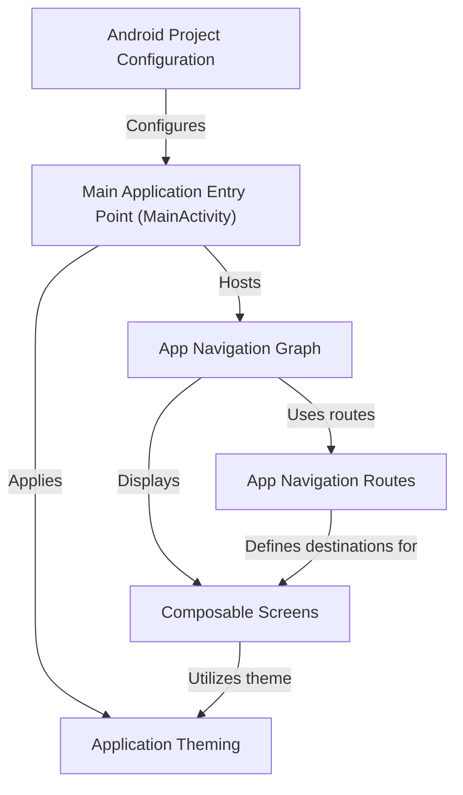

# Tutorial: NHITM_Classboard

The **NHITM_Classboard** project is an *Android application* designed to provide an interactive information board. Users can easily *navigate* through different sections like 'Home', 'Faculty', 'About Us', and 'Gallery' to access relevant content, all presented with a consistent visual *theme*.

**Source Repository:** [https://github.com/010624/NHITM_Classboard](https://github.com/010624/NHITM_Classboard)

## Chapters

1. [Composable Screens
](01_composable_screens_.md)
2. [App Navigation Routes
](02_app_navigation_routes_.md)
3. [App Navigation Graph
](03_app_navigation_graph_.md)
4. [Main Application Entry Point (MainActivity)
](04_main_application_entry_point__mainactivity__.md)
5. [Application Theming
](05_application_theming_.md)
6. [Android Project Configuration
](06_android_project_configuration_.md)

---

Generated by [AI Codebase Knowledge Builder]