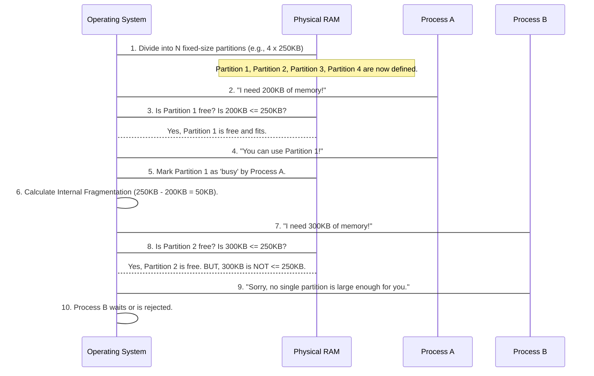

# Chapter 1: Memory Management (Fixed Partitioning - MFT)

Imagine your computer is trying to run several programs at once – maybe you have a web browser open, a music player, and a document editor. All these programs need a place to live in the computer's "short-term memory," which we call **RAM** (Random Access Memory), or simply "memory."

How does the Operating System (OS) make sure each program gets its own space and doesn't accidentally mess with another program's data? This is where **Memory Management** comes in! It's like an expert landlord for your computer's memory, ensuring every program has a comfortable, safe space to run.

In this chapter, we'll explore one of the simplest and earliest ways an OS managed memory: **Fixed Partitioning**, often called **MFT** (Multiprogramming with a Fixed number of Tasks).

### The Problem: Sharing Memory Safely

Think of your computer's RAM as a big, empty whiteboard. When programs run, they need space to write down their temporary notes and data. If multiple programs try to write on the same spot, chaos ensues! Our goal is to divide this whiteboard into sections so each program gets its own dedicated area.

### Key Concepts

Let's break down the main ideas behind Fixed Partitioning (MFT):

1.  **Memory Partitions:**
    Imagine dividing our big whiteboard into several smaller, separate boxes. In computing terms, we call these boxes **partitions**. Each partition is a section of the total RAM.

2.  **Fixed Partitions:**
    With Fixed Partitioning, these boxes (partitions) are created *once* when the computer starts up. Their sizes are **fixed** – they never change! It's like having a parking lot where the parking spots are all pre-drawn and you can't make them bigger or smaller.

3.  **One Process Per Partition (MFT):**
    The idea is that each partition can hold exactly one running program (or "process"). If you have 4 partitions, you can run at most 4 programs at the same time using this method. This is where the "Multiprogramming with a Fixed number of Tasks" (MFT) name comes from.

4.  **Internal Fragmentation:**
    This is a key concept for MFT! What happens if you have a huge parking spot (a partition) but only a tiny smart car (a small program) needs to park there? The rest of the parking spot remains empty and unused! This wasted space *inside* an allocated partition is called **internal fragmentation**. It's a big drawback of MFT.

Let's visualize this with a simple diagram:

```mermaid
graph TD
    A[Total RAM] --> B{Partition 1 (e.g., 256KB)}
    A --> C{Partition 2 (e.g., 256KB)}
    A --> D{Partition 3 (e.g., 256KB)}
    A --> E{Partition 4 (e.g., 256KB)}

    subgraph Memory Allocation Example
        P1(Process A - needs 100KB) --> B
        B -- Wasted Space (156KB) --> WF1[Internal Fragmentation]

        P2(Process B - needs 200KB) --> C
        C -- Wasted Space (56KB) --> WF2[Internal Fragmentation]

        P3(Process C - needs 250KB) --> D
        D -- Wasted Space (6KB) --> WF3[Internal Fragmentation]

        E -- Empty --> P4(Partition 4 - Free)
    end
```

In the example above, each partition is 256KB. Process A only needs 100KB, leaving 156KB unused inside its allocated partition. This is internal fragmentation!

### How Fixed Partitioning Works

Let's see this in action using a simplified example.

**Use Case:** We have 1000KB of memory and want to run 3 programs: Program1 (needs 200KB), Program2 (needs 300KB), and Program3 (needs 150KB).

Here's how Fixed Partitioning (MFT) would handle this:

1.  **Divide Memory:** The OS first divides the total memory into fixed-size partitions. Let's say we decide to create 4 partitions of 250KB each (1000KB / 4 = 250KB).

2.  **Process Arrival:**
    *   **Program1 (200KB):** The OS finds an empty partition (e.g., Partition 1, 250KB). 200KB fits perfectly! Program1 is loaded.
        *   Internal Fragmentation for Program1: 250KB (partition size) - 200KB (program size) = **50KB**.
    *   **Program2 (300KB):** The OS looks for an empty partition. It finds Partition 2 (250KB). Uh oh, 300KB is *larger* than 250KB! In simple MFT, this program cannot be allocated to a single partition. It would either have to wait, or the system couldn't run it with this setup. For our simple example, let's assume Program2 is rejected or waits.
    *   **Program3 (150KB):** The OS finds Partition 3 (250KB). 150KB fits! Program3 is loaded.
        *   Internal Fragmentation for Program3: 250KB - 150KB = **100KB**.

    *   Partition 4 remains free.

This illustrates the core idea and the internal fragmentation problem.

### Diving into the Code (Simplified `mft.c`)

Let's look at a very simplified C code snippet that simulates this memory management technique. We'll focus on the essential parts.

First, we get the total memory and decide how many fixed partitions we want.

```c
#include<stdio.h>

int main() {
    int m, p, s; // m: total memory, p: number of partitions, s: size of each partition

    printf("Enter the total memory size (KB): ");
    scanf("%d", &m);
    printf("Enter the number of fixed partitions: ");
    scanf("%d", &p);

    s = m / p; // Calculate the size of each partition
    printf("Each partition size is: %d KB\n", s);

    // ... rest of the code for processes
    return 0;
}
```
**Explanation:**
*   `m` stores the total memory (e.g., 1000KB).
*   `p` stores how many partitions we want (e.g., 4).
*   `s = m / p` calculates the size of each partition (e.g., 1000 / 4 = 250KB). This size is *fixed* from now on.

Next, we'll simulate processes requesting memory.

```c
// ... previous code ...

int p1; // p1: number of processes
int m1[4]; // m1: array to store memory needed by each process (max 4 processes for simplicity)
int i; // loop counter
int fra1_total = 0; // To sum up all internal fragmentation

printf("\nEnter the number of processes: ");
scanf("%d", &p1);

for (i = 0; i < p1; i++) {
    printf("\nEnter the memory required for process %d (KB): ", i + 1);
    scanf("%d", &m1[i]);

    if (m1[i] <= s) { // Does the process fit in one partition?
        printf("Process %d is allocated in a partition.\n", i + 1);
        int fra1 = s - m1[i]; // Calculate internal fragmentation
        printf("Internal fragmentation for process %d is: %d KB\n", i + 1, fra1);
        fra1_total = fra1_total + fra1; // Add to total fragmentation
    } else {
        printf("Process %d CANNOT be allocated. It's too large for a single partition (%d KB).\n", i + 1, s);
        m1[i] = 0; // Mark as not allocated for the final summary
    }
}
// ... rest of the code for summary
```
**Explanation:**
*   `p1` is the number of programs (processes) we want to run.
*   The `for` loop goes through each program.
*   `m1[i]` stores how much memory each `process i+1` needs.
*   `if (m1[i] <= s)`: This is the critical check. If the process's memory requirement is less than or equal to the fixed partition size, it *fits*.
    *   `fra1 = s - m1[i]` calculates the internal fragmentation for *this specific process*.
    *   `fra1_total` keeps a running sum of all internal fragmentation.
*   If `m1[i] > s`: The process is too big for a single fixed partition, so it cannot be allocated.

Finally, we display a summary:

```c
// ... previous code ...

printf("\n--- Allocation Summary ---");
printf("\nProcess\tAllocated Memory (KB)");
for (i = 0; i < p1; i++) {
    printf("\n%5d\t%5d", i + 1, m1[i] > 0 ? m1[i] : 0); // Show 0 if not allocated
}
printf("\nTotal Internal Fragmentation: %d KB\n", fra1_total);

return 0;
}
```

**Example Run (Input and Output):**

Let's try our use case:
*   Total Memory: 1000 KB
*   Number of Partitions: 4
*   Process 1 needs: 200 KB
*   Process 2 needs: 300 KB
*   Process 3 needs: 150 KB

```
Enter the total memory size (KB): 1000
Enter the number of fixed partitions: 4
Each partition size is: 250 KB

Enter the number of processes: 3

Enter the memory required for process 1 (KB): 200
Process 1 is allocated in a partition.
Internal fragmentation for process 1 is: 50 KB

Enter the memory required for process 2 (KB): 300
Process 2 CANNOT be allocated. It's too large for a single partition (250 KB).

Enter the memory required for process 3 (KB): 150
Process 3 is allocated in a partition.
Internal fragmentation for process 3 is: 100 KB

--- Allocation Summary ---
Process	Allocated Memory (KB)
    1	  200
    2	    0
    3	  150
Total Internal Fragmentation: 150 KB
```

As you can see, Program 2 couldn't be allocated, and we ended up with a total of 150KB of wasted space due to internal fragmentation (50KB from Process 1 + 100KB from Process 3).

### Under the Hood: The OS's Role

Let's quickly trace what happens step-by-step from the Operating System's perspective when using Fixed Partitioning:



This sequence shows how the OS acts as the manager, checking for available partitions and allocating them.

### Conclusion

Fixed Partitioning (MFT) is a simple way to manage memory, like giving each program its own pre-sized room. It's easy to understand and implement because the memory layout is decided once.

However, its simplicity comes with significant drawbacks:
*   **Internal Fragmentation:** As we saw, memory is wasted when a program is smaller than its allocated fixed partition.
*   **Limited Multiprogramming:** You can only run as many programs as you have partitions, regardless of how much total free memory is left.
*   **No Dynamic Resizing:** Once a partition size is set, it cannot change, which can be inefficient for programs with varying memory needs.
*   **Process Size Limitation:** A program larger than any single partition cannot be run at all, unless more complex schemes are used.

Because of these limitations, Operating Systems quickly moved on to more flexible memory management techniques. In the next chapter, we'll shift gears from memory management to how the CPU decides which program to run next: **[CPU Scheduling (Non-Preemptive)](02_cpu_scheduling__non_preemptive__.md)**.

---

Generated by [AI Codebase Knowledge Builder]