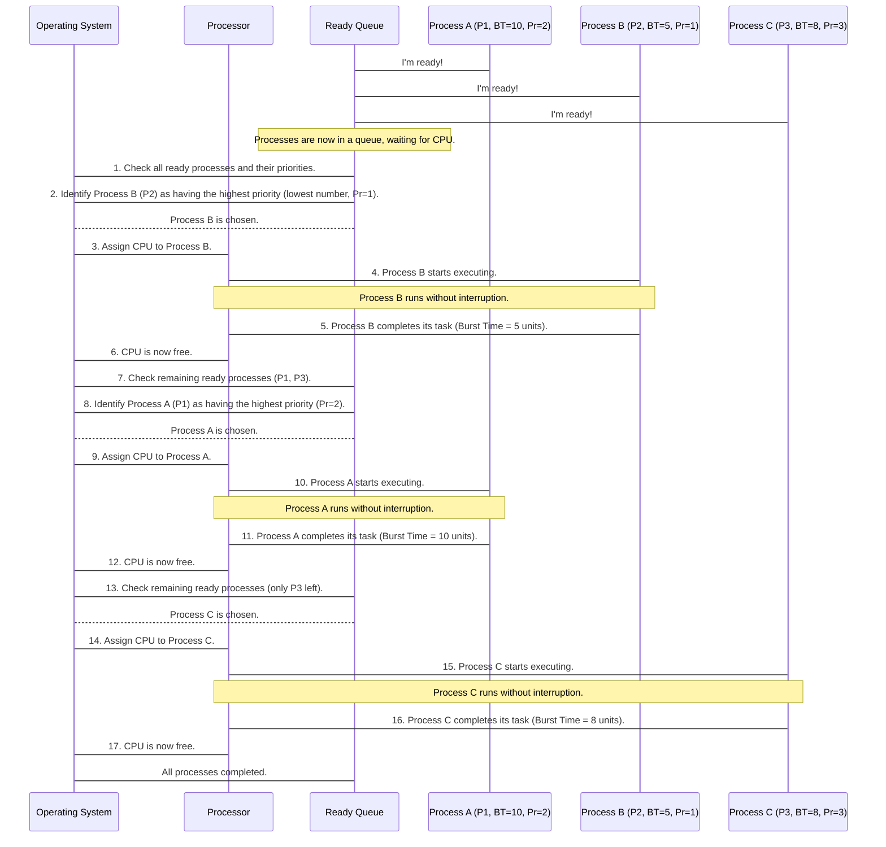

# Chapter 2: CPU Scheduling (Non-Preemptive)

Welcome back! In [Chapter 1: Memory Management (Fixed Partitioning - MFT)](01_memory_management__fixed_partitioning___mft__.md), we learned how your computer's Operating System (OS) carves up memory so different programs can have their own space to run. But getting a space in memory is just one part of the story.

Imagine you're at an amusement park. You've got your ticket (memory allocated), but now you need to get on a ride (use the CPU)! If there are many people (programs) wanting to go on the same ride (the CPU) at the same time, who gets to go next? This is where **CPU Scheduling** comes in. It's the OS's job to act as the ride operator, deciding which program gets to use the computer's brain – the **CPU** (Central Processing Unit) – and for how long.

In this chapter, we'll dive into one of the fundamental ways the OS manages the CPU: **Non-Preemptive CPU Scheduling**.

### The Problem: Sharing the CPU Fairly (or efficiently!)

Your computer's CPU is super fast, but it can generally only do one major task at a time. If you have a web browser, a music player, and a game all running, they all want the CPU's attention. How does the OS prevent them from fighting over it and ensure everything runs smoothly? This is the core challenge that CPU scheduling solves.

**Our Use Case:**
Let's say you have three programs (we call them **processes** in OS terms) ready to run:
*   **Process P1:** A small utility program.
*   **Process P2:** A large data processing task.
*   **Process P3:** A quick email check.

How does the OS decide the order in which these processes use the CPU? And what happens if P2 starts, but P1 is more urgent? This chapter will show one approach to this problem.

### Key Concepts

Let's break down the main ideas behind Non-Preemptive CPU Scheduling:

1.  **CPU (Central Processing Unit):** This is the "brain" of your computer. It executes instructions and performs calculations. There's usually only one (or a few cores acting like separate CPUs) available at any given moment.

2.  **Process:** A program that is currently running. For example, your web browser, a word processor, or a game are all processes when they are active.

3.  **CPU Scheduler:** This is a special part of the Operating System that acts like a "traffic cop" for the CPU. Its job is to choose which process from the "ready" queue (processes waiting for the CPU) gets to use the CPU next.

4.  **Non-Preemptive Scheduling:** This is the key concept for this chapter!
    *   **Analogy:** Imagine a ticket counter. Once a person (process) reaches the counter and starts their transaction (using the CPU), they *must* finish it before the next person is called. Even if someone incredibly important or urgent (a higher-priority process) arrives in the line, they have to wait for the current transaction to complete.
    *   In technical terms: Once the CPU is assigned to a process, that process keeps the CPU until it either completes its task or voluntarily gives up the CPU (e.g., it needs to wait for input/output, like reading from a disk). The OS **cannot** forcibly take the CPU away from it.

5.  **Priority Scheduling (A Non-Preemptive Example):** There are different ways a non-preemptive scheduler can decide which process goes next. One common way is **Priority Scheduling**.
    *   Each process is given a **priority number**.
    *   Often, a **lower number means a higher priority**. So, a process with priority '1' is more important than a process with priority '5'.
    *   The scheduler always picks the process with the highest priority (lowest number) from the ready queue. If there's a tie (two processes have the same priority), they might be handled in the order they arrived (First-Come, First-Served, or FCFS).

6.  **Important Time Metrics:** When evaluating scheduling, we often look at:
    *   **Burst Time (BT):** This is the amount of time a process needs the CPU to complete its task. Think of it as how long a person needs at the ticket counter.
    *   **Waiting Time (WT):** This is the total time a process spends waiting in the "ready queue" for its turn to use the CPU. It's the time from when it's ready until it actually starts executing.
    *   **Turnaround Time (TAT):** This is the total time a process spends in the system, from the moment it arrives until it completes. It's simply `Burst Time + Waiting Time`.

### How Non-Preemptive Priority Scheduling Works (Solving Our Use Case)

Let's use our example processes (P1, P2, P3) and see how non-preemptive priority scheduling handles them.

**Our Use Case Scenario:**
We have three processes with the following details:
*   **P1:** Burst Time = 10 units, Priority = 2
*   **P2:** Burst Time = 5 units, Priority = 1 (Highest Priority)
*   **P3:** Burst Time = 8 units, Priority = 3 (Lowest Priority)

*(Note: "units" can be milliseconds, seconds, etc. The specific unit doesn't matter for the logic).*

Here's how the CPU Scheduler would process them:

1.  **Identify Highest Priority:** The scheduler looks at all ready processes. P2 has Priority 1, which is the highest.
2.  **P2 Executes:** P2 gets the CPU. Because it's non-preemptive, P2 will run *until it finishes* its 5 units of burst time. No other process can interrupt it.
3.  **P2 Completes:** After 5 units, P2 is done and releases the CPU.
4.  **Next Highest Priority:** The scheduler now looks at the remaining ready processes: P1 (Priority 2) and P3 (Priority 3). P1 has a higher priority.
5.  **P1 Executes:** P1 gets the CPU. It runs for its entire 10 units of burst time.
6.  **P1 Completes:** After 10 units, P1 is done.
7.  **Last Process:** Only P3 (Priority 3) is left.
8.  **P3 Executes:** P3 gets the CPU and runs for its 8 units of burst time.
9.  **P3 Completes:** P3 is done. All processes have finished.

Let's visualize the CPU's usage over time (this is called a Gantt Chart):


*   P2 runs from time 0 to 5.
*   P1 runs from time 5 to 15 (5 + 10).
*   P3 runs from time 15 to 23 (15 + 8).

Now let's calculate the Waiting Time and Turnaround Time for each process:

*   **P2 (BT=5, Priority=1):**
    *   Waiting Time: 0 (it started immediately)
    *   Turnaround Time: 0 (WT) + 5 (BT) = 5
*   **P1 (BT=10, Priority=2):**
    *   Waiting Time: 5 (it waited for P2 to finish)
    *   Turnaround Time: 5 (WT) + 10 (BT) = 15
*   **P3 (BT=8, Priority=3):**
    *   Waiting Time: 5 (for P2) + 10 (for P1) = 15
    *   Turnaround Time: 15 (WT) + 8 (BT) = 23

**Average Waiting Time:** (0 + 5 + 15) / 3 = 20 / 3 = **6.67 units**
**Average Turnaround Time:** (5 + 15 + 23) / 3 = 43 / 3 = **14.33 units**

This example clearly shows how a higher priority process (P2) gets to run first, and crucially, once it starts, it finishes without interruption. P1, despite being ready, had to wait for P2. P3 waited the longest because of its lower priority.

### Under the Hood: The OS's Role

Let's trace what happens step-by-step from the Operating System's perspective for Non-Preemptive Priority Scheduling:



### Diving into the Code (Simplified `non_preemptive.c`)

Let's look at a very simplified C code snippet that simulates this non-preemptive priority scheduling technique. We'll focus on the essential parts, similar to the logic we just discussed.

First, we set up our variables and ask for the number of processes.

```c
#include<stdio.h>

int main() {
    // Variables for burst time, process ID, waiting time, turnaround time, priority
    int bt[20], p[20], wt[20], tat[20], pr[20], i, j, n, pos, temp;
    // Using float for totals and averages to get more accurate results
    float total_wt = 0, total_tat = 0, avg_wt, avg_tat;

    printf("Enter Total Number of Processes: ");
    scanf("%d", &n); // n: number of processes

    // ... rest of the code for process details
    return 0;
}
```
**Explanation:**
*   `bt[]` stores the Burst Time for each process.
*   `p[]` stores the original Process ID (P1, P2, etc.).
*   `wt[]` stores the Waiting Time.
*   `tat[]` stores the Turnaround Time.
*   `pr[]` stores the Priority for each process.
*   `total_wt` and `total_tat` will sum up the times for calculating averages.

Next, we get the Burst Time and Priority for each process from the user.

```c
// ... previous code ...

printf("\nEnter Burst Time and Priority for each process:\n");
for(i=0; i<n; i++) {
    printf("\nProcess P[%d]:\n", i+1);
    printf("  Burst Time: ");
    scanf("%d", &bt[i]);
    printf("  Priority: ");
    scanf("%d", &pr[i]);
    p[i] = i+1; // Assign process number (P1, P2, etc.)
}

// ... rest of the code for sorting and calculations
```
**Explanation:**
*   This loop asks the user to input the Burst Time and Priority for each process.
*   `p[i] = i+1` ensures we keep track of the original process number, even after sorting.

Now, the most important part for priority scheduling: **sorting** the processes based on their priority. Remember, lower priority number means higher importance!

```c
// ... previous code ...

// Sorting processes based on priority (lower number = higher priority)
// We use a simple selection sort for demonstration
for(i=0; i<n; i++) {
    pos = i;
    for(j=i+1; j<n; j++) {
        if(pr[j] < pr[pos]) // If current process (pr[j]) has higher priority
            pos = j;         // Update 'pos' to point to this higher priority process
    }

    // Swap priorities, burst times, and process IDs to keep them together
    temp = pr[i]; pr[i] = pr[pos]; pr[pos] = temp; // Swap priorities
    temp = bt[i]; bt[i] = bt[pos]; bt[pos] = temp; // Swap burst times
    temp = p[i]; p[i] = p[pos]; p[pos] = temp;     // Swap process IDs
}
// ... rest of the code for calculating times
```
**Explanation:**
*   This nested loop effectively sorts the processes. After this loop, `pr[0]` will hold the highest priority (lowest number), `bt[0]` will be its burst time, and `p[0]` will be its original ID. The processes are now arranged in the order they will be executed.

Next, we calculate the Waiting Time and Turnaround Time.

```c
// ... previous code ...

wt[0] = 0; // The first process (highest priority) waits 0 time
total_wt = 0; // Initialize total waiting time
for(i=1; i<n; i++) {
    wt[i] = 0;
    for(j=0; j<i; j++)
        wt[i] += bt[j]; // Waiting time for process i is sum of burst times of all *previous* processes
    total_wt += wt[i]; // Add to total waiting time for average calculation
}
avg_wt = total_wt / n; // Calculate average waiting time

total_tat = 0; // Initialize total turnaround time
printf("\n\nProcess\t Burst Time \tPriority\tWaiting Time\tTurnaround Time");
for(i=0; i<n; i++) {
    tat[i] = bt[i] + wt[i]; // Turnaround time = Burst Time + Waiting Time
    total_tat += tat[i]; // Add to total turnaround time for average
    printf("\nP[%d]\t\t %d\t\t %d\t\t\t%d\t\t\t%d", p[i], bt[i], pr[i], wt[i], tat[i]);
}
avg_tat = total_tat / n; // Calculate average turnaround time

printf("\n\nAverage Waiting Time=%.2f", avg_wt); // Display with 2 decimal places
printf("\nAverage Turnaround Time=%.2f\n", avg_tat);

return 0;
}
```
**Explanation:**
*   `wt[0] = 0` makes sense because the first process (the one with the highest priority after sorting) doesn't have to wait for anyone.
*   For subsequent processes, their waiting time is the sum of the burst times of *all* the processes that executed before them. This is the essence of non-preemptive scheduling: once a process starts, it finishes, adding its entire burst time to the wait of subsequent processes.
*   Turnaround time is simply the sum of a process's burst time and its waiting time.
*   Finally, the average waiting and turnaround times are calculated and printed. Using `%.2f` in `printf` ensures the float averages are displayed with two decimal places.

**Example Run (Input and Output):**

Let's try our use case:
*   Process P1: Burst Time = 10, Priority = 2
*   Process P2: Burst Time = 5, Priority = 1
*   Process P3: Burst Time = 8, Priority = 3

```
Enter Total Number of Processes: 3

Enter Burst Time and Priority for each process:

Process P[1]:
  Burst Time: 10
  Priority: 2

Process P[2]:
  Burst Time: 5
  Priority: 1

Process P[3]:
  Burst Time: 8
  Priority: 3


Process	 Burst Time 	Priority	Waiting Time	Turnaround Time
P[2]		 5		 1			0			5
P[1]		 10		 2			5			15
P[3]		 8		 3			15			23

Average Waiting Time=6.67
Average Turnaround Time=14.33
```

The output matches our manual calculation perfectly! You can see P2 (Priority 1) ran first with 0 waiting time. Then P1 (Priority 2) waited for P2's 5 units. Finally, P3 (Priority 3) waited for both P2 (5 units) and P1 (10 units), totaling 15 units.

### Conclusion

In this chapter, we explored **Non-Preemptive CPU Scheduling**, specifically using **Priority Scheduling** as a concrete example. We learned that:
*   The **CPU Scheduler** decides which process gets to use the CPU.
*   In **non-preemptive** scheduling, once a process starts using the CPU, it continues until it finishes its task or voluntarily gives up the CPU. The OS cannot forcibly interrupt it.
*   **Priority Scheduling** allows us to give importance to certain tasks, with higher-priority tasks getting the CPU first.
*   Key metrics like **Burst Time**, **Waiting Time**, and **Turnaround Time** help us evaluate the efficiency of a scheduling algorithm.

Non-preemptive scheduling is simpler to implement and ensures that a process, once started, completes its critical section without interruption. However, it has a significant drawback: a low-priority process might have to wait a very long time if there's a continuous stream of higher-priority processes. This problem is known as **starvation**.

This limitation is precisely what **preemptive** scheduling aims to solve! In the next chapter, we'll see how the OS can become a bit more assertive and interrupt a running process if a more important one suddenly becomes ready: [CPU Scheduling (Preemptive)](03_cpu_scheduling__preemptive__.md).

---

Generated by [AI Codebase Knowledge Builder]