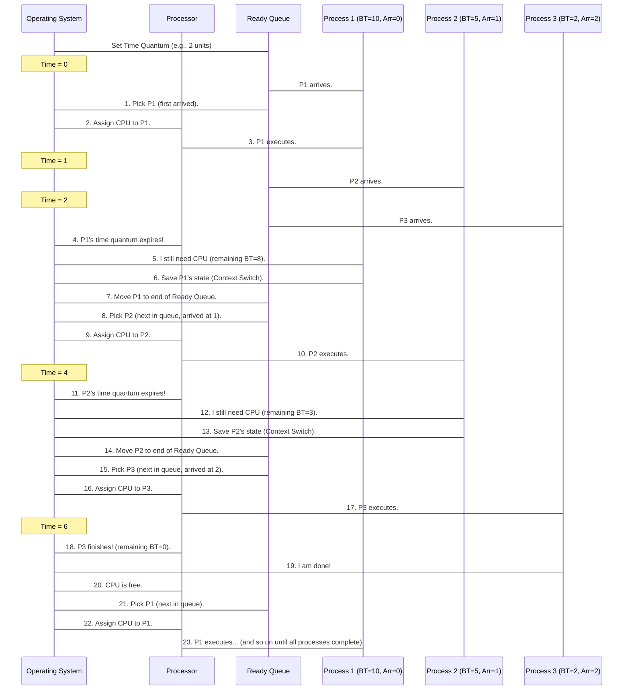

# Chapter 3: CPU Scheduling (Preemptive)

Welcome back! In [Chapter 2: CPU Scheduling (Non-Preemptive)](02_cpu_scheduling__non_preemptive__.md), we learned how the Operating System (OS) acts as a traffic cop for your CPU, deciding which program (process) gets to run. We saw that in **non-preemptive** scheduling, once a process starts, it holds onto the CPU until it finishes or voluntarily gives it up. This is simple, but it has a big problem: what if a very important, urgent task arrives, but the CPU is busy with a long, less important one? The urgent task has to wait, potentially making your computer feel slow or unresponsive.

Imagine a doctor's office. In a non-preemptive system, if a patient is having a routine check-up, an emergency patient has to wait until the check-up is completely finished. That's not ideal for emergencies!

This is where **Preemptive CPU Scheduling** comes in. This approach allows the operating system to interrupt a running process and give the CPU to another process, like our emergency patient getting immediate attention. This ensures your computer remains responsive and fair, even when many tasks are competing for the CPU.

### The Problem: Responsiveness and Fairness

Let's consider our processes again, but this time with a focus on responsiveness.

**Our Use Case:**
You're using your computer, and you have a few programs (processes) running:
*   **P1:** A large file download (needs 10 units of CPU, arrived at time 0).
*   **P2:** A music player (needs 5 units of CPU, arrived at time 1).
*   **P3:** A quick chat message (needs 2 units of CPU, arrived at time 2).

If we used non-preemptive scheduling, P1 would start at time 0, run for 10 units, and *only then* would P2 and P3 get a chance. Your music player and chat message would feel very slow. How can the OS ensure that all processes get a fair share of the CPU's attention, and interactive tasks feel snappy?

### Key Concepts

Let's break down the main ideas behind Preemptive CPU Scheduling:

1.  **CPU, Process, CPU Scheduler:** These are the same as in the previous chapter. The CPU is the brain, processes are running programs, and the CPU Scheduler is the OS part that decides who uses the CPU.

2.  **Preemptive Scheduling:** This is the core idea!
    *   **Analogy:** Back to the doctor's office: if a routine check-up is happening, and an emergency patient arrives, the doctor can *stop* the check-up, attend to the emergency, and then return to the check-up later.
    *   In technical terms: The OS can forcibly take the CPU away from a running process and assign it to another one. This happens based on certain criteria, like a higher-priority process becoming ready, or a process using the CPU for too long.

3.  **Time Slice (or Quantum):** This is a small, fixed amount of time that a process is allowed to run on the CPU before it *must* give it up.
    *   Imagine everyone at the ticket counter gets exactly 1 minute. If they're not done, they step aside, and the next person gets 1 minute. They'll come back to the counter later.
    *   This is the basis of a common preemptive algorithm called **Round Robin (RR)** scheduling, which we'll focus on.

4.  **Context Switching:** When the OS switches the CPU from one process to another, it needs to save the current state of the running process (where it was, what it was doing) and load the saved state of the next process. This saving and loading is called **context switching**. It takes a tiny bit of time, so too many switches can slow things down.

5.  **Important Time Metrics:** These are the same as before:
    *   **Burst Time (BT):** Total CPU time a process needs.
    *   **Waiting Time (WT):** Total time a process spends waiting for the CPU.
    *   **Turnaround Time (TAT):** Total time from arrival until completion.

### How Preemptive Scheduling Works (Round Robin)

Let's solve our use case using **Round Robin (RR)**, a popular preemptive scheduling algorithm. We'll set a **Time Quantum** (or time slice) of **2 units**.

**Our Use Case Scenario:**
*   **P1:** Arrival Time = 0, Burst Time = 10 units
*   **P2:** Arrival Time = 1, Burst Time = 5 units
*   **P3:** Arrival Time = 2, Burst Time = 2 units
*   **Time Quantum = 2 units**

Here's how the CPU Scheduler would process them:

*   **Time 0:** P1 arrives. Only P1 is ready.
    *   P1 starts executing.
*   **Time 1:** P2 arrives. P1 is still running.
*   **Time 2:** P3 arrives. P1 has run for 2 units (its time quantum is up!).
    *   **Preemption!** The OS interrupts P1. P1's remaining burst time is 8 (10-2).
    *   The OS now looks for the next process. P2 and P3 are ready. P2 arrived first (at time 1), so it gets the CPU.
    *   P2 starts executing.
*   **Time 4:** P2 has run for 2 units (its time quantum is up!).
    *   **Preemption!** The OS interrupts P2. P2's remaining burst time is 3 (5-2).
    *   P3 is ready. It gets the CPU.
    *   P3 starts executing.
*   **Time 6:** P3 has run for 2 units. P3's remaining burst time is 0.
    *   **P3 Completes!** P3 is done.
    *   The OS looks for the next process. P1 and P2 are ready. P1 arrived earlier and was put back in the ready queue before P2. So P1 gets the CPU.
    *   P1 starts executing.
*   **Time 8:** P1 has run for another 2 units. P1's remaining burst time is 6 (8-2).
    *   **Preemption!** The OS interrupts P1.
    *   P2 is ready. It gets the CPU.
    *   P2 starts executing.
*   **Time 10:** P2 has run for another 2 units. P2's remaining burst time is 1 (3-2).
    *   **Preemption!** The OS interrupts P2.
    *   P1 is ready. It gets the CPU.
    *   P1 starts executing.
*   **Time 12:** P1 has run for another 2 units. P1's remaining burst time is 4 (6-2).
    *   **Preemption!** The OS interrupts P1.
    *   P2 is ready. P2 only needs 1 more unit.
    *   P2 starts executing.
*   **Time 13:** P2 has run for 1 unit. P2's remaining burst time is 0.
    *   **P2 Completes!** P2 is done.
    *   P1 is ready. It gets the CPU.
    *   P1 starts executing.
*   **Time 15:** P1 has run for another 2 units. P1's remaining burst time is 2 (4-2).
    *   **Preemption!** The OS interrupts P1.
    *   P1 is still the only one ready. It gets the CPU again.
    *   P1 starts executing.
*   **Time 17:** P1 has run for 2 units. P1's remaining burst time is 0.
    *   **P1 Completes!** P1 is done. All processes are finished.

Let's visualize the CPU's usage over time with a Gantt Chart:

```mermaid
gantt
    title Preemptive Round Robin Scheduling Example (Quantum=2)
    dateFormat  X
    axisFormat %s
    P1 : 0, 2
    P2 : 2, 2
    P3 : 4, 2
    P1 : 6, 2
    P2 : 8, 2
    P1 : 10, 2
    P2 : 12, 1
    P1 : 13, 2
    P1 : 15, 2
```


*   P1 runs from 0-2 (BT remaining: 8)
*   P2 runs from 2-4 (BT remaining: 3)
*   P3 runs from 4-6 (BT remaining: 0, **P3 completes!**)
*   P1 runs from 6-8 (BT remaining: 6)
*   P2 runs from 8-10 (BT remaining: 1)
*   P1 runs from 10-12 (BT remaining: 4)
*   P2 runs from 12-13 (BT remaining: 0, **P2 completes!**)
*   P1 runs from 13-15 (BT remaining: 2)
*   P1 runs from 15-17 (BT remaining: 0, **P1 completes!**)

Now, let's calculate the Waiting Time and Turnaround Time for each process:

*   **P1 (Arrival=0, BT=10):**
    *   Completion Time: 17
    *   Turnaround Time: 17 (Completion) - 0 (Arrival) = 17
    *   Waiting Time: 17 (TAT) - 10 (BT) = 7
*   **P2 (Arrival=1, BT=5):**
    *   Completion Time: 13
    *   Turnaround Time: 13 (Completion) - 1 (Arrival) = 12
    *   Waiting Time: 12 (TAT) - 5 (BT) = 7
*   **P3 (Arrival=2, BT=2):**
    *   Completion Time: 6
    *   Turnaround Time: 6 (Completion) - 2 (Arrival) = 4
    *   Waiting Time: 4 (TAT) - 2 (BT) = 2

**Average Waiting Time:** (7 + 7 + 2) / 3 = 16 / 3 = **5.33 units**
**Average Turnaround Time:** (17 + 12 + 4) / 3 = 33 / 3 = **11.00 units**

Compare this to a non-preemptive approach where P1 runs for 10 units first. P2 would wait 9 units (until time 10) and P3 would wait 8 units (until time 10). Round Robin provides a fairer distribution of CPU time, making interactive tasks feel more responsive.

### Under the Hood: The OS's Role

Here's how the Operating System manages Round Robin scheduling:



### Diving into the Code (Simplified `preemptive.c`)

Let's look at a simplified C code snippet that simulates Round Robin scheduling. We'll focus on the essential logic for preemption and time slicing.

First, we set up variables and get the total number of processes.

```c
#include<stdio.h>

int main() {
    // Variables for process details and calculations
    int i, limit, total = 0, x, counter = 0, time_quantum;
    int wait_time = 0, turnaround_time = 0;
    int arrival_time[10], burst_time[10], temp[10]; // temp[] stores remaining burst time
    float average_wait_time, average_turnaround_time;

    printf("Enter Total Number of Processes:");
    scanf("%d", &limit); // limit: number of processes
    x = limit; // x: a copy of limit, used to count completed processes

    // ... rest of the code for process details
    return 0;
}
```
**Explanation:**
*   `limit` stores how many processes we have.
*   `x` is a counter that decreases each time a process completes, helping us know when all processes are done.
*   `arrival_time[]` stores when each process becomes ready.
*   `burst_time[]` stores the total CPU time each process needs.
*   `temp[]` is very important! It stores the *remaining* burst time for each process, as it gets interrupted and resumes.

Next, we get the arrival time and burst time for each process, and initialize `temp[]`.

```c
// ... previous code ...

for(i = 0; i < limit; i++) {
    printf("Enter Details of Process[%d]\n", i + 1); // Use \n for clarity
    printf("  Arrival Time: ");
    scanf("%d", &arrival_time[i]);
    printf("  Burst Time: ");
    scanf("%d", &burst_time[i]);
    temp[i] = burst_time[i]; // Initially, remaining burst time is full burst time
}

printf("Enter Time Quantum (time slice): "); // Clarified prompt
scanf("%d", &time_quantum);

// ... rest of the code for scheduling
```
**Explanation:**
*   This loop gathers the required `arrival_time` and `burst_time` for each process.
*   `temp[i] = burst_time[i]` is crucial: it sets the initial *remaining* time for each process.
*   `time_quantum` is the maximum time a process can run before being preempted.

Now, the core of the Round Robin scheduler: the main loop that simulates time and process execution.

```c
// ... previous code ...

printf("\nProcess ID\tBurst Time\tTurnaround Time\tWaiting Time\n"); // Corrected output header

// Main scheduling loop
for(total = 0, i = 0; x != 0;) { // total: current time, i: current process index, x: processes remaining
    if(temp[i] <= time_quantum && temp[i] > 0) { // Case 1: Process can finish within or by its quantum
        total = total + temp[i]; // Advance total time by remaining burst time
        temp[i] = 0;             // Process is completed
        counter = 1;             // Flag that a process completed
    }
    else if(temp[i] > 0) {       // Case 2: Process needs more than its quantum
        temp[i] = temp[i] - time_quantum; // Reduce remaining burst time
        total = total + time_quantum;     // Advance total time by quantum
    }

    // ... code to handle process completion and queue management
}
// ... rest of the code for calculations
```
**Explanation:**
*   The `for` loop continues until `x` (number of unfinished processes) becomes 0.
*   `total` tracks the current simulated time.
*   `if(temp[i] <= time_quantum && temp[i] > 0)`: If the process `i` needs less time than the quantum, or exactly the quantum, it completes. `total` is updated, `temp[i]` becomes 0, and `counter` is set to 1 to mark its completion.
*   `else if(temp[i] > 0)`: If the process `i` needs *more* time than the quantum, it runs for exactly `time_quantum`. Its `temp[i]` (remaining burst time) is reduced, and `total` (current time) is advanced by the quantum.

This next block handles what happens after a process finishes or its quantum expires, managing the flow between processes.

```c
// ... previous code ...

    if(temp[i] == 0 && counter == 1) { // If current process completed (temp[i] is 0 and counter is 1)
        x--; // One less process remaining
        // Calculate and print details for the completed process
        printf("P[%d]\t\t%d\t\t %d\t\t\t %d\n", i + 1, burst_time[i],
               total - arrival_time[i], total - arrival_time[i] - burst_time[i]);
        wait_time = wait_time + total - arrival_time[i] - burst_time[i];
        turnaround_time = turnaround_time + total - arrival_time[i];
        counter = 0; // Reset completion flag
    }

    if(i == limit - 1) { // If we're at the last process in our array
        i = 0;           // Go back to the first process (Round Robin logic)
    }
    else if(arrival_time[i + 1] <= total) { // If the next process in array has arrived by current time
        i++; // Move to the next process in the array
    }
    else { // If no other processes have arrived yet, and we are not at the end of the array,
           // loop back to the first process to check again
        i = 0;
    }
}
// ... rest of the code for averages
```
**Explanation:**
*   `if(temp[i] == 0 && counter == 1)`: When a process completes, we decrement `x` and print its calculated Turnaround and Waiting times.
*   The `if/else if/else` block manages which process gets the CPU next:
    *   `if(i == limit - 1)`: If we've processed the "last" process in our array for this round, we loop back to `i = 0` to check the first process again. This is key for Round Robin's circular queue behavior.
    *   `else if(arrival_time[i + 1] <= total)`: If the *next* process in our initial list has already arrived by the current `total` time, we move to it.
    *   `else`: If neither of the above conditions is met (meaning the next logical process hasn't arrived yet, and we're not at the end of the array), we loop back to `i = 0` to ensure we don't skip any processes that might be ready. This assumes processes are initially sorted by arrival time, or the logic for selecting the next process from the ready queue is more complex in a real OS.

Finally, we calculate and display the average times.

```c
// ... previous code ...

average_wait_time = wait_time * 1.0 / limit; // Cast to float for accurate division
average_turnaround_time = turnaround_time * 1.0 / limit;
printf("\nAverage Waiting Time:\t%.2f\n", average_wait_time); // Format to 2 decimal places
printf("Average Turnaround Time:\t%.2f\n", average_turnaround_time);

return 0;
}
```
**Explanation:**
*   The total waiting and turnaround times are divided by the number of processes (`limit`) to get the averages.
*   `* 1.0` is used to ensure floating-point division.
*   `%.2f` formats the output to two decimal places.

**Example Run (Input and Output):**

Let's try our use case:
*   Total Number of Processes: 3
*   P1: Arrival Time = 0, Burst Time = 10
*   P2: Arrival Time = 1, Burst Time = 5
*   P3: Arrival Time = 2, Burst Time = 2
*   Time Quantum: 2

```
Enter Total Number of Processes:3
Enter Details of Process[1]
  Arrival Time: 0
  Burst Time: 10
Enter Details of Process[2]
  Arrival Time: 1
  Burst Time: 5
Enter Details of Process[3]
  Arrival Time: 2
  Burst Time: 2
Enter Time Quantum (time slice): 2

Process ID	Burst Time	Turnaround Time	Waiting Time
P[3]		2		 4			 2
P[2]		5		 12			 7
P[1]		10		 17			 7

Average Waiting Time:	5.33
Average Turnaround Time:	11.00
```
The output matches our manual calculation! Notice how P3, despite arriving later than P1 and P2, finishes relatively quickly because of preemption, making the system feel responsive.

### Conclusion

In this chapter, we explored **Preemptive CPU Scheduling**, a powerful technique that allows the Operating System to interrupt running processes to ensure better responsiveness and fairness. We focused on **Round Robin scheduling**, which uses a **time quantum** to rotate the CPU among ready processes.

We learned that:
*   Preemption is like a doctor attending to an emergency, interrupting routine tasks.
*   The **time quantum** in Round Robin ensures no single process monopolizes the CPU.
*   **Context switching** is the mechanism the OS uses to save and restore process states during preemption.
*   Preemptive scheduling generally leads to better user experience for interactive systems, as short tasks don't have to wait for long ones to complete.

While more complex to implement than non-preemptive methods, the benefits of preemptive scheduling in modern operating systems are undeniable.

In the next chapter, we'll return to memory management and explore a more flexible approach than fixed partitioning: [Memory Management (Variable Partitioning - MVT)](04_memory_management__variable_partitioning___mvt__.md).

---

Generated by [AI Codebase Knowledge Builder]