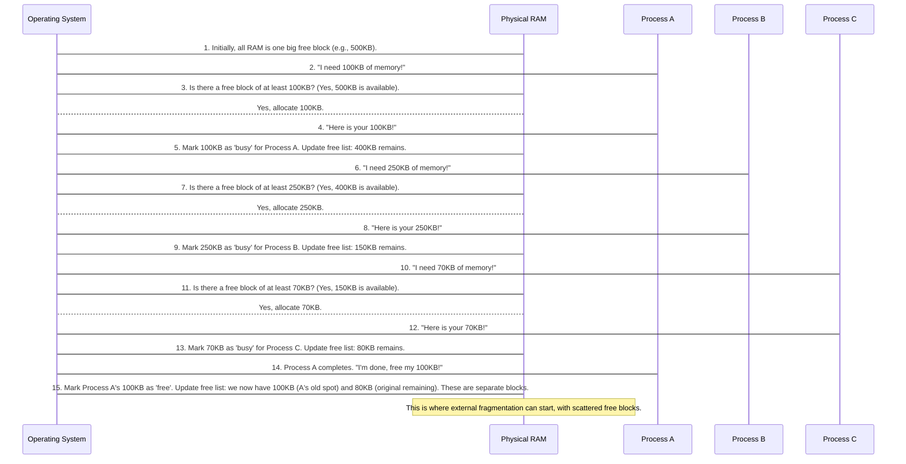

# Chapter 4: Memory Management (Variable Partitioning - MVT)

Welcome back! In [Chapter 1: Memory Management (Fixed Partitioning - MFT)](01_memory_management__fixed_partitioning___mft__.md), we explored how the Operating System (OS) divides your computer's RAM into "fixed" sections. We learned about a major downside of this approach: **internal fragmentation**, which is wasted space *inside* a partition because a program is smaller than the fixed-size block it's given. Imagine a parking lot where all spaces are the size of a huge truck, and you park a small motorcycle in one – a lot of space is wasted!

Modern computers need to be more efficient with memory. Programs come in all shapes and sizes, and wasting valuable RAM can slow things down. This is where **Memory Management (Variable Partitioning - MVT)** steps in. It's a more flexible and efficient way for the OS to manage memory, aiming to get rid of that internal fragmentation we saw with MFT.

### The Problem: Wasted Space and Inflexibility

Let's revisit our memory management problem. Your computer needs to run several programs, each requiring a different amount of memory:
*   **Process A:** Needs 100 KB
*   **Process B:** Needs 250 KB
*   **Process C:** Needs 70 KB

If we had 500 KB of total memory and used MFT with, say, four fixed 125 KB partitions:
*   Process A (100 KB) would fit in a 125 KB partition, wasting 25 KB (internal fragmentation).
*   Process B (250 KB) wouldn't fit in *any single* 125 KB partition! It would have to wait or be rejected. This is a huge limitation.
*   Process C (70 KB) would fit, wasting 55 KB.

MFT is simple but rigid. It's like having a parking garage where all spots are fixed, regardless of the car's size. This leads to wasted space (internal fragmentation) and can prevent larger cars (processes) from parking at all.

MVT tries to solve this by being more dynamic and giving each process *exactly* the space it asks for.

### Key Concepts

Let's break down the main ideas behind Variable Partitioning (MVT):

1.  **Variable-Sized Partitions:**
    Unlike MFT where partitions are fixed at startup, in MVT, partitions are created *dynamically* as processes arrive. Each process gets a partition that is exactly the size it needs. Imagine a dynamic parking garage where the parking attendant draws a parking spot *just big enough* for your car, right when you arrive!

2.  **No Internal Fragmentation:**
    This is the biggest advantage over MFT! Since each process gets exactly the memory it requests, there is no wasted space *inside* the allocated partition. The "extra" space is simply part of the free memory, not trapped within a partition.

3.  **Higher Degree of Multiprogramming:**
    Because memory is used more efficiently (no internal fragmentation), more processes can generally fit into the available RAM, leading to a higher degree of multiprogramming (more programs running concurrently).

4.  **External Fragmentation (The New Challenge!):**
    While internal fragmentation is eliminated, MVT introduces a new problem: **external fragmentation**. What happens when processes finish and their memory is freed? You might end up with many small, scattered free blocks of memory. Individually, these blocks might be too small to satisfy a new, larger process request, even if their *total* sum is enough.
    *   **Analogy:** Back to our dynamic parking garage. After many cars park and leave, you might have tiny gaps here and there. Even if the *total* empty space is large enough for a new car, no single *contiguous* gap is big enough. This makes it hard to find one large continuous space for a big new process.

5.  **Flexibility:**
    MVT is much more flexible because it adapts to the exact memory requirements of each process. There's no limitation on a process's size other than the total available memory.

Let's visualize the difference between fixed and variable partitioning:

```mermaid
graph TD
    A[Total RAM (e.g., 500KB)]

    subgraph Fixed Partitioning (MFT)
        A1[Partition 1 (125KB)]
        A2[Partition 2 (125KB)]
        A3[Partition 3 (125KB)]
        A4[Partition 4 (125KB)]
        
        P_fixed_A(Process A - needs 100KB) --> A1
        A1 -- Wasted 25KB --> IF1[Internal Fragmentation]
        
        P_fixed_B(Process B - needs 250KB) --X No single partition fits X--> A2
        
        P_fixed_C(Process C - needs 70KB) --> A3
        A3 -- Wasted 55KB --> IF2[Internal Fragmentation]
        
        A4 -- Empty --> FreeSpace1[Free Space]
    end

    subgraph Variable Partitioning (MVT)
        B1[Allocated for Process A (100KB)]
        B2[Allocated for Process B (250KB)]
        B3[Allocated for Process C (70KB)]
        B4[Remaining Free Space (80KB)]

        B1 --- No Waste --> NoIF1[No Internal Fragmentation]
        B2 --- No Waste --> NoIF2[No Internal Fragmentation]
        B3 --- No Waste --> NoIF3[No Internal Fragmentation]
        
        B1 --- (Occupied)
        B2 --- (Occupied)
        B3 --- (Occupied)
        
        FreeSpace2[Free Space] --> B4
        Note over B4: Can become 'external fragmentation' if too small for future process.
    end
```

### How Variable Partitioning Works (Solving Our Use Case)

Let's use our example processes and see how MVT handles them.

**Our Use Case Scenario:**
*   Total Memory: 500 KB
*   **Process A:** Needs 100 KB
*   **Process B:** Needs 250 KB
*   **Process C:** Needs 70 KB

Here's how the OS (using MVT) would allocate memory:

1.  **Process A Arrives (needs 100 KB):**
    *   The OS sees 500 KB of free memory.
    *   It allocates *exactly* 100 KB to Process A.
    *   Remaining Free Memory: 500 KB - 100 KB = **400 KB**.
    *   No internal fragmentation for Process A.

2.  **Process B Arrives (needs 250 KB):**
    *   The OS sees 400 KB of free memory.
    *   It allocates *exactly* 250 KB to Process B.
    *   Remaining Free Memory: 400 KB - 250 KB = **150 KB**.
    *   No internal fragmentation for Process B.

3.  **Process C Arrives (needs 70 KB):**
    *   The OS sees 150 KB of free memory.
    *   It allocates *exactly* 70 KB to Process C.
    *   Remaining Free Memory: 150 KB - 70 KB = **80 KB**.
    *   No internal fragmentation for Process C.

All processes were allocated memory without any internal fragmentation! The system successfully ran all three processes, leaving 80 KB of free memory.

Now, imagine Process A finishes and frees its 100 KB. Then Process C finishes and frees its 70 KB. We now have two separate free blocks: one of 100 KB (where A was) and one of 70 KB (where C was), and the original 80 KB remaining at the end. Total free memory is 100 + 70 + 80 = 250 KB. But if a new Process D arrives needing 150 KB, it might not fit if the largest *contiguous* free block is only 100 KB. This is external fragmentation in action!

### Under the Hood: The OS's Role

Let's quickly trace what happens step-by-step from the Operating System's perspective when using Variable Partitioning:



### Diving into the Code (Simplified `mvt.c`)

Let's look at a very simplified C code snippet that simulates some aspects of Variable Partitioning. This code focuses on allocating from a single continuous block and shows how the remaining memory shrinks. It doesn't model multiple free blocks or compaction, but it demonstrates the core idea of exact allocation and remaining memory.

First, we get the total memory and the number of processes.

```c
#include<stdio.h>

void main()
{
    int m=0, m1=0, m2=0, p, count=0, i; // m: total memory, m1: process memory, p: num processes
    printf("Enter the total memory capacity (KB): ");
    scanf("%d",&m); // Get total memory
    printf("Enter the number of processes: ");
    scanf("%d",&p); // Get number of processes

    // ... rest of the code for processes
}
```
**Explanation:**
*   `m` will hold the current total available memory. It starts as the full capacity.
*   `p` stores how many programs (processes) we want to allocate memory for.
*   Other variables are used for process memory requests (`m1`), remaining memory (`m2`), and loop control.

Next, we loop through each process, asking for its memory requirement and attempting to allocate it.

```c
// ... previous code ...

    for(i=0; i<p; i++) // Loop for each process
    {
        printf("\nEnter memory required for process %d (KB): ",i+1);
        scanf("%d",&m1); // Get memory requested by current process

        if(m1 <= m) // Check if requested memory fits in the currently available block
        {
            printf("The memory allocated for process %d is: %d KB\n",i+1,m1); // Allocate exact amount
            m2 = m - m1; // Calculate the remaining memory
            printf("Remaining memory is: %d KB\n",m2);
            m = m2; // Update the total available memory to the remaining amount
        }
        else // If the process does not fit
        {
            printf("Memory is not allocated for process %d (requested %d KB, available %d KB)\n", i+1, m1, m);
        }
        // This simplified code reports the current 'm2' as potential external fragmentation.
        // In a real system, external fragmentation arises from multiple small non-contiguous blocks.
        printf("Possible external fragmentation (current remaining block): %d KB\n", m2);
    }
}
```
**Explanation:**
*   The `for` loop iterates for each process.
*   `scanf("%d",&m1);` gets the memory needed by the current process.
*   `if(m1 <= m)`: This is the core check. If the process's requested memory (`m1`) is less than or equal to the *current largest contiguous free block* (`m`), then it can be allocated.
    *   `printf("... %d KB",i+1,m1);`: We print that the exact amount `m1` is allocated.
    *   `m2 = m - m1;`: The `m2` variable calculates how much memory is *left over* in the main block.
    *   `m = m2;`: We update `m` to be this `m2` value. So, for the *next* process, `m` will represent the smaller remaining contiguous block.
*   `else`: If the requested memory is too large, the process cannot be allocated.
*   The last `printf` line is a simplification: in this simple model, the `m2` value represents the *remaining contiguous block*. If this block is too small for a future process, it essentially becomes part of the "external fragmentation" problem (a piece of free memory too small to be useful).

**Example Run (Input and Output):**

Let's try our use case:
*   Total Memory Capacity: 500 KB
*   Number of Processes: 3
*   Process 1 needs: 100 KB
*   Process 2 needs: 250 KB
*   Process 3 needs: 70 KB

```
Enter the total memory capacity (KB): 500
Enter the number of processes: 3

Enter memory required for process 1 (KB): 100
The memory allocated for process 1 is: 100 KB
Remaining memory is: 400 KB
Possible external fragmentation (current remaining block): 400 KB

Enter memory required for process 2 (KB): 250
The memory allocated for process 2 is: 250 KB
Remaining memory is: 150 KB
Possible external fragmentation (current remaining block): 150 KB

Enter memory required for process 3 (KB): 70
The memory allocated for process 3 is: 70 KB
Remaining memory is: 80 KB
Possible external fragmentation (current remaining block): 80 KB
```
The output perfectly shows how each process gets its exact memory, and the remaining available memory shrinks dynamically. Notice how at the end, the `Possible external fragmentation` is 80 KB. If a new process came asking for 90 KB, it couldn't be allocated, even though it's technically less than the total memory initially available, because the *largest contiguous block* is only 80 KB.

### Conclusion

In this chapter, we explored **Memory Management (Variable Partitioning - MVT)**, a significant improvement over fixed partitioning. We learned that:
*   MVT allocates memory to processes in **variable-sized partitions**, precisely matching their needs.
*   This approach completely eliminates **internal fragmentation**, making memory usage more efficient.
*   It allows for a **higher degree of multiprogramming** and offers greater flexibility.
*   However, MVT introduces the challenge of **external fragmentation**, where memory becomes scattered into many small, unusable free blocks.

While MVT is more efficient with internal memory, the problem of external fragmentation still makes memory management complex. What if we could divide programs themselves into smaller pieces, so they could fit into these scattered free blocks? This idea leads us to more advanced techniques!

In the next chapter, we'll dive into how the OS deals with memory in chunks that aren't necessarily tied to entire programs: [Page Replacement Algorithms](05_page_replacement_algorithms_.md).

---

Generated by [AI Codebase Knowledge Builder]