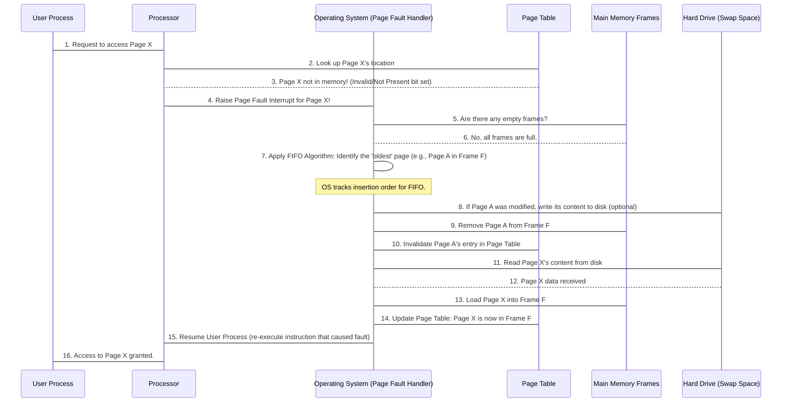

# Chapter 5: Page Replacement Algorithms

Welcome back! In our journey through memory management, we've seen how the Operating System (OS) gives programs their space. In [Chapter 4: Memory Management (Variable Partitioning - MVT)](04_memory_management__variable_partitioning___mvt__.md), we learned that **Variable Partitioning** eliminated the wasted space *inside* allocated blocks (**internal fragmentation**). That was great!

However, MVT introduced a new challenge: **external fragmentation**. This is when memory gets scattered into many small, individual free blocks that are too small to fit a new, larger program, even if the total free space is sufficient. It's like having many tiny parking spots scattered around, but no single spot big enough for a bus.

To solve this, modern operating systems use a technique called **Virtual Memory** with **Paging**. Instead of giving a program one big contiguous chunk of memory, the OS breaks both the program and the physical memory into small, fixed-size chunks. The program's chunks are called **pages**, and physical memory chunks are called **frames**. This way, a program's pages can be loaded into *any available* physical memory frames, even if they are scattered, eliminating external fragmentation!

But what happens when all physical memory frames are full, and a program needs a page that isn't currently loaded? This is a **page fault**. When this happens, the OS needs to make space. It must decide *which* existing page to remove from memory to make room for the new one. This decision is made by a **Page Replacement Algorithm**.

### The Problem: Full Memory, New Page Needed!

Imagine your computer has a very limited amount of "fast" memory (RAM) where it keeps active program parts. Let's say it can only hold 3 pages at a time (these are our **frames**). Now, a program starts asking for pages in a specific order.

**Our Use Case:**
Your computer has **3 memory frames** (slots for pages).
A program requests pages in this order (this is called the **page reference string**): `4, 1, 2, 4, 5`

How does the OS decide which page to remove when a new page is needed and all 3 frames are full? Which page should be sacrificed?

### Key Concepts

Let's break down the main ideas behind Page Replacement Algorithms:

1.  **Virtual Memory & Paging:**
    *   **Virtual Memory:** An illusion created by the OS that a program has more memory than physically available. It allows programs larger than physical memory to run.
    *   **Page:** A fixed-size block of a program's virtual memory.
    *   **Frame:** A fixed-size block of physical RAM. Pages are loaded into frames. This helps solve external fragmentation because any free frame can hold any page.

2.  **Page Fault:**
    *   This happens when a program tries to access a page that is not currently loaded into any physical memory frame. It's like trying to read a specific chapter of a book, but that chapter isn't currently on your desk (in RAM); it's still on the bookshelf (on disk). The OS has to go fetch it.

3.  **Page Replacement Algorithm:**
    *   When a page fault occurs and all memory frames are already occupied, the OS must choose an existing page to remove from a frame to make space for the new page. This is the job of the page replacement algorithm. Its goal is to minimize the number of page faults.

4.  **Reference String:**
    *   The sequence of pages requested by a running program. Our use case `4, 1, 2, 4, 5` is an example of a reference string.

5.  **FIFO (First-In, First-Out):**
    *   This is the simplest page replacement algorithm. It chooses the page that has been in memory for the *longest time* (the "oldest" page) to be replaced.
    *   **Analogy:** Imagine your full bookshelf. When you need to put a new book on it, you remove the book you put on the shelf *first*. It's fair, but not always smart!

6.  **LRU (Least Recently Used) & OPT (Optimal):**
    *   Other algorithms exist:
        *   **LRU:** Replaces the page that has not been used for the *longest period of time*. This often performs better than FIFO.
        *   **Optimal (OPT):** Replaces the page that will *not be used for the longest time in the future*. This is the ideal algorithm, but impossible to implement in practice because the OS cannot predict the future.

### How FIFO Page Replacement Works (Solving Our Use Case)

Let's solve our use case using the **FIFO (First-In, First-Out)** algorithm.

**Our Use Case Scenario:**
*   **Memory Frames:** 3
*   **Page Reference String:** `4, 1, 2, 4, 5`

We'll track the state of the frames and count page faults.

| Time Step | Requested Page | Frame 1 | Frame 2 | Frame 3 | Page Fault? | Notes                                                               |
| :-------- | :------------- | :------ | :------ | :------ | :---------- | :------------------------------------------------------------------ |
| 1         | **4**          | 4       | -       | -       | YES         | Frame 1 empty. Load 4.                                              |
| 2         | **1**          | 4       | 1       | -       | YES         | Frame 2 empty. Load 1.                                              |
| 3         | **2**          | 4       | 1       | 2       | YES         | Frame 3 empty. Load 2. (Frames are now full: [4, 1, 2])             |
| 4         | **4**          | 4       | 1       | 2       | NO          | Page 4 is already in Frame 1 (a "page hit").                        |
| 5         | **5**          | 5       | 1       | 2       | YES         | Frame 1 ([4]) was the first to be filled. Replace 4 with 5.           |
| **Total** |                |         |         |         | **4**       | **Total Page Faults: 4**                                            |

In this example, we experienced **4 page faults**. When page `5` was requested, all frames were full. Using FIFO, page `4` (which was the first one loaded) was chosen for replacement.

### Under the Hood: The OS's Role (FIFO)

Let's trace what happens step-by-step from the Operating System's perspective when a page fault occurs and FIFO is used for replacement:



### Diving into the Code (Simplified `fifo_page.c`)

Let's look at a very simplified C code snippet that simulates the FIFO page replacement algorithm. This code implements the exact logic we just walked through for our use case.

First, we set up our variables, including the incoming page stream and the number of frames.

```c
// C program for FIFO page replacement algorithm
#include <stdio.h>

int main()
{
    int incomingStream[] = {4, 1, 2, 4, 5}; // The pages requested by the program
    int pageFaults = 0;                     // Counter for page faults
    int frames = 3;                         // Number of physical memory frames available

    int m, n, s, pages;                     // Loop counters and flags
    pages = sizeof(incomingStream)/sizeof(incomingStream[0]); // Calculate total pages

    // This array represents our physical memory frames. -1 means empty.
    int temp[frames];
    for(m = 0; m < frames; m++)
    {
        temp[m] = -1; // Initialize all frames as empty
    }
    // ... rest of the code for FIFO logic
    return 0;
}
```
**Explanation:**
*   `incomingStream[]`: This array holds the sequence of page requests (our reference string).
*   `pageFaults`: Starts at 0 and increments every time a requested page is not found in memory.
*   `frames`: Defines how many physical memory slots we have (our "bookshelf capacity").
*   `temp[]`: This array simulates our actual memory frames. Each element `temp[n]` holds the ID of the page currently in that frame. We initialize them to `-1` to signify they are empty.

Next, we process each incoming page from the `incomingStream`.

```c
// ... previous code ...

    printf("Incoming \t Frame 1 \t Frame 2 \t Frame 3");

    for(m = 0; m < pages; m++) // Loop through each requested page
    {
        s = 0; // Flag: 0 if page is NOT in frames, 1 if it IS in frames
        for(n = 0; n < frames; n++) // Check if current page is already in any frame
        {
            if(incomingStream[m] == temp[n]) // Page hit!
            {
                s++; // Set flag to indicate page found
                pageFaults--; // Decrement pageFaults (it was incremented prematurely below)
                break;        // No need to check other frames, page found
            }
        }
        pageFaults++; // Assume it's a page fault initially, will correct if it's a hit

        // ... code for handling page faults and replacement
    }
    // ... rest of the code for results
```
**Explanation:**
*   The outer `for` loop iterates through each page request in `incomingStream`.
*   The inner `for` loop checks if the `incomingStream[m]` (the currently requested page) is already present in any of our `temp[n]` frames.
*   If `incomingStream[m] == temp[n]`: It's a **page hit**! We set `s = 1` and decrement `pageFaults` (because we initially assumed every request is a fault and incremented it).
*   `pageFaults++`: This line initially increments `pageFaults` for *every* incoming page. If it's a hit, `pageFaults` is then decremented by the `if` block, effectively making it count only faults. This is a common, slightly quirky way to implement it.

Now, the core FIFO replacement logic:

```c
// ... previous code ...

        if((pageFaults <= frames) && (s == 0)) // Condition for initial filling of frames
        {
            // If frames are not yet full AND the page is not already present,
            // simply add the page to the next available frame (based on the order of requests).
            // This implicitly relies on 'm' incrementing for each page,
            // filling temp[0], temp[1], temp[2] in order for the first 'frames' number of unique pages.
            // Note: This specific implementation of filling frames is a bit simplified.
            temp[m] = incomingStream[m];
        }
        else if(s == 0) // Condition for page fault when frames are full
        {
            // Frames are full and it's a page fault.
            // Use FIFO: replace the page that came in earliest.
            // (pageFaults - 1) % frames gives the index of the frame to replace.
            // Example: For 3 frames, (3-1)%3 = 2, (4-1)%3 = 0, (5-1)%3 = 1.
            temp[(pageFaults - 1) % frames] = incomingStream[m];
        }

        // ... code for printing current frame state
```
**Explanation:**
*   `if((pageFaults <= frames) && (s == 0))`: This block handles the initial loading when frames are empty. If there's space and it's a new page, it just places it in the next available `temp[m]` slot. (Note: The `temp[m] = incomingStream[m]` directly uses `m` for indexing which works only for the initial `frames` unique pages. A more robust way would be to find the first `-1` slot).
*   `else if(s == 0)`: This is the crucial FIFO replacement. If the frames are full (`pageFaults` is now greater than `frames` after the initial fill) and the page is *not* in memory (`s == 0`), a replacement is needed.
    *   `temp[(pageFaults - 1) % frames] = incomingStream[m]`: This is the FIFO rule! `(pageFaults - 1) % frames` calculates the index of the "oldest" page based on the order of page faults. For example, with 3 frames, the 1st fault replaces `temp[0]`, the 2nd replaces `temp[1]`, the 3rd replaces `temp[2]`, the 4th replaces `temp[0]` again, and so on.

Finally, we print the state of the frames and the total page faults.

```c
// ... previous code ...

        printf("\n");
        printf("%d\t\t\t",incomingStream[m]); // Print the requested page
        for(n = 0; n < frames; n++) // Print current state of all frames
        {
            if(temp[n] != -1)
                printf(" %d\t\t\t", temp[n]); // Show page ID if frame is occupied
            else
                printf(" - \t\t\t");          // Show '-' if frame is empty
        }
    }
    printf("\nTotal Page Faults:\t%d\n", pageFaults); // Final count
    return 0;
}
```
**Explanation:**
*   This part simply prints the `incomingStream` page and then the current contents of all `frames` (`temp[]` array) after each step, making it easy to follow the algorithm's execution.
*   Finally, it prints the total number of page faults.

**Example Run (Input and Output):**

Let's try our use case:
*   Incoming Stream: `4, 1, 2, 4, 5`
*   Frames: 3

```
Incoming 	 Frame 1 	 Frame 2 	 Frame 3
4			 4			 - 			 - 			
1			 4			 1			 - 			
2			 4			 1			 2			
4			 4			 1			 2			
5			 5			 1			 2			
Total Page Faults:	4
```
The output perfectly matches our manual walkthrough! The code successfully simulated the FIFO page replacement algorithm.

### Conclusion

In this chapter, we tackled a crucial aspect of virtual memory: **Page Replacement Algorithms**. We learned that when memory frames are full and a program requests a new page (a **page fault**), the OS must decide which existing page to remove.

We explored:
*   The motivation behind **paging** (to eliminate external fragmentation).
*   The concept of a **page fault** and why it's a big deal.
*   **FIFO (First-In, First-Out)** as the simplest page replacement algorithm, which replaces the oldest page in memory.
*   How to track **page faults** and trace the execution of the FIFO algorithm.
*   A basic C implementation of FIFO, demonstrating its core logic.

While FIFO is easy to understand, it's not always the most efficient. Sometimes, it removes frequently used pages, leading to more page faults. This is why other, more sophisticated algorithms like LRU (Least Recently Used) exist.

Now that we understand how pages are managed in memory, let's switch gears to another critical OS challenge: ensuring different processes can work together without causing chaos. In the next chapter, we'll dive into **[Process Synchronization](06_process_synchronization_.md)**.

---

Generated by [AI Codebase Knowledge Builder]