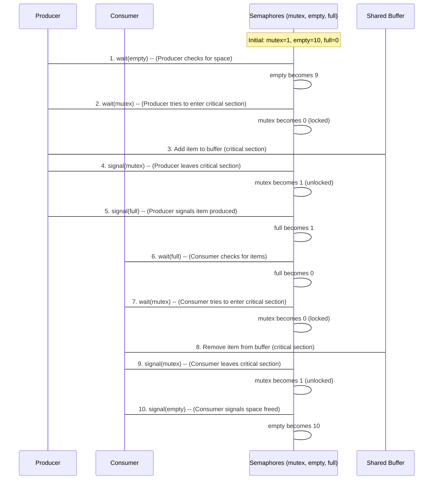

# Chapter 6: Process Synchronization

Welcome back! In our previous chapters, we've seen how the Operating System (OS) expertly manages resources for individual programs (which we call **processes**). We learned about allocating memory in [Chapter 1: Memory Management (Fixed Partitioning - MFT)](01_memory_management__fixed_partitioning___mft__.md) and [Chapter 4: Memory Management (Variable Partitioning - MVT)](04_memory_management__variable_partitioning___mvt__.md), how it schedules the CPU in [Chapter 2: CPU Scheduling (Non-Preemptive)](02_cpu_scheduling__non_preemptive__.md) and [Chapter 3: CPU Scheduling (Preemptive)](03_cpu_scheduling__preemptive__.md), and even how it handles memory shortages with [Chapter 5: Page Replacement Algorithms](05_page_replacement_algorithms_.md).

So far, we've mostly thought about processes as independent entities. But what happens when multiple processes, or parts of the same process (**threads**), need to work *together* and share resources? Imagine two people trying to edit the same sentence in a document at the exact same time, or two cars trying to enter the same intersection without a traffic light. Chaos! Data could get corrupted, or the system could crash.

This is where **Process Synchronization** comes in. It's the art of coordinating the execution of multiple processes or threads to ensure they work together correctly, especially when they share resources. It's like a traffic light system that manages cars at an intersection to prevent crashes and keep things moving smoothly.

### The Problem: Shared Resources Lead to Chaos

Let's imagine a common scenario in computing: the **Producer-Consumer Problem**.

**Our Use Case:**
You have a program that collects data (**Producer**) and another program that processes that data (**Consumer**). They both use a shared storage area (a **buffer** or queue) in memory.
*   The **Producer** creates data items and puts them into the buffer.
*   The **Consumer** takes data items out of the buffer and uses them.

What could go wrong if they don't coordinate?
1.  **Producer tries to add to a full buffer:** It needs to wait.
2.  **Consumer tries to remove from an empty buffer:** It needs to wait.
3.  **Both try to access the *same spot* in the buffer at the exact same time:** Data could be overwritten, lost, or corrupted. For example, if both try to update a counter for items, the final count might be wrong.

How does the OS help these processes cooperate nicely and avoid these kinds of "crashes" or "miscommunications"?

### Key Concepts

Let's break down the main ideas behind Process Synchronization:

1.  **Shared Resources:**
    These are any pieces of data, hardware, or files that can be accessed by multiple processes or threads. Examples include: a shared memory buffer, a printer, a global variable.

2.  **Critical Section:**
    This is a specific segment of code within a process where the shared resources are accessed and possibly modified. The golden rule for critical sections is: **only one process (or thread) can be inside its critical section at any given time.** If one process is updating shared data, no other process should be allowed to touch that data until the first process is done.

3.  **Race Condition:**
    A race condition happens when two or more processes try to access and modify shared data concurrently, and the final result of the shared data depends on the order in which the processes run. This is unpredictable and can lead to incorrect results. Synchronization aims to prevent race conditions.

4.  **Process Synchronization:**
    This is the set of mechanisms and rules used to ensure that processes coordinate their actions, especially when dealing with shared resources, to prevent race conditions and maintain data consistency.

5.  **Semaphore:**
    A semaphore is a special integer variable used to control access to a common resource in a multiprocessing environment. It acts like a protected counter or a flag system.
    *   It can only be accessed through two atomic operations (meaning they happen completely without interruption):
        *   **`wait()` (also called `P()` or `down()`):** This operation decrements the semaphore's value. If the value becomes negative or zero, the process that called `wait()` is blocked (put to sleep) until the semaphore's value becomes positive again. Think of it as "requesting a resource" or "waiting for a signal."
        *   **`signal()` (also called `V()` or `up()`):** This operation increments the semaphore's value. If there are processes waiting for this semaphore, one of them is woken up and allowed to proceed. Think of it as "releasing a resource" or "sending a signal."
    *   **Types of Semaphores:**
        *   **Binary Semaphore:** Can only have values 0 or 1. It's often used like a "lock" to protect a critical section, ensuring only one process can enter. If its value is 1 (unlocked), a process can `wait()` on it, setting it to 0 (locked) and entering the critical section. When done, it `signal()`s, setting it back to 1.
        *   **Counting Semaphore:** Can have any non-negative integer value. It's used when a resource has multiple identical instances. For example, if you have 5 printers, a counting semaphore initialized to 5 can track how many are available.

6.  **Mutex Lock:**
    A mutex (short for "mutual exclusion") is essentially a binary semaphore. It's specifically designed to protect a critical section, ensuring that only one process or thread can be executing the critical section at any given time. Often, `mutex` is used when talking about protecting a block of code, while `semaphore` is used for more general signaling (like coordinating access to a fixed number of resources).

### How Semaphores Solve the Producer-Consumer Problem

Let's solve our use case using semaphores, as demonstrated in the provided `producer.c` code.

**Our Use Case Scenario:**
*   A **Producer** adds items to a shared buffer.
*   A **Consumer** removes items from the shared buffer.
*   We need to prevent:
    1.  Producer adding to a full buffer.
    2.  Consumer removing from an empty buffer.
    3.  Both accessing the buffer's critical section simultaneously.

Here's how we can use semaphores:

1.  **`mutex` (Binary Semaphore):** Initialized to **1**. This protects the critical section (where the buffer is accessed). Only one process can acquire `mutex` at a time.
2.  **`empty` (Counting Semaphore):** Initialized to the **size of the buffer (e.g., 10)**. This counts the number of empty slots in the buffer. A producer will `wait(empty)` before producing (reducing `empty` by 1), and a consumer will `signal(empty)` after consuming (increasing `empty` by 1).
3.  **`full` (Counting Semaphore):** Initialized to **0**. This counts the number of filled slots in the buffer. A producer will `signal(full)` after producing (increasing `full` by 1), and a consumer will `wait(full)` before consuming (reducing `full` by 1).

Let's visualize the interaction:



This sequence ensures:
*   A producer waits if `empty` is 0 (buffer full).
*   A consumer waits if `full` is 0 (buffer empty).
*   Only one can hold `mutex` (value 0) at a time, preventing simultaneous access to the buffer.

### Diving into the Code (Simplified `producer.c`)

Let's look at a simplified C code snippet from `producer.c` that demonstrates this Producer-Consumer solution using these integer semaphores. Note that these are simplified integer-based semaphores; real semaphores in an OS often involve blocking/waking processes directly.

First, we declare our semaphore variables and an item counter `x`:

```c
// C program for the above approach
#include <stdio.h>
#include <stdlib.h> // For exit()

int mutex = 1;     // Binary semaphore for critical section, initially unlocked (1)
int full = 0;      // Counting semaphore for filled slots, initially 0
int empty = 10;    // Counting semaphore for empty slots, initially 10 (buffer size)
int x = 0;         // Item counter
// ... rest of the code for producer/consumer functions
```
**Explanation:**
*   `mutex = 1`: Allows one process to proceed. When 0, others wait.
*   `full = 0`: No items in the buffer initially.
*   `empty = 10`: All 10 buffer slots are empty initially.
*   `x = 0`: Represents the item being produced/consumed.

Here's the `producer` function:

```c
// ... previous code ...

void producer()
{
    --mutex;   // wait(mutex) - decrement mutex. If 0, wait.
    ++full;    // signal(full) - increment full (one more item produced)
    --empty;   // wait(empty) - decrement empty (one less empty slot)
    x++;       // Increment item counter (simulate producing an item)
    printf("\nProducer produces"
           " item %d", x);
           
    ++mutex;   // signal(mutex) - increment mutex (release critical section)
}
// ... rest of the code ...
```
**Explanation:**
*   `--mutex;`: Acts as `wait(mutex)`. If `mutex` is 1, it becomes 0 and the producer proceeds. If `mutex` is already 0, the producer *should* wait. (In this simplified integer model, it proceeds but `mutex` becomes -1, which is incorrect semaphore behavior for blocking, but captures the intent of a lock).
*   `++full;`: Acts as `signal(full)`. Increments the count of full slots.
*   `--empty;`: Acts as `wait(empty)`. Decrements the count of empty slots.
*   `x++; printf(...);`: This is the critical section where the item is produced and added to the buffer (represented by `x`).
*   `++mutex;`: Acts as `signal(mutex)`. Increments `mutex` back to 1, releasing the lock.

Here's the `consumer` function:

```c
// ... previous code ...

void consumer()
{
    --mutex;   // wait(mutex) - decrement mutex.
    --full;    // wait(full) - decrement full (wait for an item)
    ++empty;   // signal(empty) - increment empty (one more empty slot)
    printf("\nConsumer consumes "
           "item %d", x);
    x--;       // Decrement item counter (simulate consuming an item)
    ++mutex;   // signal(mutex) - increment mutex.
}
// ... rest of the code ...
```
**Explanation:**
*   `--mutex;`: `wait(mutex)` for the consumer.
*   `--full;`: `wait(full)`. The consumer waits here if `full` is 0 (buffer is empty).
*   `++empty;`: `signal(empty)`. Increments `empty` because a slot has been freed.
*   `printf(...); x--;`: This is the critical section where the item is consumed.
*   `++mutex;`: `signal(mutex)` for the consumer.

The `main` function simulates user choices for producer or consumer operations:

```c
// ... previous code ...

int main()
{
    int n, i;
    printf("\n1. Press 1 for Producer"
           "\n2. Press 2 for Consumer"
           "\n3. Press 3 for Exit");

    for (i = 1; i > 0; i++) { // Loop indefinitely until exit

        printf("\nEnter your choice:");
        scanf("%d", &n);
        switch (n) {
        case 1: // User wants to produce
            if ((mutex == 1) && (empty != 0)) { // Check if critical section is free AND buffer is not full
                producer();
            } else {
                printf("Buffer is full!"); // Or mutex is busy, preventing entry
            }
            break;

        case 2: // User wants to consume
            if ((mutex == 1) && (full != 0)) { // Check if critical section is free AND buffer is not empty
                consumer();
            } else {
                printf("Buffer is empty!"); // Or mutex is busy
            }
            break;
        case 3: // User wants to exit
            exit(0);
            break;
        }
    }
}
```
**Explanation:**
*   The `main` function presents a menu.
*   When the user chooses 1 (Producer):
    *   `if ((mutex == 1) && (empty != 0))`: This is a *simplified* check. In a real OS, `wait()` operations handle the blocking automatically. Here, we manually check if `mutex` is available *and* if there's an empty slot. If both conditions are met, `producer()` is called.
*   When the user chooses 2 (Consumer):
    *   `if ((mutex == 1) && (full != 0))`: Similar simplified check for the consumer to ensure `mutex` is available *and* there's an item to consume.

**Example Run (Input and Output):**

Let's see some interactions with this simplified system (assuming `empty` starts at 10, `full` at 0, `mutex` at 1, `x` at 0):

```
1. Press 1 for Producer
2. Press 2 for Consumer
3. Press 3 for Exit

Enter your choice:1
Producer produces item 1

Enter your choice:1
Producer produces item 2

Enter your choice:2
Consumer consumes item 2

Enter your choice:2
Consumer consumes item 1

Enter your choice:2
Buffer is empty!

Enter your choice:1
Producer produces item 1

Enter your choice:3
(Program Exits)
```

As you can see, the buffer correctly shows "empty" when there are no items to consume, and producers/consumers take turns accessing the (implied) shared resource.

### Under the Hood: More Synchronization Challenges

The Producer-Consumer problem is a classic example of synchronization, but there are other, more complex scenarios. One such scenario is the **Dining Philosophers Problem**, which is mentioned in the provided `deadlock_banker.c` file.

In this problem:
*   Five philosophers sit around a circular table.
*   There are five chopsticks, one between each pair of philosophers.
*   To eat, a philosopher needs *two* chopsticks: one from their left and one from their right.

If each philosopher picks up their left chopstick first, and then tries to pick up their right, they might all end up holding one chopstick, and no one can get a second one. Everyone waits forever for a chopstick that will never be released! This situation is called a **deadlock**.

The `deadlock_banker.c` code uses `sem_t` (a real semaphore type in POSIX systems) to simulate this:

```c
#include<semaphore.h>
// ...
sem_t room; // A counting semaphore for the room, allows only 4 philosophers in at a time
sem_t chopstick[5]; // An array of binary semaphores for each chopstick

// ... inside philosopher function ...
sem_wait(&room); // Philosopher enters room (prevents all 5 from trying to eat at once)
sem_wait(&chopstick[phil]);       // Pick up left chopstick
sem_wait(&chopstick[(phil+1)%5]); // Pick up right chopstick

eat(phil); // Eating happens

sem_post(&chopstick[(phil+1)%5]); // Put down right chopstick
sem_post(&chopstick[phil]);       // Put down left chopstick
sem_post(&room); // Philosopher leaves room
```
**Explanation:**
*   `sem_init(&room, 0, 4);`: Initializes a counting semaphore `room` to 4. This means only 4 philosophers can enter the "dining room" at a time. This is one way to *prevent* deadlock in this specific problem, ensuring at least one philosopher can always pick up both chopsticks.
*   `sem_init(&chopstick[i], 0, 1);`: Initializes 5 binary semaphores, one for each `chopstick`, to 1 (available).
*   `sem_wait()`: This is the `wait()` operation we discussed. It tries to decrement the semaphore. If the semaphore is 0, the thread (philosopher) will block.
*   `sem_post()`: This is the `signal()` operation. It increments the semaphore. If any threads are waiting, one of them will be woken up.

By using `sem_wait()` and `sem_post()` operations on `chopstick` semaphores, the OS ensures that only one philosopher can "hold" a specific chopstick at a time. The `room` semaphore is a clever addition to avoid the deadlock scenario where all 5 philosophers grab one chopstick each, leading to a standstill.

### Conclusion

In this chapter, we explored **Process Synchronization**, a critical concept in operating systems that allows multiple processes or threads to cooperate safely. We learned that:
*   When processes share resources, **race conditions** can occur, leading to data corruption.
*   A **critical section** is a code segment accessing shared resources, needing protection.
*   **Semaphores** (both binary and counting) are powerful tools used by the OS to achieve synchronization through `wait()` (decrement/block) and `signal()` (increment/unblock) operations.
*   We saw how semaphores solve the classic **Producer-Consumer problem** by managing access to a shared buffer and coordinating availability.
*   We also briefly touched upon the **Dining Philosophers problem** as another synchronization challenge that, without proper handling (like using an additional `room` semaphore), can lead to **deadlock**.

Understanding synchronization is crucial for building robust and reliable multi-tasking systems. Without it, the concurrent nature of modern computers would lead to constant errors and unpredictable behavior.

In the next chapter, we'll shift our focus to how the OS efficiently manages the physical storage devices like hard drives: [Disk Scheduling Algorithms](07_disk_scheduling_algorithms_.md).

---

Generated by [AI Codebase Knowledge Builder]