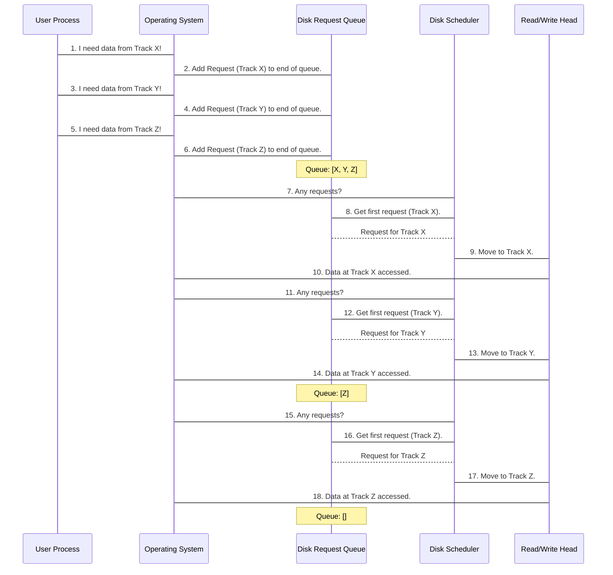

# Chapter 7: Disk Scheduling Algorithms

Welcome back! In our previous chapter, [Chapter 6: Process Synchronization](06_process_synchronization_.md), we learned how the Operating System (OS) helps different programs (processes) work together without causing chaos, especially when sharing resources. Now, let's shift our focus from programs cooperating in memory to how the OS manages one of your computer's slowest but most important components: the **hard drive** (or Disk).

Imagine your computer is trying to do many things at once: saving a document, loading a game level, and streaming a video. All these tasks involve reading from or writing to the hard drive. Unlike super-fast RAM, hard drives have physical moving parts, and moving these parts takes time. If the OS isn't smart about how it handles these requests, your computer can feel very slow and unresponsive.

This is where **Disk Scheduling Algorithms** come in. They are like expert traffic controllers for your hard drive, deciding the best order to handle all the incoming requests to make the disk work as efficiently as possible.

### The Problem: Slow Disk Access

Your computer's hard drive stores all your files, programs, and the operating system itself. Inside a traditional hard drive, there's a spinning platter and a "read/write head" that moves across the platter, much like a needle on a record player. Data is stored in circular paths called **tracks** (or cylinders).

When a program needs to read or write data, it tells the OS which track on the disk it needs. If many programs ask for data from different tracks all over the disk, the read/write head has to move back and forth a lot. Each time the head moves, it wastes precious time.

**Our Use Case:**
Imagine the read/write head is currently at **track 25**. Now, your computer gets a bunch of requests to access data on the following tracks, in this order: `64, 12, 42, 19, 62, 32, 16, 86`.

If we just service them in the order they arrive, how much will the head have to move? Is there a smarter way to pick the order to minimize movement? This chapter will show one basic approach to this problem.

### Key Concepts

Let's break down the main ideas behind Disk Scheduling Algorithms:

1.  **Hard Disk Drive (HDD):**
    This is your computer's long-term storage. It's slower than RAM because it has physical moving parts. Data is stored on circular **platters** in concentric circles called **tracks** (or **cylinders**). The read/write head moves across these tracks.

2.  **Disk I/O Request:**
    When a program wants to read data from or write data to the disk, it sends a request to the OS specifying the track (and sector) where the data is located.

3.  **Seek Time:**
    This is the most important concept for disk scheduling! **Seek time is the time it takes for the disk's read/write head to move from its current track to the track where the requested data is located.** This is usually the biggest component of disk access time, and our primary goal with disk scheduling is to minimize it. Less head movement means faster disk access!

4.  **Rotational Latency:**
    Once the head is at the correct track, we also have to wait for the desired sector (a segment of the track) to rotate under the head. This is **rotational latency**. While important, disk scheduling algorithms primarily focus on reducing seek time, as it typically accounts for a larger portion of the total access time.

5.  **Disk Scheduling Algorithm:**
    This is the strategy the OS uses to decide the order in which to service pending disk I/O requests. The goal is always to minimize the total seek time.

6.  **FCFS (First-Come, First-Serve):**
    This is the simplest disk scheduling algorithm, just like the FCFS CPU scheduling we saw. It processes disk requests in the exact order they arrive in the queue.
    *   **Analogy:** Imagine a busy drive-through restaurant. Cars are served strictly in the order they pull up. Simple to understand, but if a car for a huge order arrives, everyone behind it has to wait, even if they just want a small coffee. For disks, this means the head might jump back and forth across the entire disk unnecessarily. It's fair (no request is starved), but often not the most efficient.

### How FCFS Disk Scheduling Works (Solving Our Use Case)

Let's use our example requests and see how the **FCFS (First-Come, First-Serve)** algorithm handles them.

**Our Use Case Scenario:**
*   **Initial Head Position:** `25`
*   **Request Queue (Arrival Order):** `64, 12, 42, 19, 62, 32, 16, 86`

Here's how the FCFS Disk Scheduler would process them:

1.  **Start at 25.**
2.  **Request 1: 64.** Move from 25 to 64.
    *   Distance: `|64 - 25| = 39`. Total Seek Time: `39`. Head is now at `64`.
3.  **Request 2: 12.** Move from 64 to 12.
    *   Distance: `|12 - 64| = 52`. Total Seek Time: `39 + 52 = 91`. Head is now at `12`.
4.  **Request 3: 42.** Move from 12 to 42.
    *   Distance: `|42 - 12| = 30`. Total Seek Time: `91 + 30 = 121`. Head is now at `42`.
5.  **Request 4: 19.** Move from 42 to 19.
    *   Distance: `|19 - 42| = 23`. Total Seek Time: `121 + 23 = 144`. Head is now at `19`.
6.  **Request 5: 62.** Move from 19 to 62.
    *   Distance: `|62 - 19| = 43`. Total Seek Time: `144 + 43 = 187`. Head is now at `62`.
7.  **Request 6: 32.** Move from 62 to 32.
    *   Distance: `|32 - 62| = 30`. Total Seek Time: `187 + 30 = 217`. Head is now at `32`.
8.  **Request 7: 16.** Move from 32 to 16.
    *   Distance: `|16 - 32| = 16`. Total Seek Time: `217 + 16 = 233`. Head is now at `16`.
9.  **Request 8: 86.** Move from 16 to 86.
    *   Distance: `|86 - 16| = 70`. Total Seek Time: `233 + 70 = 303`. Head is now at `86`.

**Total Seek Time for FCFS:** **303 units**.
**Average Seek Time:** `303 / 8 = 37.875` units per request.

You can see how the head moves quite a bit, jumping from low track numbers to high ones and back again. This back-and-forth motion is what makes FCFS generally inefficient for disk scheduling.

### Under the Hood: The OS's Role (FCFS)

Let's quickly trace what happens step-by-step from the Operating System's perspective when using FCFS for disk scheduling:



### Diving into the Code (Simplified `fcfs_disk.c`)

Let's look at a very simplified C code snippet from `fcfs_disk.c` that simulates the FCFS disk scheduling algorithm.

First, the `main` function sets up the request queue and the initial head position, then calls our scheduling function.

```c
// --- File: fcfs_disk.c ---
#include <stdio.h> 

// Main function where the program starts
int main() 
{ 
    // Request queue elements (tracks to visit)
    int queue[] = { 
        64, 
        12, 
        42, 
        19, 
        62, 
        32, 
        16, 
        86 
    }; 
    // Get the number of elements in request queue  
    int n = sizeof(queue) / sizeof(queue[0]); 
    // Initial head position (current track of the read/write head)
    int head = 25; 
    
    // Call the FCFS scheduling function
    fcfs_disk_scheduling(queue, head, n); 
    return 0; 
}
```
**Explanation:**
*   `queue[]`: This array holds the list of disk track requests, in the order they arrived.
*   `n`: Calculates the total number of requests in the `queue`.
*   `head`: Represents the starting position of the disk's read/write head (currently at track 25).
*   `fcfs_disk_scheduling()`: This function, which we'll see next, performs the actual FCFS simulation.

Now, let's look at the `fcfs_disk_scheduling` function itself, where the logic for calculating seek time is implemented.

```c
// --- File: fcfs_disk.c ---
#include <stdio.h> 

// Function to perform FCFS disk scheduling
void fcfs_disk_scheduling(int queue[], int head, int n) 
{ 
    double seek_time = 0.0; // Variable to accumulate total seek time
    int distance = 0;       // Stores distance for each individual move
    int i = 0;              // Loop counter
    
    printf("\n Starting Head : %d ", head); 
    printf("\n Queue Sequence : ");
    // Display the given queue elements
    for (i = 0; i < n; i++) 
    { 
        printf(" %d", queue[i]); 
    } 
    
    // Loop through each request in the queue
    for (i = 0; i < n; i++) 
    { 
        // Calculate the absolute distance between current head and next request
        distance = queue[i] - head; 
        if (distance < 0) 
        { 
            distance = -distance; // Convert negative distance to positive (absolute value)
        } 
        
        // Update head position to the current serviced track
        head = queue[i]; 
        
        // Add current distance to total seek time
        seek_time += distance; 
    } 
    
    // Display results
    printf("\n Total Seek Time : %lf", seek_time);  
    printf("\n Average Seek Time : %lf\n", seek_time / n); 
} 
// ... (main function continues below this in actual file)
```
**Explanation:**
*   `seek_time`: A `double` variable to keep track of the total head movement.
*   The first `for` loop simply prints the request queue for better visualization.
*   The second `for` loop is the heart of the FCFS algorithm:
    *   `distance = queue[i] - head;`: Calculates the difference between the next track to visit and the current head position.
    *   `if (distance < 0) { distance = -distance; }`: This converts the distance to its absolute value (e.g., moving from track 50 to 20 is a distance of 30, not -30).
    *   `head = queue[i];`: After servicing the current request, the head's position is updated to that track.
    *   `seek_time += distance;`: The calculated distance for this move is added to the `total_seek_time`.
*   Finally, the total and average seek times are printed.

**Example Run (Input and Output):**

Using the `queue` and `head` values from our `main` function:
*   Initial Head Position: `25`
*   Request Queue: `64, 12, 42, 19, 62, 32, 16, 86`

```
 Starting Head : 25 
 Queue Sequence :  64 12 42 19 62 32 16 86
 Total Seek Time : 303.000000
 Average Seek Time : 37.875000
```
This output matches our manual calculation, showing a total seek time of 303 units and an average of 37.875 units per request.

### Conclusion

In this chapter, we introduced **Disk Scheduling Algorithms**, which are crucial for optimizing how your computer's OS manages its hard drive. We learned that:
*   The main goal is to minimize **seek time**, the time taken for the read/write head to move between tracks.
*   **FCFS (First-Come, First-Serve)** is the simplest algorithm, servicing requests in the order they arrive.
*   While FCFS is fair and prevents starvation, it's often inefficient because it can cause a lot of unnecessary back-and-forth movement of the disk head, leading to higher total seek times.

FCFS is a good starting point for understanding disk scheduling, but its inefficiency highlights the need for more sophisticated algorithms. Other algorithms, like Shortest Seek Time First (SSTF) or SCAN, aim to reduce total head movement by intelligently reordering requests.

---

Generated by [AI Codebase Knowledge Builder]