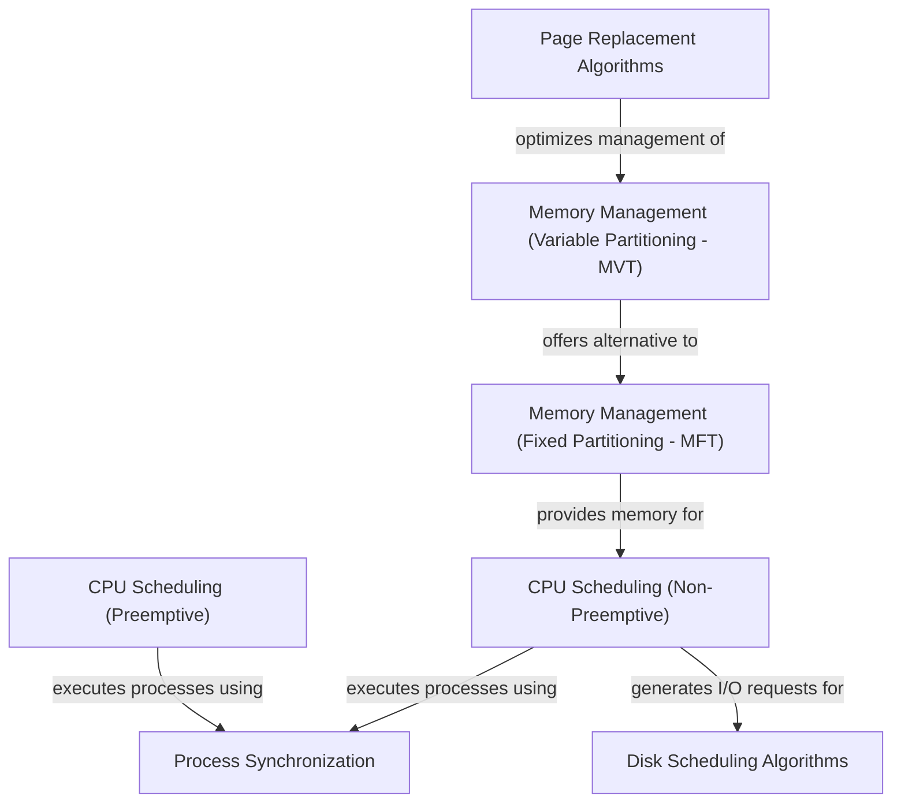

# Tutorial: Operating-System

This project delves into core *Operating System* functionalities, showcasing how an OS efficiently manages computer resources. It demonstrates different **CPU scheduling** approaches to decide which program gets to use the processor, various **memory management** techniques to organize and allocate system memory, and mechanisms for **process synchronization** to ensure concurrent programs work together without conflicts. Furthermore, it includes **disk scheduling** algorithms to optimize how data is read from and written to storage.

**Source Repository:** [https://github.com/010624/Operating-System](https://github.com/010624/Operating-System)

## Chapters

1. [Memory Management (Fixed Partitioning - MFT)
](01_memory_management__fixed_partitioning___mft__.md)
2. [CPU Scheduling (Non-Preemptive)
](02_cpu_scheduling__non_preemptive__.md)
3. [CPU Scheduling (Preemptive)
](03_cpu_scheduling__preemptive__.md)
4. [Memory Management (Variable Partitioning - MVT)
](04_memory_management__variable_partitioning___mvt__.md)
5. [Page Replacement Algorithms
](05_page_replacement_algorithms_.md)
6. [Process Synchronization
](06_process_synchronization_.md)
7. [Disk Scheduling Algorithms
](07_disk_scheduling_algorithms_.md)

---

Generated by [AI Codebase Knowledge Builder]